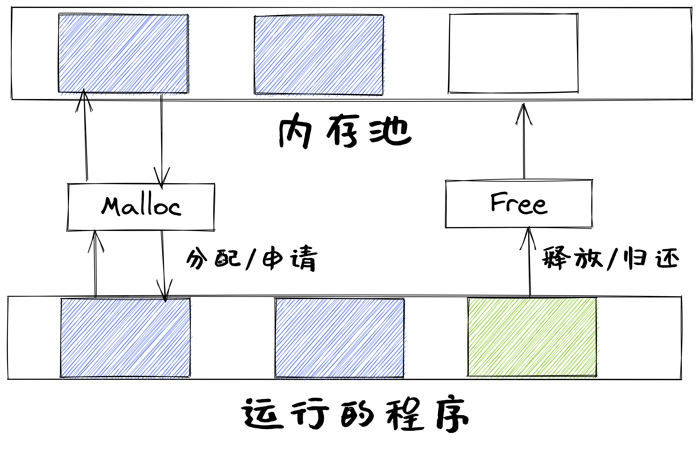
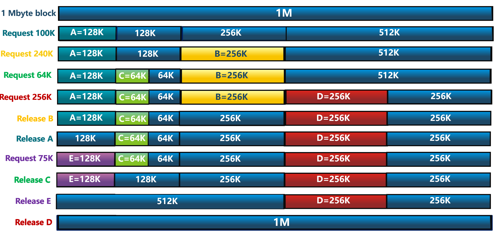
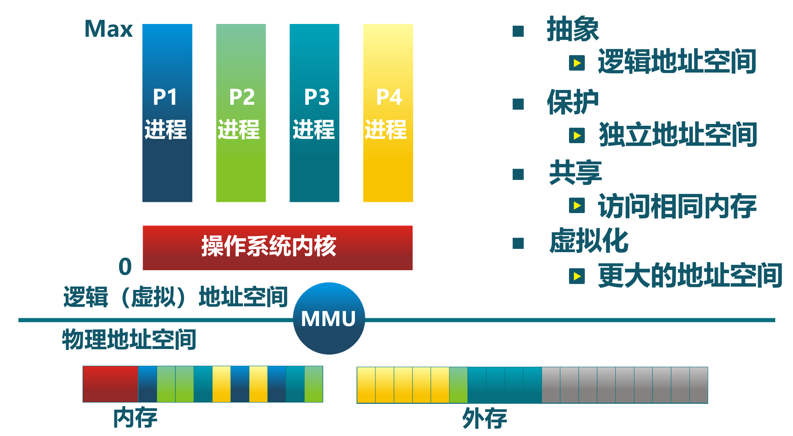
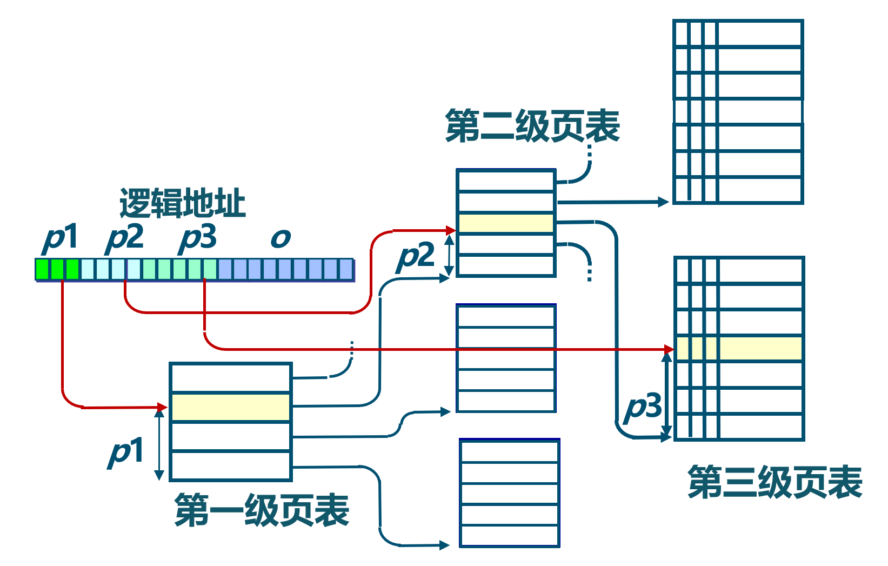
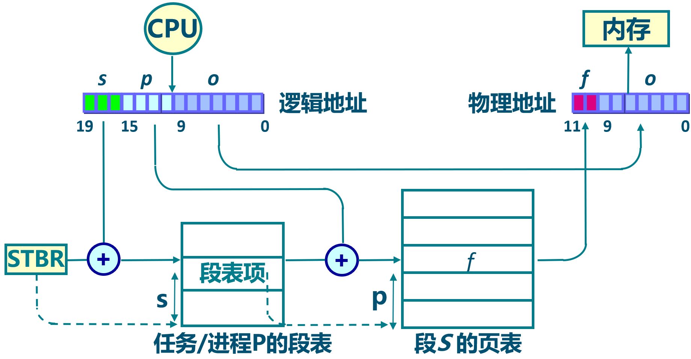
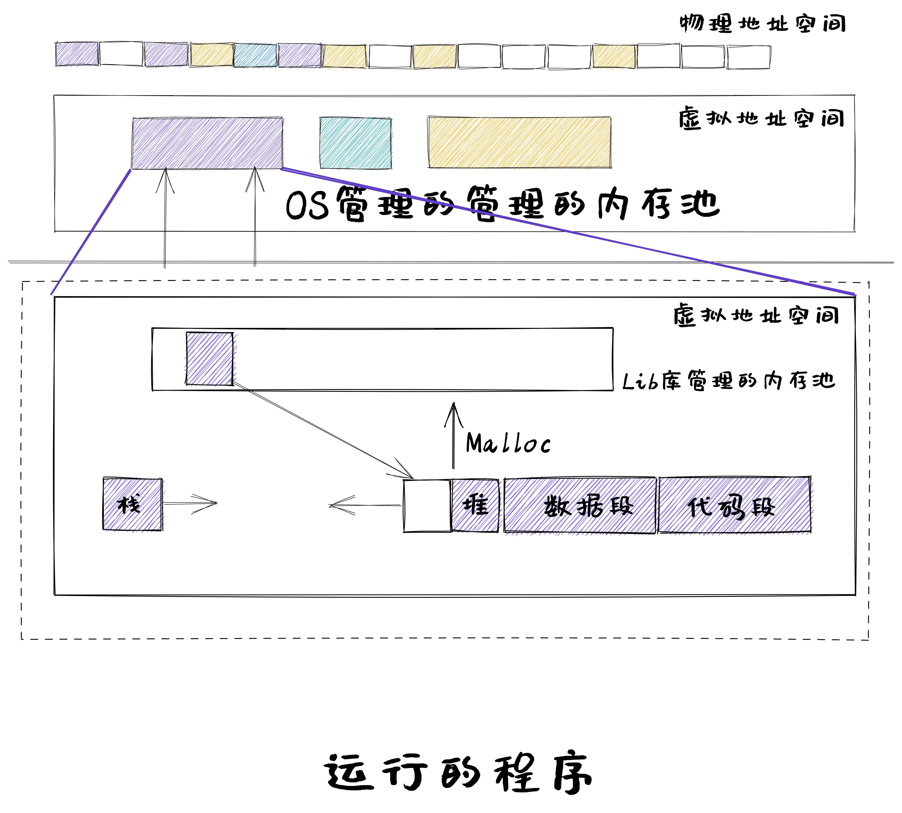

<!-- theme: gaia -->
<!-- _class: lead -->

# 第五講 物理內存管理
## 第二節 內存分配
<br>
<br>

向勇 陳渝 李國良 

<br>
<br>

2022年秋季

---
**提綱**

### 1. 內存分配
2. 連續內存分配
3. 非連續內存分配

---

#### 內存分配方式
運行應用所佔內存按存儲數據特徵劃分成多個**段(Segment)**
* 內存分配方式
  - 靜態內存分配
  - 動態內存分配
      - 連續內存分配
      - 非連續內存分配
* 內存管理的目的
  - 讓應用方便/靈活/高效地使用有限的內存


---

#### 動態內存分配接口



---

#### 靜態內存分配

靜態內存分配是指**編譯時**的內存分配
 - 包括全局、靜態變量和代碼
 - 位於全局/靜態數據段、常量數據段、代碼段


---

#### 動態內存分配
動態內存分配是指**運行時**的內存分配
- 棧(stack)
  - 局部變量
- 堆(heap) 
  - `malloc()`函數分配內存
  - `free()`函數釋放內存


---
#### 使用動態內存分配的原因
**無法事先確定**程序運行所需要的內存大小。
- 經常直到程序實際運行時，才知道某些數據結構的大小
- 在大型軟件代碼中硬編碼數據大小會是一種噩夢


---
#### 動態內存分配方式的分類

- **顯式分配**(explicit allocation)
  - 應用顯式地釋放任何已分配的塊
- **隱式分配**(implicit allocation)
  - 編譯器/運行時庫自動釋放未使用的已分配的塊


---
#### 堆和棧的內存分配

分配方式：動態內存分配
- 棧由**編譯器**管理：隱式分配
- 堆的分配和釋放由**程序員**管理：顯式分配

分配大小
- 棧是由高地址向低地址生長的數據結構，是一塊連續的內存，能從棧中獲得的內存**較小**，編譯期間確定大小；
- 堆是由低地址向高地址生長的數據結構，是一個不連續的儲存空間，內存獲取比較靈活，也**較大**。


---
#### 動態內存分配函數`malloc()`

- `malloc()`函數: `void * malloc (size_ t size);`
  - 申請一塊size大小的連續堆內存
  - 函數返回值是一個指針，指向剛分配的內存首地址
  - 如果申請內存失敗， 返回一個空指針，即返回值為NULL

- 動態內存的分配和釋放必須**成對使用**
  - 如果`malloc()`比`free()`多，會造成**內存洩漏**
  - 如果`malloc()`比`free()`少，會造成二次刪除，**破壞內存**，導致程序崩潰
---

#### 動態內存回收函數`free()`
  
- `free()`函數：``void free (void *ptr)``
  - 釋放指針變量在堆區上的內存空間
  - 不能釋放棧上的內存空間
  - `free()`要與`malloc()`成對使用
---
**提綱**

1. 內存分配
### 2. 連續內存分配
- 動態分區分配
- 夥伴系統(Buddy System)
3. 非連續內存分配

---

#### 連續內存分配

**連續內存分配**是指給應用分配一塊**不小於指定大小**的**連續**的內存區域
- **內存碎片**：不能被利用的空閒內存
  - **外碎片**：分配單元間未被使用內存
  - **內碎片**：分配單元內部未被使用內存 


---
#### 動態分區分配

動態分區分配是指，當程序被加載執行時或運行中數據存儲時，分配一個進程指定**大小可變**的分區(內存塊)
- 分區的地址是連續的
- 用戶庫/操作系統需要維護的**數據結構**
  - 已分配分區：已分配給應用的分區
  - 空閒分區(Empty-blocks)


---
#### 動態分區分配的設計要解決的問題
-  **空閒塊組織**：如何記錄空閒塊？
-  **放置位置**：如何選擇合適的空閒塊來分配？
-  **分割**：如何處理沒分配完的空閒塊中的剩餘部分？
-  **合併**：如何處理一個剛剛被釋放的塊？


---
#### 動態分區分配策略
  - 最先匹配(First-fit)
  - 最佳匹配(Best-fit)
  - 最差匹配(Worst-fit)


---
#### 最先匹配(First Fit)分配策略
- 優點：簡單，在高地址空間有**大塊的空閒分區**
- 缺點：**外碎片**，分配大塊時較慢
- 示例：分配400字節， 使用第1個空閒塊


---
#### 最佳匹配(Best Fit)分配策略
- **分配n字節分區**時， 查找並使用不小於n的最小空閒分區
- **釋放分區**時，檢查是否可與臨近的空閒分區合併

- 示例：分配400字節， 使用第3個空閒塊(最小)


---
#### 最佳匹配(Best Fit)分配策略
- 優點：多數申請分配的**尺寸較小**時，效果很好
- 缺點：**外碎片**，釋放分區較慢，容易產生很多無用的小碎片


---
#### 最差匹配(Worst Fit)分配策略
- **分配n字節**時，使用尺寸大於n的**最大空閒分區**
- **釋放分區**時，檢查是否可與臨近的空閒分區**合併**

- 示例：分配400字節，使用第2個空閒塊（最大）


---

#### 最差匹配(Worst Fit)分配策略

- 優點：**中等大小**的分配較多時，效果最好
- 缺點：**外碎片**，**釋放分區較慢**，容易破壞大的空閒分區


---
**提綱**

1. 內存分配
2. 連續內存分配
- 動態分區分配
### 夥伴系統(Buddy System)
3. 非連續內存分配

---

#### 夥伴系統(Buddy System)的需求背景

- 觀察&分析
  - 基本的分配策略很簡單和通用，但性能差，外碎片多 
  - 內核和應用的內存**需求特徵**
    - 內核經常以$2^U$個4KB大小來分配和釋放連續地址的內存塊
    - 需要能**快速**地分配和釋放，且不會產生**外碎片**
- 需要新的連續內存分配策略

---

#### 夥伴系統的工作原理


---
#### 分區大小
- 可分配分區的大小 $2^U$
- 待分配分區的大小為$2^{(U-1)} < s ≤ 2^U$
  - 把整塊分配給應用；
- 待分配分區的大小為$s ≤2^{(i－1)}$
  - 將大小為$2^i$ 的當前空閒分區**劃分成兩個**大小為$2^{(i－1)}$空閒分區
  - **重複劃分**過程，直到$2^{(i-1)} < s ≤ 2^i$,把一個空閒分區分配出去

<!--

-->

---
#### 分配過程
- 數據結構
  - 空閒塊按大小和起始地址組織成二維數組
  - 初始狀態：只有一個大小為$2^U$的空閒塊
- 分配過程
  - 由小到大在空閒塊中找最小可用塊
  - 如空閒塊過大，對可用空閒塊進行二等分，直到得到合適可用空閒塊

<!--

-->

---
#### 釋放過程

- 釋放過程
  - 把塊放入空閒塊數組
  - 合併滿足條件的空閒塊
- 合併條件
  - 大小相同$2^i$
  - 地址相鄰
  - 低地址空閒塊起始地址為$2^{(i＋1)}$的位數

<!--


http://en.wikipedia.org/wiki/Buddy_memory_allocation -->

---

#### 夥伴系統工作過程示例


---
#### 夥伴系統工作過程示例


---
#### 夥伴系統工作過程示例


---
#### 夥伴系統工作過程示例


---
#### 夥伴系統工作過程示例


---
#### 夥伴系統的參考實現

* [buddy_system_allocator](https://crates.io/crates/buddy_system_allocator)：用Rust寫的夥伴系統算法
* [buddy-system-in-ucore-test](https://github.com/ucore-test/buddy-system-in-ucore-test#buddy-system-in-ucore-test)：能夠在c語言程序中調用buddy-system的接口

---
**提綱**

1. 內存分配
2. 連續內存分配
### 3. 非連續內存分配
- 非連續內存分配的概念
- 頁式存儲管理
- 內存分配示例

---

#### 非連續內存分配的需求背景：碎片問題
- 內核通過頁表能夠**把多個地址不連續的物理頁轉換為地址連續的多個虛擬頁**
- 提供給應用程序和內核自身使用地址連續的虛擬內存塊，這樣可以比較輕鬆地解決**內存分配的碎片問題**




---

#### 非連續內存分配的需求背景：較大的內存空間
- 創建運行的程序時需要分配讓其正常運行所需的**比較大的內存空間**
- 程序運行時會需要動態申請和釋放比較大的內存空間
   - 通常用用戶庫發出請求
   - 減少系統調用次數
   - 一次申請$2^U$MB大小(如:64MB)的內存 


---

#### 非連續內存分配的設計目標

提高內存利用效率和管理靈活性
 - 允許一個程序使用**非連續**的物理地址空間
 - 允許**共享**代碼與數據
 - 支持**動態**加載和動態鏈接


---

#### 非連續分配需要解決的問題
- 虛擬地址到物理地址的**地址轉換**
    - 軟件實現 （靈活，開銷大）
    - 硬件實現 （夠用，開銷小）
- 非連續分配的**硬件輔助**機制
  - 如何選擇非連續分配中內存塊大小
    - 段式存儲管理(segmentation)
    - 頁式存儲管理(paging)


---

#### 段式存儲管理

程序運行的段地址空間由多個段組成
- 主代碼段、子模塊代碼段、公共庫代碼段、棧段、堆數據(heap)...


---

#### 段表

- 位於內存中
- 由內核管理
- 與任務/進程對應


---

**提綱**

1. 內存分配
2. 連續內存分配
3. 非連續內存分配
- 非連續內存分配的概念
### 頁式存儲管理
- 內存分配示例

---

#### 物理頁面和邏輯頁面
- 物理頁面（頁幀、幀, Frame, Page Frame）
  - 把物理地址空間劃分為大小相同(2^n)的基本分配單位
- 邏輯頁面（頁面、頁, Page) 
  - 把邏輯地址空間也劃分為相同大小的基本分配單位
  - **物理頁面和邏輯頁面的基本單位大小是相同的**
- 邏輯頁面到物理頁面的對應
  - 邏輯地址到物理地址的地址轉換
  - 硬件機制：頁表/MMU/TLB

---

#### 頁表

- 位於內存中
- 由內核管理
- 與任務/進程對應


---

#### 頁式存儲管理面臨的性能挑戰

- 內存訪問性能
  - 訪問一個內存單元需要2次內存訪問
    - 第一次訪問：獲取頁表項
    - 第二次訪問：訪問數據
- 頁表大小
  - 頁表可能非常大
  - 64位計算機系統中，如果每頁1024字節，那麼一個頁表的大小會是多少？


---

#### 提高頁式存儲管理性能的方法

- 緩存（Caching）
- 間接（Indirection）訪問


---

#### 多級頁表




---

#### 多級頁表的地址轉換


---

#### 反置頁表

基於Hash映射值查找對應頁表項中的物理頁號
- 任務/進程id與頁號的Hash值可能有*衝突*
- 頁表項中包括保護位、修改位、訪問位和存在位等標識

---

#### 反置頁表的地址轉換


---

#### 反置頁表的hash衝突


---

#### 反置頁表的hash衝突


---

#### 反置頁表的hash衝突


---

#### 段頁式存儲管理
- 段式存儲在內存保護方面有優勢，頁式存儲在內存利用和優化轉移到後備存儲方面有優勢。
- 段式存儲、頁式存儲能否結合？


---

#### 段頁式存儲管理



<!-- 2017ppt -->

---
**提綱**

1. 內存分配
2. 連續內存分配
3. 非連續內存分配
- 非連續內存分配的概念
- 頁式存儲管理
### 內存分配示例

---

#### 一個app調用malloc的例子
```C
#include <stdlib.h>
int main(){
int *ptr;
ptr = malloc(15 * sizeof(*ptr)); /* a block of 15 integers */
    if (ptr != NULL) {
      *(ptr + 5) = 480; /* assign 480 to sixth integer */
      printf("Value of the 6th integer is %d",*(ptr + 5));
    }
}
```


---

#### app的地址空間


---
#### 加載程序運行

第一步：OS加載程序運行


---

#### malloc函數調用

第二步：程序發出malloc函數調用，且Lib庫**有空閒空間**



---
#### 內核分配內存空間
第二步：程序發出malloc函數調用，且Lib庫**無空閒空間**
