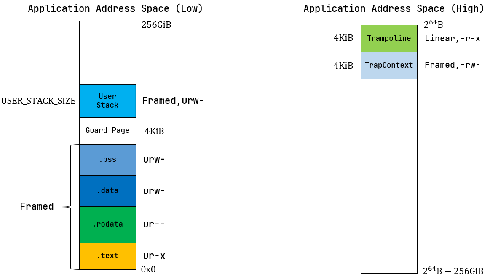
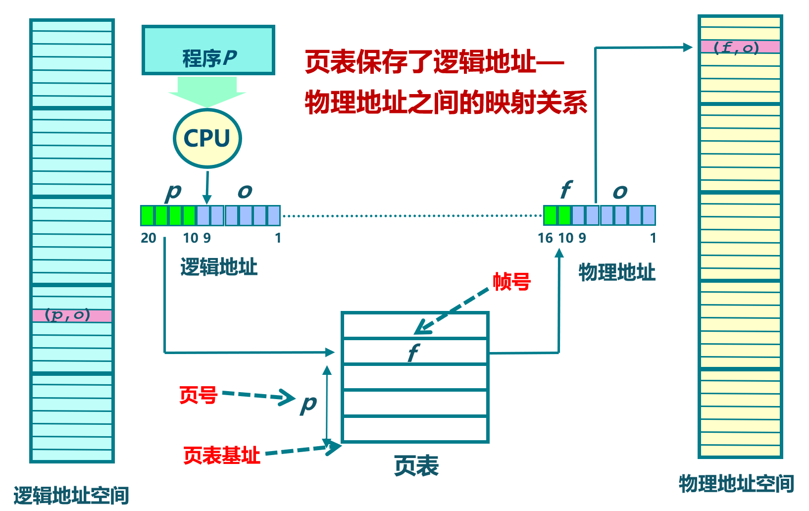
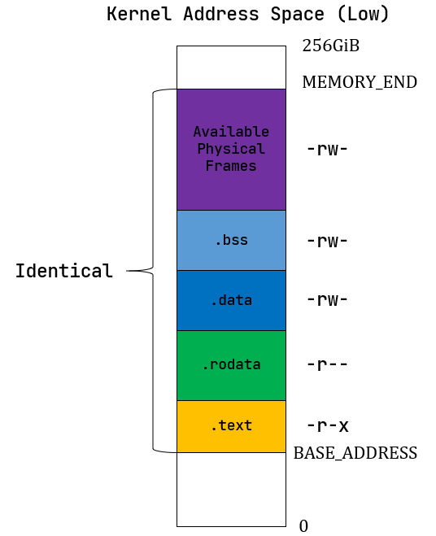
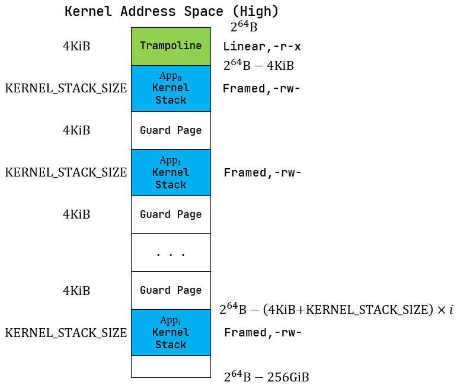

<!-- theme: gaia -->
<!-- _class: lead -->

# 第五講 物理內存管理
## 第三節 實踐：建立地址空間的OS
Address Space OS(ASOS)
<br>
<br>

向勇 陳渝 李國良 

2022年秋季

---
**提綱**

### 1. 實驗目標和步驟
- 實驗目標
- 實踐步驟
2. 系統架構
3. 用戶視角的地址空間
4. 內核管理地址空間
5. 實現ASOS


---

#### 以往目標
提高性能、簡化開發、加強安全
- multiprog & time-sharing OS目標
  - 讓APP有效共享CPU，提高系統總體性能和效率
- BatchOS目標
  - 讓APP與OS隔離，加強系統安全，提高執行效率
- LibOS目標
  - 讓APP與硬件隔離，簡化應用訪問硬件的難度和複雜性
---
#### 實驗目標

~~提高性能~~、簡化開發、加強安全、
- 簡化編程，APP不用考慮其運行時的起始執行地址
  - 與編譯器達成共識，給每個APP設定一個固定起始執行地址
- **隔離APP訪問的內存地址空間**
  -  給APP的內存地址空間劃界，不能越界訪問OS和其他APP

---

#### 實驗要求
- 理解地址空間
- 掌握頁機制
- 會處理頁訪問異常
- 會寫支持頁機制的操作系統

<!-- 頭甲龍 ankylosauridae 白堊紀晚期-->


---

#### 總體思路


---

#### 總體思路
- 編譯：應用程序和內核獨立編譯，合併為一個鏡像
- 編譯：不同應用程序可採用**統一的起始地址**
- 構造：系統調用服務，任務的管理與初始化
- 構造：建立基於**頁表機制**的虛存空間
- 運行：特權級切換，任務與OS相互切換
- 運行：**切換地址空間**，跨地址空間訪問數據


---

#### 歷史背景

- 在 1940 年出現了**兩級存儲**系統
  - 主存：磁芯；輔助：磁鼓
- 提出**虛擬內存（Virtual memory）**技術概念
  - 德國的柏林工業大學博士生 Fritz-Rudolf Güntsch
- 1959 年的Atlas Supervisor 操作系統
  - 英國曼徹斯特大學的 Tom Kilburn 教授團隊展示了 Atlas 計算機和 Atlas Supervisor 操作系統
  - **創造**出分頁（paging）技術和虛擬內存技術（virtual memory，當時稱為 one-level storage system）
---
**提綱**

1. 實驗目標和步驟
- 實驗目標
### 實踐步驟
2. 系統架構
3. 用戶視角的地址空間
4. 內核管理地址空間
5. 實現ASOS


---

#### 實踐步驟 
- 修改APP的鏈接腳本(定製起始地址)
- 加載&執行應用
- 切換任務和**任務的地址空間**


---
#### 編譯步驟 
```
git clone https://github.com/rcore-os/rCore-Tutorial-v3.git
cd rCore-Tutorial-v3
git checkout ch4
cd os
make run
```

---

#### 輸出結果 

```
Into Test load_fault, we will insert an invalid load operation...
Kernel should kill this application!
[kernel] PageFault in application, bad addr = 0x0, bad instruction = 0x1009c, kernel killed it.

store_fault APP running...

Into Test store_fault, we will insert an invalid store operation...
Kernel should kill this application!
[kernel] PageFault in application, bad addr = 0x0, bad instruction = 0x1009c, kernel killed it.
power_3 [130000/300000]
```

---
#### 測試應用 

其中包含兩個應用程序`04load_fault`, `05store_fault`
```
// usr/src/bin/04load_fault.rs
......
    unsafe {
        let _i=read_volatile(null_mut::<u8>());
    }

// usr/src/bin/05store_fault.rs
......
    unsafe {
       null_mut::<u8>().write_volatile(1);
    }
```

---
**提綱**

1. 實驗目標和步驟
### 2. 系統架構
- 代碼結構
- RISC-V SV39頁機制
3. 用戶視角的地址空間
4. 內核管理地址空間
5. 實現ASOS


---

#### 軟件架構
- 簡化應用
- 建立Paging
- 內核頁表
- 應用頁表
- 信息傳遞
- 跳板機制
- 擴展TCB
- 擴展異常
  


---

#### 構建應用
```
└── user
    ├── build.py(移除：給應用設定唯一起始地址的腳本)
    └── src（用戶態庫和應用程序）
        ├── bin（各個應用程序）
        ├── ...
        └── linker.ld(修改：將所有應用放在各自地址空間中固定的位置)
```


---

#### 地址空間
```
├── os
    └── src
         ├── config.rs(修改：新增一些內存管理的相關配置)
         ├── linker-k210.ld(修改：將跳板頁引入內存佈局)
         ├── linker-qemu.ld(修改：將跳板頁引入內存佈局)
         ├── loader.rs(修改：僅保留獲取應用數量和數據的功能)
         ├── main.rs(修改)
```

---

#### mm子模塊
```
├── os
    └── src
         ├── mm(新增：內存管理的 mm 子模塊)
             ├──address.rs(物理/虛擬 地址/頁號的 Rust 抽象)
             ├──frame_allocator.rs(物理頁幀分配器)
             ├──heap_allocator.rs(內核動態內存分配器)
             ├──memory_set.rs(引入地址空間 MemorySet 及邏輯段 MemoryArea 等)
             ├──mod.rs(定義了 mm 模塊初始化方法 init)
             └──page_table.rs(多級頁表抽象 PageTable 以及其他內容)
```

---

#### 改進OS
```
├── os
    └── src
         ├── syscall
             ├──fs.rs(修改：基於地址空間的 sys_write 實現)
         ├── task
             ├──context.rs(修改：構造一個跳轉到不同位置的初始任務上下文)
             ├──mod.rs(修改)
             └──task.rs(修改)
         └── trap
             ├── context.rs(修改：在 Trap 上下文中加入了更多內容)
             ├── mod.rs(修改：基於地址空間修改了 Trap 機制)
             └── trap.S(修改：基於地址空間修改了 Trap 上下文保存與恢復彙編代碼) 
```


---
**提綱**

1. 實驗目標和步驟
2. 系統架構
- 代碼結構
### RISC-V SV39頁機制
3. 用戶視角的地址空間
4. 內核管理地址空間
5. 實現ASOS


---

#### RISC-V 基於SATP的虛擬內存系統

- 虛擬地址將內存劃分為固定大小的頁來進行地址轉換和內容保護。
- 頁表基址寄存器satp：內核態控制狀態寄存器控制了分頁。satp 有三個域：
  - MODE 域：開啟分頁並選擇頁表級數
  - ASID（Address Space Identifier，地址空間標識符）域：可選的，用來降低上下文切換的開銷
  - PPN 字段：保存了根頁表的物理地址


<!--
---
## S-Mode編程 -- 虛存機制

- 通過stap CSR建立頁表基址
- 建立OS和APP的頁表
- 處理內存訪問異常


---
##  S-Mode編程 -- 虛存機制
- S、U-Mode中虛擬地址會以從根部遍歷頁表的方式轉換為物理地址：

  - satp.PPN 給出了一級頁表的基址， VA [31:22] 給出了一級頁號，CPU會讀取位於地址(satp. PPN × 4096 + VA[31: 22] × 4)頁表項。
  - PTE 包含二級頁表的基址，VA[21:12]給出了二級頁號，CPU讀取位於地址(PTE. PPN × 4096 + VA[21: 12] × 4)葉節點頁表項。
  - 葉節點頁表項的PPN字段和頁內偏移（原始虛址的最低 12 個有效位）組成了最終結果：物理地址(LeafPTE.PPN×4096+VA[11: 0])


---
##  S-Mode編程 -- 虛存機制
- S、U-Mode中虛擬地址會以從根部遍歷頁表的方式轉換為物理地址：

-->

---
#### 頁表基址寄存器satp
- satp CSR:(S-Mode) 
  Supervisor Address Translation and Protection，監管者地址轉換和保護
- 控制硬件分頁機制


---
#### 初始化&使能頁機制

- M模式的RustSBI在第一次進入S-Mode之前會把0寫入satp，以禁用分頁
- 然後S-Mode的OS在初始化頁表後會再次寫satp
  - 使能頁表:`MODE`=8
  - 設定頁表起始物理地址頁號 `PPN`


---
#### 頁表項屬性

- V：有效位
- R,W,X：讀/寫/執行位
- U：U-Mode能否訪問
- G：是否對所有地址有效
- A：Access，訪問位
- D：Dirty，修改位
- RSW：保留位
- PPN：物理頁號


---
**提綱**

1. 實驗目標和步驟
2. 系統架構
### 3. 用戶視角的地址空間
* ASOS地址空間
* 跳板頁
* 應用的地址空間
4. 內核管理地址空間
5. 實現ASOS


---

#### 應用程序的地址空間
- **地址空間**：一系列**有關聯**和**不一定連續**的邏輯段
- 由若干邏輯段組成的虛擬/物理內存空間與一個運行的程序（目前把一個運行的程序稱為**任務**和**進程**）綁定
- 進程對代碼和數據的直接訪問範圍限制在它關聯的地址空間之內


---

#### 應用地址空間和內核地址空間
- 應用地址空間
   - 編譯器給應用生成的地址空間，內核通過頁表來約束應用地址空間，應用不能訪問它之外的地址空間
- 內核地址空間
   - 編譯器給內核生成的地址空間，內核通過頁表調整應用/內核地址空間，並管理整個物理內存


---
**提綱**

1. 實驗目標和步驟
2. 系統架構
3. 用戶視角的地址空間
* ASOS地址空間
### 跳板頁
* 應用的地址空間
4. 內核管理地址空間
5. 實現ASOS


---
#### 跳板頁
- 應用與內核的跳板Trampoline頁的虛擬地址是相同的，且映射到同一物理頁
- 放置的是``trap.S``中的執行代碼
<!-- - 但用戶態無法訪問此內存區域
- 產生異常/中斷時，會跳到跳板頁的``_all_traps``入口
- 並在切換頁表後，平滑地繼續執行 -->


---

#### 基於跳板頁的平滑過渡

- **特權級過渡**：產生異常/中斷時，CPU會跳到跳板頁的``_all_traps``入口
- **地址空間過渡**：在切換頁表後，可平滑地繼續執行內核代碼


---

#### 陷入(Trap)上下文頁
- 跳板頁的`_all_traps`彙編函數會**保存**相關寄存器到陷入上下文
- 跳板頁的`_restore`彙編函數會從陷入上下文中**恢復**相關寄存器


---

#### 回顧：沒有頁機制的OS
陷入上下文保存在內核棧頂，``sscratch``保存應用的內核棧
- 只通過``sscratch``寄存器中轉**用戶/內核的棧指針**
- 當一個應用 Trap 到內核時，sscratch 已指向該應用的內核棧棧頂，用一條指令即可從用戶棧切換到內核棧，然後直接將 Trap 上下文壓入內核棧棧頂。

<!--

-->

---
#### 對比使能頁機制的OS

如何只通過`sscratch`寄存器中轉**棧指針**和**頁表基址**？
- 能用之前的方法嗎？
- 方案1：通過`sscratch`寄存器中轉**用戶/內核的棧指針**
- 方案2：通過`sscratch`寄存器中轉**用戶棧指針/頁表基址**


---
#### 方案1：通過`sscratch`寄存器中轉用戶/內核的棧指針
- 通過``sscratch``寄存器中轉**用戶/內核的棧指針**
   - 當前sp指針指向的是內核地址空間
   - 而此時頁表還是用的用戶態頁表
- 導致在內核態產生異常，**系統崩潰** 


---

#### 方案2：通過`sscratch`寄存器中轉用戶棧指針/頁表基址
- 通過`sscratch`寄存器中轉**用戶棧指針/頁表基址**
- 當前用的是內核態頁表，訪問內核地址空間
- 接下來需要取得應用的內核棧指針來把用戶態當前的通用寄存器保存到陷入上下文中
- 獲取內核棧指針需要修改（**破壞**）通用寄存器才能完成，無法**正確保存**


---

#### 方案3：``sscratch`` - 應用的陷入上下文地址
- 通過``sscratch``進行應用的用戶態棧指針<->陷入上下文地址切換;
- 保存用戶態寄存器到陷入上下文;
- 讀出陷入上下文中的頁表基址/應用的內核棧指針/**trap_handler**地址；
- 切換頁表，跳轉**trap_handler**


---

**提綱**

1. 實驗目標和步驟
2. 系統架構
3. 用戶視角的地址空間
* ASOS地址空間
* 跳板頁
### 應用的地址空間
4. 內核管理地址空間
5. 實現ASOS


---
#### 應用程序設計

- 應用程序
  - **內存佈局**有調整
- 沒有更新
  - 項目結構  
  - 應用代碼 
  - 函數調用
  - 系統調用



---

#### 應用程序的內存佈局
* 由於每個應用被加載到的位置都相同，所以它們共用一個鏈接腳本 linker.ld    
  * **`BASE_ADDRESS`** =  0x10000


---
**提綱**

1. 實驗目標和步驟
2. 系統架構
3. 用戶視角的地址空間
### 4. 內核管理地址空間
* 管理物理內存
* 建立內核/應用頁表
* 管理地址空間
5. 實現ASOS


---
#### 從內核角度看地址空間
- 理解地址空間
- 理解陷入上下文頁


---

#### 從內核角度看地址空間

- **內核理解地址空間**
  - 建立&感知虛擬/物理地址
  - 在內核/應用虛擬地址空間之間穿越
- 應用的頁表
  - 代表了內核管理下的現實情況下的應用地址空間
  - 讓CPU"能看"到的應用地址空間


---

#### 頁表機制
- **管理物理內存**
- 建立內核/應用頁表
- 使能頁機制




---
#### 物理內存

- 物理內存(RAM 設定位8MB)
  - 物理內存起始地址：：``0x80000000``
  - 可用物理內存起始地址： ``os/src/linker.ld`` 中``ekernel``地址
  - 物理內存結束地址：``0x80800000``
- 物理內存中有啥？


---
#### 物理內存

- 物理內存(RAM 設定位8MB)，包括：
  -  應用/內核的數據/代碼/棧/堆
  -  空閒的空間
-  特別是各種管理類數據
     - 任務控制塊
         - MemorySet
              -  應用/內核的多級頁表等
        - 應用核心棧
        - 應用的TrapContext頁 ....
---

#### 管理物理內存

- 物理內存上已經有**一部分**用於放置內核的代碼和數據
- 需要將**剩下的空閒內存**以單個物理頁幀為單位管理起來
  - 當需要存應用數據或擴展應用的多級頁表時**分配**空閒的物理頁幀
  - 在應用出錯或退出的時候**回收**應用佔的所有物理頁幀 


---
#### 管理物理內存
- 採用連續內存的**動態分配策略**
- **分配/回收物理頁幀**的接口
  - 提供``alloc()``和``dealloc()``函數接口 


---
**提綱**

1. 實驗目標和步驟
2. 系統架構
3. 用戶視角的地址空間
4. 內核管理地址空間
* 管理物理內存
### 建立內核/應用頁表
* 管理地址空間
5. 實現ASOS


---

#### SV39多級頁表

- SV39 多級頁表是以頁大小的節點為單位進行管理。每個節點恰好存儲在一個物理頁幀中，它的位置可以用一個物理頁號來表示
- satp CSR


---

#### 建立內核/應用頁表
- 頁表起始物理地址
- 頁表內容:虛地址<->物理地址映射
  - 恆等映射 Identical Mapping
  - 隨機映射 Framed Mapping

VPN: Virtual Page Number
PPN: Physical Page Number
satp: 包含頁表起始處PPN的CSR


---

#### 建立和拆除虛實地址映射關係

* 在多級頁表中找到一個虛擬地址對應的**頁表項**。
* 通過**修改頁表項**的內容即可完成**鍵值對**的插入和刪除，從而實現**映射關係**的建立和拆除。


---
#### 使能頁機制

- 設置``satp= root_ppn`` 

核心數據結構的包含關係
```
TCB-->MemorySet-->PageTable-->root_ppn
任務控制塊  --------------->任務的頁表基址
```





---
**提綱**

1. 實驗目標和步驟
2. 系統架構
3. 用戶視角的地址空間
4. 內核管理地址空間
* 管理物理內存
* 建立內核/應用頁表
### 管理地址空間
5. 實現ASOS


---

#### 應用地址空間


---
#### 邏輯段

- 邏輯段：內核/應用會用到的一段連續地址的虛擬內存
- 內核/應用運行的虛擬地址空間：由多個邏輯段組成

**理想: 豐滿  v.s.  現實: 骨感**    
- 應用的**頁表**
  - 現實情況下的應用地址空間
- 應用的**邏輯段**
  - 理想情況下的應用地址空間


---

#### 邏輯段的數據結構``MapArea``
- 邏輯段：一段連續地址的虛擬內存
```rust
// os/src/mm/memory_set.rs

pub struct MapArea {
    vpn_range: VPNRange, //一段虛擬頁號的連續區間
    data_frames: BTreeMap<VirtPageNum, FrameTracker>,//VPN<-->PPN映射關係
    map_type: MapType,  //映射類型
    map_perm: MapPermission, //可讀/可寫/可執行屬性
}
```
``data_frames`` 是一個保存了該邏輯段內的每個虛擬頁面和它被映射到的物理頁面 FrameTracker 的一個鍵值對容器


---

#### 地址空間的數據結構 ``MemorySet``
- **地址空間**：一系列有關聯的不一定連續的邏輯段
```rust
// os/src/mm/memory_set.rs

pub struct MemorySet {
    page_table: PageTable, //頁表
    areas: Vec<MapArea>, //一系列有關聯的不一定連續的邏輯段
}
```
* **地址空間**的數據結構字段
  - 多級頁表： 基於數據結構``PageTable``的變量``page_table`` 
  - 邏輯段集合： 基於數據結構``MapArea`` 的向量 ``areas``

---
#### 內核管理任務地址空間的時機
- 操作系統管理的**地址空間** ``MemorySet``=``PageTable``+``MapAreas``
   - **創建**任務：創建任務的 ``MemorySet``
   - **清除**任務：回收任務的 ``MemorySet``所佔內存
   - **調整**應用的內存空間大小： 修改任務的``MemorySet``
   - 用戶態**切換**到內核態：切換任務的``MemorySet``為內核的``MemorySet``
   - 內核態**切換**到用戶態：切換內核的``MemorySet``為任務的``MemorySet``

---
#### 新建任務地址空間`MemorySet`的過程
- 創建頁表
- 創建邏輯段向量 


---

#### 在地址空間插入/刪除一個邏輯段
- 更新頁表中的相應頁表項
- 更新邏輯段對應的物理頁幀內容 


---
**提綱**

......
3. 用戶視角的地址空間
4. 內核管理地址空間
### 5. 實現ASOS
* 啟動分頁模式
* 實現跳板機制
* 加載和執行應用程序
* 改進 Trap 處理的實現
* 改進 sys_write 的實現


---

#### 對分時共享多任務操作系統的擴展

1. 創建**內核頁表**，使能分頁機制，建立內核的虛擬地址空間；
2. 擴展**Trap上下文**，在保存與恢復Trap上下文的過程中切換頁表（即切換虛擬地址空間）；
3. 建立用於內核地址空間與應用地址空間相互切換所需的**跳板空間**；
4. 擴展**任務控制塊**包括虛擬內存相關信息，並在加載執行創建基於某應用的任務時，建立應用的虛擬地址空間；
5. 改進Trap處理過程和sys_write等**系統調用**的實現以支持分離的應用地址空間和內核地址空間。

---
#### 啟動分頁模式
1. 創建內核地址空間
2. 內存管理子系統的初始化


---

#### 創建內核地址空間的全局實例
- 內核地址空間``KERNEL_SPACE``
```rust
pub static ref KERNEL_SPACE: MemorySet = MemorySet::new_kernel()
```


---
#### 內存管理子系統的初始化
   1. 把**空閒物理內存**按照堆(heap)進行動態連續內存管理初始化
   2. 基於堆實現**物理頁幀分配**管理初始化
   3. 設置**satp**，啟動分頁機制，激活內核地址空間``KERNEL_SPACE``，
```rust
// os/src/mm/mod.rs
pub fn init() {
    heap_allocator::init_heap();
    frame_allocator::init_frame_allocator();
    KERNEL_SPACE.exclusive_access().activate();
}
```
---
**提綱**

......
3. 用戶視角的地址空間
4. 內核管理地址空間
5. 實現ASOS
* 啟動分頁模式
### 實現跳板機制
* 加載和執行應用程序
* 改進 Trap 處理的實現
* 改進 sys_write 的實現


---

#### 實現跳板機制的動機

在啟動分頁機制後，讓處於不同地址空間的應用和內核能夠進行正常的**特權級切換**操作和**數據交互**。


---

#### 跳板機制的思路

- 內核和應用的虛擬地址空間中**最高的虛擬頁面**是一個跳板(trampoline)頁
- 在**特權級**切換後，要迅速完成**地址空間**切換，**內核棧**切換，並**平滑地繼續執行**內核代碼


---

#### 跳板機制的思路

- 應用地址空間的**次高虛擬頁面**被設置為存放應用的 Trap 上下文


---

#### 跳板機制的思路

- Q:為何不直接把 Trap 上下文仍放到應用的內核棧中呢？


---

#### 跳板機制的思路

- Q:為何不直接把Trap上下文仍放到應用的內核棧中呢？
  - 訪問內核棧中的Trap上下文地址，需要先切換**頁表**；
  - 頁表信息放在 **Trap上下文**中，形成了相互依賴。


---

#### 建立跳板頁面
將 trap.S 中的整段彙編代碼放置在 .text.trampoline 段，並在調整內存佈局的時候將它對齊到代碼段的一個頁面中
```
# os/src/linker.ld
    stext = .;
        .text : {
        *(.text.entry)
        . = ALIGN(4K);
        strampoline = .;
        *(.text.trampoline);
        . = ALIGN(4K);
        *(.text .text.*)
    }
```
<!-- ---
RISC-V只提供一個 sscratch 寄存器可用來進行臨時週轉

1. 必須先切換到內核地址空間，這就需要將內核地址空間的 token 寫入 satp 寄存器;
2. 之後還需要保存應用的內核棧棧頂的位置，這樣才能以它為基址保存 Trap 上下文。
3. 這兩步需要用通用寄存器作為臨時週轉，然而我們無法在不破壞任何一個通用寄存器的情況下做到這一點。
4. 所以，我們不得不將 Trap 上下文保存在應用地址空間的一個虛擬頁面中，而不是切換到內核地址空間去保存。 -->


---

#### 擴展Trap 上下文數據結構
```rust
 // os/src/trap/context.rs
 pub struct TrapContext {
     pub x: [usize; 32],
     pub sstatus: Sstatus,
     pub sepc: usize,
     pub kernel_satp: usize, //內核頁表的起始物理地址
     pub kernel_sp: usize,   //當前應用內核棧棧頂的虛擬地址
     pub trap_handler: usize,//內核中 trap handler 入口點的虛擬地址
}
```
---

#### 切換Traps上下文
* **保存Trap上下文**
  - 把**用戶棧指針**切換到用戶地址空間中的TrapContext
  - 在TrapContext**保存**通用寄存器、sstatus、sepc
  - 在TrapContext**讀出**kernel_satp、kernel_sp、trap_handler
  - **切換**內核地址空間，切換到內核棧
  - **跳轉**到trap_handler繼續執行
* **恢復Trap上下文**
  - 上述過程的逆過程

---

#### 跳轉到trap_handler繼續執行

Q:為何用``jr t1`` 而不是 ``call trap_handler``完成跳轉？

---

#### 保存Trap上下文

Q:為何用``jr t1`` 而不是 ``call trap_handler``完成跳轉？
- 在內存佈局中，這條 .text.trampoline 段中的跳轉指令和 trap_handler 都在代碼段之內，彙編器（Assembler）和鏈接器（Linker）會根據 linker-qemu.ld 的地址佈局描述，設定跳轉指令的地址，並計算二者地址偏移量，讓跳轉指令的實際效果為當前 pc 自增這個偏移量。
- 這條跳轉指令在被執行的時候，它的虛擬地址被操作系統內核設置在地址空間中的最高頁面之內，所以加上這個偏移量並不能正確的得到 trap_handler 的入口地址。


---
**提綱**

......
3. 用戶視角的地址空間
4. 內核管理地址空間
5. 實現ASOS
* 啟動分頁模式
* 實現跳板機制
### 加載和執行應用程序
* 改進 Trap 處理的實現
* 改進 sys_write 的實現


---

#### 加載和執行應用程序
1. 擴展任務控制塊
2. 更新任務管理


---

#### 擴展任務控制塊TCB
- 應用的**地址空間** memory_set
- **Trap 上下文**所在物理頁幀的物理頁號trap_cx_ppn
- **應用數據大小**base_size
```
// os/src/task/task.rs
pub struct TaskControlBlock {
    pub task_cx: TaskContext,
    pub task_status: TaskStatus,
    pub memory_set: MemorySet,
    pub trap_cx_ppn: PhysPageNum,
    pub base_size: usize,
}
```


---

#### 更新任務管理
- 創建任務控制塊TCB
  1. 根據應用的**ELF執行文件**內容形成應用的虛擬地址空間
  2. 建立應用轉換到內核態後用的**內核棧**
  3. 在內核地址空間建立應用的**TCB**
  4. 在用戶地址空間構造出一個**Trap上下文**TrapContext
---
**提綱**

......
3. 用戶視角的地址空間
4. 內核管理地址空間
5. 實現ASOS
* 啟動分頁模式
* 實現跳板機制
* 加載和執行應用程序
### 改進 Trap 處理的實現
* 改進 sys_write 的實現


---

#### 改進 Trap 處理的實現
由於應用的 Trap 上下文不在內核地址空間，因此調用 current_trap_cx 來**獲取當前應用的 Trap 上下文**的可變引用而不是像之前那樣作為參數傳入 trap_handler 。至於 Trap 處理的過程則沒有發生什麼變化。

為了簡單起見，弱化了 S態 –> S態的 Trap 處理過程：直接 panic 。
注：ch9會支持 S態 –> S態的 Trap 處理過程

---

#### 改進 Trap 處理的實現


```rust
let restore_va = __restore as usize - __alltraps as usize + TRAMPOLINE;
unsafe {
  asm!(
     "fence.i",
     "jr {restore_va}",
  )
}
```

---
**提綱**

......
3. 用戶視角的地址空間
4. 內核管理地址空間
5. 實現ASOS
* 啟動分頁模式
* 實現跳板機制
* 加載和執行應用程序
* 改進 Trap 處理的實現
### 改進 sys_write 的實現


---

#### 改進 sys_write 的實現

- 由於內核和應用地址空間的隔離， sys_write 不再能夠直接訪問**位於應用空間中的數據**
- 需要**手動查頁表**才能知道那些數據被放置在哪些物理頁幀上並進行訪問。


---

#### 訪問應用空間數據的輔助函數

頁表模塊 page_table 提供了將應用地址空間中一個緩衝區轉化為在內核空間中能夠直接訪問的形式的輔助函數：
```rust
// os/src/mm/page_table.rs
pub fn translated_byte_buffer(
```
1. 查找應用的頁表，根據應用虛地址找到物理地址
2. 查找內核的頁表，根據物理地址找到內核虛地址
3. 基於內核虛地址完成對應用數據的讀寫

---
### 小結
- 地址空間
- 連續內存分配
- 段機制
- 頁表機制
- 頁訪問異常
- 能寫頭甲龍OS
