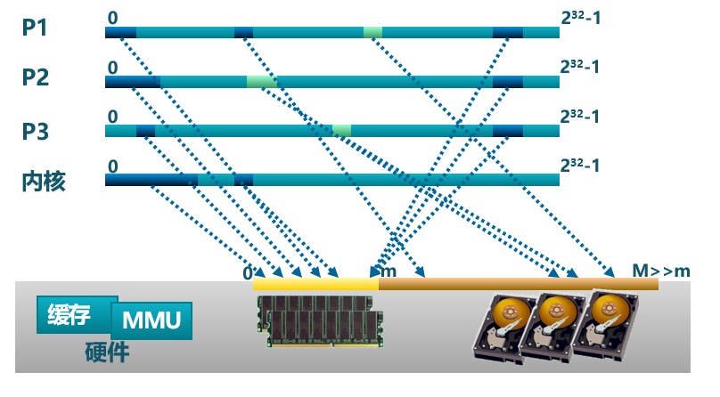

<!-- theme: gaia -->
<!-- _class: lead -->

# 第六講 虛擬存儲管理
## 第一節 虛擬存儲概念

 
 
 
 

向勇 陳渝 李國良 

2022年秋季

---

**提綱**

### 1. 虛擬存儲技術的需求
2. 覆蓋技術
3. 交換技術
4. 虛擬存儲的基本概念
5. 缺頁異常

---

#### 虛擬存儲技術的需求背景

程序規模的增長速度**遠大於**存儲器容量的增長速度

理想中的存儲器: **容量**更大、**速度**更快、**價格**更便宜的**非易失性**存儲器  

---
#### 虛擬存儲的基本思路
**挑戰**：計算機系統時常出現**內存不夠用**
**思路**：內存不夠，外存來補
- 函數覆蓋（overlay）
  - 應用程序以**函數/模塊**為單位**手動**換入換出內存
- 程序交換（swapping）
  - 操作系統以**程序**為單位**自動**換入換出內存
- 虛擬存儲(virtual storage)
  - 操作系統以**頁**為單位**自動**換入換出內存

虛擬存儲=內存+外存

---
#### 地址空間
<!--計算機系統時常出現內存空間不夠用
- 模塊覆蓋（overlay）
  - 應用程序**手動**把需要的指令和數據保存在內存中
- 任務交換（swapping）
  - 操作系統**自動**把暫時不能執行的程序保存到外存中
- 虛擬存儲
  - 在有限容量的內存中，以**頁為單位自動**裝入更多更大的程序
--->
地址空間是操作系統對虛擬存儲的**抽象**。

---

**提綱**

1. 虛擬存儲技術的需求
### 2. 覆蓋技術
3. 交換技術
4. 虛擬存儲的基本概念
5. 缺頁異常

---

#### 覆蓋技術
- 目標
  - 程序員**手動**控制在**較小的可用內存**中運行**較大的程序**
- 基本思路
  - **不同時間段**內執行的**函數或模塊**共享一塊有限的空間

---

#### 覆蓋的基本原理
  覆蓋是指把一個程序**劃分**為一系列功能相對獨立的程序段，讓執行時**不要求同時裝入**內存的程序段組成一組（稱為覆蓋段），**共享**主存的同一個區域。
  - **必要**部分（常用）的代碼和數據常駐內存
  - **可選**部分（不常用）放在其他程序模塊中,只在**需要時裝入**內存
  - **不存在調用關係**的模塊可相互覆蓋，共用同一塊內存區域

---

#### 覆蓋技術示例

 

---

#### 覆蓋技術的不足

- 增加**編程困難**
  - 需程序員劃分功能模塊，並確定模塊間的覆蓋關係
  - 增加了編程的複雜度；
- 增加**執行時間**
  - 從外存裝入覆蓋模塊
  - 時間換空間

 Turbo Pascal的Overlay系統單元支持程序員控制的覆蓋技術

---

**提綱**

1. 虛擬存儲技術的需求
2. 覆蓋技術
### 3. 交換技術
4. 虛擬存儲的基本概念
5. 缺頁異常

---

#### 交換技術 
- 基本思路
  - 操作系統以**程序**為單位**自動**換入換出內存
- 方法
  - **換出(swap out)**：把一個執行程序的整個地址空間內容保存到外存
  - **換入(swap in)**：將外存中某執行程序的地址空間內容讀入到內存

---

#### 交換技術面臨的問題

- 交換**時機**：何時需要發生交換？
  - 只當內存空間不夠或有不夠的可能時換出
- 交換區**大小**：存放所有用戶進程的所有內存映像的拷貝
- 程序換入時的**重定位**：換出後再換入時要放在原處嗎？
  - 不一定在原處，需要某種機制保證程序正確尋址&執行 

---

#### 覆蓋與交換的比較
- 程序覆蓋
  - 發生在某時間段不在一個控制流上的**模塊/函數間**
  - 以模塊/函數為單位
  - 程序員須給出模塊/函數間的**邏輯覆蓋結構**
- 交換
  - 發生在運行的**程序間**
  - 以運行的程序為單位
  - 不需要模塊間的邏輯覆蓋結構

運行的程序：``任務``或``進程``
 
---

**提綱**

1. 虛擬存儲技術的需求
2. 覆蓋技術
3. 交換技術
### 4. 虛擬存儲的基本概念
5. 缺頁異常

---

#### 虛擬存儲的定義
- 定義
  - 虛擬存儲 = **內存** + **外存**
- 思路
  - 操作系統將**不常用**的部分內存**暫存**到外存，將要處理器訪問的數據從外存**裝入**內存
- **前提**
  - 程序具有**局部性**

 ---

#### 局部性原理

局部性（locality）：程序在執行過程中的一個**較短時期**，所執行的**指令**地址和指令的**操作數**地址，分別侷限於一定區域
- **時間**局部性：**一條指令**的一次執行和下次執行，**一個數據**的一次訪問和下次訪問都集中在一個較短時期內
- **空間**局部性：當前指令和**鄰近時間**的幾條指令，當前訪問的數據和鄰近時間訪問的幾個數據都集中在一個較小區域內
- **分支**局部性：一條**跳轉指令**的兩次執行，很可能跳到相同的內存位置

局部性的意義：如果大部分程序運行具有局部性特徵，則虛擬存儲技術是能夠實現的，而且可取得滿意的效果
 

---
#### 虛擬存儲的思路與規則
- 思路：將**不常用**的部分內存塊暫存到外存
- 規則：
  - **裝載**程序時：只將**當前指令執行需要的**部分頁面或段裝入內存
  - 指令執行中需要的指令或數據**不在內存**（稱為缺頁或缺段）時：處理器通知操作系統將相應的頁面或段調入內存
  - 操作系統將內存中**暫時不用**的頁面或段保存到外存
- 實現方式：
  - 虛擬頁式存儲
  - 虛擬段式存儲

---
#### 虛擬存儲的基本特徵
- 不連續性
  - 物理內存分配非連續
  - 虛擬地址空間使用非連續
- 大用戶空間
  - 提供給用戶的虛擬內存可大於實際的物理內存
- 部分交換
  - 虛擬存儲只對部分虛擬地址空間進行調入和調出
 

---
#### 虛擬存儲的底層支撐
- 硬件(MMU/TLB/PageTable)
  - 頁式或段式存儲中的硬件**地址轉換**機制、硬件**異常**
- 軟件(OS)
  - 內存中建立**頁表或段表**
  - 管理內存和外存間頁面或段的**換入和換出**
 

---

#### 虛擬頁式存儲管理
在頁式存儲管理的基礎上，增加請求調頁和頁面置換

- **基本思路**
  - 當用戶程序要裝載到內存時，只**裝入部分**頁面，就啟動程序運行
  - 用戶程序在運行中發現有需要的代碼或數據不在內存時，則向系統發出**缺頁異常**請求
  - 操作系統在處理缺頁異常時，將外存中相應的頁面**調入**內存，使得用戶程序能繼續運行
  - 當內存快用完時，操作系統把部分頁從內存**調出**到外存

---
#### 虛擬頁式存儲管理
在頁式存儲管理的基礎上，增加請求調頁和頁面置換
- 請求調頁：也稱按需分頁，在處理器需要訪問某數據時，才把數據從外存調入內存
- 頁面置換：把不常用頁換出，要使用的頁換入
- 缺頁異常處理：**軟硬件協同支持**
 

---

**提綱**

1. 虛擬存儲技術的需求
2. 覆蓋技術
3. 交換技術
4. 虛擬存儲的基本概念
### 5. 缺頁異常

---

#### 缺頁異常的處理流程
1. CPU讀內存單元，在TLB中根據其虛擬地址匹配物理地址，未命中，**讀頁表**；
1. 由於頁表項的存在位為0，CPU產生**缺頁異常**；
1. OS**查找**到保存在外存中對應的應用的頁面內容；

---

#### 缺頁異常的處理流程

4-1. 如有空閒物理頁幀，把外存中的頁面內容**換入到某空閒物理頁幀**中；
4-2. 如無空閒物理頁幀，通過置換算法**釋放/換出**某物理頁幀到外存，再把外存中的頁面內容換入到某空閒物理頁幀中；

---

#### 缺頁異常的處理流程

5. **修改頁表項**，建立虛擬頁到物理頁幀的映射，存在位置1；
6. OS返回到應用程序，讓處理器**重新執行**產生缺頁異常的讀內存單元指令。

*在何處保存未被映射的頁？如何找到這個頁？*

---
#### 在何處保存未被映射的頁？
  - 交換空間（磁盤/文件形態）
    - 採用特殊格式存儲未被映射的頁面
  - 磁盤上的文件(代碼或數據)
  
---

#### 虛擬存儲的外存交換空間

在何處保存放在外存中的頁的地址？

- 交換空間
    - 磁盤分區：一般是扇區地址
    - 在存在位為0的頁表項中保存外存的頁地址
     

---

#### 虛擬存儲的外存磁盤文件

在何處保存放在外存中的頁的地址？

- 磁盤上的文件(代碼或數據)
  - 地址空間中的邏輯段表示中有對應的文件位置
    - 如：`MemorySet::MapArea`
  - 代碼段：可執行二進制文件
  - 動態加載的共享庫程序段：動態調用的庫文件

---
#### 虛擬存儲的性能

有效存儲訪問時間（EAT, Effective memory Access Time）
- EAT = 內存訪問時間 $*$ (1-p)  + 缺頁異常處理時間 
- 缺頁異常處理時間 = 磁盤訪問時間*p(1+q)
  - p: 缺頁率；
  - q: 寫回概率
* 例子
  - 內存訪問時間: 10 ns ；磁盤訪問時間: 5 ms
  - EAT = 10(1–p) + 5,000,000p(1+q) 

---

### 小結

1. 虛擬存儲技術的需求
2. 覆蓋技術
3. 交換技術
4. 虛擬存儲的基本概念
5. 缺頁異常
