<!-- theme: gaia -->
<!-- _class: lead -->

# 第六講 虛擬存儲管理
## 第二節 局部頁面置換算法

<br>
<br>

向勇 陳渝 李國良 

2022年秋季

---

**提綱**

### 1. 頁面置換算法的基本概念
2. 最優頁面置換算法 (OPT, optimal)
3. 先進先出頁面置換算法 (FIFO)
4. 最近最久未使用頁面置換算法 (LRU, Least Recently Used)
5. 時鐘頁面置換算法 (Clock)
6. 改進的時鐘頁面置換算法
7. 最不常用頁面置換算法 (LFU, Least Frequently Used)
8. Belady現象

--- 

#### 頁面置換算法的功能與設計目標

- 功能
  - 出現缺頁異常需調入新頁面而內存已滿時，置換算法**選擇被置換的物理頁面**

- 設計目標
  - 儘可能減少頁面**缺頁次數**、**換入/換出次數**
  - 把未來不再訪問或**短期內不訪問**的頁面調出


--- 
#### 頁面置換的時機

- **空閒內存**數量上限和下限
- 到達下限，開始回收內存
- 到達上限，暫停回收內存

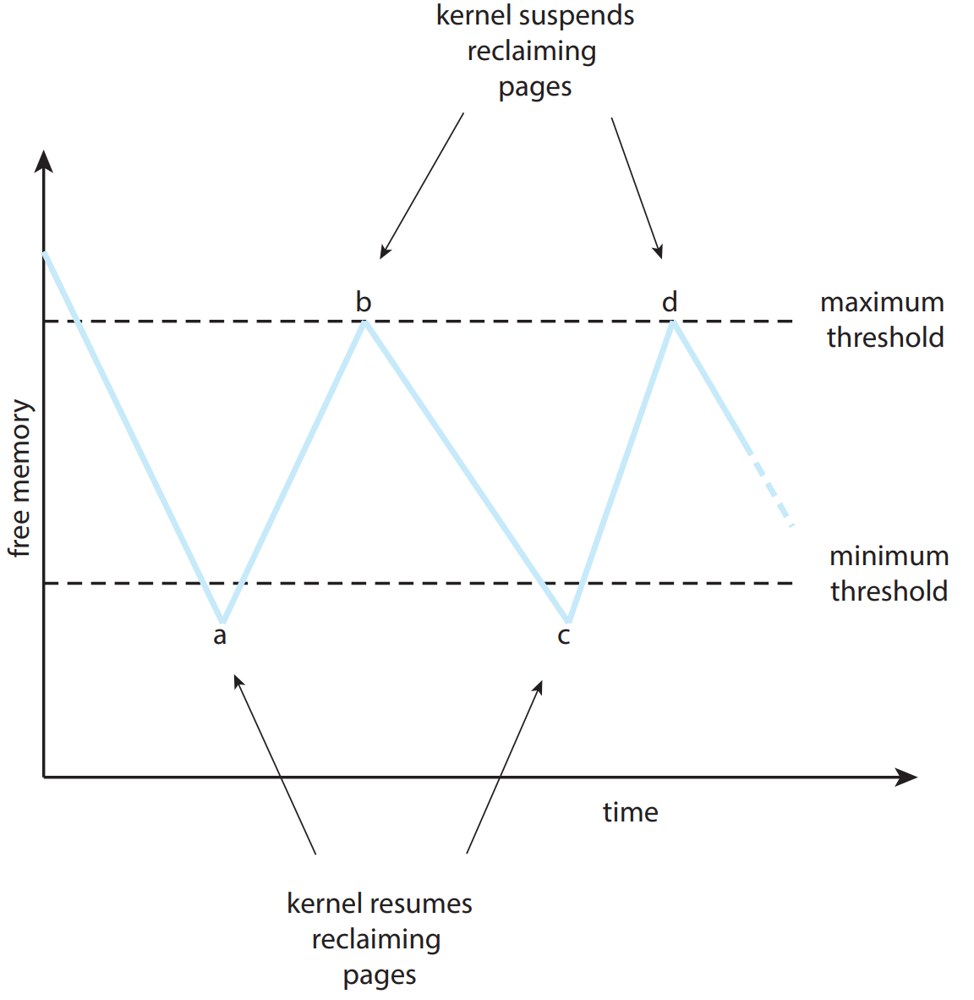

--- 

#### 頁面鎖定(frame locking)/常駐內存

**必須常駐內存**的邏輯頁面
  - 操作系統的關鍵部分
  - 要求響應速度的代碼和數據
  - 頁表中的鎖定標誌位(lock bit)


--- 

#### 頁面置換算法的評價方法

- 評價方法
  - 記錄進程**訪問內存頁面的軌跡**，模擬置換行為，記錄**缺頁次數**；
  - 更**少**的缺頁, 更**好**的性能
- 示例: 虛擬地址訪問用(頁號, 位移)表示
```
(3,0),  (1,9),  (4,1),  (2,1),  (5,3),  (2,0),  (1,9),  (2,4),  (3,1),  (4,8)
```
- 對應的頁面軌跡
```
3, 1, 4, 2, 5, 2, 1, 2, 3, 4 用數字表示 
c, a, d, b, e, b, a, b, c, d 用字符表示
```

--- 

#### 頁面置換算法的分類

- **局部**頁面置換算法
  - 置換頁面的選擇範圍僅限於**當前進程**佔用的物理頁面內
  - 最優算法、先進先出算法、最近最久未使用算法
  - 時鐘算法、最不常用算法

- **全局**頁面置換算法
  - 置換頁面的選擇範圍是**所有**可換出的物理頁面
  - 工作集算法、缺頁率算法

---

**提綱**

1. 頁面置換算法的基本概念
### 2. 最優頁面置換算法 (OPT, optimal)
3. 先進先出頁面置換算法 (FIFO)
4. 最近最久未使用頁面置換算法 (LRU, Least Recently Used)
5. 時鐘頁面置換算法 (Clock)
6. 改進的時鐘頁面置換算法
7. 最不常用頁面置換算法 (LFU, Least Frequently Used)
8. Belady現象

--- 

#### 最優頁面置換算法的工作原理
- 基本思路
  - 置換在**未來最長時間**不訪問的頁面
- 算法實現
  - 缺頁時，計算內存中每個邏輯頁面的**下一次訪問時間**
  - 選擇未來最長時間不訪問的頁面
  
---
#### 最優頁面置換算法特徵
  - 缺頁最少，是**理想情況**
  - 實際系統中**無法實現**
  - **無法預知**每個頁面在下次訪問前的等待時間
    - 在模擬器上運行某個程序，並記錄每一次的頁面訪問情況
    - 第二遍運行時使用最優算法
 
  
---

#### 最優頁面置換算法示例


  
  
---

#### 最優頁面置換算法示例


---

#### 最優頁面置換算法示例

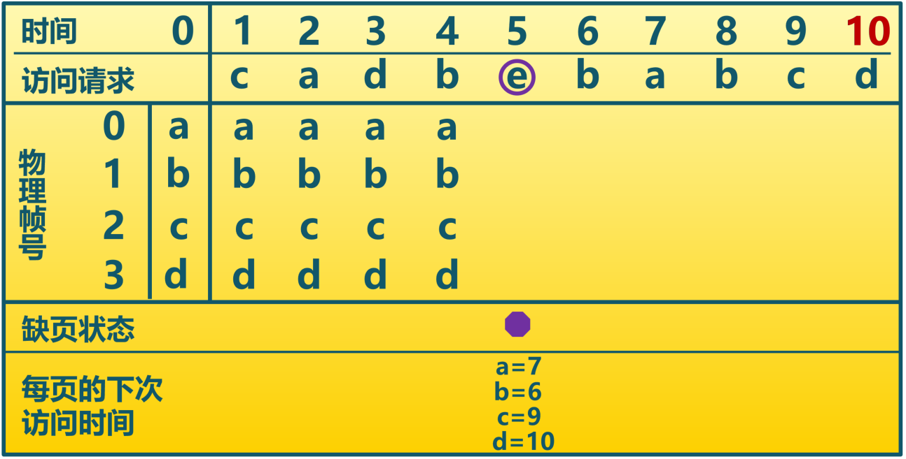 

---

#### 最優頁面置換算法示例

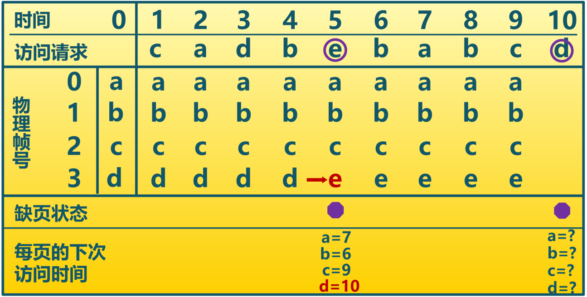

---

**提綱**

1. 頁面置換算法的基本概念
2. 最優頁面置換算法 (OPT, optimal)
### 3. 先進先出頁面置換算法 (FIFO)
4. 最近最久未使用頁面置換算法 (LRU, Least Recently Used)
5. 時鐘頁面置換算法 (Clock)
6. 改進的時鐘頁面置換算法
7. 最不常用頁面置換算法 (LFU, Least Frequently Used)
8. Belady現象

--- 

#### 先進先出算法的工作原理
- 基本思路
  - 選擇在內存**駐留時間最長**的頁面進行置換
- 算法實現
  - 維護一個記錄所有**位於內存中的邏輯頁面鏈表**
  - 鏈表元素**按駐留內存的時間排序**，鏈首最長，鏈尾最短
  - 出現缺頁時，**選擇**鏈首頁面進行置換，新頁面加到鏈尾

---
#### 先進先出算法特徵

  - 實現簡單
  - 性能較差，調出的頁面可能是經常訪問的
  - 分配物理頁面數增加時，缺頁並不一定減少(Belady現象)
  - 很少單獨使用

---

#### 先進先出算法示例


  
---

#### 先進先出算法示例

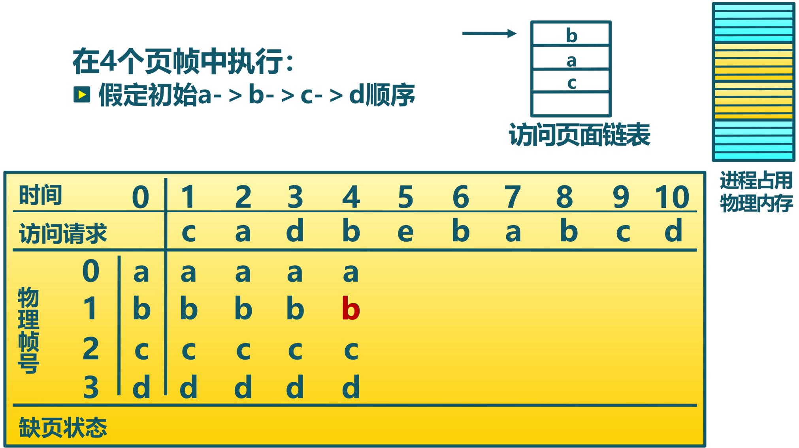

  
---

#### 先進先出算法示例

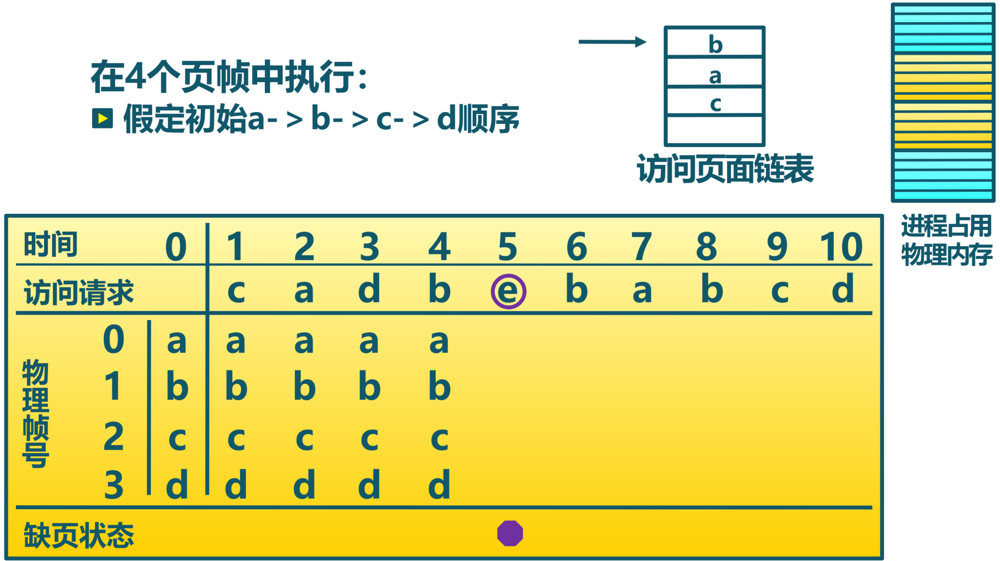

---

#### 先進先出算法示例

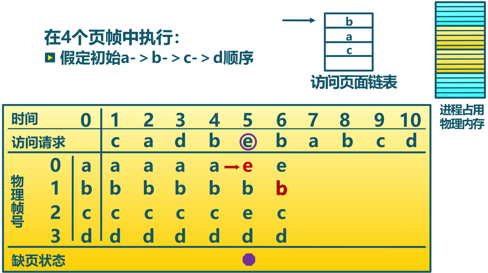

---

#### 先進先出算法示例


---

#### 先進先出算法示例


  
---

**提綱**

1. 頁面置換算法的基本概念
2. 最優頁面置換算法 (OPT, optimal)
3. 先進先出頁面置換算法 (FIFO)
### 4. 最近最久未使用算法 (LRU, Least Recently Used)
5. 時鐘頁面置換算法 (Clock)
6. 改進的時鐘頁面置換算法
7. 最不常用頁面置換算法 (LFU, Least Frequently Used)
8. Belady現象

--- 

#### 最近最久未使用算法的工作原理

- 基本思路
  - 選擇**最長時間沒有被引用**的頁面進行置換
  - 如某頁面長時間未被訪問，則它**在將來還可能**會長時間不會訪問

- 算法實現
  - 缺頁時，計算內存中每個邏輯頁面的**上一次訪問**時間
  - 選擇上一次使用到當前時間最長的頁面進行置換
- 算法特徵
  - **最優置換算法的一種近似**

---

#### 最近最久未使用算法示例


  
---

#### 最近最久未使用算法示例


  
---

#### 最近最久未使用算法示例


  
---

#### 最近最久未使用算法示例


  
---

#### 最近最久未使用算法示例


  
---

#### 最近最久未使用算法示例


  
---

#### 最近最久未使用算法示例


  
  
---

#### LRU的頁面鏈表實現

- 頁面鏈表
  - 系統維護一個按最近一次訪問時間排序的頁面**鏈表**
    - **鏈表首節點**是最近剛剛使用過的頁面
    - **鏈表尾節點**是最久未使用的頁面
  - 訪問內存時，找到相應頁面，並把它**移到鏈表之首**
  - 缺頁時，置換鏈表尾節點的頁面
- 特徵
  - 開銷大

  
  
---

#### LRU的活動頁面棧實現

- 活動頁面**棧**
  - 訪問頁面時，將此頁號**壓入棧頂**，並棧內相同的頁號抽出
  - 缺頁時，**置換棧底**的頁面
- 特徵
  - 開銷大

  
---

#### LRU的活動頁面棧實現示例

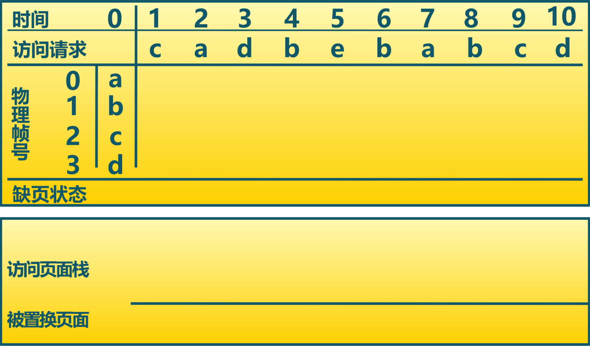

---

#### LRU的活動頁面棧實現示例


  
---

#### LRU的活動頁面棧實現示例


  
---

#### LRU的活動頁面棧實現示例


---

#### LRU的活動頁面棧實現示例

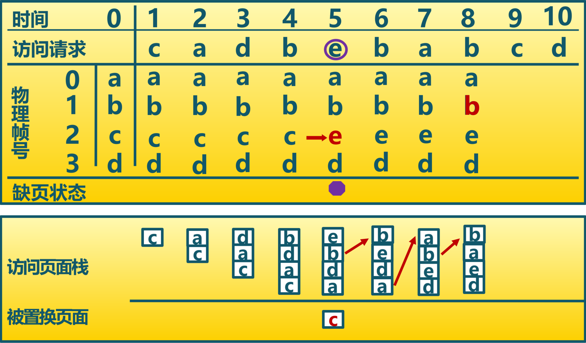

  
---

#### LRU的活動頁面棧實現示例


---

#### LRU的活動頁面棧實現示例


  
---

#### LRU的活動頁面棧實現示例


  
---

#### LRU的活動頁面棧實現示例


  
---

**提綱**

1. 頁面置換算法的基本概念
2. 最優頁面置換算法 (OPT, optimal)
3. 先進先出頁面置換算法 (FIFO)
4. 最近最久未使用頁面置換算法 (LRU, Least Recently Used)
### 5. 時鐘頁面置換算法 (Clock)
6. 改進的時鐘頁面置換算法
7. 最不常用頁面置換算法 (LFU, Least Frequently Used)
8. Belady現象

--- 

#### 時鐘置換算法的工作原理

- 基本思路
  - 僅對頁面的訪問情況進行**大致統計**
- 數據結構 
  - 在頁表項中增加**訪問位**，描述頁面在過去一段時間的內訪問情況
  - 各頁面組織成**環形鏈表**
  - 指針指向**最先調入的頁面**


---

#### 時鐘置換算法的工作原理

- 算法實現
  - **訪問頁面時**，在頁表項記錄頁面訪問情況
  - **缺頁時**，從指針處開始順序查找未被訪問的頁面進行置換


  
---

#### 時鐘置換算法的具體實現過程

- 頁面**裝入內存時**，訪問位初始化為0
- **訪問頁面（讀/寫)時**，訪問位置1
- **缺頁時**，從指針當前位置順序檢查
  - 訪問位為0，則置換該頁
  - 訪問位為1，則訪問位置0，並指針移動到下一個頁面，直到找到可置換的頁面
- 算法特徵
  - 時鐘算法是LRU和FIFO的折中


---

#### 時鐘置換算法示例


---

#### 時鐘置換算法示例


---

#### 時鐘置換算法示例

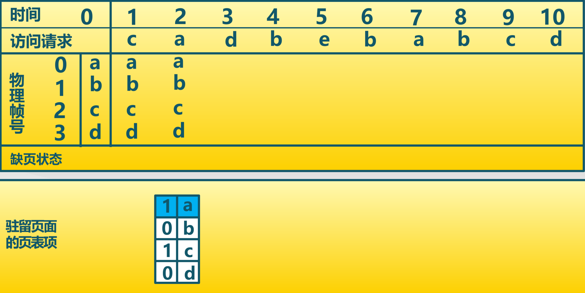


---

#### 時鐘置換算法示例


---

#### 時鐘置換算法示例


---

#### 時鐘置換算法示例


---

#### 時鐘置換算法示例


---

#### 時鐘置換算法示例


---

#### 時鐘置換算法示例


---

#### 時鐘置換算法示例


---

#### 時鐘置換算法示例


---

#### 時鐘置換算法示例


---

#### 時鐘置換算法示例

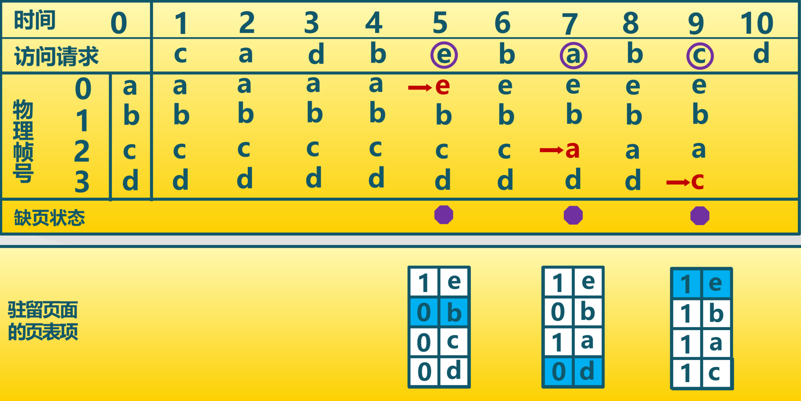


---

#### 時鐘置換算法示例

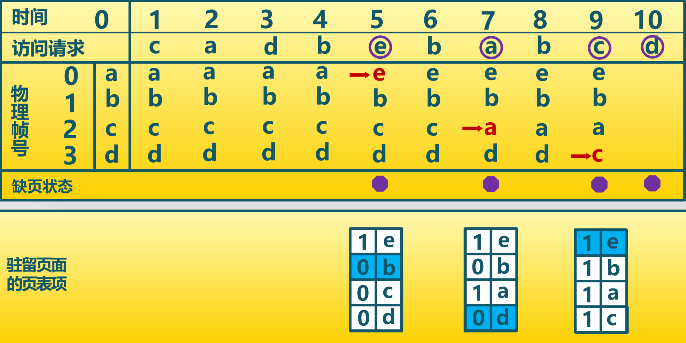


---

#### 時鐘置換算法示例


  
---

**提綱**

1. 頁面置換算法的基本概念
2. 最優頁面置換算法 (OPT, optimal)
3. 先進先出頁面置換算法 (FIFO)
4. 最近最久未使用頁面置換算法 (LRU, Least Recently Used)
5. 時鐘頁面置換算法 (Clock)
### 6. 改進的時鐘頁面置換算法
7. 最不常用頁面置換算法 (LFU, Least Frequently Used)
8. Belady現象

--- 

#### 改進的時鐘置換算法的工作原理

- 基本思路
  - 減少**修改頁**的缺頁處理開銷
- 數據結構 
  - 在頁面中增加**修改位**，描述頁面在過去一段時間的內寫訪問情況
- 算法實現
  - 訪問頁面時，在頁表項記錄頁面訪問情況
  - **修改頁面時**，在頁表項記錄頁面修改情況
  - 缺頁時，修改頁面標誌位，以**跳過**有修改的頁面
  
---

#### 改進的時鐘置換算法的工作原理


  
---

#### 改進的時鐘置換算法示例


  
---

#### 改進的時鐘置換算法示例

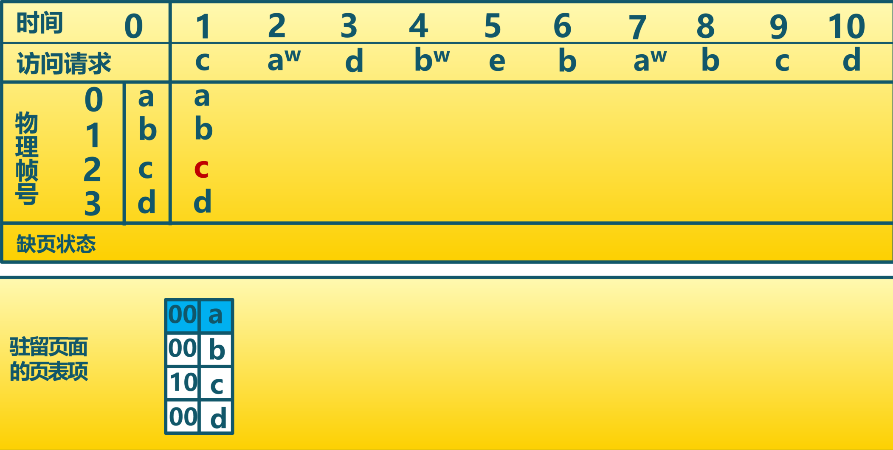

  
---

#### 改進的時鐘置換算法示例


  
---

#### 改進的時鐘置換算法示例


---

#### 改進的時鐘置換算法示例


  
---

#### 改進的時鐘置換算法示例


  
---

#### 改進的時鐘置換算法示例


  
---

#### 改進的時鐘置換算法示例


---

#### 改進的時鐘置換算法示例

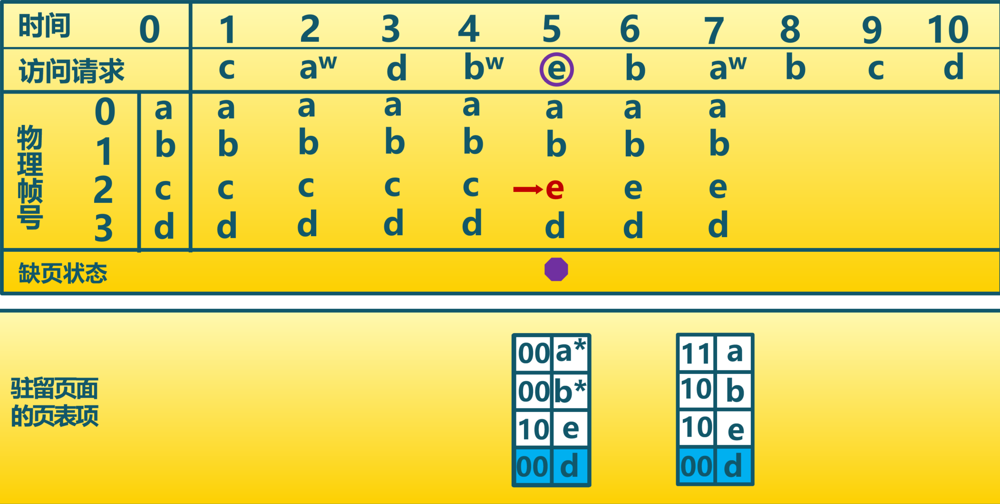

  
---

#### 改進的時鐘置換算法示例


  
---

#### 改進的時鐘置換算法示例


  
---

#### 改進的時鐘置換算法示例


---

#### 改進的時鐘置換算法示例

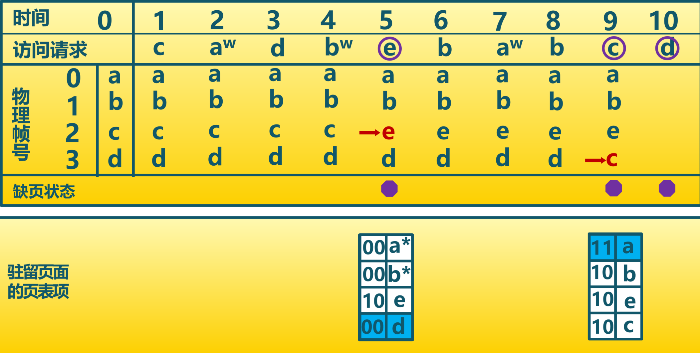

  
---

#### 改進的時鐘置換算法示例


  
---

**提綱**

1. 頁面置換算法的基本概念
2. 最優頁面置換算法 (OPT, optimal)
3. 先進先出頁面置換算法 (FIFO)
4. 最近最久未使用頁面置換算法 (LRU, Least Recently Used)
5. 時鐘頁面置換算法 (Clock)
6. 改進的時鐘頁面置換算法
### 7. 最不常用置換算法 (LFU, Least Frequently Used)
8. Belady現象

--- 

#### 最不常用算法的工作原理

- 基本思路
  - 缺頁時，置換**訪問次數最少**的頁面

- 算法實現
  - 每個頁面設置一個**訪問計數**
  - 訪問頁面時，**訪問計數加1** 
  - 缺頁時，置換**計數最小的頁面**

  
---

#### 最不常用算法特徵

- 特徵
  - 算法開銷大
  - 開始時頻繁使用，但以後不使用的頁面**很難置換**
    - 解決方法：計數定期右移

- LRU關注多久未訪問,時間越短越好
- LFU關注訪問次數，次數越多越好

  
---

#### LFU示例

4個物理頁幀，最初的訪問次數a-＞8 b-＞5 c-＞6 d-＞2
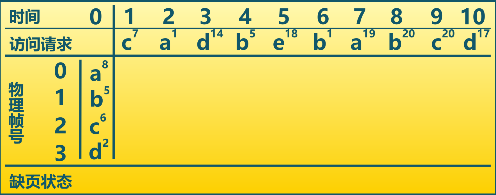

  
---

#### LFU示例

4個物理頁幀，最初的訪問次數a-＞8 b-＞5 c-＞6 d-＞2


  
---

#### LFU示例

4個物理頁幀，最初的訪問次數a-＞8 b-＞5 c-＞6 d-＞2
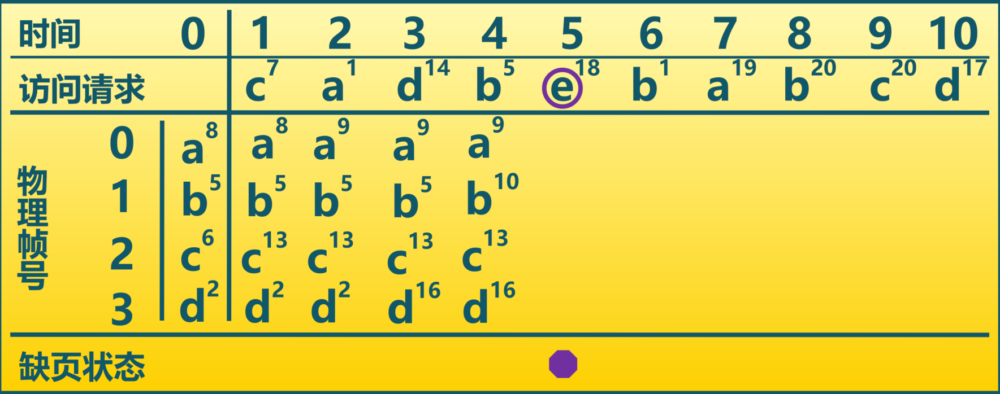

  
---

#### LFU示例

4個物理頁幀，最初的訪問次數a-＞8 b-＞5 c-＞6 d-＞2


---

#### LFU示例

4個物理頁幀，最初的訪問次數a-＞8 b-＞5 c-＞6 d-＞2


  
---

#### LFU示例

4個物理頁幀，最初的訪問次數a-＞8 b-＞5 c-＞6 d-＞2
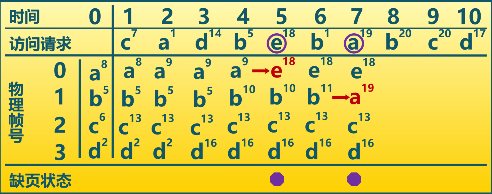

  
---

#### LFU示例

4個物理頁幀，最初的訪問次數a-＞8 b-＞5 c-＞6 d-＞2


---

**提綱**

1. 頁面置換算法的基本概念
2. 最優頁面置換算法 (OPT, optimal)
3. 先進先出頁面置換算法 (FIFO)
4. 最近最久未使用頁面置換算法 (LRU, Least Recently Used)
5. 時鐘頁面置換算法 (Clock)
6. 改進的時鐘頁面置換算法
7. 最不常用頁面置換算法 (LFU, Least Frequently Used)
### 8. Belady現象

--- 

#### Belady現象
- 現象
  - 採用FIFO等算法時，可能出現**分配的物理頁面數增加**，**缺頁次數反而升高**的異常現象
- 原因
  - FIFO算法的置換特徵與進程訪問內存的動態特徵**矛盾**
  - 被它置換出去的頁面**並不一定**是進程近期不會訪問的
- 思考
  - 哪些置換算法沒有Belady現象？

---

#### FIFO算法的Belady現象

訪問順序 : 1, 2, 3, 4, 1, 2, 5, 1, 2, 3, 4, 5
物理頁面數: 3  ； 缺頁次數: 9


---

#### FIFO算法的Belady現象

訪問順序 : 1, 2, 3, 4, 1, 2, 5, 1, 2, 3, 4, 5
物理頁面數: 3  ； 缺頁次數: 9


---

#### FIFO算法的Belady現象

訪問順序 : 1, 2, 3, 4, 1, 2, 5, 1, 2, 3, 4, 5
物理頁面數: 3  ； 缺頁次數: 9


---

#### FIFO算法的Belady現象

訪問順序 : 1, 2, 3, 4, 1, 2, 5, 1, 2, 3, 4, 5
物理頁面數: 3  ； 缺頁次數: 9


---

#### FIFO算法的Belady現象

訪問順序 : 1, 2, 3, 4, 1, 2, 5, 1, 2, 3, 4, 5
物理頁面數: 3  ； 缺頁次數: 9


---

#### FIFO算法的Belady現象

訪問順序 : 1, 2, 3, 4, 1, 2, 5, 1, 2, 3, 4, 5
物理頁面數: 3  ； 缺頁次數: 9


---

#### FIFO算法的Belady現象

訪問順序 : 1, 2, 3, 4, 1, 2, 5, 1, 2, 3, 4, 5
物理頁面數: 3  ； 缺頁次數: 9


---

#### FIFO算法的Belady現象

訪問順序 : 1, 2, 3, 4, 1, 2, 5, 1, 2, 3, 4, 5
物理頁面數: 4  ； 缺頁次數: 10


---

#### FIFO算法的Belady現象

訪問順序 : 1, 2, 3, 4, 1, 2, 5, 1, 2, 3, 4, 5
物理頁面數: 4  ； 缺頁次數: 10
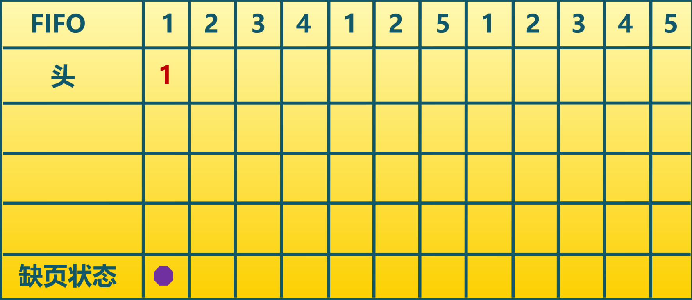


---

#### FIFO算法的Belady現象

訪問順序 : 1, 2, 3, 4, 1, 2, 5, 1, 2, 3, 4, 5
物理頁面數: 4  ； 缺頁次數: 10


---

#### FIFO算法的Belady現象

訪問順序 : 1, 2, 3, 4, 1, 2, 5, 1, 2, 3, 4, 5
物理頁面數: 4  ； 缺頁次數: 10


---

#### FIFO算法的Belady現象

訪問順序 : 1, 2, 3, 4, 1, 2, 5, 1, 2, 3, 4, 5
物理頁面數: 4  ； 缺頁次數: 10


---

#### FIFO算法存在Belady現象


<!-- 
-->
<!-- -->

---

#### LRU算法不存在Belady現象


時鐘/改進的時鐘頁面置換是否有Belady現象？
為什麼LRU頁面置換算法沒有Belady現象？

---

#### LRU、FIFO和Clock的比較

  - LRU算法和FIFO本質上都是先進先出的思路
  - LRU依據頁面的最近訪問時間排序
  - LRU需要動態地調整順序
  - FIFO依據頁面進入內存的時間排序
  - FIFO的頁面進入時間是固定不變的

---

#### LRU、FIFO和Clock的比較

  - LRU可退化成FIFO
    - 如頁面進入內存後**沒有被訪問**，最近訪問時間與進入內存的時間相同
    - 例如：給進程分配3個物理頁面，邏輯頁面的訪問順序為1、2、3、4、5、6、1、2、3…


---

#### LRU、FIFO和Clock的比較

  - LRU算法性能較好，但系統開銷較大
  - FIFO算法系統開銷較小，會發生Belady現象
  - Clock算法是它們的**折衷**
    - 頁面訪問時，不動態調整頁面在鏈表中的順序，僅做標記
    - 缺頁時，再把它移動到鏈表末尾
    - 對於**未被訪問的**頁面，Clock和LRU算法的表現一樣好
    - 對於**被訪問過的**頁面，Clock算法不能記錄準確訪問順序，而LRU算法可以

--- 

### 小結

1. 頁面置換算法的基本概念
2. 最優頁面置換算法 (OPT, optimal)
3. 先進先出頁面置換算法 (FIFO)
4. 最近最久未使用頁面置換算法 (LRU, Least Recently Used)
5. 時鐘頁面置換算法 (Clock)
6. 改進的時鐘頁面置換算法
7. 最不常用頁面置換算法 (LFU, Least Frequently Used)
8. Belady現象


