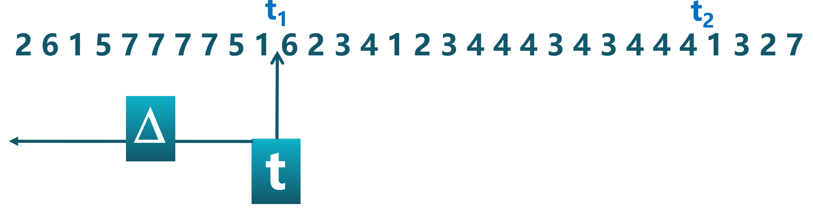
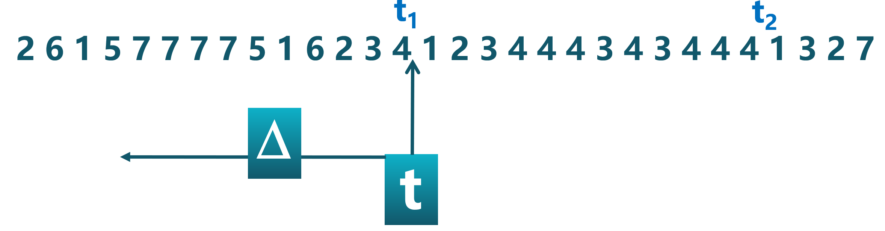
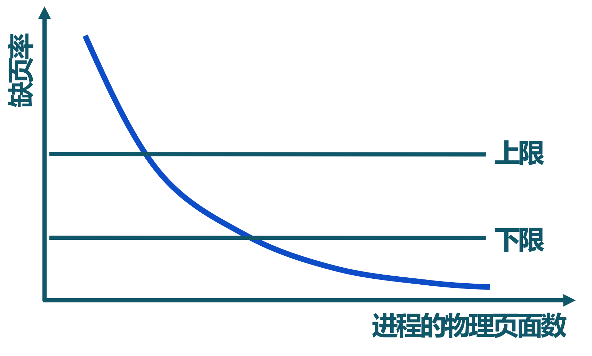

<!-- theme: gaia -->
<!-- _class: lead -->

# 第六講 虛擬存儲管理
## 第三節 全局頁面置換算法

 
 

向勇 陳渝 李國良 

2022年秋季

---

**提綱**

### 1. 全局頁面置換算法的定義
2. 工作集頁面置換算法
3. 缺頁率頁面置換算法

--- 
#### 局部置換算法沒有考慮進程訪存差異
FIFO 頁面置換算法: 假設初始順序 a->b->c 
物理頁面數: 3   缺頁次數: 9

--- 
#### 局部置換算法沒有考慮進程訪存差異
FIFO 頁面置換算法: 假設初始順序 a->b->c 
物理頁面數: 4   缺頁次數: 1

--- 
#### 全局置換算法的工作原理
- 思路
  - **為進程分配可變數目的物理頁面**
- 全局置換算法要解決的問題
  - 進程在**不同階段**的內存需求是變化的
  - 分配給進程的**內存**也需要在**不同階段有所變化**
  - 全局置換算法需要**確定分配給進程的物理頁面數**

---
#### CPU利用率與程序運行數量

<!--  -->
 - CPU利用率與程序運行數量存在相互**促進和制約**的關係
   - 運行程序少時，提高程序運行數，可提高CPU利用率
   - 程序運行數量大導致內存訪問增加，並會降低訪存的局部性
   - 局部性下降會導致缺頁率上升和CPU利用率下降

---

**提綱**

1. 全局頁面置換算法的定義
### 2. 工作集頁面置換算法
3. 缺頁率頁面置換算法

--- 

#### 工作集
一個進程當前正在使用的邏輯頁面集合，可表示為二元函數W(t, $\Delta$)
- 當前執行時刻$t$
- 工作集窗口(working-set window)$\Delta$：一個定長的頁面訪問時間窗口
- 工作集窗口$\Delta$大小$\tau$
  - 時間段長度，用當前時刻 $t$ 前的**內存訪問次數**來表示
- 工作集W(t, $\Delta$)
  - 在當前時刻 $t$ 前的$\Delta$時間窗口中的所有訪問頁面所組成的集合
- 工作集大小 | W(t, $\Delta$) |：頁面數目

---
#### 進程的工作集示例
頁面訪問順序：
W(t, $\Delta$) ={1,2,5,6,7} , 工作集窗口大小 $\tau=10, 當前時刻 t=t_1$ 

---
#### 進程的工作集示例

頁面訪問順序：
W(t, $\Delta$) ={1,2,3,4,5,6,7} , 工作集窗口大小 $\tau=10, 當前時刻 t=t_1$ 

---
#### 進程的工作集示例
頁面訪問順序：
W(t, $\Delta$) ={3,4}， 工作集窗口大小 $\tau=10$，當前時刻 $t=t_2$

---
#### 工作集的變化

- **進程開始執行**後，隨著訪問新頁面逐步建立較穩定的工作集
- 當內存訪問的**局部性區域位置大致穩定**時，工作集大小也大致穩定
- **局部性區域位置改變**時，工作集快速擴張和收縮過渡到下一個穩定值

---
#### 常駐集
  在當前時刻，進程**實際駐留內存**中的頁面集合
- 工作集與常駐集的關係
  - 工作集是進程在運行過程中的**固有性質**
  - 常駐集**取決於系統**分配給進程的物理頁面數目和頁面置換算法
- 缺頁率與常駐集的關係 
  - 常駐集  $\supseteq$ 工作集時，缺頁較少
  - 工作集發生劇烈變動（過渡）時，缺頁較多
  - 進程常駐集大小達到一定數目後，缺頁率也不會明顯下降

---
#### 工作集頁面置換算法
- 思路
   - 換出**不在工作集中的**頁面
- 工作集窗口大小$\tau$
   - 當前時刻前$\tau$次內存訪問的頁面集合構成**工作集**

- 實現方法
  - 訪存鏈表：維護窗口內的訪存頁面鏈表
  - 訪存時，**換出**不在工作集的頁面，更新訪存鏈表
  - 缺頁時，換入頁面，更新訪存鏈表

---

#### 工作集置換算法示例

$\tau=4$

---

#### 工作集置換算法示例

$\tau=4$

---

#### 工作集置換算法示例

$\tau=4$

---

#### 工作集置換算法示例

$\tau=4$

---

#### 工作集置換算法示例

$\tau=4$

---

#### 工作集置換算法示例

$\tau=4$

---

#### 工作集置換算法示例

$\tau=4$

---

#### 工作集置換算法示例

$\tau=4$

---

#### 工作集置換算法示例

$\tau=4$

---

**提綱**

1. 全局頁面置換算法的定義
2. 工作集頁面置換算法
### 3. 缺頁率頁面置換算法

--- 

#### 缺頁率(Page-Fault-Frequency, Page Fault Rate)

缺頁次數 / 內存訪問**次數** 或 缺頁平均時間**間隔的倒數**

- 影響缺頁率的因素
  - 頁面置換算法
  - 分配給進程的物理頁面數目
  - 頁面大小
  - 程序的編寫方法

---
#### 缺頁率置換算法

通過調節**常駐集大小**，使每個進程的**缺頁率**保持在一個合理的範圍內
- 若進程缺頁率過高，則增加常駐集以分配更多的物理頁面
- 若進程缺頁率過低，則減少常駐集以減少它的物理頁面數

---
#### 缺頁率頁面置換算法
- 訪存時，**設置**引用位標誌
- 缺頁時，**計算**從上次缺頁時間$t_{last}$ 到現在$t_{current}$ 的**時間間隔**
  - 如果 $t_{current} – t_{last}>T$（容忍的缺頁窗口），則**置換**所有在$[t_{last} ,  t_{current} ]$時間內沒有被引用的頁
  - 如果$t_{current} – t_{last} \le T$，則**增加**缺失頁到常駐集中

---

#### 缺頁率置換算法示例

假定窗口大小為 2

---

#### 缺頁率置換算法示例

假定窗口大小為 2

---

#### 缺頁率置換算法示例

假定窗口大小為 2

---

#### 缺頁率置換算法示例

假定窗口大小為 2

---

#### 缺頁率置換算法示例

假定窗口大小為 2

---

#### 缺頁率置換算法示例

假定窗口大小為 2

---

#### 缺頁率置換算法示例

假定窗口大小為 2

---

#### 缺頁率置換算法示例

假定窗口大小為 2

---

#### 缺頁率置換算法示例

假定窗口大小為 2

---

#### 缺頁率置換算法示例

假定窗口大小為 2

---
####  抖動問題(thrashing)
- 抖動
  - 進程**物理頁面太少**，不能包含工作集
  - 造成**大量缺頁**，頻繁置換
  - 進程**運行速度變慢**

- 產生抖動的原因
   - 隨著駐留內存的**進程數目**增加，分配給每個進程的物理頁面數不斷減小，缺頁率不斷上升
-  操作系統需**在併發水平和缺頁率之間達到一個平衡**
   - 選擇一個適當的進程數目和進程需要的物理頁面數

---

### 課程實驗二

* 第四章：地址空間 -> chapter4練習 -> 
    * [rCore](https://learningos.github.io/rCore-Tutorial-Guide-2022A/chapter4/7exercise.html)
    * [uCore](https://learningos.github.io/uCore-Tutorial-Guide-2022A/chapter4/7exercise.html)
* 實驗任務
    * 重寫獲取系統時間和進程控制塊信息的內核函數
    * 實現申請和取消虛存映射的系統調用
* 實驗提交要求
    * 任務佈置後的第11天（2022年10月30日）；

---

### 第五講虛擬存儲管理小結

* 第一節 虛擬存儲概念
    * 需求、覆蓋、交換、虛擬存儲的概念、缺頁異常
* 第二節 局部頁面置換算法
    * 頁面置換算法的概念、OPT、FIFO、LRU、Clock、改進的時鐘頁面置換算法、LFU、Belady現象
* 第三節 全局頁面置換算法
    * 全局頁面置換算法、工作集置換算法、缺頁率置換算法
