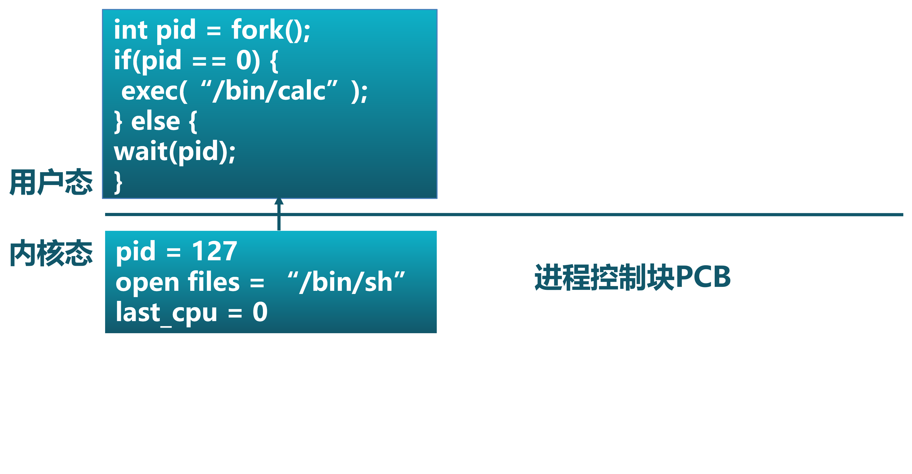
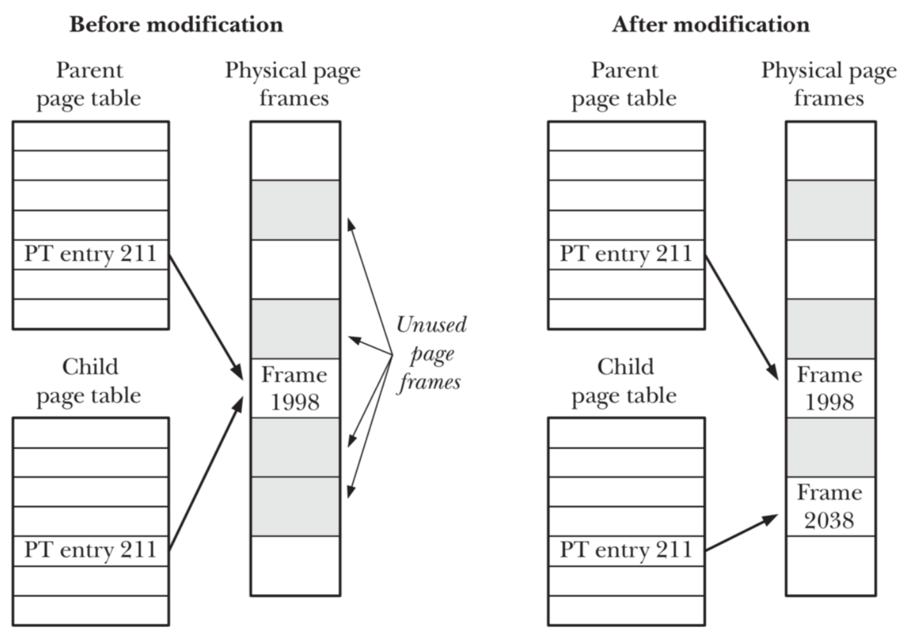
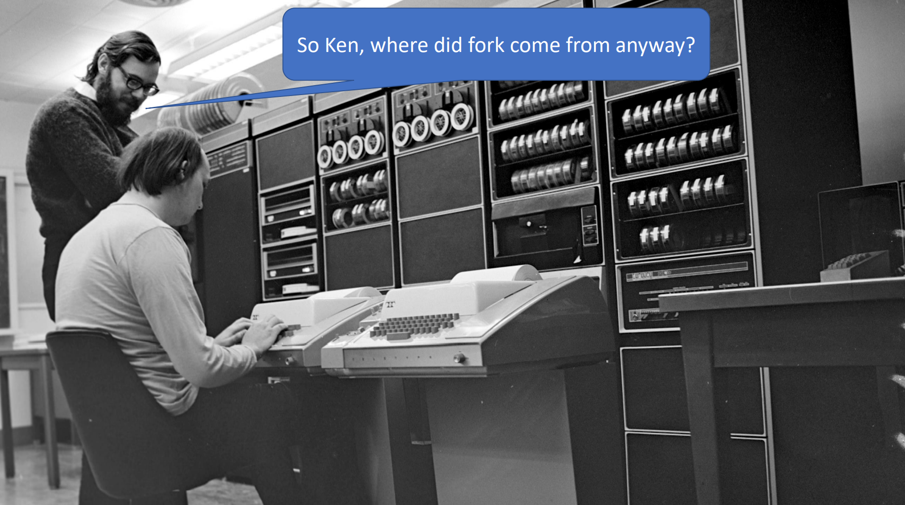

<!-- theme: gaia -->
<!-- _class: lead -->

# 第七講 進程管理與單處理器調度
## 第一節 進程管理

<br>
<br>

向勇 陳渝 李國良 

2022年秋季

---

**提綱**

### 1. 進程的基本概念
   - 進程管理的需求背景
   - 進程的概念
   - 進程與任務
2. 進程管理
3. 關於Fork()的思考

---

#### 進程管理的需求背景

- 背景
  - **硬件**越來越強大
    - 更快的CPU with MMU/TLB/Cache
    - 更大的內存和外存
    - 更豐富的外設
  - 開發者希望能夠在計算機上有更多的**動態交互和控制能力**
  - 使用者需要更**方便**的計算機交互能力
  
- 目標
  - **提高開發效率和執行效率**

---

#### 進程管理的需求背景

- 操作系統需要**與用戶交互**的接口/界面
     - **命令行**界面（CLI）
        - 用戶通過鍵盤直接輸入命令
        - Shell
     - **圖形**界面（GUI）
        - 用戶通過鼠標/窗口等輸入命令

 


---

#### 進程管理的需求背景

- 用戶需要**動態管理和控制應用執行** 
- 在應用的執行過程中，用戶通過界面主動給操作系統發出**請求**，來**創建並執行**新的應用程序，**暫停或停止**應用程序的執行等。

 

---

#### 引入進程(Process)概念的目的
  - 清晰地**刻畫**操作系統系統中程序運行的動態內在規律
  - 有效**管理和調度**多個程序的執行和對資源的使用

 

---

#### 進程提供給應用程序的抽象

- 從應用角度看，進程提供給應用程序的**關鍵抽象**
    - 獨立的邏輯**控制流**：好像自己的程序獨佔地使用處理器
    - 私有的**地址空間**：好像自己的程序獨佔地使用內存系統
  
 

---

#### 從實現角度看進程

從實現角度看，進程是操作系統建立程序運行中的過程管理相關的**數據結構**，以及對數據結構的**動態操作**過程

 


---
#### 從資源角度看進程

- 從資源角度看，進程是程序執行中**佔用資源的集合**
  - 共享資源 v.s. 獨佔資源
  - 處理器、時間
  - 內存、地址空間
  - 文件、I/O、...
  
 

---

#### 什麼是進程？

- 簡單定義
  - 一個程序的執行**過程**
  - 一個執行中程序的**實例**
- 詳細定義：一個具有一定**獨立功能**的程序在某**數據集合**上的一次**執行和資源使用的動態過程**
   - 執行程序邏輯並讀寫數據
   - 創建並執行新進程
   - 使用共享資源：文件等

 

---

#### 任務和進程

從**資源佔用**和**執行過程**兩個方面分析

相同點：
- 從用戶的角度看，任務和進程都表示運行的程序
- 從操作系統的角度看，任務和進程都表示為一個程序的執行過程
- 從資源使用的角度看
    - 二者都能夠被操作系統打斷並通過切換來分時佔用 CPU 資源
    - 都需要地址空間來放置代碼和數據

---

#### 任務和進程

從**資源佔用**和**執行過程**兩個方面分析

相同點：
- 從執行過程的角度看
  - 都有從開始到結束運行這樣的**生命週期**
    - 任務生命週期 --> 進程生命週期
    - 任務的三狀態模型 --> 進程的三狀態模型
    - 任務切換 --> 進程切換
    - 任務上下文  --> 進程上下文


---

#### 任務和進程

從**資源佔用**和**執行過程**兩個方面分析

不同點：
- 任務 是這裡提到的進程的**初級階段**，不具有如下功能：
  - 進程可以在運行的過程中，創建子進程 、 用新的程序內容覆蓋已有的程序內容
  - 進程成為程序執行過程中動態申請/使用/釋放各種資源的載體

進程的動態功能可讓程序的運行更加靈活。

---

#### 進程是計算機科學中的重要概念

**進程**是計算機科學中最深刻、最成功的概念之一(from CSAPP)
 

---

**提綱**

1. 進程的基本概念
### 2. 進程管理
  - 進程管理系統調用
  - 進程控制塊PCB
  - 進程創建和程序加載
  - 進程等待與退出
3. 關於Fork()的思考

---

#### 進程管理系統調用產生背景

- 如何讓應用**方便地動態執行其他應用**？
   - process_id = execute(app_name)？
- 如何讓應用**瞭解其啟動的其他應用**是否結束？
   - 被啟動的其他應用 exit(status)？
   - 發起的主應用 wait(process_id)？

於是各種OS(UNIX/Windows...)都設計出了類似上面的進程管理類的各種**系統調用**

---

#### 進程管理系統調用

| 系統調用名 | 含義 |
| -------------------------- | ------ |
| ``int fork()``           |  **創建**一個進程，返回子進程的PID。    |
| ``int exec(char *file)``   |  **加載**文件並執行；僅當出錯時返回。    |
| ``int exit(int status)`` | **終止**自身；報告`status`給執行waitpid()系統調用的父進程。     |
| ``int waitpid(int pid, int *status)``  |  **等待**`pid`子進程退出，得到其 ``*status``退出狀態。    |
| ``int getpid()``           |  **獲得**當前進程的PID。    |


---

#### 進程管理應用示例：``getpid()``

```rust
// usr/src/bin/hello_world.rs
pub fn main() -> i32 {
    // 顯示自己的PID
    println!("pid {}: Hello world from user mode program!", getpid()); 
    0  // 返回的退出碼
}
```

---

#### 進程管理應用示例：``fork()``和``exec()``

```rust
// usr/src/bin/forkexec.rs
pub fn main() -> i32 {
    println!("pid {}: parent start forking ...", getpid());
    let pid = fork();  // 創建子進程
    if pid == 0 {
        // 子進程
        println!("pid {}: forked child start execing hello_world app ... ", getpid());
        exec("hello_world");  // 執行hello_world程序
        100
    } else {
        // 父進程
        let mut exit_code: i32 = 0;
        println!("pid {}: ready waiting child ...", getpid());
        assert_eq!(pid, wait(&mut exit_code)); //確認等待的子進程PID
        assert_eq!(exit_code, 0);  //確認退出碼是0
        println!("pid {}: got child info:: pid {}, exit code: {}", getpid() , pid, exit_code);
        0
    }
}
```

---

#### 進程管理應用示例：``fork()``和``exec()``

執行結果
```
Rust user shell
>> forkexec
pid 2: parent start forking ...
pid 2: ready waiting child ...
pid 3: forked child start execing hello_world app ...
pid 3: Hello world from user mode program!
pid 2:  got child info:: pid 3, exit code: 0
Shell: Process 2 exited with code 0
>> QEMU: Terminated

```

---

**提綱**

1. 進程的基本概念
2. 進程管理
  - 進程管理系統調用
### 進程控制塊PCB
  - 進程創建和程序加載
  - 進程等待與退出
3. 關於Fork()的思考

---

#### 進程控制塊PCB


---

#### shell執行用戶輸入命令

 


---

#### shell執行中的進程控制塊


 


---

#### 進程切換

- 進程切換過程
   -   **暫停**當前運行進程，從運行狀態變成其他狀態
   -   **調度**另一個進程從就緒狀態變成運行狀態

- 進程切換的要求
  - 切換前，**保存**進程上下文
  - 切換後，**恢復**進程上下文


---

#### 進程生命週期

- 進程切換
   -   暫停當前運行進程，從運行狀態變成其他狀態
   -   調度另一個進程從就緒狀態變成運行狀態

- 進程生命週期的信息
  - **寄存器** (PC, SP, …)
  - **CPU狀態**
  - **內存地址空間**

 
---

**提綱**

1. 進程的基本概念
2. 進程管理
  - 進程管理系統調用
  - 進程控制塊PCB
### 進程創建和程序加載
  - 進程等待與退出
3. 關於Fork()的思考

---

#### Windows進程創建API： ``CreateProcess(filename)``

  - 創建時關閉所有在子進程裡的文件描述符                
     -  ``CreateProcess(filename, CLOSE_FD)``
  - 創建時改變子進程的環境
     - ``CreateProcess(filename, CLOSE_FD, new_envp)``
 
---

#### 進程創建/加載

- Unix進程創建/加載系統調用： fork/exec
   - fork()把一個進程複製成兩個進程 
      - parent (old PID), child (new PID)
   - exec()用新程序來重寫當前進程
      - PID沒有改變

  
---

#### 用fork和exec創建進程的示例

```C
int pid = fork()；		// 創建子進程
if(pid == 0) {			// 子進程在這裡繼續
     // Do anything (unmap memory, close net connections…)
     exec(“program”, argc, argv0, argv1, …);
}
```
- fork() 創建一個繼承的子進程
  - **複製**父進程的所有變量和內存
  - **複製**父進程的所有CPU寄存器(有一個寄存器**例外**)
   
 
---

#### 用fork和exec創建進程的示例

```C
int pid = fork()；		// 創建子進程
if(pid == 0) {			// 子進程在這裡繼續
     // Do anything (unmap memory, close net connections…)
     exec(“program”, argc, argv0, argv1, …);
}
```
- fork()的返回值
  - 子進程的fork()返回0
  - 父進程的fork()返回子進程標識符
  -  fork() 返回值可方便後續使用，子進程可使用getpid()獲取PID

---

#### 進程創建``fork()``的執行過程

- 對於子進程而言，fork()是對父進程地址空間的一次複製過程
  

---

#### 程序加載並執行的示例

- 系統調用exec( )加載新程序取代當前運行進程 (代碼是否有問題???)
```C
main()
…
int pid = fork();			// 創建子進程
if (pid == 0) {			        // 子進程在這裡繼續
    exec_status = exec(“calc”, argc, argv0, argv1, …);
    printf(“Why would I execute?”);     // 這行代碼能執行到嗎???
}  else {				// 父進程在這裡繼續
    printf(“Whose your daddy?”);
    …
    child_status = wait(pid);
}

```

 
---

#### 程序加載並執行的示例

- 系統調用exec( )加載新程序取代當前運行進程
```C
main()
…
int pid = fork();			// 創建子進程
if (pid == 0) {			        // 子進程在這裡繼續
    exec_status = exec(“calc”, argc, argv0, argv1, …);
    printf(“Why would I execute?”);
}  else {				// 父進程在這裡繼續
    printf(“Whose your daddy?”);
    …
    child_status = wait(pid);
}
if (pid < 0) { /* error occurred */
```


 
---

#### 程序加載並執行的過程

在shell中調用fork()後加載計算器

  

 
 
---

#### 程序加載並執行的過程

在shell中調用fork()後加載計算器

  

 
 
---

#### 程序加載並執行的過程

在shell中調用fork()後加載計算器

  

  
---

#### 程序加載並執行的過程

在shell中調用fork()後加載計算器

  

 
 
---

#### 程序加載並執行的過程

在shell中調用fork()後加載計算器

  

 
 
---

#### 程序加載並執行的過程

在shell中調用fork()後加載計算器

  


---

#### 進程管理應用示例：``fork()``

```C
int  main()
{
     pid_t  pid;
      int  i;

      for  (i=0;  i<LOOP;  i++)
      {
           /* fork  another  process  */
           pid = fork();
           if  (pid < 0) { /*error  occurred  */
                fprintf(stderr, “Fork Failed”);
                exit(-1);
           }
           else if (pid == 0) { /* child process */
                fprintf(stdout,  “i=%d,  pid=%d,  parent  pid=%d\n”,I,      
                             getpid() ,getppid());
           }   
      }
      wait(NULL);
      exit(0);
} 

```


 ---

#### 進程管理應用示例：``fork()``

  


---

**提綱**

1. 進程的基本概念
2. 進程管理
  - 進程管理系統調用
  - 進程控制塊PCB
  - 進程創建和程序加載
### 進程等待與退出
3. 關於Fork()的思考

---

#### 父進程等待子進程

- wait()系統調用用於父進程等待子進程的結束
  - 子進程結束時通過exit()向父進程返回一個值
  - 父進程通過wait()接受並處理返回值
- wait()系統調用的功能
  - 有子進程存活時，父進程進入等待狀態，等待子進程的返回結果
  - 當某子進程調用exit()時，喚醒父進程，將exit()返回值作為父進程中wait的返回值

---

#### 殭屍進程與孤兒進程

- 殭屍進程：已經執行sys_exit系統調用，但還**沒有**被父進程通過sys_wait系統調用回收其進程控制塊的子進程。
  - 等待殭屍子進程時，wait()立即返回其中一個值
- 孤兒進程：其**父進程先退出**的子進程。
  - 孤兒進程由root進程負責等待並回收

---

#### 進程退出``exit()``

- 進程結束執行時調用exit()，完成進程資源回收
  - exit()系統調用的功能
  - 將調用參數作為進程的“結果”
  - 關閉所有打開的文件等佔用資源
  - 釋放內存
  - 釋放大部分進程相關的內核數據結構
  - 保留結果的值，檢查是否父進程存活
    - 如沒有存活，設置父進程為Root進程
  - 進入殭屍（zombie/defunct）狀態，等待父進程回收

---

#### 進程管理的其他相關係統調用

-  優先級控制
   - nice()指定進程的初始優先級
   - Unix系統中進程優先級會隨執行時間而衰減
- 進程調試
   - ptrace()允許一個進程控制另一個進程的執行
   - 設置斷點和查看寄存器等
- 定時
   - sleep()可以讓進程在定時器的等待隊列中等待指定


---

#### 進程管理與進程狀態的關係

進程管理相關的系統調用可能會影響進程的狀態
  

 
---

#### 進程管理與進程狀態的關係

 


 
---

**提綱**

1. 進程的基本概念
2. 進程管理
### 3. 關於Fork()的思考
- Fork()的開銷？
- 重新思考fork

---

#### Fork()的開銷？

- fork()的實現開銷
  - 對子進程分配內存
  - 複製父進程的內存和CPU寄存器到子進程裡
  - 開銷昂貴!!


---

#### Fork()的開銷？

- 在99%的情況裡，我們在調用fork()之後調用exec()
  - 在fork()操作中內存複製是沒有作用的  --why?
  - 子進程將可能關閉打開的文件和網絡連接?  --why?


---

#### Fork()的開銷？

- vfork()創建進程時，不再創建一個同樣的內存映像
  - 輕量級fork() 
  - 子進程應該幾乎立即調用exec()
  - 現在使用 Copy on Write  (COW) 技術
 
---

#### 重新思考fork

[Andrew Baumann,etc.,   A fork() in the road，HotOS 2019](https://www.microsoft.com/en-us/research/publication/a-fork-in-the-road/)

   

---

#### 重新思考fork

    The fork system call is one of Unix's great ideas.
         -- https://cs61.seas.harvard.edu/site/2018/WeensyOS/

- It’s simple: no parameters!
- It’s elegant: fork is orthogonal to exec
- It eased concurrency    


---

#### 重新思考fork

但是！
-  Fork is no longer simple
   - Fork encourages memory overcommit
   - Fork is incompatible with a single address space
   - Fork is incompatible with heterogeneous hardware
   - Fork infects an entire system


---

#### 重新思考fork

但是！
   


---

#### 重新思考fork

   


---

#### 重新思考fork

   


---

#### 重新思考fork

For implementation expedience [Ritchie, 1979]
- fork was 27 lines of PDP-7 assembly
   - One process resident at a time
   - Copy parent’s memory out to swap
   - Continue running child
-  exec didn’t exist – it was part of the shell
   - Would have been more work to combine them  

<!--
https://www.infoq.cn/article/BYGiWI-fxHTNvSohEUNW
 當 Unix 為 PDP-11 計算機（其帶有內存轉換硬件，允許多個進程保留駐留）重寫時，只為了在 exec 中丟棄一個進程就複製進程的全部內存就已經很沒效率了。我們懷疑在 Unix 的早期發展階段，fork 之所以能倖存下來，主要是因為程序和內存都很小（PDP-11 上有隻 8 個 8 KiB 頁面），內存訪問速度相對於指令執行速度較快，而且它提供了一個合理的抽象。這裡有兩點很重要： -->

---

#### 重新思考fork

結論
- Fork is not an inspired design, but an accident of history
- Only Unix implemented it this way
- We may be stuck with fork for a long time to come
- But, let’s not pretend that it’s still a good idea today!

**Please, stop teaching students that fork is good design**
- Begin with spawn
- Teach fork, but include historical context

---

### 小結

1. 進程的基本概念
2. 進程管理
3. 關於Fork()的思考
- Fork()的開銷？
- 重新思考fork