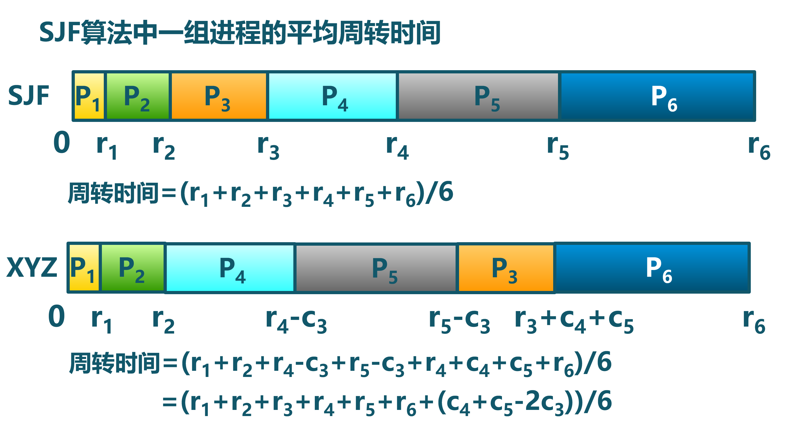
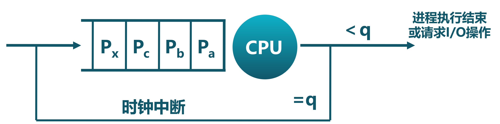

<!-- theme: gaia -->
<!-- _class: lead -->

# 第七講 進程管理與單處理器調度
## 第二節 單處理器調度

 
 

向勇 陳渝 李國良 

2022年秋季

---

**提綱**

### 1. 處理機調度概念
  - 處理機調度的時機和策略
  - 比較調度算法的準則
2. 調度算法

---

#### CPU資源的時分複用

- 進程切換：CPU資源的當前佔用者切換
  - 保存當前進程在PCB中的執行上下文(CPU狀態)
  - 恢復下一個進程的執行上下文

- 處理機調度
   - 從就緒隊列中挑選下一個佔用CPU運行的進程
   - 從多個可用CPU中挑選就緒進程可使用的CPU資源
- 調度器：挑選就緒進程的內核函數
- 調度策略
    -   依據什麼原則挑選進程？

---
#### 調度時機

- 內核執行調度的條件
   - 進程從運行狀態切換到等待/就緒狀態
   - 進程被終結了
- 非搶佔系統
  - 當前進程主動放棄CPU時
- 可搶佔系統
  - 中斷請求被服務例程響應完成時

---

#### 調度策略

確定如何從就緒隊列中選擇下一個執行進程
- 要解決的問題
   - 通過什麼樣的準則來選擇？
   - 挑選就緒隊列中的哪一個進程？
- 調度算法
   - 在內核調度中實現的調度策略
-  比較調度算法的準則
   - 哪一個策略/算法較好?
 
---
#### 處理機資源的使用模式
- 進程在CPU計算和I/O操作間交替
   - 每次調度決定在下一個CPU計算時將哪個工作交給CPU
   - 在時間片機制下，進程可能在結束當前CPU計算前被迫放棄CPU

  

 
---

**提綱**

1. 處理機調度概念
  - 處理機調度的時機和策略
### 比較調度算法的準則
2. 調度算法

---

#### 比較調度算法的準則
- CPU使用率 : CPU處於忙狀態的時間百分比
- 吞吐量：單位時間內完成的進程數量
- 週轉時間：進程從初始化到結束(包括等待)的總時間
- 就緒等待時間：就緒進程在就緒隊列中的總時間
- 響應時間：從提交請求到產生響應所花費的總時間
- 公平：進程佔用相同的資源，如CPU時間等

 
---
#### 比較調度算法的吞吐量與延遲準則
- 調度算法的要求：   希望“更快”的服務
- 什麼是更快？
  - 傳輸文件時的高帶寬，調度算法的高吞吐量
  - 玩遊戲時的低延遲，調度算法的低響應延遲
  - 這兩個因素相互影響
- 與水管的類比
  - 低延遲：喝水的時候想要一打開水龍頭水就流出來
  - 高帶寬：給游泳池充水時希望從水龍頭裡同時流出大量的水，並且不介意是否存在延遲

 
---
#### 比較調度算法的響應時間準則
- 減少響應時間
  - 及時處理用戶的輸入請求，儘快將輸出反饋給用戶
- 減少平均響應時間的波動
  - 在交互系統中，可預測性比高差異低平均更重要
- 低延遲調度改善了用戶的交互體驗
  - 如果移動鼠標時，屏幕中的光標沒動，用戶可能會重啟電腦
- 響應時間是操作系統的計算延遲

 
---
#### 比較調度算法的吞吐量準則
- 增加吞吐量
   - 減少開銷（操作系統開銷，上下文切換）
   - 系統資源的高效利用（CPU，I/O設備）
- 減少就緒等待時間
   - 減少每個就緒進程的等待時間
- 操作系統需要保證吞吐量不受用戶交互的影響
  - 即使存在許多交互任務
- 吞吐量是操作系統的計算帶寬

 
---
#### 比較調度算法的公平準則

一個用戶比其他用戶運行更多的進程時，公平嗎？怎麼辦？

- 公平的定義
  - 保證每個進程佔用相同的CPU時間
  - 保證每個進程的就緒等待時間相同
- 公平通常會增加平均響應時間

 
---

**提綱**

1. 處理機調度概念
### 2. 調度算法
- 先來先服務算法FCFS、短作業優先算法SJF
- 最短剩餘時間算法SRT、最高響應比優先算法HRRN
- 時間片輪轉算法RR
- 多級隊列調度算法MQ、多級反饋隊列算法MLFQ
- 公平共享調度算法FSS

---

#### 先來先服務調度算法FCFS

FCFS: First Come, First Served
- 依據進程進入就緒狀態的先後順序排列
- 進程進入等待或結束狀態時，就緒隊列中的下一個進程佔用CPU
- 指標
   - FCFS算法的週轉時間
  
---

#### 先來先服務調度算法示例

- 示例：3個進程，計算時間分別為12,3,3

 

   
---

#### 先來先服務調度算法的特徵

- 優點：簡單
- 缺點
  - 平均等待時間波動較大
  - 短作業/任務/進程可能排在長進程後面
  - I/O資源和CPU資源的利用率較低
     - CPU密集型進程會導致I/O設備閒置時，
I/O密集型進程也等待
  
---

#### 短作業優先調度算法SJF

Short Job First
- 選擇就緒隊列中執行時間最短作業/進程佔用CPU進入運行狀態
- 就緒隊列按預期的執行時間來排序

  

---

#### 短作業優先調度算法的特徵

**具有最優平均週轉時間**

修改作業/進程執行順序可能減少平均等待時間嗎?
  

 ---

#### 短作業優先調度算法的特徵

- 可能導致飢餓
  - 連續的短作業/進程流會使長作業/進程無法獲得CPU資源

- 需要預知未來
  - 如何預估下一個CPU計算的持續時間？
  - 簡單的解決辦法：詢問用戶
     - 用戶欺騙就殺死相應進程
     - 用戶不知道怎麼辦？
---

#### 短作業優先算法的執行時間預估

- 用歷史的執行時間來預估未來的執行時間

$\tau_{n+1} = \alpha t_n+(1-\alpha) \tau_n，其中 0\le \alpha \le 1$
$t_n$ -- 第n次的CPU計算時間
$\tau_{n+1}$ -- 第n+1次的CPU計算時間預估

$\tau_{n+1} = \alpha t_n+(1-\alpha) \alpha t_{n-1} + (1-\alpha)  (1-\alpha) \alpha t_{n-2} + ...$

---

#### 短作業優先算法的執行時間預估

- 執行時間預估
  

---

#### 最短剩餘時間算法SRT

Shortest Remaining Time, SRT

- SRT支持搶佔調度機制，即有新的進程就緒，且新進程的服務時間小於當前進程的剩餘時間，則轉到新的進程執行。

---

#### 最高響應比優先算法HRRN

Highest Response Ratio Next，HRRN

- 高響應比優先調度算法主要用於作業調度
- 該算法是對FCFS調度算法和SJF調度算法的一種綜合平衡，同時考慮每個作業的等待時間和估計的運行時間
- 在每次進行作業調度時，先計算後備作業隊列中每個作業的響應比，從中選出響應比最高的作業投入運行。

---

#### 最高響應比優先算法HRRN

- 選擇就緒隊列中響應比R值最高的進程

$Ｒ＝（ｗ+s)/s$
w: 就緒等待時間(waiting time)
s: 執行時間(service time)

- 在短作業優先算法的基礎上改進
- 關注進程的等待時間
- 防止無限期推遲

---

**提綱**

1. 處理機調度概念
2. 調度算法
- 先來先服務算法FCFS、短作業優先算法SJF
- 最短剩餘時間算法SRT、最高響應比優先算法HRRN
### 時間片輪轉算法RR
- 多級隊列調度算法MQ、多級反饋隊列算法MLFQ
- 公平共享調度算法FSS

---

#### 時間片輪轉算法RR

RR, Round-Robin

- 時間片
  - 分配處理機資源的基本時間單元
- 算法思路
  -  時間片結束時，按FCFS算法切換到下一個就緒進程
  -  每隔(n – 1)個時間片進程執行一個時間片q
  

 ---

#### 時間片輪轉算法示例

  

---

#### 時間片輪轉算法的時間片長度參數

- RR算法開銷： 額外的上下文切換
- 時間片太大
  - 等待時間過長，極限情況退化成FCFS
- 時間片太小
  - 反應迅速，但產生大量上下文切換
  - 大量上下文切換開銷影響到系統吞吐量
- 時間片長度選擇目標
  - 選擇一個合適的時間片長度
  - 經驗規則：維持上下文切換開銷處於1%以內

---

#### 比較FCFS和RR

 

---

**提綱**

1. 處理機調度概念
2. 調度算法
- 先來先服務算法FCFS、短作業優先算法SJF
- 最短剩餘時間算法SRT、最高響應比優先算法HRRN
- 時間片輪轉算法RR
### 多級隊列調度算法MQ、多級反饋隊列算法MLFQ
- 公平共享調度算法FSS

---

#### 多級隊列調度算法MQ

MQ, MultiQueue
- 就緒隊列被劃分成多個獨立的子隊列
   - 如：前臺進程(交互)子隊列、後臺進程(批處理)子隊列
   - 同一優先級的進程屬於某個隊列，且不能跨越隊列
- 每個隊列擁有自己的調度策略
   - 如：前臺進程–RR、後臺進程–時間片大的RR/FCFS
 
 - 規則1：如果A的優先級 > B的優先級，運行A（不運行B）。
 - 規則2：如果A的優先級 = B的優先級，輪轉運行A和B。
---

#### 多級隊列調度算法MQ

- 隊列間的調度
  - 固定優先級
    - 先處理前臺(交互)進程，然後處理後臺進程
    - 可能導致飢餓
  - 時間片輪轉
    - 每個隊列都得到一個確定的能夠調度其進程的CPU總時間
    - 如：80%CPU時間用於前臺進程，20%CPU時間用於後臺進程

---

#### 多級反饋隊列調度算法MLFQ

MLFQ, Multi-Level Feedback Queue
- 1962年，MIT教授Corbato首次提出多級反饋隊列，應用於兼容時分共享系統（CTSS-Compatible Time-Sharing System）
- 解決兩方面的問題
  -  如何在不知道工作要運行多久的情況下，優化週轉時間
  -  如何降低響應時間，給交互用戶很好的交互體驗

---

#### 多級反饋隊列調度算法MLFQ

- 關鍵問題：沒有完備的知識如何調度？
   - 對進程工作長度未知情況下，如何構建能同時減少響應時間和週轉時間的調度程序？
- 啟發：從歷史中學習　
   - 用歷史經驗預測未來 
- 繼承Multi Queue的調度規則
   - 如果A的優先級 > B的優先級，運行A（不運行B）
   - 如果A的優先級 = B的優先級，輪轉/FIFO運行A和B
---

#### 多級反饋隊列調度算法MLFQ

基本調度規則
   - 工作進入系統時，放在最高優先級（最上層隊列）
   - 如進程在當前的時間片沒有完成，則降到下一個優先級
   - 如果工作在其時間片以內主動釋放CPU，則優先級不變
   - 時間片大小隨優先級級別增加而增加
  

 
---

#### 三個優先級隊列的MLFQ調度例子

- CPU密集型進程首先進入最高優先級隊列；
- 執行1ms時間片後，調度器將進程的優先級減1，進入次高優先級隊列；
- 執行2ms時間片後，進入系統的最低優先級隊列，一直留在那裡，按4ms時間片執行。

---

#### 多級反饋隊列調度算法MLFQ

- MLFQ算法的特徵
   - CPU密集型進程的優先級下降很快
   - I/O密集型進程停留在高優先級

- 潛在問題
  - CPU密集型進程會飢餓
  - 惡意進程會想辦法留在高優先級
  

 
---

#### 多級反饋隊列調度算法MLFQ

基本調度規則
   - 如果A的優先級 > B的優先級，運行A（不運行B）
   - 如果A的優先級 = B的優先級，輪轉/FIFO運行A和B
   - 工作進入系統時，放在最高優先級（最上層隊列）
   - 一旦工作用完了其在某一層中的時間配額（無論中間主動放棄了多少次CPU），就降低其優先級（移入低一級隊列）
   - 經過一段時間S，就將系統中所有工作重新加入最高優先級隊列

---

#### 公平共享調度算法FSS

FSS, Fair Share Scheduling
- 控制用戶對系統資源的訪問
   - 不同用戶擁有多個進程
   - 按用戶優先級分配資源
   - 保證不重要的用戶無法壟斷資源
   - 未使用的資源按比例分配
  
  

  
---

#### 調度算法的特徵

- 先來先服務算法
   - 平均等待時間較差 
- 短作業優先算法
   - 平均週轉時間最小
   - 需要精確預測計算時間
   - 不允許搶佔；可能導致飢餓
- 最短剩餘時間算法
   - 對短作業優先算法的改進，允許搶佔
   - 可能導致飢餓
  
---

#### 調度算法的特徵

- 最高響應比優先算法
   -  基於短作業優先調度，不可搶佔
   -  同時考慮每個作業的等待時間和估計的運行時間
- 時間片輪轉算法
   - 公平，但是平均等待時間較差 
- 多級反饋隊列算法
   - 多種算法的集成 
- 公平共享調度算法
   - 公平是第一要素

---

### 小結

1. 處理機調度概念
- 處理機調度的時機和策略、比較調度算法的準則
2. 調度算法
- FCFS、SJF、SRT、HRRN
- RR
- MQ、MLFQ、FSS
