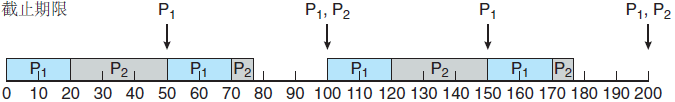
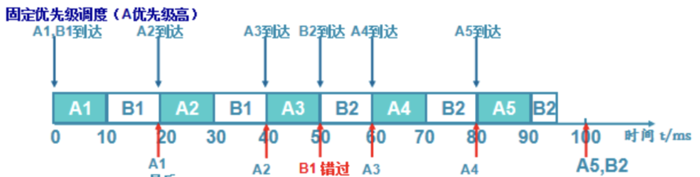
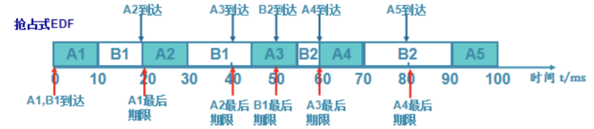
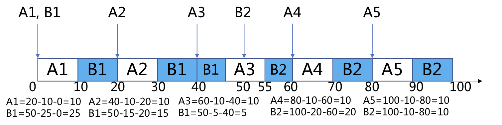
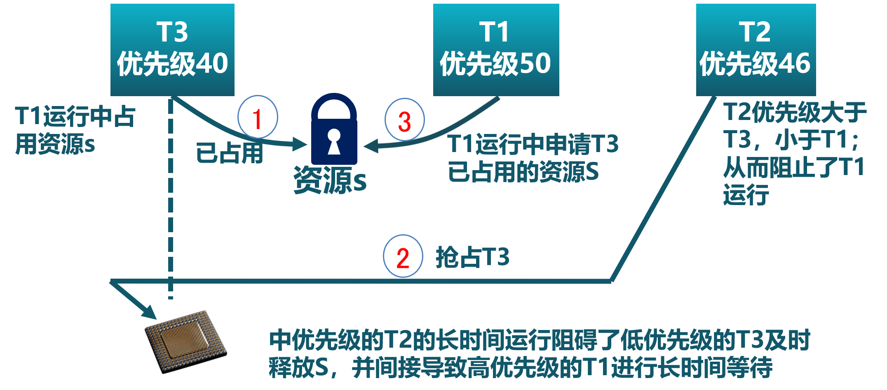
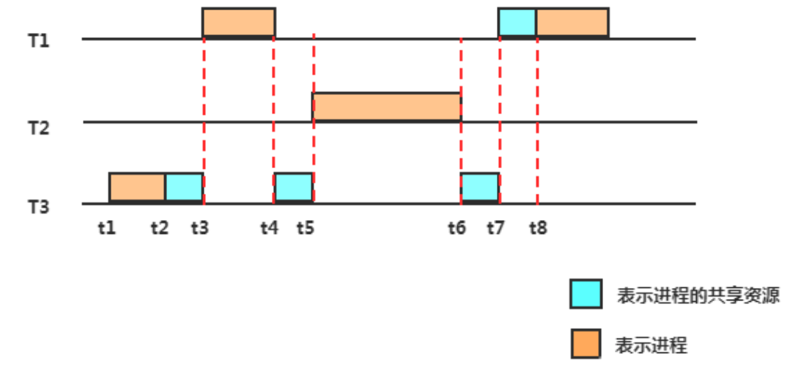
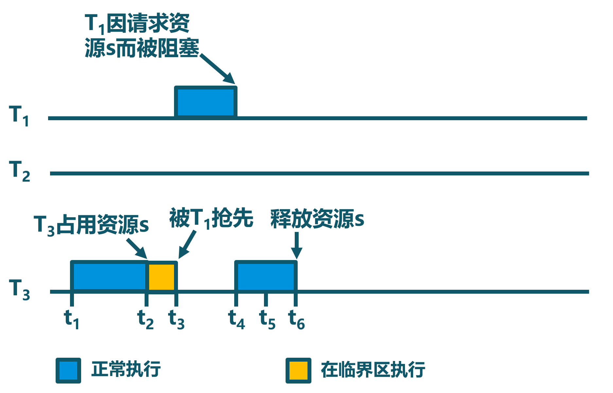

<!-- theme: gaia -->
<!-- _class: lead -->

# 第七講 進程管理與單處理器調度
### 第三節 實時調度

 
 

向勇 陳渝 李國良 

2022年秋季

---

**提綱**

### 1. 實時操作系統
- 實時操作系統的定義
- 實時任務
2. 實時調度
3. 優先級反置

---
#### 實時操作系統的定義
- 實時操作系統的定義
  - 正確性依賴於其時間和功能兩方面的操作系統
- 實時操作系統的性能指標
   - 時間約束的及時性（deadlines）
   - 速度和平均性能相對不重要
- 實時操作系統的特性
  - 時間約束的可預測性

---
#### 實時操作系統分類
- 強/硬實時操作系統
   - 要求在指定的時間內必須完成重要的任務
- 弱/軟實時操作系統
  - 重要進程有高優先級，要求儘量但非必須完成

---
#### 實時任務
- 任務（工作單元）
  - 一次計算，一次文件讀取，一次信息傳遞等等
- 任務屬性
  - 完成任務所需要的資源
  - 定時參數

---
#### 週期實時任務
- 週期實時任務：一系列相似的任務
  - 任務有規律地重複
  - 週期p = 任務請求時間間隔 (0 <p)
  - 執行時間e = 最大執行時間(0 < e < p)
  - 使用率U = e/p

- 可調度：if $\sum_{p_i} \frac{e_i}{p_i}\leq 1$; otherwise 不可調度

---
#### 軟時限和硬時限
- 硬時限（Hard deadline）
  - 錯過任務時限會導致災難性或非常嚴重的後果
  - 必須驗證，在最壞情況下能夠滿足時限
- 軟時限(Soft deadline)
  - 通常能滿足任務時限
  - 如有時不能滿足，則降低要求
  - 盡力保證滿足任務時限

---
####  可調度性
- 可調度表示一個實時操作系統能夠滿足任務時限要求
   - 需要確定實時任務的執行順序
   - **靜態**優先級調度：任務執行過程中**不會**改變任務的優先級
   - **動態**優先級調度：任務執行過程中**會**改變任務的優先級

---

**提綱**

1. 實時操作系統
### 2. 實時調度
- 速率單調調度算法
- 最早截止時間優先算法
- 最低鬆弛度優先算法
3. 優先級反置

---
####  實時調度
- **靜態**優先級調度：速率單調調度算法(RM, Rate Monotonic) 
  - 通過週期安排優先級
  - 週期越短優先級越高
  - 執行週期最短的任務

- **動態**優先級調度：最早截止時間優先算法 (EDF, Earliest Deadline First) 
  - 截止時間越早優先級越高
  - 執行離截止時間最近的任務

如果任務間有**共享資源佔用**的情況，高優先級任務可能會被延誤執行！

---
#### 速率單調調度算法(RM, Rate Monotonic) 

- 根據任務週期來確定任務優先級（週期越短優先級越高，搶佔式）

- 進程P1：e=20 p=50
- 進程P2：e=35 p=100

---
#### 速率單調調度算法(RM, Rate Monotonic) 

- 根據任務週期來確定任務優先級（週期越短優先級越高，搶佔式）

- 進程P1：e=25 p=50
- 進程P2：e=35 p=80

---

#### 最早截止時間優先算法 (EDF, Earliest Deadline First) 

- 固定優先級的問題：有的任務可能錯過期限

- 進程P1：e=10 p=20
- 進程P2：e=25 p=50

---

#### 最早截止時間優先算法 (EDF, Earliest Deadline First) 

- 固定優先級的問題：有的任務可能錯過期限

- 進程P1：e=10 p=20
- 進程P2：e=25 p=50

---

#### 最早截止時間優先算法 (EDF, Earliest Deadline First) 

- 固定優先級的問題：有的任務可能錯過期限

- 進程P1：e=10 p=20
- 進程P2：e=25 p=50

---

#### 最早截止時間優先算法 (EDF, Earliest Deadline First) 

- 任務的優先級根據任務的截止時間動態分配。截止時間越短，優先級越高。

- 進程P1：e=10 p=20
- 進程P2：e=25 p=50

---

#### 最低鬆弛度優先算法（LLF）

- 根據**任務緊急或者鬆弛程度**，來確定任務優先級

- 任務緊急度越高，優先級越高

- 鬆弛度=必須完成時間-本身還需要運行時間-當前時間

- 進程P1：e=10 p=20；進程P2：e=25 p=50

---

**提綱**

1. 實時操作系統
2. 實時調度
### 3. 優先級反置
- 優先級繼承
- 優先級天花板協議

---
####  優先級反置(Priority Inversion)

高優先級進程長時間等待低優先級進程所佔用資源的現象

- 基於優先級的可搶佔調度算法存在優先級反置問題
優先級：T1>T2>T3

---
####  優先級反置(Priority Inversion)

高優先級進程長時間等待低優先級進程所佔用資源的現象

- 基於優先級的可搶佔調度算法存在優先級反置問題
優先級：T1>T2>T3

---
####  優先級繼承（Priority Inheritance)
- 佔用資源的低優先級進程繼承申請資源的高優先級進程的優先級
- 只在佔有資源的低優先級進程被阻塞時,才提高佔有資源進程的優先級

---
####  優先級繼承（Priority Inheritance)
- 佔用資源的低優先級進程繼承**申請資源的高優先級進程的優先級**
- 只在佔有資源的低優先級進程被阻塞時,才提高佔有資源進程的優先級

注：臨界區：互斥訪問共享資源的代碼片段

---
####  優先級繼承（Priority Inheritance)
- 佔用資源的低優先級進程繼承申請資源的高優先級進程的優先級
- 只在佔有資源的低優先級進程被阻塞時,才提高佔有資源進程的優先級

注：臨界區：互斥訪問共享資源的代碼片段

---
####  優先級繼承（Priority Inheritance)
- 佔用資源的低優先級進程繼承申請資源的高優先級進程的優先級
- 只在佔有資源的低優先級進程被阻塞時,才提高佔有資源進程的優先級

注：臨界區：互斥訪問共享資源的代碼片段

---
####  優先級繼承（Priority Inheritance)
- 佔用資源的低優先級進程繼承申請資源的高優先級進程的優先級
- 只在佔有資源的低優先級進程被阻塞時,才提高佔有資源進程的優先級

注：臨界區：互斥訪問共享資源的代碼片段

---
####  優先級繼承（Priority Inheritance)
- 佔用資源的低優先級進程繼承申請資源的高優先級進程的優先級
- 只在佔有資源的低優先級進程被阻塞時,才提高佔有資源進程的優先級

注：臨界區：互斥訪問共享資源的代碼片段

---
####  優先級繼承（Priority Inheritance)
- 佔用資源的低優先級進程繼承申請資源的高優先級進程的優先級
- 只在佔有資源的低優先級進程被阻塞時,才提高佔有資源進程的優先級

注：臨界區：互斥訪問共享資源的代碼片段

---
#### 優先級天花板協議（priority ceiling protocol）
- 佔用資源進程的優先級與所有可能申請該資源的進程的最高優先級相同
  - 不管是否發生等待,都提升佔用資源進程的優先級
  - 優先級高於系統中所有被鎖定的資源的優先級上限，任務執行臨界區時就不會被阻塞

---

### 小結

1. 實時操作系統
- 實時操作系統的定義、實時任務
2. 實時調度
- 速率單調調度算法、最早截止時間優先算法、最低鬆弛度優先算法
3. 優先級反置
- 優先級繼承、優先級天花板協議
