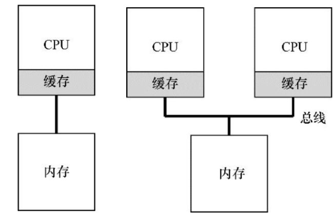

<!-- theme: gaia -->
<!-- _class: lead -->

# 第八講 多處理器調度

## 第一節 對稱多處理與多核架構

 
 

向勇 陳渝 李國良 

2022年秋季

---

**提綱**

### 1. 多處理機器
2. Cache一致性(Cache Coherence)

---

#### 單核處理器
 

---
#### 超線程(Hyperthread, Simultaneous multithreading)處理器
 

---
#### 多核(multi-core)處理器
 

---
#### 眾核(many-core)處理器
 

---

**提綱**

1. 多處理機器
### 2. Cache一致性(Cache Coherence)

---

#### 對稱多處理器(SMP)與非一致內存訪問系統(NUMA)
 

---
#### Cache 一致性 (Cache Coherence)
 

---

#### Cache 一致性問題
