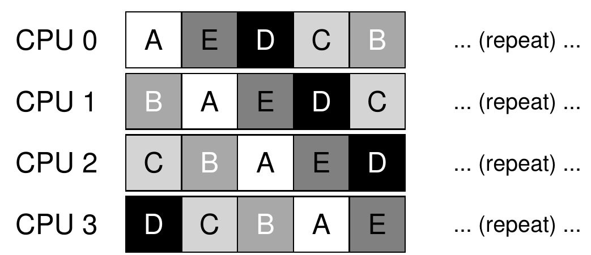
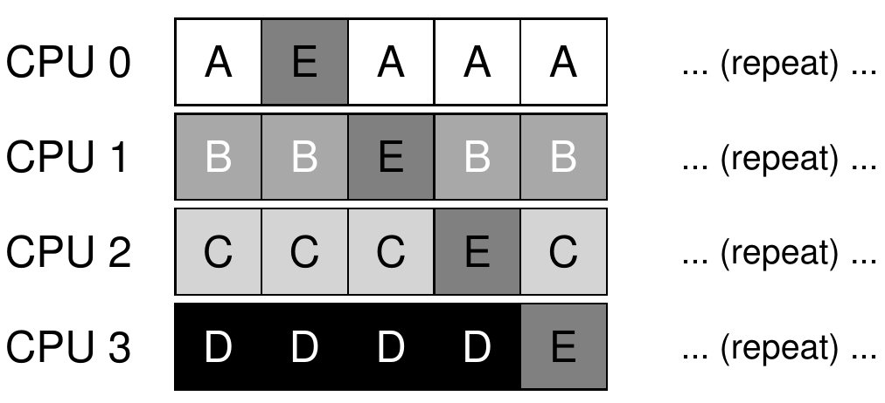
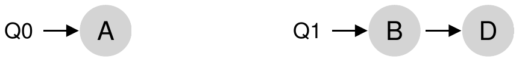
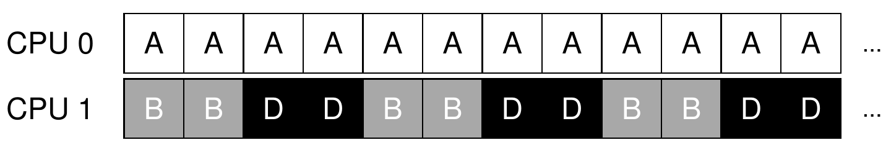
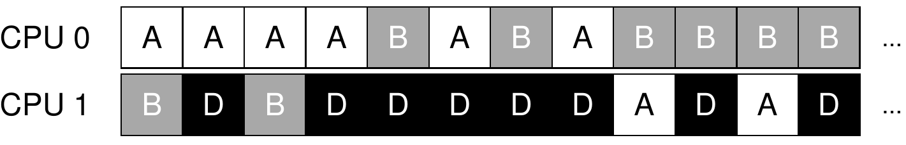

<!-- theme: gaia -->
<!-- _class: lead -->

# 第八講 多處理器調度

## 第二節 多處理器調度概述

 
 

向勇 陳渝 李國良 

2022年秋季

---

**提綱**

### 1. 單隊列多處理器調度SQMS
2. 多隊列多處理器調度MQMS

---

#### 單隊列多處理器調度
Single Queue Multiprocessor Scheduling, SQMS
- 複用單處理器調度下的基本架構
- 所有需要調度的進程放入**一個隊列**中
 

---
#### 單隊列多處理器調度的特徵
- 缺乏可擴展性 (scalability)
- 緩存親和性 (cache affinity) 弱
 

---
#### 多處理器調度的親和度與負載均衡
儘可能讓進程在同一個 CPU 上運行。保持一些進程的親和度的同時，可能需要犧牲其他進程的親和度來實現負載均衡。
 

---

**提綱**

1. 單隊列多處理器調度SQMS
### 2. 多隊列多處理器調度MQMS

---

#### 多隊列多處理器調度
Multi-Queue MultiprocessorScheduling, MQMS
- 基本調度框架包含**多個調度隊列**，每個隊列可用不同的調度規則。
- 依照一些啟發性規則，在進程進入系統時，將其放入某個調度隊列。
- **每個 CPU 調度相互獨立**，避免單隊列方式的數據共享及同步問題。
 
 

---
#### 多隊列多處理器調度的特徵
- 具有**可擴展性**：隊列的數量會隨著CPU 的增加而增加，因此鎖和緩存爭用的開銷不是大問題。
- 具有良好的**緩存親和度**：所有進程都保持在固定的 CPU 上，因而可以很好地利用緩存數據。
 
 

---
#### 多隊列多處理器調度的負載不均
-  假定4個進程，2個CPU；隊列都執行輪轉調度策略；進程C執行完畢
-  A 獲得了 B 和 D 兩倍的 CPU 時間

 
 

---

#### 如何解決MQMS的負載不均？

- 假定 4 個進程，2 個 CPU；每個隊列都執行輪轉調度策略；A 和 C 都執行完畢，系統中只有 B 和 D
  - CPU1 很忙
  - CPU0 空閒

 
 

---
#### 進程遷移 (migration)
- 通過進程的跨 CPU 遷移，可實現負載均衡。
  - 情況：CPU0 空閒，CPU1 有一些進程。
  - 遷移：將 B 或 D 遷移到 CPU0

 
 

---
#### MQMS如何確定進程遷移時機?

- 情況：A 獨自留在 CPU 0 上，B 和 D 在 CPU 1 上交替運行
- 遷移：**不斷地遷移和切換**一個或多個進程

 
 

---
#### MQMS的工作竊取 (work stealing)
- 進程量較少的 (源) 隊列不定期地“偷看”其他 (目標) 隊列是不是比自己的進程多
- 如果目標隊列比源隊列 (顯著地) 更滿，就從目標隊列“竊取”一個或多個進程，實現負載均衡。

 
 

---
#### 工作竊取的隊列檢查間隔
- 如果頻繁地檢查其他隊列，就會帶來較高的開銷，可擴展性不好
- 如果檢查間隔太長，又可能會帶來嚴重的負載不均
 
 