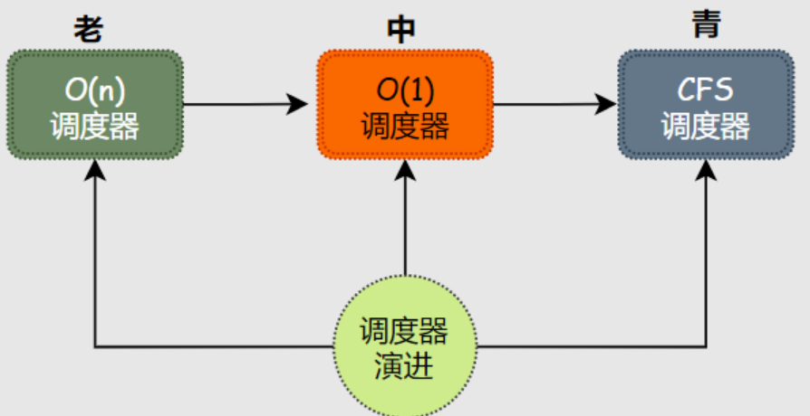
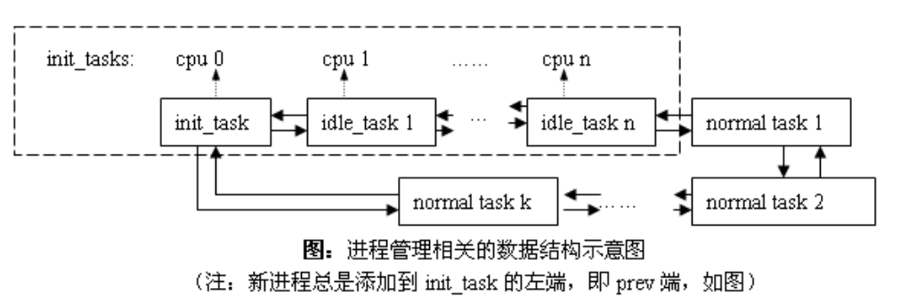

<!-- theme: gaia -->
<!-- _class: lead -->

# 第八講 多處理器調度

## 第三節 Linux O(1) 調度

 
 

向勇 陳渝 李國良 

2022年秋季

---

**提綱**

### 1. SMP 和 早期Linux 內核
2. Linux O(n)調度器
3. Linux O(1) 調度器

---

#### Linux調度器的[演進](https://www.eet-china.com/mp/a111242.html)

* O(n) 調度器：內核版本 2.4-2.6
* O(1) 調度器：內核版本 2.6.0-2.6.22
* CFS 調度器：內核版本 2.6.23-至今

<!--
https://www.scaler.com/topics/operating-system/process-scheduling/
-->

---
#### 調度器需要考慮的關鍵問題

- 採用何種**數據結構**來組織進程
- 如何根據進程優先級來確定**進程運行時間**
- 如何判斷**進程類型**(I/O密集，CPU密集型，實時，非實時)
- 如何確定進程的動態**優先級**：影響因素
  - 靜態優先級、nice值
  - I/O密集型和CPU密集型產生的優先級獎懲
- 如何**適配多處理器**情況

---
#### SMP 和 早期Linux 內核

<!-- https://courses.engr.illinois.edu/cs423/sp2018/slides/13-linux-schedulers.pdf
Linux歷史 -->

- Linux 1.2
  - 環形隊列 + Round Robin調度策略
- Linux 2.0
  - SMP 支持由一個“大鎖”組成，“大鎖”對內核訪問串行化
  - 在用戶態支持並行，Linux 內核本身並不能利用多處理器加速
- Linux 2.2
  - 引入調度類（real-time, non-real-time）
<!--   -->

<!-- 調度器簡介，以及Linux的調度策略 https://www.cnblogs.com/vamei/p/9364382.html -->

<!-- 萬字長文，錘它！揭秘Linux進程調度器 https://www.eet-china.com/mp/a111242.html -->
---

**提綱**

1. SMP 和 早期Linux 內核
### 2. Linux O(n)調度器
3. Linux O(1) 調度器

---

#### Linux 2.4 內核：Linux $O(n)$調度器

---
#### Linux $O(n)$調度器
- 使用多處理器可以加快內核的處理速度，調度器是複雜度為 $O(n)$
  - $O(n)$ 這個名字，來源於算法複雜度的大$O$表示法 
  - 字母$n$在這裡代表操作系統中的活躍進程數量
  - $O(n)$ 表示這個調度器的時間複雜度和活躍進程的數量成正比

---
#### Linux $O(n)$ 調度算法的思路

- 把時間分成大量的微小時間片（Epoch）
- 每個時間片開始時
  - 計算進程的動態優先級
  - 將進程的靜態優先級映射成缺省時間片
  - 然後選擇優先級最高的進程來執行
- 進程被調度器切換執行後，可不被打擾地用盡這個時間片
- 如進程沒有用盡時間片，則剩餘時間增加到進程的下一個時間片中

<!-- 談談調度 - Linux O(1) https://cloud.tencent.com/developer/article/1077507 
Linux Kernel 排程機制介紹
https://loda.hala01.com/2017/06/linux-kernel.html
-->
---
#### $O(n)$ 調度算法的複雜度
O(n)調度算法的複雜度為$O(n)$ 
- 每次使用時間片前都要**檢查所有就緒進程的優先級**
- **檢查時間**和進程中進程數目$n$成正比

---
#### Linux O(n)調度器數據結構
- 只用一個 global runqueue放置就緒任務
- 各個 core 需要競爭同一個 runqueue 裡面的任務

---

#### Linux $O(n)$調度器的缺點

- $O(n)$的**執行開銷**
   - 當有大量進程在運行時，這個調度器的性能將會被大大降低
- 多處理器**競爭訪問**同一個 runqueue 裡面的任務
   - $O(n)$調度器沒有很好的可擴展性(scalability)

<!-- ---
#### Linux 2.4 內核：SMP 實現在內核態
- 使用多處理器可以加快內核的處理速度，調度器是複雜度為 O(n)
  - 內核調度器維護兩個 queue：runqueue 和 expired queue
  - 兩個 queue 都永遠保持有序
  - 一個 process 用完時間片，就會被插入 expired queue
  - 當 runqueue 為空時，把 runqueue 和 expired queue 交換一下
 

---
#### Linux 2.4 內核：SMP 實現在內核態
- 使用多處理器可以加快內核的處理速度，調度器是複雜度為 O(n)
  - 全局共享的就緒隊列
  - 尋找下一個可執行的 process，這個操作一般都是 O(1)
  - 每次進程用完時間片，找合適的位置執行插入操作，會遍歷所有任務，複雜度為O(n)
 

---
#### Linux 2.4 內核：SMP 實現在內核態
- 使用多處理器可以加快內核的處理速度，調度器是複雜度為 O(n)
  - 現代操作系統都能運行成千上萬個進程
  - O(n) 算法意味著每次調度時，對於當前執行完的process，需要把所有在 expired queue 中的 process 過一遍，找到合適的位置插入
  - 這不僅僅會帶來性能上的巨大損失，還使得系統的調度時間非常不確定 -- 根據系統的負載，可能有數倍甚至數百倍的差異
    -->

<!-- 萬字長文，錘它！揭秘Linux進程調度器 https://www.eet-china.com/mp/a111242.html -->
---

**提綱**

1. SMP 和 早期Linux 內核
2. Linux O(n)調度器
### 3. Linux O(1) 調度器

---

#### Linux O(1) 調度器
Linux 2.6 版本的調度器是由 Ingo Molnar 設計並實現的。
- 為喚醒、上下文切換和定時器中斷開銷建立一個完全 O(1) 的調度器
 

---

#### Linux O(1) 調度器的思路

- 實現了per-cpu-runqueue，每個CPU都有一個就緒進程任務隊列
- 採用全局優先級
  - 實時進程0-99
  - 普通進程100-139

 

---

#### Linux O(1) 調度器的思路

- 活躍數組active：放置就緒進程
- 過期數組expire：放置過期進程
 
---

#### Linux O(1) 調度器的思路

- 每個優先級對應一個鏈表
- 引入bitmap數組來記錄140個鏈表中的活躍進程情況
 

  
---
#### 常用數據結構訪問的時間複雜度
- 滿足 O(1) 的數據結構？
- 常用數據結構的四種基本操作和時間複雜度
  - access：**隨機訪問**
    - array: 平均情況和最壞情況均能達到 O(1)
    - linked list 是 O(N)
    - tree 一般是 O(log N)
 

  
---
#### 常用數據結構的搜索操作
- search：搜索
  - hash table 時間複雜度是 O(1)，但它最壞情況下是 O(N)
  - 大部分 tree（b-tree / red-black tree）平均和最壞情況都是 O(log N)
 

  
---
#### 常用數據結構的插入和刪除操作
- insert/deletion：插入和刪除
  - hash table 時間複雜度是 O(1)，但它最壞情況下是 O(N)
  - linked list，stack，queue 在平均和最壞情況下都是 O(1)

 

    
---

#### Linux O(1) 調度器的時間複雜度

- 進程有 140 種優先級，可用長度為 140 的數組去記錄優先級。
  - access 是 $O(1)$
- 位圖bitarray為每種優先級分配一個 bit
  - 如果這個優先級隊列下面有進程，那麼就對相應的 bit 染色，置為 1，否則置為 0。
  - 問題簡化為尋找位圖中最高位是 1 的 bit（left-most bit），可用一條CPU 指令實現。

 
    
---

#### Linux O(1) 調度器的時間複雜度

- 每個優先級下面用一個FIFO queue 管理這個優先級下的進程。
  - 新來的插到隊尾，先進先出，insert/deletion 都是 $O(1)$

 
    
---

#### Linux $O(1)$活躍數組和過期數組

<!-- Linux 是如何調度進程的？https://jishuin.proginn.com/p/763bfbd2df25 -->

活躍數組(Active Priority Array, APA)過期數組(Expired Priority Array, EPA)

- 在 active bitarray 中尋找 left-most bit 的位置 x；
- 在 APA 中找到對應隊列 APA[x]；
- 從 隊列APA[x] 中取出一個進程；

 

    
---

#### Linux $O(1)$活躍數組和過期數組

- 對於當前執行完的進程，重新計算其優先級，然後 放入到 EPA 相應的隊列EPA[priority]；
- 如果進程優先級在 expired bitarray 裡對應的 bit 為 0，將其置 1；
- 如果 active bitarray 全為零，將 active bitarray 和 expired bitarray 交換；

   

    
---
#### Linux O(1) 調度器的多核/SMP支持
- 按一定時間間隔，分析各CPU負載
  - 在每個時鐘中斷後進行計算CPU負載
  - 由負載輕的 CPU pulling 進程而不是 pushing進程
   

---

### 小結

1. SMP 和 早期Linux 內核
2. Linux O(n)調度器
3. Linux O(1) 調度器

---

### 參考文獻
- http://www.wowotech.net/process_management/scheduler-history.html
- https://courses.engr.illinois.edu/cs423/sp2018/slides/13-linux-schedulers.pdf
- https://www.cnblogs.com/vamei/p/9364382.html
- https://cloud.tencent.com/developer/article/1077507?from=article.detail.1603917
- https://www.eet-china.com/mp/a111242.html
- https://loda.hala01.com/2017/06/linux-kernel.html
- https://jishuin.proginn.com/p/763bfbd2df25