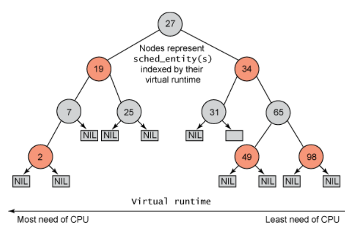

<!-- theme: gaia -->
<!-- _class: lead -->

# 第八講 多處理器調度

## 第四節 Linux CFS 調度
完全公平調度(CFS, Completely Fair Scheduler)

<br>
<br>

向勇 陳渝 李國良 

2022年秋季

---

**提綱**

### 1. CFS的原理
2. CFS 的實現

---

#### CFS的背景
<!-- 萬字長文，錘它！揭秘Linux進程調度器 https://www.eet-china.com/mp/a111242.html -->
- O(1)和O(n)都將CPU資源劃分為時間片
    - 採用固定額度分配機制，每個調度週期的進程可用時間片是確定的
    - 調度週期結束被重新分配
- O(1)調度器本質上是MLFQ算法的思想
    - 不足：O(1)調度器對進程交互性的響應不及時
- 需求
    - 根據進程的運行狀況判斷它屬於IO密集型還是CPU密集型，再做優先級獎勵和懲罰
    - 這種推測本身存在誤差，場景越複雜判斷難度越大


---
#### CFS的背景

匈牙利人Ingo Molnar所提出和實現CFS調度算法
- 他也是O(1)調度算法的提出者

 

---
#### CFS 的思路
<!-- - CFS 不計算優先級，而是通過計算進程消耗的 CPU 時間（標準化以後的虛擬 CPU 時間）來確定誰來調度。從而到達所謂的公平性。 -->
- 摒棄固定時間片分配，採用**動態時間片分配**
- 每次調度中進程可佔用的時間與進程總數、總CPU時間、進程權重等均有關係，每個調度週期的值都可能會不一樣
- 每個進程都有一個nice值, 表示其靜態優先級

 

---
#### CFS 的思路
- **把 CPU 視為資源**，並記錄下每一個進程對該資源使用的情況
    - 在調度時，調度器總是選擇消耗資源最少的進程來運行（**公平分配**）
- 由於一些進程的工作會比其他進程更重要，這種絕對的公平有時也是一種不公平
    - **按照權重來分配 CPU 資源**
 

---
#### CFS 的進程運行時間動態分配
- 根據各個進程的優先級權重分配運行時間
    - 進程權重越大, 分到的運行時間越多
`分配給進程的運行時間 = 調度週期 * 進程權重 / 所有進程權重總和`
- 調度週期
    - 將所處於 TASK_RUNNING 態進程都調度一遍的時間

<!--   -->


---
<!-- CFS（Completely Fair Scheduler） https://www.jianshu.com/p/1da5cfd5cee4 -->
#### CFS 的相對公平性
- 系統中兩個進程 A，B，權重分別為 1， 2，調度週期設為 30ms，
- A 的 CPU 時間為：30ms * (1/(1+2)) = 10ms
- B 的 CPU 時間為：30ms * (2/(1+2)) = 20ms
- 在這 30ms 中 A 將運行 10ms，B 將運行 20ms

它們的運行時間並不一樣。 公平怎麼體現呢？

<!--   -->


---

#### CFS 的虛擬時間vruntime

* virtual runtime(vruntime)：記錄著進程已經運行的時間
    * vruntime是根據進程的權重將運行時間放大或者縮小一個比例。
`vruntime = 實際運行時間 * 1024 / 進程權重`
    * 1024是nice為0的進程的權重，代碼中是NICE_0_LOAD
    * 所有進程都以nice為0的進程的權重1024作為基準，計算自己的vruntime增加速度

---

#### CFS 的虛擬時間vruntime

以上面A和B兩個進程為例，B的權重是A的2倍，那麼B的vruntime增加速度只有A的一半。
```
vruntime = (調度週期 * 進程權重 / 所有進程總權重) * 1024 / 進程權重
         = 調度週期 * 1024 / 所有進程總權重
```
雖然進程的權重不同，但是它們的 vruntime增長速度應該是一樣的 ，與權重無關。

<!-- O(n)、O(1)和CFS調度器  http://www.wowotech.net/process_management/scheduler-history.html 

Virtual runtime ＝ （physical runtime） X （nice value 0的權重）/進程的權重

通過上面的公式，我們構造了一個虛擬的世界。二維的（load weight，physical runtime）物理世界變成了一維的virtual runtime的虛擬世界。在這個虛擬的世界中，各個進程的vruntime可以比較大小，以便確定其在紅黑樹中的位置，而CFS調度器的公平也就是維護虛擬世界vruntime的公平，即各個進程的vruntime是相等的。

-->

---
#### CFS 的虛擬時間計算

所有進程的vruntime增長速度宏觀上看應該是同時推進的，就可以用這個vruntime來選擇運行的進程。

* 進程的vruntime值較小說明它以前佔用cpu的時間較短，受到了“不公平”對待，因此下一個運行進程就是它。
* 這樣既能公平選擇進程，又能保證高優先級進程獲得較多的運行時間。


---
#### CFS 的虛擬時間計算示例

CFS讓每個調度實體（進程或進程組）的vruntime互相追趕，而每個調度實體的vruntime增加速度不同，權重越大的增加的越慢，這樣就能獲得更多的cpu執行時間。

     A每週期6時間片，B每週期3時間片，C每週期2時間片
     vruntime：
     A:   0  6  6  6  6  6  6  12 12 12 12 12 12
     B:   0  0  3  3  3  6  6  6  9  9  9  12 12
     C:   0  0  0  2  4  4  6  6  6  8  10 10 12
     調度：   A  B  C  C  B  C  A  B  C  C   B  C


<!--   -->


---

**提綱**

1. CFS的原理
### 2. CFS 的實現

---

#### 紅黑樹：CFS中進程vruntime數據結構
- Linux 採用了紅黑樹記錄下每一個進程的 vruntime
    - 在多核系統中，每個核一棵紅黑樹
    - 調度時，從紅黑樹中選取vruntime最小的進程出來運行
 

---

#### CFS 的進程權重
- 權重由 nice 值確定，權重跟進程 nice 值一一對應
    - nice值越大，權重越低
- 通過全局數組 prio_to_weight 來轉換
 


---

#### CFS中新創建進程的 vruntime如何設置？

- 如果新進程的 vruntime 初值為 0 的話，比老進程的值小很多，那麼它在相當長的時間內都會保持搶佔 CPU 的優勢，老進程就要餓死了，這顯然是不公平的。
 

---

#### CFS中新創建進程的 vruntime設置

- 每個 CPU 的運行隊列 cfs_rq 都維護一個**min_vruntime 字段**
    - 記錄該運行隊列中所有進程的 vruntime 最小值
- 新進程的初始vruntime 值設置為它所在運行隊列的min_vruntime
    - 與老進程保持在合理的差距範圍內
 

---

#### CFS中休眠進程的 vruntime 一直保持不變嗎？

如果休眠進程的 vruntime 保持不變，而其他運行進程的 vruntime 一直在推進，那麼等到休眠進程終於喚醒的時候，它的 vruntime 比別人小很多，會使它獲得長時間搶佔 CPU 的優勢，其他進程就要餓死了。
 


---

#### CFS中休眠進程的vruntime

- 在休眠進程被喚醒時重新設置 vruntime 值，以 min_vruntime 值為基礎，給予一定的補償，但不能補償太多。
 


---

#### CFS中休眠進程在喚醒時會立刻搶佔 CPU 嗎？

- 休眠進程在醒來的時候有能力**搶佔** CPU 是大概率事件，這也是 CFS 調度算法的本意，即保證交互式進程的響應速度，**交互式進程**等待用戶輸入會頻繁休眠。
 

---

#### CFS中休眠進程在喚醒時會立刻搶佔 CPU 嗎？

- **主動休眠的進程**同樣也會在喚醒時獲得補償，這類進程往往並不要求快速響應，它們同樣也會在每次喚醒並搶佔，這有可能會導致其它更重要的應用進程被搶佔，有損整體性能。
- sched_features 的 WAKEUP_PREEMPT 位表示禁用喚醒搶佔特性，剛喚醒的進程**不立即搶佔**運行中的進程，而是要等到運行進程用完時間片之後

 


---

#### CFS中的進程在 CPU 間遷移時 vruntime 會不會變？
- 在多 CPU 的系統上，不同的 CPU 的負載不一樣，有的 CPU 更忙一些，而每個 CPU 都有自己的運行隊列，每個隊列中的進程的vruntime 也走得**有快有慢**，每個CPU運行隊列的 min_vruntime 值，都會有不同
 


---

#### CFS中的進程遷移

- 當進程從一個 CPU 的運行隊列中**出來時**，它的 vruntime 要**減去**隊列的 min_vruntime 值；
- 當進程**加入**另一個 CPU 的運行隊列時，它的vruntime 要**加上**該隊列的 min_vruntime 值。

 

---
#### CFS的vruntime 溢出問題

- vruntime 的類型 usigned long
- 進程的虛擬時間是一個遞增的正值，因此它不會是負數，但是它有它的上限，就是unsigned long 所能表示的最大值
- 如果溢出了，那麼它就會從 0 開始回滾，如果這樣的話，結果會怎樣？

 

---

#### CFS 的vruntime 溢出示例
```C
unsigned char a = 251;
unsigned char b = 254;
b += 5;
//b溢出，導致a > b，應該b = a + 8
//怎麼做到真正的結果呢？改為以下：
unsigned char a = 251;
unsigned char b = 254;
b += 5;
signed char c = a - 250, 
signed char d = b - 250;
//到此判斷 c 和 d 的大小
```
 

---

#### Linux調度器的[模塊化](http://www.wowotech.net/process_management/scheduler-history.html)


---
### 參考文獻
-  https://www.eet-china.com/mp/a111242.html
-  https://www.jianshu.com/p/1da5cfd5cee4
-  https://developer.ibm.com/tutorials/l-completely-fair-scheduler/
-  http://www.wowotech.net/process_management/scheduler-history.html

---

### 課程實驗三 進程及進程管理

* 第五章：進程及進程管理 -> chapter5練習 -> 
    * [rCore](https://learningos.github.io/rCore-Tutorial-Guide-2022A/chapter5/4exercise.html)
    * [uCore](https://learningos.github.io/uCore-Tutorial-Guide-2022A/chapter5/4exercise.html)
* 實驗任務
    * spawn 系統調用
    * stride 調度算法
* 實驗提交要求
    * 任務佈置後的第11天（2022年11月13日）；
