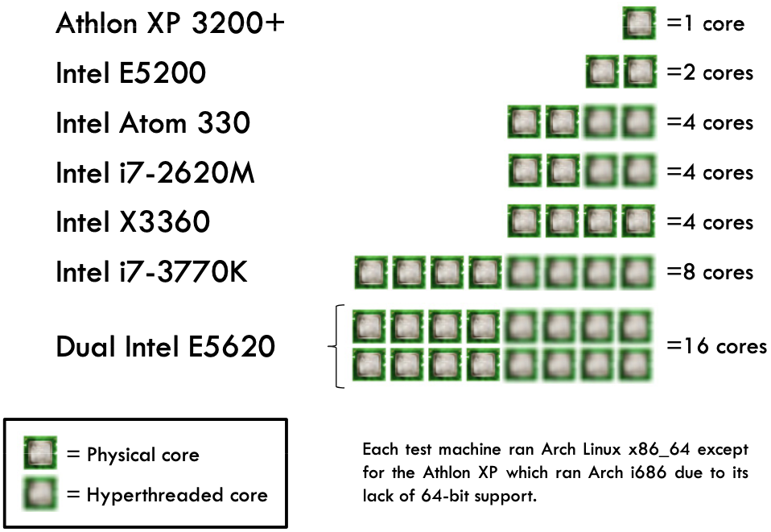
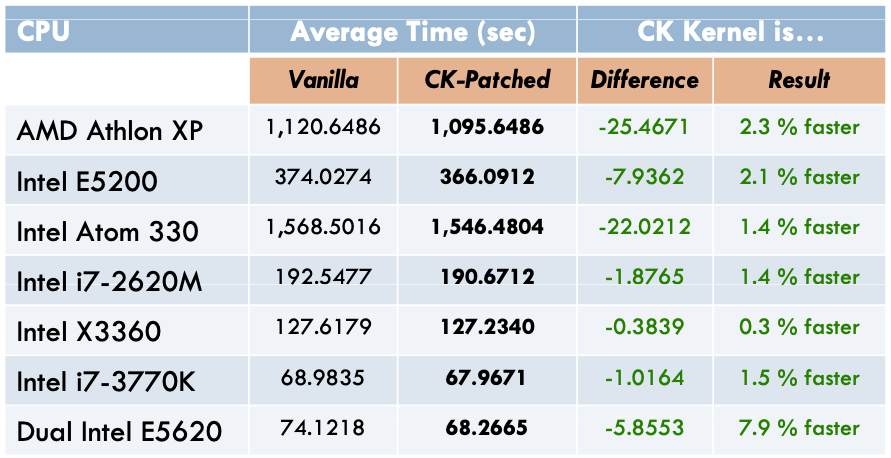
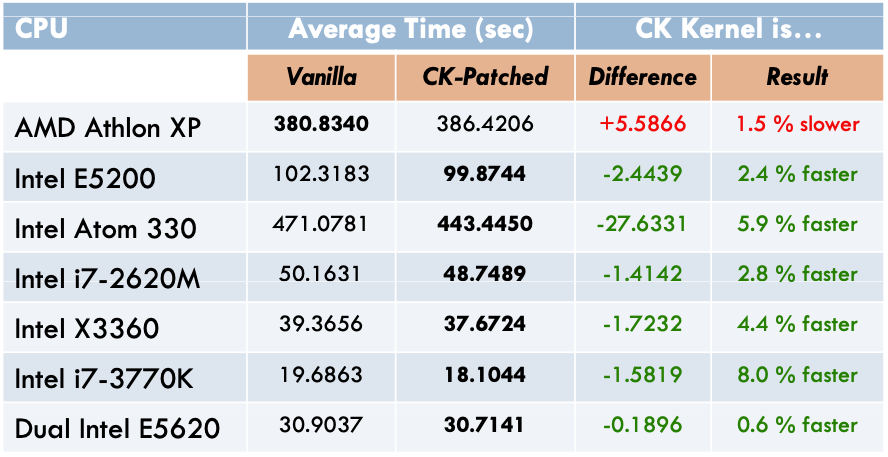

<!-- theme: gaia -->
<!-- _class: lead -->

# 第八講 多處理器調度

## 第五節 Linux/FreeBSD BFS 調度

-- From [Analysis of the BFS Scheduler in FreeBSD](http://vellvisher.github.io/papers_reports/doc/BFS_FreeBSD.pdf)

<br>
<br>

向勇 陳渝 李國良 

2022年秋季

---

**提綱**

### 1. BFS調度器
2. BFS 與 CFS 的性能對比 (2012)

---

#### BFS 的思路
BFS全稱：Brain Fuck Scheduler，腦殘調度器
- BFS 調度算法是一種時間片輪轉算法的變種。
- 在多處理機時使用單就緒隊列（雙向鏈表）
  - 增加了隊列互斥訪問的開銷
  - 減少了負載均衡算法開銷

---
#### BFS 的進程優先級

- 進程有 103 個優先級
  - 100 個靜態的實時優先級；
  - 3 個普通優先級 
      - SCHED_ISO (isochronous) : 交互式任務
      - SCHED_NORMAL  : 普通任務
      - SCHED_IDLEPRIO ：低優先級任務


---
#### BFS 的就緒隊列

- 就緒隊列
  - 所有 CPU 共享一個雙向鏈表結構的**單就緒隊列**；
  - 所有進程按優先級排隊；
  - 相同優先級的每個進程有一個時間片長度和虛擬截止時間；

---
#### BFS 的時間片
- 時間片大小：由算法參數指定，可在 1ms 到 1000ms 間選擇，缺省設置為 6ms；
- 虛擬截止時間（Virtual Deadline）：關於就緒隊列中進程等待 CPU 最長時間的排序，並不是真實的截止時間；
  - 進程**時間片用完**時，重新計算虛擬截止時間；
  - **事件等待結束**時，虛擬截止時間保持不變，以搶先相同優先級的就緒進程；
  - 為了讓進程在**上次運行的 CPU** 上運行（親和性），不同 CPU 對進程的虛擬截止時間加一個權重；


---
#### BFS 的虛擬截止時間計算
- 依據當前時間、進程優先級和時間片設置計算；
```
offset = niffies + (prioratio ∗ rr_interval)
prioratio increases by 10% for every nice level
```
- niffies是當前時間；prio_ratios[priority]是一個常量數組，不同的priority對應不同的prio_ratios[priority]；rr_interval是timeslice，是CPU分配給每個任務的時間片，是一個常數

- 虛擬截止時間計算結果：https://wikimili.com/en/Brain_Fuck_Scheduler


---
#### BFS 的調度思路
使用O(1)調度器中的**位圖**概念，所有進程被安排到103個queue中，各個進程不是按照優先級而是按照優先級區間被排列到各自所在的區間，每一個區間擁有一個queue。
<!-- https://www.cnblogs.com/dragonsuc/p/7144265.html -->


---
#### BFS 的調度思路
按照O(1)調度器的方式首先查找位圖中不為0的那個queue，然後在該queue中執行O(n)查找，查找到virtual deadline最小的那個進程投入執行。


---

#### BFS 的就緒隊列插入

- 時間片用完：重新設置虛擬截止時間後，插入就緒隊列；
- 等待事件出現：虛擬截止時間保持不變，搶先低優先級進程或插入就緒隊列；

---

**提綱**

1. BFS調度器
### 2. BFS 與 CFS 的性能對比 (2012)

---

#### BFS 與 CFS 的[性能對比](http://repo-ck.com/bench/cpu_schedulers_compared.pdf) (2012)
測試用例集
- Linux kernel v3.6.2.2 的 GCC **編譯**
- Linux kernel v3.6.2 內核源代碼樹的 lrzip **壓縮**
- 從 720p 到 360p 的 MPEG2 視頻 ffmpeg **壓縮**



---
#### BFS 與 CFS 的性能對比: 壓縮測試


---
#### BFS 與 CFS 的性能對比: 測試編譯


---

#### BFS 與 CFS 的性能對比: 視頻編碼測試


---

### 參考文獻
- http://repo-ck.com/bench/cpu_schedulers_compared.pdf
- https://zhuanlan.zhihu.com/p/351876567
- https://blog.csdn.net/dog250/article/details/7459533
- https://www.cnblogs.com/dragonsuc/p/7144265.html