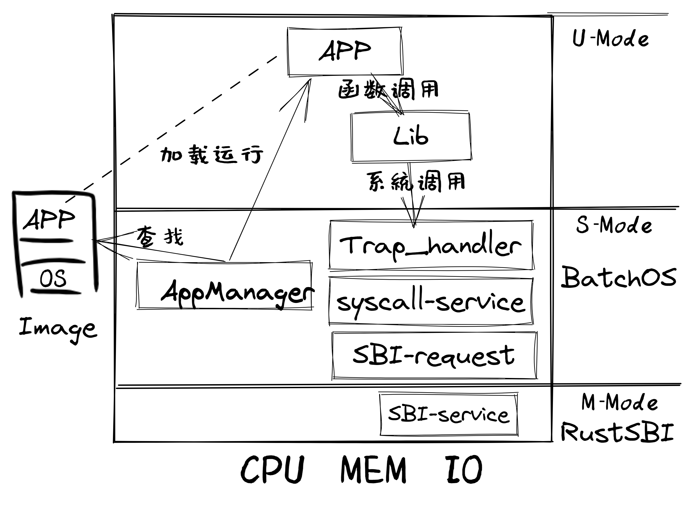
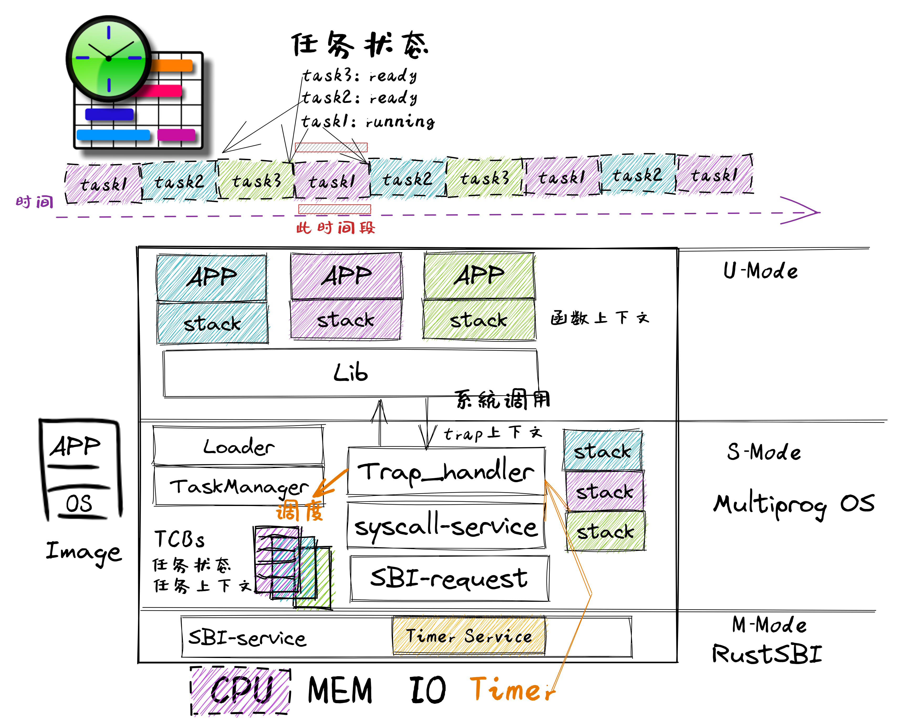
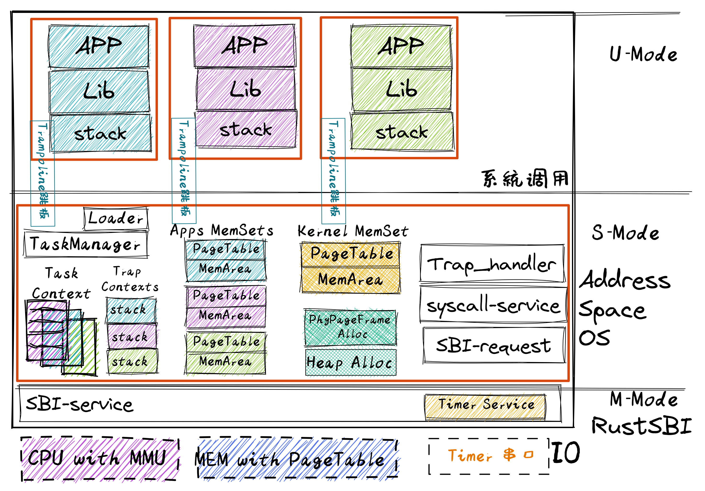
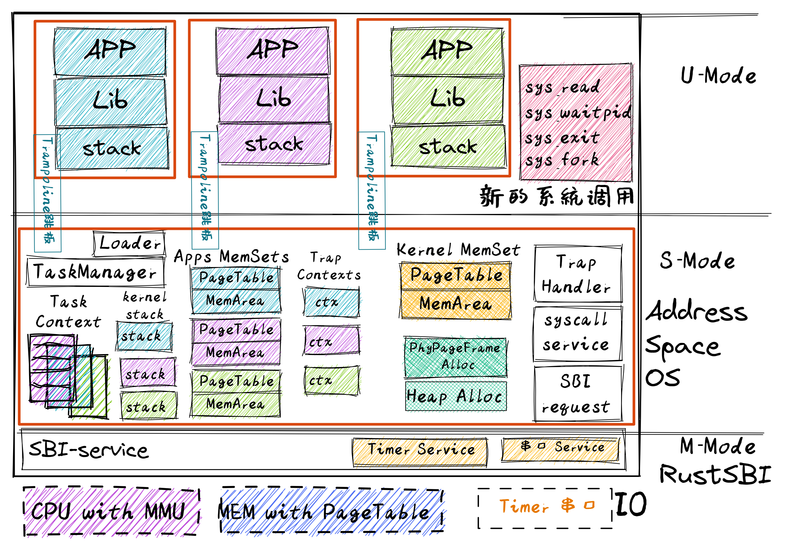
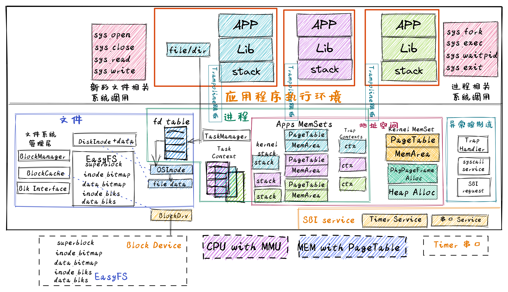

<!-- theme: gaia -->
<!-- _class: lead -->

## 第六講 地址空間-虛擬存儲管理

### 第0節 回顧
- 給應用提供"好"的服務
   - 提高性能、簡化開發、加強安全
   - 應用的執行環境持續進化
   - 操作系統功能持續增強
---
### 回顧
- lec1: UNIX/Linux APP 

  - "系統調用"
  - 例子，用C語言，來自UNIX（例如Linux、macOS、FreeBSD）。

            fd = open("out", 1);
            write(fd, "hello\n", 6);
            pid = fork()

---
### 回顧
- lec2: 裸機程序：LibOS             
  - 軟硬件啟動，函數調用，SBI調用

---
### 回顧
- lec3: 寫 Batch OS  
  - 特權級: U-Mode, S-Mode
  - **特權級切換**
  - **陷入上下文**
  - 編譯多應用+OS的鏡像
  - 加載並執行應用

---
### 回顧
- lec4-1: MultiProg OS  
   - 任務的概念
   - 任務的設計實現
   - **協作**/搶佔式調度
   -  **任務上下文** 
   -  **陷入上下文**
   - **切換任務**
   - **切換特權級**
 

---
### 回顧
- lec4-2: TimeSharing OS  
   - **中斷**
   - **中斷響應**
   - 協作/**搶佔式**調度
   -  **陷入上下文**
   -  **任務上下文** 
   - **切換任務**
   - **切換特權級**
 

---
### 回顧 App/OS內存佈局
- .text: 數據段
- 已初始化數據段.rodata：只讀的全局數據（常數或者是常量字符串）、.data：可修改的全局數據。
- 未初始化數據段 .bss
- 堆 （heap）向高地址增長
- 棧 （stack）向低地址增長

---
### 回顧
- lec5: AddrSpace OS  
- 地址空間
- 物理地址
- 頁表
-  **陷入上下文**
-  **任務上下文** 
-  **中斷響應**

 

---
### 回顧 App/OS內存佈局
- 應用地址空間
- 內核地址空間
- **切換任務**
- **切換特權級**
- **切換頁表**
  

---
### 回顧
- lec7: Process OS  
  - Process
    - Trap
    - Task
    - Address Space
    - state
    - relations
    - exit code
 

---
### 回顧
- lec7: Process OS  
  - fork
  - exec
  - exit
  - wait

 

---
### 回顧
- lec7: Process OS  
   - PCB 

---
### 回顧
- lec9: Filesystem OS  

---
### 回顧
- lec9: Filesystem OS  

---
### 回顧
- lec9: Filesystem OS
  

