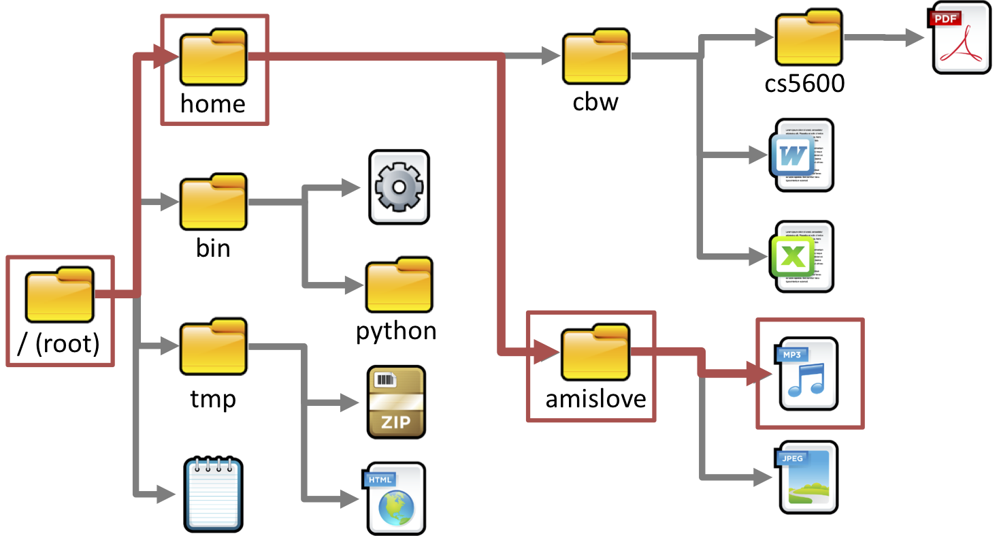
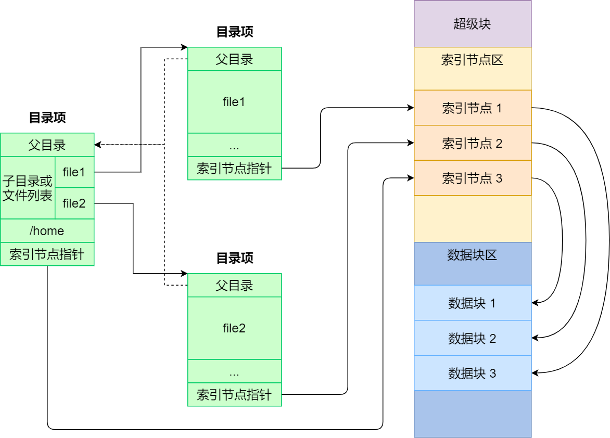
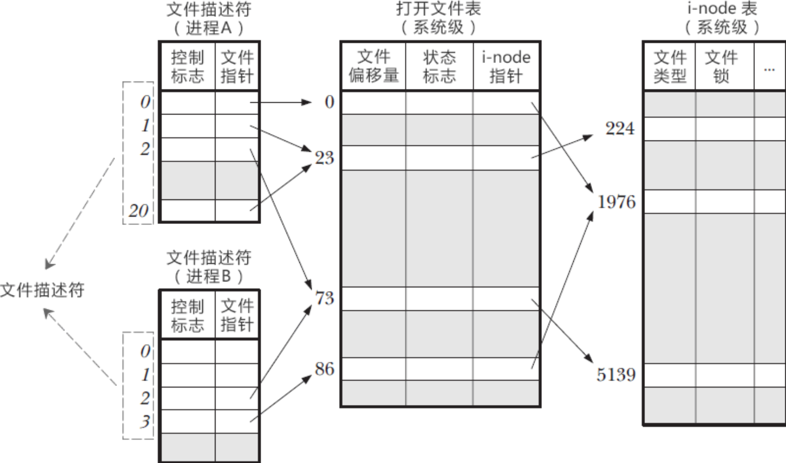
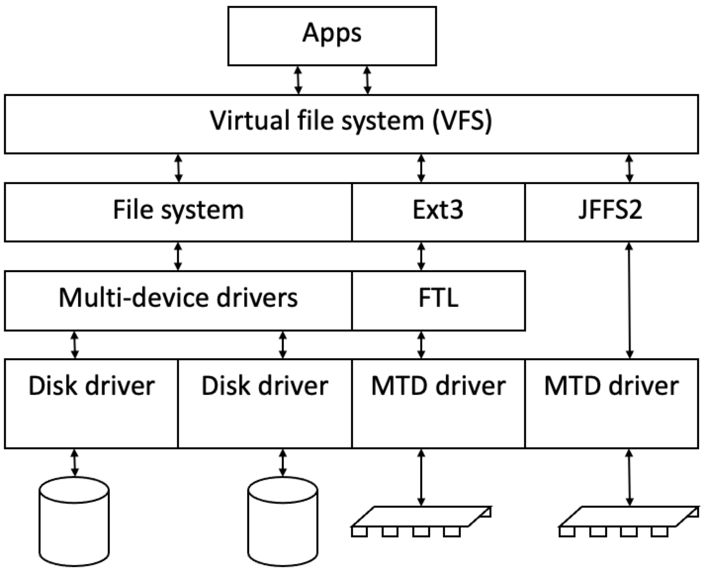

<!-- theme: gaia -->
<!-- _class: lead -->

# 第九講 文件系統

## 第一節 文件和文件系統


<br>
<br>

向勇 陳渝 李國良 

2022年秋季

---

**提綱**

### 1. 文件
- 文件的概念
- 文件操作
- 文件描述符
2. 文件系統和文件組織

---

#### 什麼是文件系統？

* [文件系統](https://blog.csdn.net/wsmzyzdw/article/details/82908736)是存儲設備上組織文件的**方法**和**數據結構**。



---

#### 什麼是文件系統？

* [文件系統](https://blog.csdn.net/wsmzyzdw/article/details/82908736)是存儲設備上組織文件的**方法**和**數據結構**。
* [文件系統](https://chinese.freecodecamp.org/news/file-systems-architecture-explained/)是操作系統中負責文件命名、存儲和檢索的**子系統**。


---
#### 什麼是文件？
- 文件是具有符號名，由字節序列構成的**數據項集合**
  - 文件是文件系統的基本數據單位
  - 文件名是文件的標識符號

- 文件頭：文件系統元數據中的**文件信息**
  - 文件屬性：名稱、類型、位置、創建時間、…
  - 文件存儲位置和順序

---
#### 一切都是文件
- UNIX類操作系統的一個設計哲學：**一切都是文件**
  - 普通文件，目錄文件
  - 字符設備文件（如鍵盤，鼠標...）
  - 塊設備文件（如硬盤，光驅...）
  - 網絡文件（socket ...）等等
- 所有一切均抽象成文件，提供了**統一的接口**，方便應用程序調用

---
#### 文件視圖

- **用戶的文件視圖**
  - 持久的數據結構
  - 系統調用接口：**字節序列**的集合(UNIX)
- **操作系統的文件視**圖
  - **數據塊**的集合
  - 數據塊是邏輯存儲單元，而扇區是物理存儲單元

---

#### 文件中數據的內部結構

- 與應用相關
  - 無結構：文本文件
  - 簡單結構：CSV、JSON等格式化文件
  - 複雜結構：Word文件、ELF可執行文件

---

**提綱**

1. 文件
- 文件的概念
### 文件操作
- 文件描述符
2. 文件系統和文件組織

---

#### 文件的基本操作

- 進程**讀文件**
  - 獲取文件所在的數據塊
  - 返回數據塊內對應部分
- 進程**寫文件**
  - 獲取數據塊
  - 修改數據塊中對應部分
  - 寫回數據塊




---

#### 文件的基本操作單位

- 文件系統中的基本操作單位是**數據塊**
  - 例如, getc()和putc()即使每次只訪問1字節的數據，也需要緩存目標數據4096字節

---
#### 文件的訪問模式
- **順序訪問**: 按字節依次讀取
  - 把一維數據映射到文件中 
- **隨機訪問**: 從任意位置讀寫
  - 把一個複雜結構(矩陣)映射到文件中
- **索引訪問**: 依據數據特徵索引
  - 數據庫訪問是一種基於索引的訪問

---

#### 文件訪問控制

- 多用戶操作系統中的文件共享是很必要的
- 訪問控制
  - 用戶對文件的訪問權限
  - 讀、寫、執行、刪除
- 文件訪問控制列表(ACL-Access Control List)
  - <文件實體, 權限>

---

#### 文件訪問控制

- UNIX模式
  - <用戶|組|所有人, 讀|寫|可執行>
  - 用戶標識ID
  - 組標識ID


---

#### 文件的共享訪問

多進程如何同時訪問共享文件？
- 文件是一個共享資源
  - 需要互斥訪問
  - 採用類似的同步互斥技術(後續)
    - 讀寫鎖

---

#### 文件的共享訪問

UNIX 文件系統(UFS)語義
- 對打開文件的寫入內容，立即對其他打開同一文件的其他用戶可見
- 共享文件指針允許多用戶同時讀取和寫入文件

---

**提綱**

1. 文件
- 文件的概念
- 文件操作
### 文件描述符
2. 文件系統和文件組織

---

#### 應用程序如何訪問文件？
- 應用訪問文件數據前必須先“打開”文件，**獲得文件描述符**
- 再進一步通過文件描述符（File Descriptor，fd）**讀寫文件**
```C
fd = open(name, flag);
read(fd, …);
close(fd);
```

---

#### 文件描述符

當應用程序請求內核打開/新建一個文件時，內核返回一個文件描述符用於**對應這個打開/新建的文件**。
- 形式上，文件描述符是一個**非負整數**
- 實際上，文件描述符是一個**索引值**，指向內核為每一個進程所維護的該進程打開文件的記錄表

 


---

#### 打開文件表

- 內核**跟蹤**進程打開的所有文件
  - 操作系統為每個進程維護一個打開的文件描述符表
  - 一個系統級的打開文件表
  - i-node表指中向具體的文件內容
 


---

#### 打開文件表

- 內核在打開文件表中**維護**的打開文件狀態和信息
  - **文件指針**
     - 最近一次讀寫位置
     - 每個進程分別維護自己的打開文件指針

 

---

#### 打開文件表

- 內核在打開文件表中**維護**的打開文件狀態和信息
  - **文件打開計數**
     - 當前打開文件的次數
     - 最後一個進程關閉文件時，將其從打開文件表中移除

 


---

#### 打開文件表

- 操作系統在打開文件表中維護的打開文件狀態和信息
  - **文件的磁盤位置**
     - 緩存數據訪問信息
  - **訪問權限**
    -  每個進程的文件訪問模式信息
 

---

**提綱**

1. 文件
### 2. 文件系統和文件組織
- 文件系統的功能
- 目錄

---
#### 文件系統類型
- 磁盤文件系統：FAT, NTFS, ext2/3, ISO9660,等
- 網絡/分佈式文件系統：NFS, SMB, AFS, GFS
- 特殊文件系統：procfs, sysfs

---

#### 虛擬文件系統（VFS）

 

---

#### 文件系統的功能
- 文件系統是操作系統中**管理持久性數據的子系統**，提供數據**文件命名、存儲和檢索**功能。
  - 組織、檢索、讀寫訪問數據
  - 大多數計算機系統都有文件系統

---
#### 文件系統功能
- 分配文件磁盤空間
  - 管理文件塊（位置和順序）
  - 管理空閒空間(位置)
  - 分配算法 (策略)

---
#### 文件系統功能
- 管理文件集合
  - 組織：組織文件的控制結構和數據結構
  - 命名：給文件取名字 
  - 定位：通過名字找到文件文件及其內容

---
#### 文件系統功能
- 數據可靠和安全
  - 安全：多層次保護數據安全
  - 可靠
    - 持久保存文件
    - 避免系統崩潰、數據丟失等
 
---
#### 文件系統組織形式
**分層文件系統**
- 文件以目錄的方式組織起來
- 目錄是一類特殊的文件
- 目錄的內容是文件索引表<文件名, 指向文件的指針>

 

 
---

**提綱**

1. 文件
2. 文件系統和文件組織
- 文件系統的功能
###  目錄

---

#### 目錄操作

應用程序通過系統調用對目錄進行操作
- 搜索文件 創建文件 
- 刪除文件 列目錄
- 重命名文件 重命名文件

 

 
---
#### 目錄實現
- 文件名的線性列表，包涵了指向數據塊的指針
  - 編程簡單、執行耗時
- 哈希表 – 哈希數據結構的線性表
  - 減少目錄搜索時間
  - 可能有衝突 - 兩個文件名的哈希值相同

---
#### 遍歷目錄路徑
舉例: 解析`./fs/inode.rs`
- 讀取當前目錄文件`.`的數據內
- 找到`fs`項，讀取目錄文件`fs`的數據內容
- 找到`inode.rs`項，讀取一般文件`inode.rs`的數據內容

 

---
#### 文件別名
多個文件名關聯同一個文件
- **硬鏈接**(hard link)
  - 多個文件項指向一個文件
- **軟鏈接**(soft link, symbolic link)
  - 以存儲文件名稱的方式來指向其他文件

inode：管理文件數據的結構

 


---
#### 如何避免目錄中沒有形成循環？
  - 只允許對文件的鏈接，不允許對子目錄的鏈接
  - 增加鏈接時，用循環檢測算法確定是否合理
  - 限制遍歷文件目錄的路徑數量

  

 ---
#### 文件系統掛載
  - 文件系統需要先掛載才能被訪問
 
 
 ---

### 小結

1. 文件
- 文件的概念
- 文件操作
- 文件描述符
2. 文件系統和文件組織
- 文件系統的功能
- 目錄

 