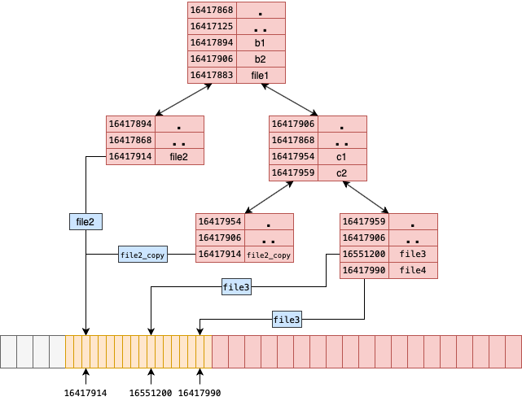
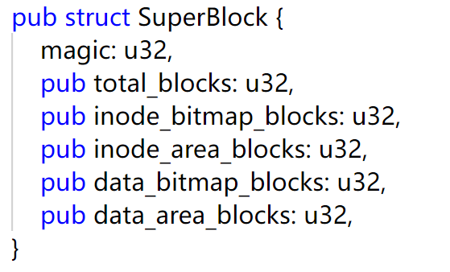
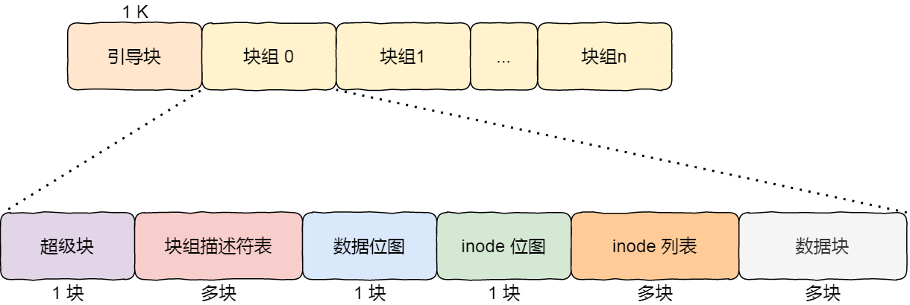

<!-- theme: gaia -->
<!-- _class: lead -->

# 第九講 文件系統

## 第二節 文件系統的設計與實現

 
 

向勇 陳渝 李國良 

2022年秋季

---

**提綱**

### 1. 概述
2. 文件系統的基本數據結構
3. 文件緩存
4. 文件分配
5. 文件訪問過程示例

--- 
#### 文件系統在內核中的位置

---

#### 文件系統的分層結構

---
#### 文件系統在計算機系統中的分層結構

---

#### 文件系統的用戶視圖與內核視圖

---

#### 虛擬文件系統

（Virtual File System，VFS）

- 定義了一組所有文件系統都支持的數據結構和標準接口。
- 磁盤的文件系統：直接把數據存儲在磁盤中，比如 Ext 2/3/4、XFS。
- 內存的文件系統：內存輔助數據結構 - 例如目錄項。

--- 
#### 虛擬文件系統的功能
- 目的：對所有不同文件系統的抽象
- 功能
  - 提供相同的文件和文件系統接口
  - 管理所有文件和文件系統關聯的數據結構
  - 高效查詢例程, 遍歷文件系統
  - 與特定文件系統模塊的交互

--- 
#### 虛擬文件系統統一不同文件系統的訪問接口

--- 

**提綱**

1. 概述
### 2. 文件系統的基本數據結構
3. 文件緩存
4. 文件分配
5. 文件訪問過程示例

--- 

#### 文件系統的存儲視圖
- 文件卷控制塊 (`superblock`)
- 文件控制塊( `inode`/`vnode`)
- 目錄項 (`dir_entry`)
- 數據塊（`data block`）

--- 

#### 文件系統的組織視圖

---

#### 文件系統基本數據結構 

--- 
#### 文件卷控制塊 (`superblock`)

每個文件系統一個文件卷控制塊
- 文件系統詳細信息
- 塊大小、空餘塊數量等
- block 與inode 的總量，未使用與已使用的數量
- filesystem的掛載時間、最近一次寫入時間、最近一次檢驗磁盤(fsck) 時間

--- 
#### 文件控制塊inode
每個文件有一個文件控制塊inode (`inode`/`vnode`)
  - 大小、數據塊位置（指向一個或多個datablock）
  - 訪問模式(read/write/excute)
  - 擁有者與群組(owner/group)
  - 時間信息：建立或狀態改變的時間、最近讀取時間/修改的時間
  - **文件名在目錄的datablock中**
<!---->

--- 
#### bitmap塊
bitmap塊( `bitmap inode/dnode`) 
- inode使用或者未使用標誌位
- dnode使用或者未使用標誌位

--- 
#### 數據塊dnode( `data node`)
- 目錄和文件的數據塊
    - 放置目錄和文件內容
    - 格式化時確定data block的固定大小
    - 每個block都有編號，以方便inode記錄
    - inode一般為128B
    - data block一般為4KB

--- 
#### 目錄的數據塊

--- 
#### 目錄項 (`dir_entry`)
- 目錄項一般會在內存中緩存
  - 每個目錄項一個(目錄和文件)
  - 將目錄項數據結構及樹型佈局編碼成樹型數據結構
  - 指向文件控制塊、父目錄、子目錄等

--- 

**提綱**

1. 概述
2. 文件系統的基本數據結構
### 3. 文件緩存
4. 文件分配
5. 文件訪問過程示例

--- 

#### 多種磁盤緩存位置

---
#### 數據塊緩存
- 數據塊**按需讀入**內存
  - 提供read()操作
  - 預讀: 預先讀取後面的數據塊
- 數據塊使用後被**緩存**
  - 假設數據將會再次用到
  - 寫操作可能被緩存和延遲寫入
 
 頁緩存: 統一緩存數據塊和內存頁

--- 
#### 虛擬頁式存儲 -- 頁緩存

在虛擬地址空間中虛擬頁面可映射到本地外存文件中
  

<!--
--- 
#### 文件系統的設計與實現 -- 緩存
虛擬頁式存儲 -- 頁緩存
- 在虛擬地址空間中虛擬頁面可映射到本地外存文件中
- 文件數據塊的頁緩存
  - 在虛擬內存中文件數據塊被映射成頁
  - 文件的讀/寫操作被轉換成對內存的訪問
  - 可能導致缺頁和/或設置為髒頁
  - 問題: 頁置換算法需要協調虛擬存儲和頁緩存間的頁面數
-->

--- 
#### 虛擬頁式存儲 -- 頁緩存

在虛擬地址空間中虛擬頁面可映射到本地外存文件中
- 文件數據塊的頁緩存
  - 在虛擬內存中文件數據塊被映射成頁
  - 文件的讀/寫操作被轉換成對內存的訪問
  - 可能導致缺頁和/或設置為髒頁
- 問題: 頁置換算法需要協調虛擬存儲和頁緩存間的頁面數

--- 
#### 文件描述符
- 每個被打開的文件都有一個文件描述符
- 作為index，指向對應文件狀態信息

--- 
#### 打開文件表
- 每個進程一個進程打開文件表
- 一個系統打開文件表

--- 
#### 文件鎖
一些文件系統提供文件鎖，用於協調多進程的文件訪問
- 強制 – 根據鎖保持情況和訪問需求確定是否拒絕訪問
- 勸告 – 進程可以查找鎖的狀態來決定怎麼做

--- 

**提綱**

1. 概述
2. 文件系統的基本數據結構
3. 文件緩存
### 4. 文件分配
5. 文件訪問過程示例

--- 

#### 文件大小
- 大多數文件都很小
  - 需要支持小文件
  - 數據塊空間不能太大
- 一些文件非常大
  - 能支持大文件
  - 可高效讀寫

--- 
#### 文件分配

分配文件數據塊
- 分配方式
   - 連續分配
   - 鏈式分配
   - 索引分配
- 評價指標
  - 存儲效率：外部碎片等
  - 讀寫性能：訪問速度

--- 
#### 連續分配
文件頭指定起始塊和長度

- 分配策略: 最先匹配, 最佳匹配, ...
- 優點: 
  - 高效的順序和隨機讀訪問
- 缺點
  - 頻繁分配會帶來碎片；增加文件內容開銷大

--- 
#### 鏈式分配
數據塊以鏈表方式存儲

- 優點: 創建、增大、縮小很容易；幾乎沒有碎片
- 缺點：
   - 隨機訪問效率低；可靠性差；
   - 破壞一個鏈，後面的數據塊就丟了

--- 
#### 鏈式分配

  - 顯式連接
  - 隱式連接

--- 
#### 索引分配

- 文件頭包含了索引數據塊指針
- 索引數據塊中的索引是文件數據塊的指針

- 優點
  - 創建、增大、縮小很容易；幾乎沒有碎片；支持直接訪問
- 缺點
  - 當文件很小時，存儲索引的開銷相對大

如何處理大文件?

--- 
#### 索引分配

- 鏈式索引塊 (IB+IB+…)

- 多級索引塊(IB*IB *…)

--- 
#### 索引分配

--- 
#### 多級索引分配

--- 
#### 多級索引分配

- 文件頭包含13個指針
  - 10 個指針指向數據塊
  - 第11個指針指向索引塊
  - 第12個指針指向二級索引塊
  - 第13個指針指向三級索引塊

大文件在訪問數據塊時需要大量查詢

--- 
#### 文件分配方式比較

--- 
#### 空閒空間管理
跟蹤記錄文件卷中未分配的數據塊: 數據結構?
- 位圖:用位圖代表空閒數據塊列表
  - 11111111001110101011101111...
  - $D_i = 0$ 表明數據塊$i$是空閒, 否則，表示已分配
  - 160GB磁盤 --> 40M數據塊 --> 5MB位圖
  - 假定空閒空間在磁盤中均勻分佈，
      - 找到“0”之前要掃描n/r 
        - n = 磁盤上數據塊的總數 ； r = 空閒塊的數目

--- 
#### 空閒空間管理 
- 鏈表

- 索引

 

---

**提綱**

1. 概述
2. 文件系統的基本數據結構
3. 文件緩存
4. 文件分配
### 5. 文件訪問過程示例

--- 

#### 文件系統組織示例

--- 
#### 文件讀操作過程

--- 
#### 文件寫操作過程

--- 
#### 文件系統分區
- 多數磁盤劃分為一個或多個分區，每個分區有一個獨立的文件系統。

---

### 小結

1. 概述
2. 文件系統的基本數據結構
3. 文件緩存
4. 文件分配
5. 文件訪問過程示例

