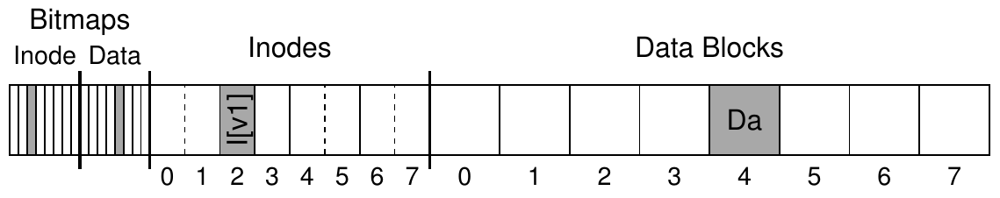
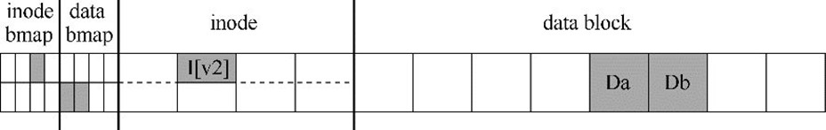
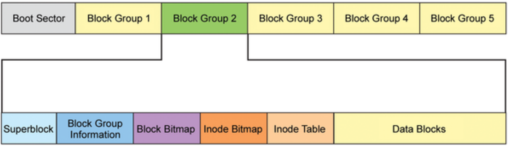
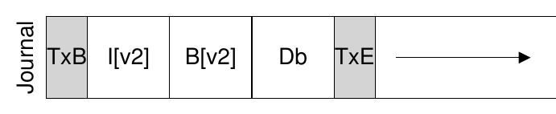
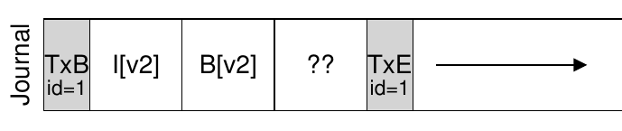
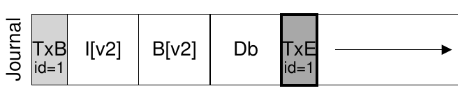
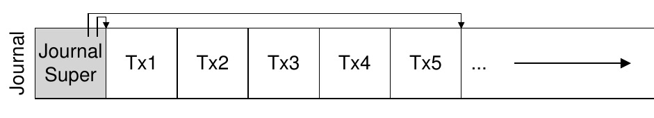
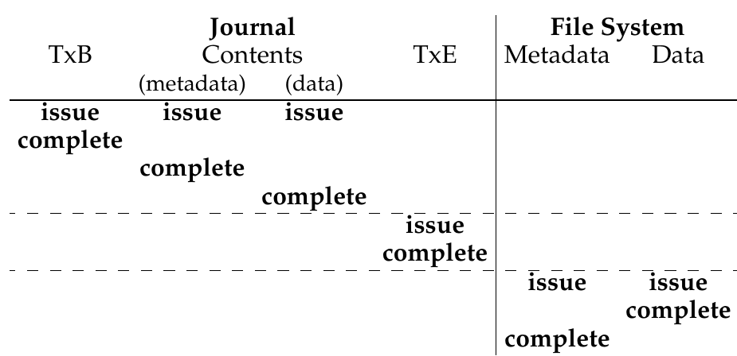
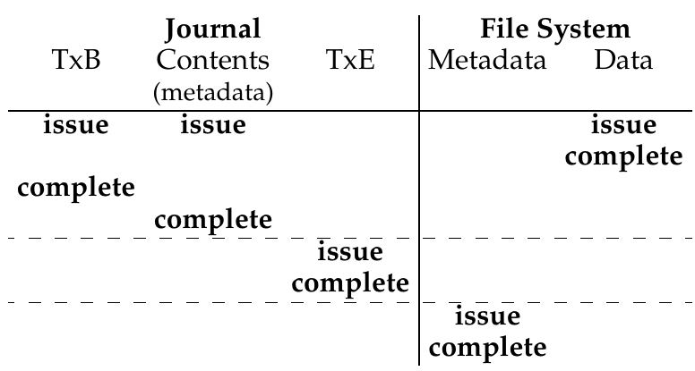

<!-- theme: gaia -->
<!-- _class: lead -->

# 第九講 文件系統

## 第三節 支持崩潰一致性的文件系統

 
 

向勇 陳渝 李國良 

2022年秋季

---

**提綱**

### 1. 崩潰一致性問題
- 崩潰一致性
- 崩潰場景
2. 文件系統檢查程序 fsck
3. 日誌文件系統

---

#### 文件系統的持久數據更新挑戰

如何在出現斷電（power loss）或系統崩潰（system crash）的情況下，更新持久數據結構。

崩潰可能導致磁盤文件系統映像中的文件系統數據結構出現**不一致**性。如，有空間洩露、將垃圾數據返回給用戶等。

---

#### 崩潰一致性問題

**崩潰一致性**問題（crash-consistency problem）也稱**一致性更新**問題（consistent-update problem）
- 特定操作需要更新磁盤上的**兩個結構**A和B。
- 磁盤一次只為一個請求提供服務，因此其中一個請求將首先到達磁盤（A或B）。
- 如果在一次寫入完成後系統崩潰或斷電，則磁盤上的結構將處於不一致（inconsistent）的狀態。

---

#### 崩潰一致性的需求

* 目標
  * 將文件系統從一個一致狀態（在文件被追加之前），原子地（atomically）變遷到另一個一致狀態（在inode、位圖和新數據塊被寫入磁盤之後）。
* 困難
  * 磁盤一次只提交一次寫入，更新之間可能會發生崩潰或斷電。

---

#### 文件更新過程示例

一個應用以某種方式更新磁盤結構：將單個數據塊附加到原有文件。
- 通過打開文件，調用`lseek()`將文件偏移量移動到文件末尾，然後在關閉文件之前，向文件發出單個4KB寫入來完成追加。

---

#### 文件系統數據結構

* inode位圖（inode bitmap，只有8位，每個inode一個）
* 數據位圖（data bitmap，也是8位，每個數據塊一個）
* inode（總共8個，編號為0到7，分佈在4個塊上）
* 數據塊（總共8個，編號為0～7）。

<!--
文件系統的示意圖
-->

---

#### 文件更新中的磁盤操作

一個應用以某種方式更新磁盤結構：將單個數據塊附加到原有文件
- 必須對磁盤執行**3次單獨寫入**
  - inode（I[v2]）、位圖（B[v2]）和數據塊（Db）
- 發出write()系統調用時，這些寫操作通常不會立即發生。
  - 髒的inode、位圖和新數據先在**內存**（頁面緩存page cache，或緩衝區緩存buffer cache）中存在一段時間。
- 當文件系統最終決定將它們寫入磁盤時（比如說5s或30s），文件系統將向磁盤發出必要的**寫入請求**。

<!---->

---

**提綱**

1. 崩潰一致性問題
- 崩潰一致性
### 崩潰場景
2. 文件系統檢查程序 fsck
3. 日誌文件系統

---

#### 文件操作中的崩潰
在文件操作過程中可能會發生崩潰，從而干擾磁盤的這些更新。
* 如果寫入操作中的一個或兩個完成後發生崩潰，而不是全部 3個，則文件系統可能處於**有趣**（不一致）的狀態。
<!--  -->

---

#### 崩潰場景一

只將數據塊（Db）寫入磁盤
* **數據在磁盤上**，但沒有指向它的inode，也沒有表示塊已分配的位圖
* **好像寫入從未發生過**一樣

<!--  -->

---

#### 崩潰場景二 

只有**更新的inode**（I[v2]）寫入了磁盤
* inode指向磁盤塊5，其中Db即將寫入，但Db尚未寫入
* **從磁盤讀取垃圾數據**（磁盤塊5的舊內容）。

<!--  -->

---

#### 崩潰場景三

只有**更新後的位圖**（B [v2]）寫入了磁盤
* 位圖指示已分配塊5，但沒有指向它的inode
* 這種寫入將導致**空間洩露**（space leak），文件系統永遠不會使用塊5

<!--  -->

---

#### 崩潰場景四

**inode（I[v2]）和位圖（B[v2]）寫入了磁盤**，但沒有寫入數據（Db）
* inode有一個指向塊5的指針，位圖指示5正在使用，因此從文件系統的元數據的角度來看，一切**看起來很正常**
* 但**磁盤塊5中又是垃圾**。

<!--  -->

---

#### 崩潰場景五

**寫入了inode（I[v2]）和數據塊（Db）**，但沒有寫入位圖（B[v2]）
* inode指向了磁盤上的正確數據
* 在inode和位圖（B1）的舊版本之間存在**不一致**

<!--  -->

---

#### 崩潰場景六

**寫入了位圖（B[v2]）和數據塊（Db）**，但沒有寫入inode（I[v2]）
* inode和數據位圖之間再次存在**不一致**
* 不知道它屬於哪個文件，因為沒有inode指向該塊

---

**提綱**

1. 崩潰一致性問題
### 2. 文件系統檢查程序 fsck
3. 日誌文件系統

---

#### 崩潰解決方案

* 文件系統檢查程序 fsck
* 基於預寫日誌（write ahead log）的文件系統

---

#### 文件系統檢查程序 fsck

早期的文件系統採用了一種簡單的方法來處理崩潰一致性。
* 讓不一致的事情發生，然後再修復它們（重啟時）
* 目標：確保文件系統**元數據內部一致**。

---

#### 超級塊檢查

檢查超級塊是否合理，主要是進行健全性檢查
* 確保文件系統大小大於分配的塊數
* 找到超級塊的**內容不合理（衝突）**，系統（或管理員）可以決定使用超級塊的**備用副本**

注：可靠性高的文件系統，會有多處放置超級塊備份的磁盤扇區。

---

#### 位圖與inode間的一致性檢查

掃描inode、間接塊、雙重間接塊等，以瞭解當前在文件系統中分配的塊，生成正確版本的分配位圖
* 如果位圖和inode之間存在任何不一致，則通過信任inode內的信息來解決它
* 對所有inode執行相同類型的檢查，確保所有看起來像在用的inode，都在inode位圖中有標記

---

#### inode狀態檢查

檢查每個inode是否存在損壞或其他問題
* 每個分配的inode具有有效的類型字段（即常規文件、目錄、符號鏈接等）
* 如果inode字段存在問題，不易修復，則inode被認為是可疑的，並被fsck清除，inode位圖相應地更新。

---

#### 鏈接計數檢查

inode鏈接計數表示包含此特定文件的引用（即鏈接）的不同目錄的數量。
* 從根目錄開始掃描整個目錄樹，併為文件系統中的每個文件和目錄構建自己的鏈接計數
* 如果新計算的計數與inode中找到的計數不匹配，則通常是修復inode中的計數
* 如果發現已分配的inode但沒有目錄引用它，則會將其移動到lost + found目錄。

---

#### 重複指針檢查

兩個不同的inode引用同一個塊的情況
* 如果一個inode明顯錯誤，可能會被清除或複製指向的塊，從而為每個inode提供其自己的文件數據。
* inode有很多錯誤可能性，比如其inode內的元數據不一致
  * inode有文件的長度記錄，但其實際指向的數據塊大小小於其文件長度。

---

#### 壞塊檢查

在掃描所有指針列表時，檢查壞塊指針。如果指針顯然指向超出其有效範圍的某個指針，則該指針被認為是“壞的”。
* 地址指向大於分區大小的塊
* 從inode或間接塊中刪除（清除）該指針

---

#### 目錄檢查

fsck不瞭解用戶文件的內容，但目錄包含由文件系統本身創建的特定格式的信息。對每個目錄的內容執行額外的完整性檢查。
  - 確保“.”和“..”是前面的條目，目錄條目中引用的每個inode都已分配
  - 確保整個層次結構中沒有目錄的引用超過一次。

---

#### 文件系統檢查程序 fsck 的不足

- 對於非常大的磁盤卷，掃描整個磁盤，以查找所有已分配的塊並讀取整個目錄樹，可能需要幾分鐘或幾小時。
- 可能丟數據！

---

**提綱**

1. 崩潰一致性問題
2. 文件系統檢查程序 fsck
### 3. 日誌文件系統
- 日誌
- 數據日誌（data journaling）
- 日誌文件系統的性能優化

---

#### 日誌（或預寫日誌）

預寫日誌（write-ahead logging）
- 從數據庫管理系統的世界中借鑑的想法
- 在文件系統中，出於歷史原因，通常將預寫日誌稱為日誌（journaling）
- 第一個實現它的文件系統是[Cedar](https://www.microsoft.com/en-us/research/publication/the-cedar-file-system/)
- 許多現代文件系統都使用這個想法，包括Linux ext3和ext4、reiserfs、IBM的JFS、SGI的XFS和Windows NTFS。

---

#### 預寫日誌的思路

* 更新磁盤時，在覆寫結構之前，首先寫下一點小注記（在磁盤上的其他地方，在一個眾所周知的位置），描述你將要做的事情
* 寫下這個註記就是“預寫”部分，把它寫入一個結構，並組織成“日誌”

---

#### 預寫日誌的崩潰恢復

- 通過將註釋寫入磁盤，可以保證在更新（覆寫）正在更新的結構期間發生崩潰時，能夠返回並查看你所做的註記，然後重試
- 在崩潰後準確知道要修復的內容（以及如何修復它），而不必掃描整個磁盤
- 日誌功能通過在更新期間增加了一些工作量，大大減少了恢復期間所需的工作量

---

**提綱**

1. 崩潰一致性問題
2. 文件系統檢查程序 fsck
3. 日誌文件系統
- 日誌
### 數據日誌（data journaling）
- 日誌文件系統的性能優化

---

#### 數據日誌（data journaling）

- TxB: transaction 開始
- TxE: transaction 結束
- logical logging: 中間 3 塊數據
---

#### 數據日誌（data journaling）

- 數據日誌寫到磁盤上
- 更新磁盤，覆蓋相關結構 (checkpoint)
  - I[V2] B[v2] Db

---

#### 寫入日誌期間發生崩潰

磁盤內部可以（1）寫入TxB、I[v2]、B[v2]和TxE，然後才寫入Db。
* 如果磁盤在（1）和（2）之間斷電，那麼磁盤上會變成：

---

#### 數據日誌的兩步事務寫入

為避免該問題，文件系統分兩步發出事務寫入。
- 將除TxE塊之外的所有塊寫入日誌，同時發出這些寫入操作
- 當這些寫入完成時，日誌將看起來像這樣（假設又是文件追加的工作負載）：

---

#### 數據日誌的兩步事務寫入

當這些寫入完成時，文件系統會發出TxE塊的寫入，從而使日誌處於最終的安全狀態：

---

#### 數據日誌的更新流程

當前更新文件系統的協議如下，3個階段中的每一個都標上了名稱。
1. **日誌寫入**
   - 將事務的內容（包括TxB、元數據和數據）寫入日誌，等待這些寫入完成。
2. **日誌提交**
   - 將事務提交塊（包括TxE）寫入日誌，等待寫完成，事務被認為已提交（committed）。
3. **加檢查點**
   - 將更新內容（元數據和數據）寫入其最終的磁盤位置。

---

#### 數據日誌的崩潰恢復

在此更新序列期間的任何時間都可能發生崩潰。

- 如果崩潰發生在將事務安全地寫入日誌之前
- 如果崩潰是在事務提交到日誌之後，但在檢查點完成之前發生

太多寫，慢！

---

**提綱**

1. 崩潰一致性問題
2. 文件系統檢查程序 fsck
3. 日誌文件系統
- 日誌
- 數據日誌（data journaling）
### 日誌文件系統的性能優化

---

#### 日誌超級塊 journal superblock

- 批處理日誌更新
- 使日誌有限：循環日誌

---

#### 日誌超級塊的更新過程
- Journal write
- Journal commit
- Checkpoint
- Free: 一段時間後，通過更新日記帳，超級塊將交易記錄標記為空閒

---

#### 元數據日誌 Metadata Journaling

什麼時候應該將數據塊 Db 寫入磁盤？
  - 數據寫入的順序對於僅元數據的日誌記錄很重要
  - 如果在事務（包含 I [v2] 和 B [v2]）完成後將 Db 寫入磁盤，這樣有問題嗎？

---

#### 元數據日誌的更新過程
- Data write
- Journal metadata write
- Journal commit
- Checkpoint metadata
- Free

通過強制首先寫入數據，文件系統可保證指針永遠不會指向垃圾數據。

--- 

#### Data Journaling時間線 v.s. Metadata Journaling時間線	

---

### 小結

1. 崩潰一致性問題
- 崩潰一致性
- 崩潰場景
2. 文件系統檢查程序 fsck
3. 日誌文件系統
- 日誌
- 數據日誌（data journaling）
- 日誌文件系統的性能優化
