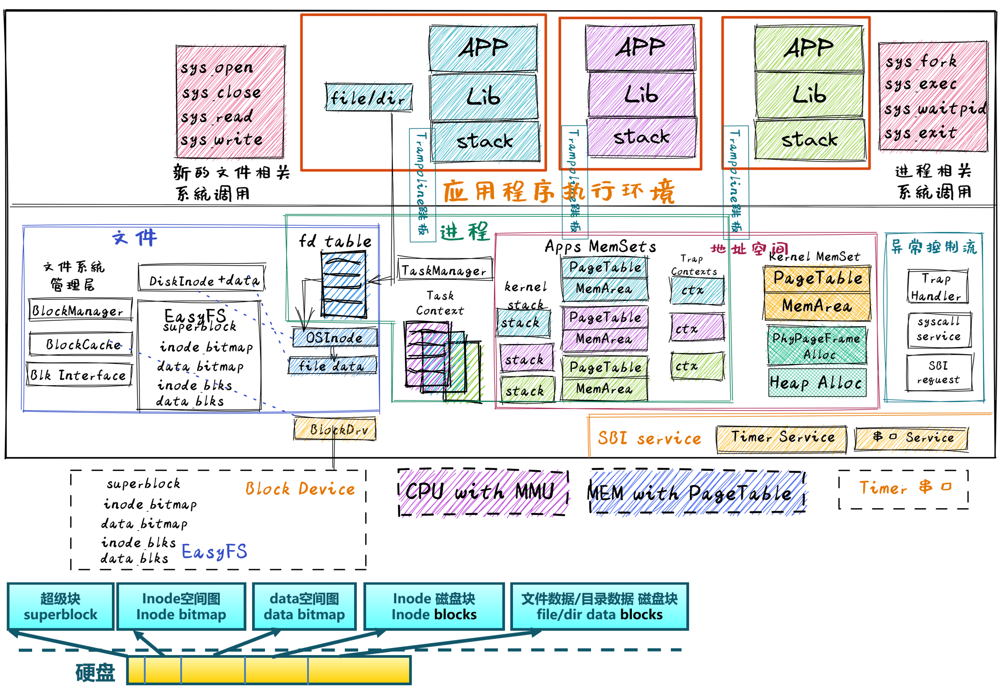
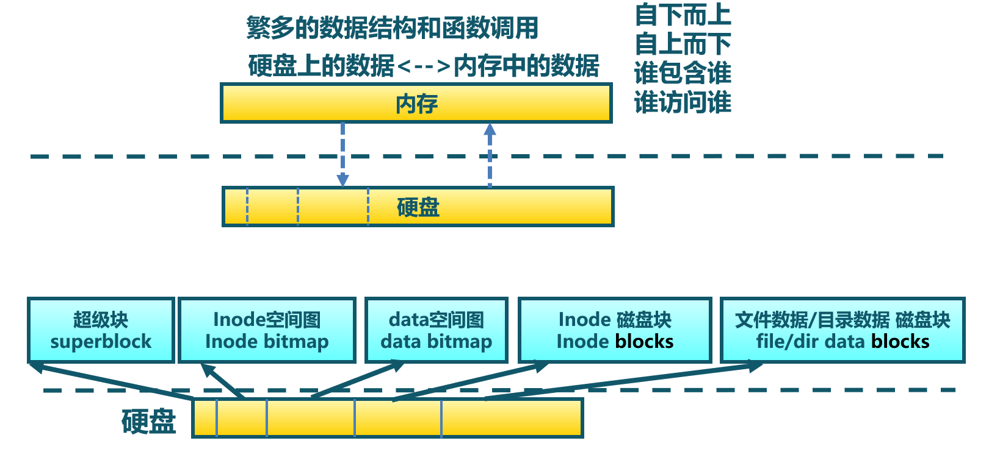
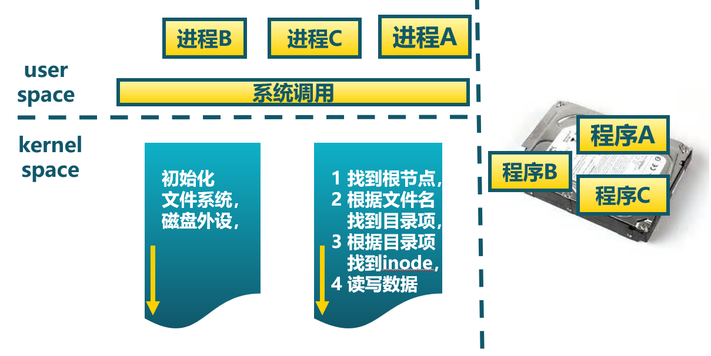
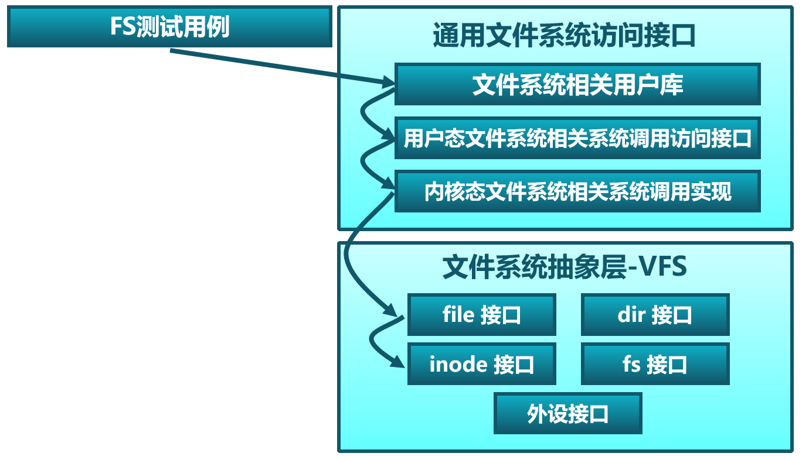
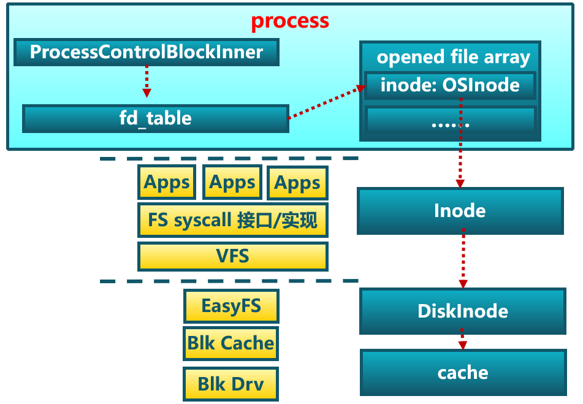
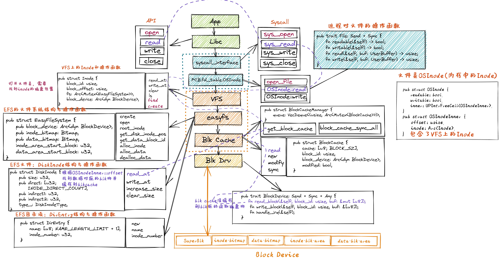
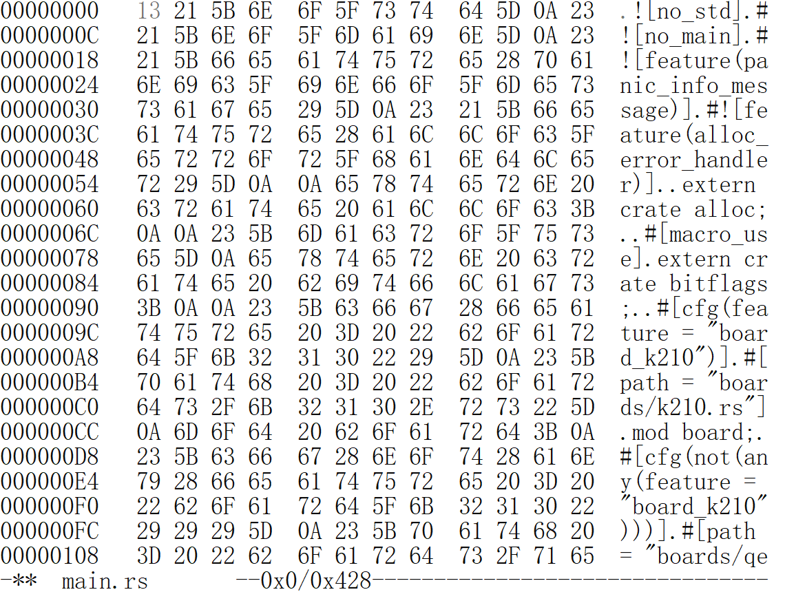
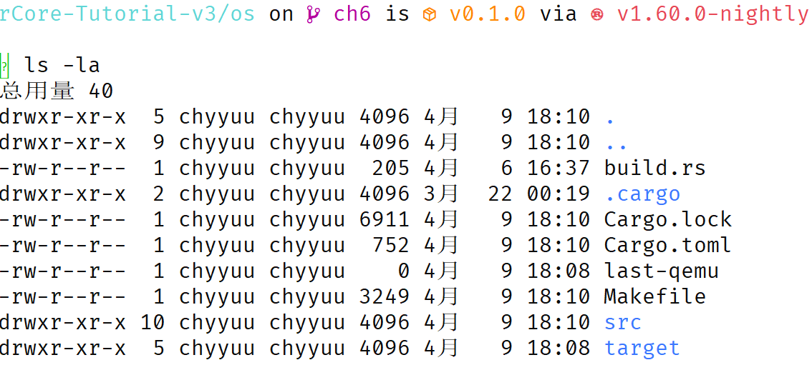

<!-- theme: gaia -->
<!-- _class: lead -->

# 第九講 文件系統

## 第四節 支持文件的操作系統

Filesystem OS(FOS)


<br>
<br>

向勇 陳渝 李國良 

2022年秋季

---

**提綱**

### 1. 實驗目標和步驟
- 實驗目標
- 文件系統接口和數據結構
- 實踐步驟
2. 代碼結構
3. 應用程序設計
4. 內核程序設計



---

#### 以往實驗目標

提高性能、簡化開發、加強安全
- Process OS: 增強**進程管理**和資源管理
- Address Space OS: APP不用考慮其運行時的起始執行地址，隔離APP訪問的內存**地址空間**
- multiprog & time-sharing OS: 讓APP有效共享**CPU**，提高系統總體性能和效率
- BatchOS: 讓APP與OS**隔離**，加強系統安全，提高執行效率
- LibOS: 讓APP與HW**隔離**，簡化應用訪問硬件的難度和複雜性
---
#### 實驗目標

支持**數據持久保存**
- 以**文件**形式保存持久數據，並能進行文件數據讀寫
- **進程**成為文件資源的使用者
- 能夠在應用層面發出如下**系統調用**請求：
   - open/read/write/close


---
#### 歷史
- 1965：描述未來的 MULTICS 操作系統
  - 指明方向的舵手
    - **文件**數據看成是一個無格式的字節流 
    - 第一次引入了**層次文件系統**的概念
  - 啟發和造就了UNIX
     - 眼中**一切皆文件**的UNIX文件系統
---

#### 實驗要求

- 理解文件系統/文件**概念**
- 理解文件系統的**設計與實現**
- 理解應用<->庫<->...<->設備驅動的整個文件**訪問過程**
- **會寫**支持文件系統的OS

<!-- 霸王龍即雷克斯暴龍（Tyrannosaurus Rex） 操作系統  -->


---

#### 需要考慮的問題

- 硬盤上的文件系統如何組織？硬盤佈局？
- 如何管理空閒磁盤塊？
- 如何表示一個文件/目錄？
  - 文件是啥？目錄是啥？
- 如何表示文件/目錄數據內容？
- 如何訪問一個文件？


---

####  實驗中的文件類型
- 當前
  - Regular file 常規文件
  - Directory 目錄文件
- 未來
  - Link file 鏈接文件
  - Device 設備文件
  - Pipe 管道文件


---

#### 總體思路



---

**提綱**

1. 實驗目標和步驟
- 實驗目標
### 文件系統接口和數據結構
- 實踐步驟
2. 代碼結構
3. 應用程序設計
4. 內核程序設計


---

#### 文件訪問流程




---

#### 文件系統訪問接口


---

#### 文件系統訪問接口




---

#### 文件系統訪問接口


---

#### 文件系統的數據結構




---

#### 文件系統的數據結構



---

**提綱**

1. 實驗目標和步驟
- 實驗目標
- 文件系統接口和數據結構
### 實踐步驟
2. 代碼結構
3. 應用程序設計
4. 內核程序設計


---

#### 實驗步驟

- 編譯：內核獨立編譯，單獨的內核鏡像
- 編譯：應用程序編譯後，**組織形成文件系統鏡像**
- 構造：進程的管理與初始化，建立基於頁表機制的虛存空間
- 構造：構建文件系統
- 運行：特權級切換，進程與OS相互切換
- 運行：切換地址空間，跨地址空間訪問數據
- 運行：**從文件系統加載應用，形成進程**
- 運行：數據訪問：內存--磁盤，**基於文件的讀寫**


---

#### 實踐步驟 
```
git clone https://github.com/rcore-os/rCore-Tutorial-v3.git
cd rCore-Tutorial-v3
git checkout ch6
cd os
make run
```

---
#### 實踐步驟 
```
[RustSBI output]
...
filetest_simple
fantastic_text
**************/
Rust user shell
>>
```
操作系統啟動``shell``後，用戶可以在``shell``中通過敲入應用名字來執行應用。

從用戶界面上，沒看出文件系統的影子


---
#### 實踐步驟 
在這裡我們運行一下本章的測例 filetest_simple ：
```
>> filetest_simple
file_test passed!
Shell: Process 2 exited with code 0
>>
```
它會將 Hello, world! 輸出到另一個文件 filea，並讀取裡面的內容確認輸出正確。

---
#### 實踐步驟 

我們也可以通過命令行工具 cat_filea 來更直觀的查看 filea 中的內容：

```
>> cat_filea
Hello, world!
Shell: Process 2 exited with code 0
>>
```
---

**提綱**

1. 實驗目標和步驟
### 2. 代碼結構
3. 應用程序設計
4. 內核程序設計


---

#### 軟件架構

- 文件操作
    - open
    - read
    - write
    - close
  


---
#### 代碼結構
添加easy-fs
```
├── easy-fs(新增：從內核中獨立出來的一個簡單的文件系統 EasyFileSystem 的實現)
│   ├── Cargo.toml
│   └── src
│       ├── bitmap.rs(位圖抽象)
│       ├── block_cache.rs(塊緩存層，將塊設備中的部分塊緩存在內存中)
│       ├── block_dev.rs(聲明塊設備抽象接口 BlockDevice，需要庫的使用者提供其實現)
│       ├── efs.rs(實現整個 EasyFileSystem 的磁盤佈局)
│       ├── layout.rs(一些保存在磁盤上的數據結構的內存佈局)
│       ├── lib.rs（定義的必要信息）
│       └── vfs.rs(提供虛擬文件系統的核心抽象，即索引節點 Inode)
├── easy-fs-fuse(新增：將當前 OS 上的應用可執行文件按照 easy-fs 的格式進行打包)
│   ├── Cargo.toml
│   └── src
│       └── main.rs
```

---
#### 代碼結構
改進OS
```
├── os
│   ├── build.rs
│   ├── Cargo.toml(修改：新增 Qemu 和 K210 兩個平臺的塊設備驅動依賴 crate)
│   ├── Makefile(修改：新增文件系統的構建流程)
│   └── src
│       ├── config.rs(修改：新增訪問塊設備所需的一些 MMIO 配置)
│       ├── console.rs
│       ├── drivers(修改：新增 Qemu 和 K210 兩個平臺的塊設備驅動)
│       │   ├── block
│       │   │   ├── mod.rs(將不同平臺上的塊設備全局實例化為 BLOCK_DEVICE 提供給其他模塊使用)
│       │   │   ├── sdcard.rs(K210 平臺上的 microSD 塊設備, Qemu不會用)
│       │   │   └── virtio_blk.rs(Qemu 平臺的 virtio-blk 塊設備)
│       │   └── mod.rs
```

---
#### 代碼結構
改進OS
```
├── os
│       ├── fs(修改：在文件系統中新增常規文件的支持)
│       │   ├── inode.rs(新增：將 easy-fs 提供的 Inode 抽象封裝為內核看到的 OSInode
│       │            並實現 fs 子模塊的 File Trait)
│       ├── loader.rs(移除：應用加載器 loader 子模塊，本章開始從文件系統中加載應用)
│       ├── mm
│       │   ├── memory_set.rs(修改：在創建地址空間的時候插入 MMIO 虛擬頁面)
│       ├── syscall
│       │   ├── fs.rs(修改：新增 sys_open)
│       │   └── process.rs(修改：sys_exec 改為從文件系統中加載 ELF，並支持命令行參數)
│       ├── task
│       │   ├── mod.rs(修改初始進程 INITPROC 的初始化)
```


---

#### 存儲塊設備


---

**提綱**

1. 實驗目標和步驟
2. 代碼結構
### 3. 應用程序設計
- 文件和目錄
- 文件訪問系統調用
4. 內核程序設計


---

#### 理解文件

<!-- **程序設計**  -->
  - 對持久存儲（persistent storage）的虛擬化和抽象
     - Tape，Disk，SSD... 
     - 用戶用它們保存真正關心的數據


---

#### 從應用角度理解文件

- **文件** 是一個特殊的線性**字節數組**，每個字節都可以讀取或寫入。
-  每個文件都有一個給用戶可理解的字符串**名字**
-  每個文件都有一個應用程序員可理解的某種低級名稱-**文件描述符** (file descriptor)
- 顯示文件的線性字節內容
 ```
  $ hexedit os/src/main.rs
```


---

#### 從內核角度理解文件

- **文件** 是存儲設備上的**數據**，需要通過文件系統進行管理
- **管理文件的結構**稱為inode，inode描述了文件的各種屬性和數據位置
- 顯示文件的線性字節內容
 ```
  $ cd os ; stat src/main.rs
```


---

#### 從應用角度理解目錄

-   **目錄** 是一個特殊的文件，它的內容包含一個位於該目錄下的**文件名列表**
- 顯示目錄內容  

```
  $ cd os ; ls -la
```
 



---

#### 從內核角度理解目錄

-   **目錄** 是一個特殊的文件，它的內容包含一個（用戶可讀文件名字，inode）對的數組
-   ``DirEntry``數組

```rust
pub struct DirEntry {
    name: [u8; NAME_LENGTH_LIMIT + 1],
    inode_number: u32,
}
```
 


---

**提綱**

1. 實驗目標和步驟
2. 代碼結構
3. 應用程序設計
- 文件和目錄
### 文件訪問系統調用
4. 內核程序設計


---

#### open()系統調用

```
/// 功能：打開一個常規文件，並返回可以訪問它的文件描述符。
/// 參數：path 描述要打開的文件的文件名
/// （簡單起見，文件系統不需要支持目錄，所有的文件都放在根目錄 / 下），
/// flags 描述打開文件的標誌，具體含義下面給出。
/// 返回值：如果出現了錯誤則返回 -1，否則返回打開常規文件的文件描述符。
/// 可能的錯誤原因是：文件不存在。
/// syscall ID：56
fn sys_open(path: &str, flags: u32) -> isize
```
---

#### close()系統調用

```
/// 功能：當前進程關閉一個文件。
/// 參數：fd 表示要關閉的文件的文件描述符。
/// 返回值：如果成功關閉則返回 0 ，否則返回 -1 。
/// 可能的出錯原因：傳入的文件描述符並不對應一個打開的文件。

/// syscall ID：57
fn sys_close(fd: usize) -> isize
```

---

#### read()系統調用

```
/// 功能：當前進程讀取文件。
/// 參數：fd 表示要讀取文件的文件描述符。
/// 返回值：如果成功讀入buf，則返回 讀取的字節數，否則返回 -1 。
/// 可能的出錯原因：傳入的文件描述符並不對應一個打開的文件。

/// syscall ID：63
sys_read(fd: usize, buf: *const u8, len: usize) -> isize
```


---

#### write()系統調用

```
/// 功能：當前進程寫入一個文件。
/// 參數：fd 表示要寫入文件的文件描述符。
/// 返回值：如果成功把buf寫入，則返回寫入字節數 ，否則返回 -1 。
/// 可能的出錯原因：傳入的文件描述符並不對應一個打開的文件。

/// syscall ID：64
fn sys_write(fd: usize, buf: *const u8, len: usize) -> isize
```


---

#### 應用程序示例

```
// user/src/bin/filetest_simple.rs
pub fn main() -> i32 {
    let test_str = "Hello, world!";
    let filea = "filea\0";
    // 創建文件filea，返回文件描述符fd(有符號整數)
    let fd = open(filea, OpenFlags::CREATE | OpenFlags::WRONLY);
    write(fd, test_str.as_bytes());               // 把test_str寫入文件中
    close(fd);                                    // 關閉文件
    let fd = open(filea, OpenFlags::RDONLY);      // 只讀方式打開文件
    let mut buffer = [0u8; 100];                  // 100字節的數組緩衝區
    let read_len = read(fd, &mut buffer) as usize;// 讀取文件內容到buffer中
    close(fd);                                    // 關閉文件
}
```

---

**提綱**

1. 實驗目標和步驟
2. 代碼結構
3. 應用程序設計
### 4. 內核程序設計
- 核心數據結構
- 文件管理機制


---

#### 核心數據結構
- 進程管理文件
  - 目錄、文件
  - inode
  - 文件描述符
  - 文件描述符表


---

#### 核心數據結構

- 文件位於根目錄``ROOT_INODE``中
- 目錄的內容是``DirEntry``組成的數組
- 文件/目錄用``inode``表示
```rust
pub struct DirEntry {
    name: [u8; NAME_LENGTH_LIMIT + 1],
    inode_number: u32,
}
... 
let fd = open(filea, OpenFlags::RDONLY);
```


---

#### 核心數據結構

- 打開的文件在進程中``fd_table``中
- ``fd_table``是``OSInode``組成的數組
```rust
pub struct TaskControlBlockInner {
    pub fd_table: ... //文件描述符表

pub struct OSInode {//進程管理的inode
    readable: bool,  writable: bool,
    inner: UPSafeCell<OSInodeInner>,
}

pub struct OSInodeInner {
    offset: usize, //文件讀寫的偏移位置
    inode: Arc<Inode>,//存儲設備inode
}
```


---

#### 核心數據結構
- 超級塊
- inode/data位圖
- disk_inode
- disk_data
- blk_cache


---

#### 超級塊

超級塊(SuperBlock)描述文件系統全局信息
```rust
pub struct SuperBlock {
    magic: u32,
    pub total_blocks: u32,
    pub inode_bitmap_blocks: u32,
    pub inode_area_blocks: u32,
    pub data_bitmap_blocks: u32,
    pub data_area_blocks: u32,
}
```


---

#### 位圖(bitmap)

位圖(bitmap)描述文件系統全局信息
* 在 easy-fs 佈局中存在兩類位圖
    * 索引節點位圖
    * 數據塊位圖
```rust
pub struct Bitmap {
    start_block_id: usize,
    blocks: usize,
}
```


---

#### 磁盤索引節點(DiskInode)

- ``read_at``和``write_at``把文件偏移量和buf長度轉換為一系列的數據塊編號，並進行通過``get_block_cache``數據塊的讀寫。
- ``get_block_id`` 方法體現了 DiskInode 最重要的數據塊索引功能，它可以從索引中查到它自身用於保存文件內容的第 block_id 個數據塊的塊編號，這樣後續才能對這個數據塊進行訪問


---

#### 磁盤索引節點(DiskInode)

磁盤索引節點(DiskInode)描述文件信息和數據
```rust
pub struct DiskInode {
    pub size: u32,
    pub direct: [u32; INODE_DIRECT_COUNT],
    pub indirect1: u32,
    pub indirect2: u32,
    type_: DiskInodeType,
}
```


---

#### 數據塊與目錄項

```rust
type DataBlock = [u8; BLOCK_SZ];

pub struct DirEntry {
    name: [u8; NAME_LENGTH_LIMIT + 1],
    inode_number: u32,
}
```


---

#### 塊緩存``BlockCache``

```rust
pub const BLOCK_SZ: usize = 512;

pub struct BlockCache {
    cache: [u8; BLOCK_SZ], //512 字節數組
    block_id: usize, //對應的塊編號
    //底層塊設備的引用，可通過它進行塊讀寫
    block_device: Arc<dyn BlockDevice>, 
    modified: bool, //它有沒有被修改過
}
```
``get_block_cache`` ：取一個編號為 ``block_id`` 的塊緩存


---

**提綱**

1. 實驗目標和步驟
2. 代碼結構
3. 應用程序設計
4. 內核程序設計
- 核心數據結構
### 文件管理機制


---

#### 文件管理機制概述

1. 文件系統初始化
2. 打開與關閉文件
3. 基於文件加載應用
4. 讀寫文件


---

#### 文件系統初始化

1. 打開塊設備 BLOCK_DEVICE ；
2. 從塊設備 BLOCK_DEVICE 上打開文件系統；
3. 從文件系統中獲取根目錄的 inode 。

```rust
lazy_static! {
    pub static ref BLOCK_DEVICE = Arc::new(BlockDeviceImpl::new());
......
lazy_static! {
    pub static ref ROOT_INODE: Arc<Inode> = {
        let efs = EasyFileSystem::open(BLOCK_DEVICE.clone());
        Arc::new(EasyFileSystem::root_inode(&efs))
```


---

#### 打開(創建)文件

```rust
pub fn sys_open(path: *const u8, flags: u32) -> isize {
    //調用open_file函數獲得一個OSInode結構的inode
    if let Some(inode) = open_file(path.as_str(), 
                           OpenFlags::from_bits(flags).unwrap()) {
        let mut inner = task.inner_exclusive_access();
        let fd = inner.alloc_fd();  //得到一個空閒的fd_table項的idx，即fd
        inner.fd_table[fd] = Some(inode); //把inode填入fd_table[fd]中
        fd as isize  //返回fd 
    ...
```
如果失敗，會返回 `-1`

---

#### 打開(創建)文件

```rust
fn open_file(name: &str, flags: OpenFlags) -> Option<Arc<OSInode>> {
  ......
 ROOT_INODE.create(name) //在根目錄中創建一個DireEntry<name，inode>
                .map(|inode| {//創建進程中fd_table[OSInode]
                    Arc::new(OSInode::new( 
                        readable,
                        writable,
                        inode,  ))
                })
```
在根目錄``ROOT_INODE``中創建一個文件，返回``OSInode``


---

#### 打開(查找)文件

```rust
fn open_file(name: &str, flags: OpenFlags) -> Option<Arc<OSInode>> {
  ......
 ROOT_INODE.find(name) //在根目錄中查找DireEntry<name，inode>
            .map(|inode| { //創建進程中fd_table[OSInode]
                Arc::new(OSInode::new(
                    readable,
                    writable,
                    inode ))
            })
```
在根目錄``ROOT_INODE``中找到一個文件，返回``OSInode``


---

#### 關閉文件

```rust
pub fn sys_close(fd: usize) -> isize {
    let task = current_task().unwrap();
    let mut inner = task.inner_exclusive_access();
    ......
    inner.fd_table[fd].take();
    0
}
```
sys_close ：將進程控制塊中的文件描述符表對應的一項改為 None 代表它已經空閒即可，同時這也會導致文件的引用計數減一，當引用計數減少到 0 之後文件所佔用的資源就會被自動回收。


---

#### 基於文件加載應用

基於文件加載應用（ELF可執行文件格式）
```rust
    pub fn sys_exec(path: *const u8) -> isize {
        if let Some(app_inode) = open_file(path.as_str(), ...) {
            let all_data = app_inode.read_all();
            let task = current_task().unwrap();
            task.exec(all_data.as_slice()); 0
    } else { -1 }
```

當獲取應用的 ELF 文件數據時，首先調用 ``open_file`` 函數，以只讀方式打開應用文件並獲取它對應的 ``OSInode`` 。接下來可以通過 ``OSInode::read_all`` 將該文件的數據全部讀到一個向量 ``all_data`` 中


---

#### 讀寫文件

- 基於文件抽象接口和文件描述符表
- 可以按照無結構的字節流在處理基本的文件讀寫
```rust
  pub fn sys_write(fd: usize, buf: *const u8, len: usize) -> isize {
        if let Some(file) = &inner.fd_table[fd] {
            file.write(
                UserBuffer::new(translated_byte_buffer(token, buf, len))
            ) as isize
```
操作系統都是通過文件描述符在當前進程的文件描述符表中找到某個文件，無需關心文件具體的類型。

---

#### 讀寫文件

- 基於文件抽象接口和文件描述符表
- 可以按照無結構的字節流在處理基本的文件讀寫
```rust
  pub fn sys_read(fd: usize, buf: *const u8, len: usize) -> isize {
        if let Some(file) = &inner.fd_table[fd] {
            file.read(
                UserBuffer::new(translated_byte_buffer(token, buf, len))
            ) as isize
```
操作系統都是通過文件描述符在當前進程的文件描述符表中找到某個文件，無需關心文件具體的類型。

---
### 小結
- 文件/目錄的概念與實現
- 文件系統設計與實現
- 進程與文件系統
- 能寫霸王龍OS

