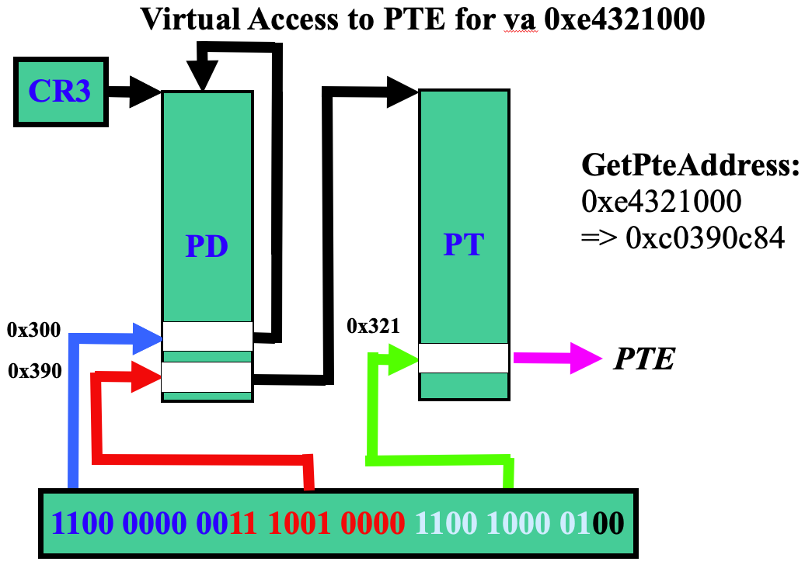

# 第七講 虛擬存儲：局部頁面置換算法

## 第1節 頁面置換算法的概念

## 第2節 最優/最近/最壞/先進先出/最近最久未使用 算法

## 第3節 時鐘置換算法和最不常用算法

## 第4節 Belady現象和局部置換算法比較

## 第5節 頁表自映射

### ref
http://os.cs.tsinghua.edu.cn/oscourse/OS2019spring/lecture09
http://os.cs.tsinghua.edu.cn/oscourse/OS2013/lecture05
20130326-lecture05-mm-instance.pptx
頁表自映射

http://inst.eecs.berkeley.edu/~cs61c/resources/su18_lec/Lecture7.pdf
RISC-V Instruction Formats

https://cseweb.ucsd.edu/classes/wi14/cse141/pdf/08/12_CSE141-MBT-Virtual-Memory.ppt.pdf
Virtual Memory 

#### 自映射改成線性映射
https://github.com/oscourse-tsinghua/rcore_plus/pull/50
這個PR記錄了從自映射改成線性映射的過程
我感覺你的這個問題，主要來自rust寫頁表的事。對嗎？

我感覺你的這個問題，主要來自rust寫頁表的不方便。對嗎？是的。
是語言的原因？感覺不是，C語言寫也會不方便

具體到頁表操作，riscv crate同時保留了兩種實現
https://github.com/rcore-os/riscv/tree/master/src/paging

multi_level.rs：線性映射
recursive.rs：自映射

在xy-plus/rcore-step-by-step裡也有自映射的頁表。。。
https://github.com/xy-plus/rcore_step_by_step_old
https://github.com/LearningOS/rcore_step_by_step
https://github.com/LearningOS/rcore_step_by_step/tree/master/os/crate/riscv/src/paging

似乎可以在這個commit裡面找到
https://github.com/LearningOS/rcore_step_by_step_old2/tree/f6e9d1603d0949dd2187e873ec38307e7d3c1f56

#### rCore代碼分析

/Users/xyong/github/rCore/crate/memory/src/paging/mock_page_table.rs
pub struct MockEntry

/Users/xyong/github/rCore/docs/2_OSLab/os2atc/ucore_os_in_rust.md
內存模塊——接口的Mock實現
實現一個仿真頁表，模擬地址轉換的過程，從數組中存取數據。

/Users/xyong/github/rCore/kernel/src/arch/riscv/paging.rs
PageTable
impl PageTable for PageTableImpl

Line 15:
target_arch = "riscv32"
type TopLevelPageTable<'a> = riscv::paging::Rv32PageTable<'a>;

/Users/xyong/github/rCore/kernel/src/arch/riscv/paging.rs
Line 285:
impl FrameAllocator for FrameAllocatorForRiscv

Line 30:
pub struct PageEntry

/Users/xyong/github/rCore/docs/1_OS/RISCV.md
set_recursive

READONLY_SHARED
contains
RESERVED2
RESERVED1

/Users/xyong/github/rCore/kernel/src/arch/aarch64/interrupt/context.rs
pub struct TrapFrame

/Users/xyong/github/rCore/crate/memory/src/paging/mod.rs
pub trait PageTable

/Users/xyong/github/rCore/kernel/src/arch/riscv/paging.rs
impl PageTable for PageTableImpl

use riscv::paging::{
    Mapper, PageTable as RvPageTable, PageTableEntry, PageTableFlags as EF, PageTableType,
    RecursivePageTable,
};

https://github.com/equation314/aarch64/blob/master/src/paging/page_table.rs
struct PageTableFlags

#### RecursivePageTable

/Users/xyong/github/rCore/kernel/src/arch/riscv/paging.rs
Line 50:
fn get_entry(&mut self, vaddr: usize) -> Option<&mut dyn Entry>

https://github.com/rcore-os/riscv
/Users/xyong/github/riscv/src/addr.rs
Line 252:
pub fn of_ppn(ppn: usize) -> Self

/Users/xyong/github/riscv/src/addr.rs
Line 72:
pub fn from_page_table_indices(p2_index: usize, p1_index: usize, offset: usize) -> Self

/Users/xyong/github/riscv/src/addr.rs
Line 235:
pub fn from_page_table_indices(p2_index: usize, p1_index: usize) -> Self

/Users/xyong/github/riscv/src/addr.rs
Line 4:
pub struct VirtAddr(usize)

Line 111:
pub struct PhysAddr(usize)

Line 41:
pub fn p2_index(&self) -> usize

Line 46:
pub fn p1_index(&self) -> usize

/Users/xyong/github/riscv/src/paging/recursive.rs
Line 174:
pub struct RecursivePageTable

#### PageEntry
/Users/xyong/github/rCore/kernel/src/arch/riscv/paging.rs
Line 74:
impl Entry for PageEntry 
Line 107:
fn set_target(&mut self, target: usize)

#### rust的代碼引用

/Users/xyong/github/rCore/kernel/src/arch/riscv/paging.rs
self.0.flags().contains(EF::DIRTY)
use crate::arch::interrupt::TrapFrame;

https://docs.rs/riscv/0.5.4/riscv/register/index.html

https://docs.rs/crate/riscv/0.5.4/source/src/register/scause.rs

/Users/xyong/github/rCore/kernel/src/arch/riscv/consts.rs
pub const KERNEL_OFFSET

https://doc.rust-lang.org/rust-by-example/mod/super.html

#### bitflags

https://docs.rs/bitflags/1.2.1/bitflags/

https://github.com/rcore-os/riscv/blob/master/src/paging/page_table.rs#L101
pub struct PageTableFlags
const RESERVED2

riscv32
dirty
sw_dirty
riscv::paging::Rv32PageTable

https://github.com/rcore-os/riscv/blob/master/src/paging/multi_level.rs
Line 8:
pub struct Rv32PageTable

#### 自映射頁表的初始化
/Users/xyong/github/riscv/src/paging/recursive.rs
Line 200:
impl<'a> Mapper for RecursivePageTable<'a>
Line 210:
pub fn new(table: &'a mut PageTable) -> Result<Self, NotRecursivelyMapped>

RecursivePageTable

rec_idx

recursive_index

/Users/xyong/github/rCore/docs/1_OS/RISCV.md

```rust
fn set_recursive(self: &mut PageTable, recursive_index: usize, frame: Frame)
```

我正在RecursivePageTable的代碼，沒有找到set_recursive()是在什麼時候執行的？recursive_index的取值是多少？ @王潤基 @More than xkcd #378 誰知道？

https://github.com/LearningOS/rcore_step_by_step_old/blob/master/xy_os/riscv-pk/bbl/bbl.c#L49

static void setup_page_table_sv32

這一部分初始化的代碼並沒有使用set_recursive，而是用C搞的。

### 頁表自映射

#### 基於4KB頁面的32位CPU二級頁表

https://cseweb.ucsd.edu/classes/wi14/cse141/pdf/08/12_CSE141-MBT-Virtual-Memory.ppt.pdf

Page 8:


#### 地址轉換的計算過程

20130326-lecture05-mm-instance.pptx
Page 10

計算過程圖


#### 頁表自映射機制


### X86-32頁表自映射

#### 基於4KB頁面的X86-32二級頁表

20130326-lecture05-mm-instance.pptx
Page 9

地址轉換和二級頁表的


#### X86-32頁表項結構

Ref: 20130326-lecture05-mm-instance.pptx
Page 17


#### 用C語言宏表示的地址轉換計算過程

20130326-lecture05-mm-instance.pptx
Page 11

```c
// page directory index
#define PDX(la) ((((uintptr_t)(la)) >> PDXSHIFT) & 0x3FF)
// page table index
#define PTX(la) ((((uintptr_t)(la)) >> PTXSHIFT) & 0x3FF)
// page number field of address
#define PPN(la) (((uintptr_t)(la)) >> PTXSHIFT)
// offset in page
#define PGOFF(la) (((uintptr_t)(la)) & 0xFFF)
```


#### X86-32的第一級頁表的自映射
20130326-lecture05-mm-instance.pptx
Page 23


#### X86-32的第二級頁表的自映射
20130326-lecture05-mm-instance.pptx
Page 24



#### X86-32自映射頁表項初始化
```C
// recursively insert boot_pgdir in itself
// to form a virtual pate table at virtual address VPT
boot_pgdir[PDX(VPT)] = PADDR(boot_pgdir) | PTE_P | PTE_W;
```
### riscv32頁表自映射

#### RISC-V Sv32的二級頁表

https://learningos.github.io/rcore_step_by_step_webdoc/docs/%E9%A1%B5%E8%A1%A8%E7%AE%80%E4%BB%8B.html
圖


#### RISC-V32頁表項結構

Ref: https://learningos.github.io/rcore_step_by_step_webdoc/docs/頁表簡介.html
riscv-privileged-20190608-1.pdf
Page 80:
Figure 4.15: Sv32 page table entry


riscv-privileged-20190608-1.pdf
Table 4.4: Encoding of PTE R/W/X fields.


#### rCore中riscv32的自映射

/Users/xyong/github/rCore/docs/1_OS/RISCV.md


RISCV頁表項中的flags，明確表示它指向的是數據頁（VRW），還是下層頁表（V）。
在訪問一級頁表虛地址期間，將它所對應的二級頁表項flags置為VRW。
訪問二級頁表本身，還需要再加一個自映射的二級頁表項，其flags為VRW。
