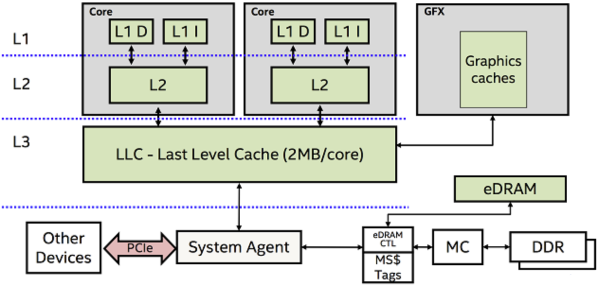
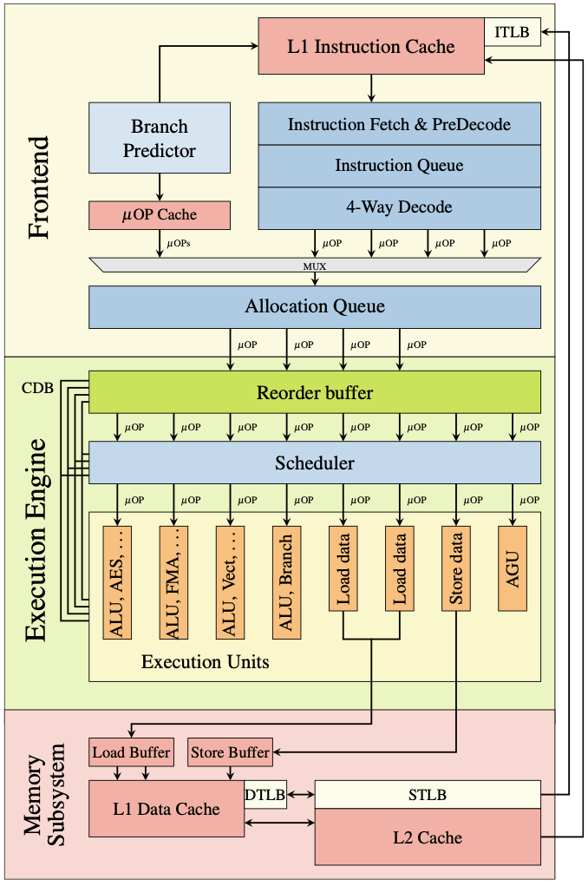
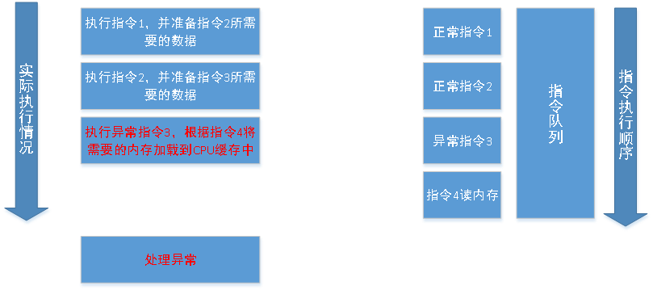
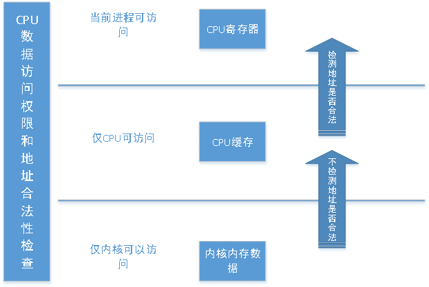
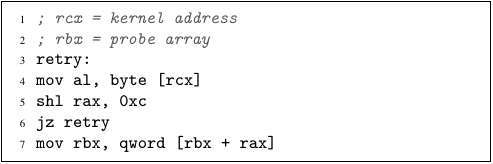
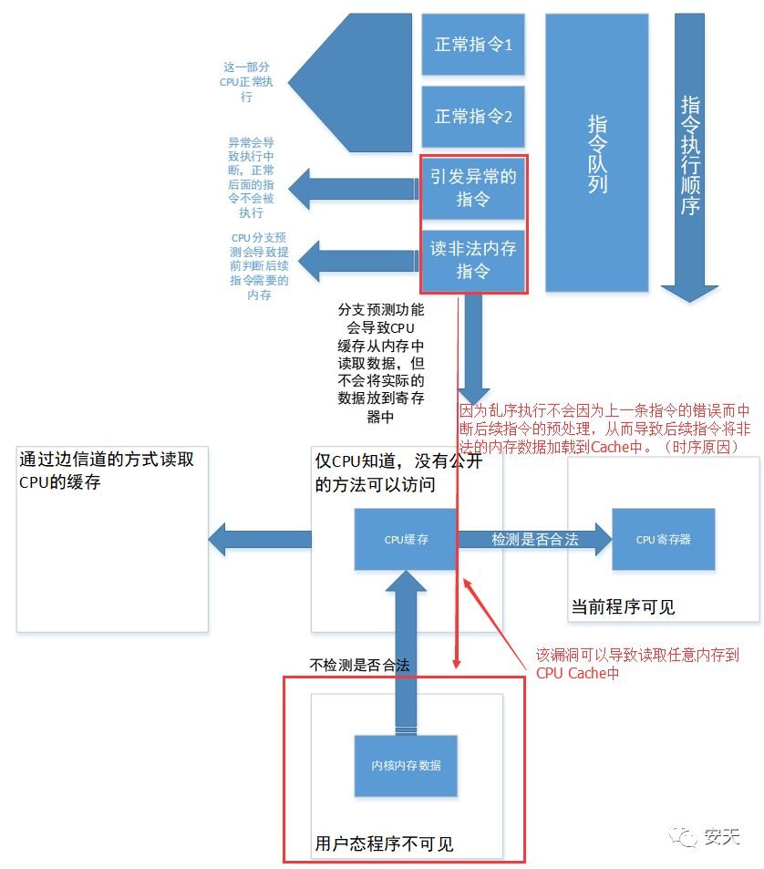
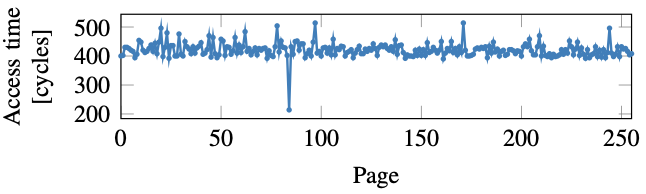
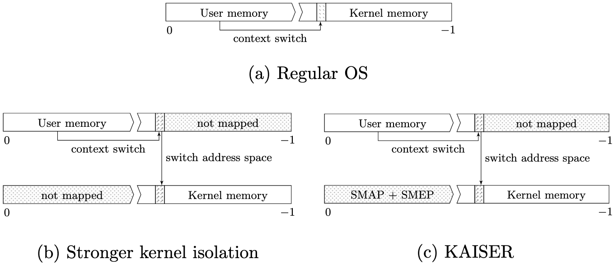
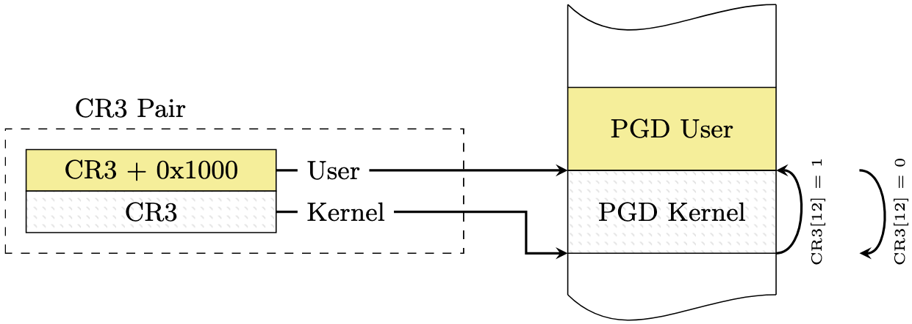

### 進程地址空間與熔斷(meltdown)漏洞

#### 歷史版本

[v1](https://github.com/LearningOS/os-lectures/blob/eeab82b9b9682d079b2ad7e63e522e48079d1098/lecture09/ref.md)

[v2](https://github.com/LearningOS/os-lectures/blob/9019d3ae3a8b18c6a0ec1a230652bf0f24714066/lecture09/ref.md)

#### ref

https://mp.weixin.qq.com/s/zlspXeDGlAEzVsq2h6gg8w
首發：Meltdown漏洞分析與實踐 （nice）

https://git.kernel.org/pub/scm/linux/kernel/git/torvalds/linux.git/commit/?id=694d99d40972f12e59a3696effee8a376b79d7c8
x86/cpu, x86/pti: Do not enable PTI on AMD processors

https://github.com/xyongcn/exploit/tree/master/meltdown
meltdown和spectre比較

https://github.com/21cnbao/meltdown-example
宋寶華： 用代碼切身實踐體會meltdown漏洞

[CPU Meltdown和Spectre漏洞分析](https://www.cnblogs.com/Shepherdzhao/p/8253421.html)

https://mp.weixin.qq.com/s/2FvvFUT8taRPv6GOHzNW-g
處理器A級漏洞Meltdown(熔燬)和Spectre(幽靈)分析報告 （nice：有幾個很好的圖示）

https://meltdownattack.com/meltdown.pdf
Meltdown: Reading Kernel Memory from User Space

https://spectreattack.com/spectre.pdf
Spectre Attacks: Exploiting Speculative Execution

Kernelpage-table isolation (KPTI)

https://lwn.net/Articles/741878/
The current state of kernel page-table isolation

https://gruss.cc/files/kaiser.pdf
KASLR is Dead: Long Live KASLR

https://www.zhihu.com/question/265012502?utm_medium=social&utm_source=wechat_session&from=groupmessage&isappinstalled=0
有幾個很好的圖。

Kernel page-tableisolation

http://voltjockey.com/

http://voltjockey.com/flies/paper/2.pdf
VoltJockey: Breaking SGX by Software-ControlledVoltage-Induced Hardware Faults

#### 背景

假設有abc三個地址，其中a地址沒有訪問的權限，但是b和c可以訪問，此時執行下面這個條件表達式：

x= a？b:c

表面看來，由於a地址無法訪問，所以系統會直接報錯！
但實際上，CPU為了加快執行速度，會採用多流水線作業方式。它會在檢查a是否可訪問的同時，預先就往下執行了。
等到權限檢查結果回來，已經根據a的結果完成了b或者c的加載，只是還沒有賦給x而已。經過加載的b或者c會在緩存裡。雖然報錯了，但如果再次訪問就會比較快。
於是再次訪問b和c，根據返回的時間快慢，就可以猜到a的內容！

#### CPU高速緩存結構(Intel Skylake)

[How Does CPU Cache Work?](https://www.makeuseof.com/tag/what-is-cpu-cache/)

https://mp.weixin.qq.com/s/zlspXeDGlAEzVsq2h6gg8w

各級存儲結構的訪問延遲

| 訪問類型            | 延遲           |
| ------------------- | -------------- |
| L1 cache命中        | 約4個時鐘週期  |
| L2 cache 命中       | 約10個時鐘週期 |
| L3 cache命中        | 約40個時鐘週期 |
| 訪問本地DDR         | 約60 納秒      |
| 訪問遠端內存節點DDR | 約100納秒      |

#### 指令執行的亂序優化(Intel Skylake)
https://meltdownattack.com/meltdown.pdf
Meltdown: Reading Kernel Memory from User Space
Figure 1: Simplified illustration of a single core of the Intel’s Skylake microarchitecture

https://www.zhihu.com/question/265012502?utm_medium=social&utm_source=wechat_session&from=groupmessage&isappinstalled=0

亂序執行可以簡單的分為三個階段

1. 獲取指令，解碼後存放到執行緩衝區Reservations Stations
2. 亂序執行指令，結果保存在一個結果序列中
3. 退休期Retired Circle，重新排列結果序列及安全檢查（如地址訪問的權限檢查），提交結果到寄存器

#### CPU異常指令執行

https://www.freebuf.com/vuls/159269.html
CPU異常指令執行

#### CPU數據訪問權限和地址合法性檢查

https://www.freebuf.com/vuls/159269.html
圖3 CPU數據訪問權限和地址合法性檢查

#### 熔斷漏洞(CVE-2017-5754)：利用過程

https://meltdownattack.com/meltdown.pdf
Meltdown: Reading Kernel Memory from User Space

 1. 接收者開闢一段2^8=256個page大小的內存(256*4096)作為probe array，並保證這部分內存未被緩存。
 2. 假設要訪問的非法內存的地址存在rcx, 通過mov指令讀取位於rcx地址的內存中的一個字節，存在rax中，這條指令將來會產生異常，然而在異常產生前，就可以通過transient instructions把讀取的內容發送出去：
 3. 假設讀取的值是i，那麼就在transient instructions裡面訪問probe array的第i*4096個元素，這會導致第i*4096個元素被緩存。
 4. 接收者通過測量所有的256個page的內存的訪問時間，就可以知道i的值了。

#### 熔斷漏洞：原理
https://mp.weixin.qq.com/s/2FvvFUT8taRPv6GOHzNW-g
圖4 漏洞原理圖

#### 熔斷漏洞：在用戶態讀取內核數據

https://meltdownattack.com/meltdown.pdf
Meltdown: Reading Kernel Memory from User Space
Figure 4

#### KPTI: Kernel page-table isolation
https://gruss.cc/files/kaiser.pdf
KASLR is Dead: Long Live KASLR
Fig. 2

(a) The kernel is mapped into the address space of every user process.
(b) Theoretical concept of stronger kernel isolation. It splits the address spacesand  only  interrupt  handling  code  is  mapped  in  both  address  spaces. 
(c)  Forcompatibility with x86 Linux, KAISER relies on SMAP to prevent invalid usermemory references and SMEP to prevent execution of user code in kernel mode.

supervisor-mode access prevention (SMAP) and supervisor-mode execution prevention (SMEP)

#### Shadow address space in KAISER
https://gruss.cc/files/kaiser.pdf
KASLR is Dead: Long Live KASLR
Fig. 3: Shadow address space

Kernel Address Isolation to have Side channels Efficiently Removed, KAISER

PML4 of user address space and kernel addressspace are placed next to each other in physical memory.

https://en.wikipedia.org/wiki/Kernel_page-table_isolation

#### “騎士” 漏洞（CVE-2019-11157）

http://voltjockey.com/flies/paper/2.pdf
VoltJockey: Breaking SGX by Software-ControlledVoltage-Induced Hardware Faults
Fig. 1.   Overview of our voltage-induced fault attack

動態電源管理模塊DVFS（Dynamic Voltage and Frequency Scaling）允許多核處理器根據負載信息採用相應的頻率和電壓運行，以降低處理器的功耗。
當一個核出現電壓和頻率不太匹配（如電壓偏低無法滿足較高頻率運行需求）時，系統就會出現短暫“故障”。
故障對系統行為結果的干擾會洩露出的系統行為信息。

