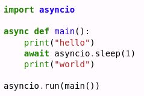
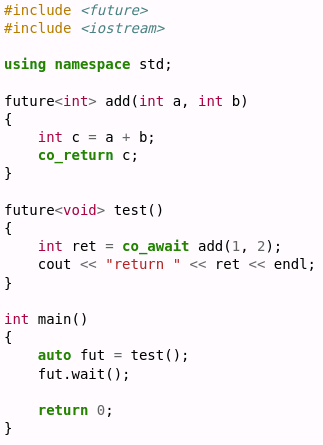
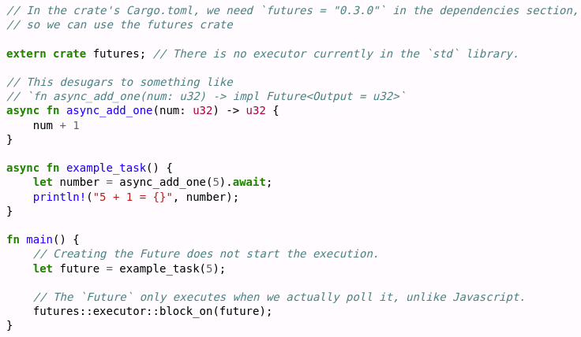
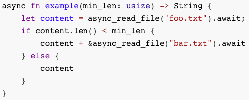
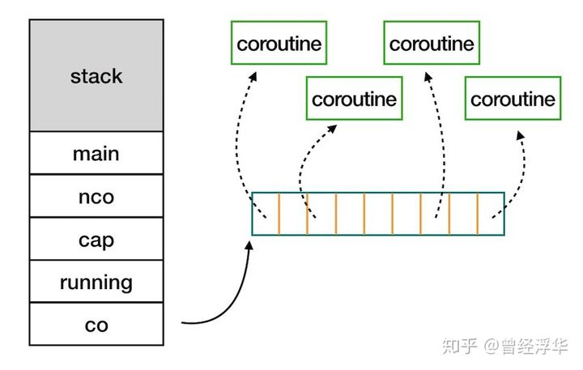
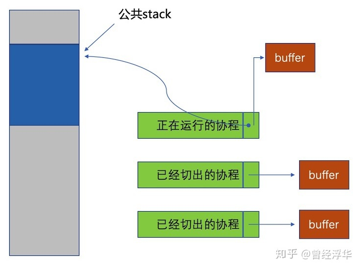
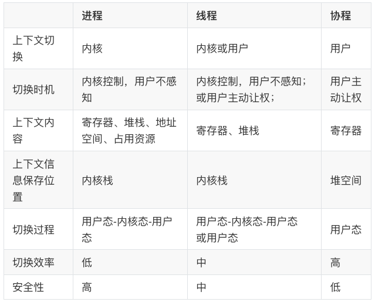

### 9.3 協程(coroutine)

* [v1](https://github.com/LearningOS/os-lectures/blob/f7d4a00f5a0d55b5240d33175b29d8f1ccce72aa/lecture09/slide-09-03.md)
* [v2](https://github.com/LearningOS/os-lectures/blob/a19431e2d7bf6d57f5616773478fba30551a8922/lecture09/slide-09-03.md)
* [v3](https://github.com/LearningOS/os-lectures/blob/9e6eb145a3381fb65a584531bae0f229a4030c05/lecture09/slide-09-03.md)
* v4

#### 協程引入

##### 問題[描述](https://os.phil-opp.com/async-await/#example)

多線程系統的併發執行效率仍然不高，特別是在一些併發線程數目較多且需要頻繁與外界進行交互中的短時等待場景。

##### 引入協程的目的

1. 提高線程內代碼執行的併發性能和穩定性
2. 代碼以順序性書寫：代碼邏輯易於理解，減弱異步調用複雜性，提高可維護性，方便錯誤排查。
3. 執行時則是異步調用：減少協程切換開銷，避免線程內的併發操作衝突，提高線程內代碼併發執行的性能。

#### 協程的概念

##### 協程

協程(Coroutine)是基於狀態機機制實現的允許在執行過程中主動暫停和恢復的異步函數實現機制。

* [ Design of a Separable Transition-Diagram Compiler](http://melconway.com/Home/pdf/compiler.pdf)：1963年關於協程的論文；
* 同步函數(ordinary function)：當一個函數是同步執行時，那麼當該函數被調用時不會立即返回，直到該函數所要做的事情全都做完了才返回。
* [異步函數](https://www.cnblogs.com/balingybj/p/4780442.html)(asynchronous function)：如果一個異步函數被調用時，該函數會立即返回；當該函數規定的操作任務完成時，通過回調、事件或消息機制將結果通知調用者。

##### 協程的模型描述

1. 狀態機：每個狀態是一個連續的代碼片段執行，狀態間是協程的切換；
2. 演員模型：併發和合作的演員模型。每個演員有自己的任務，自願地由調度器協調各演員的執行順序；
3. 生成器：可在指定位置暫停的執行流，由調度器遍歷協調執行順序；

#### 協程的例子

##### Python的協程示例

[Async/await](https://en.wikipedia.org/wiki/Async/await)：對多種支持異步的語言中給出協程的示例程序；

##### C++的協程示例

##### Rust協程示例

#### 協程的工作原理

##### 協程的工作原理

當協程在執行中出現阻塞時，由協程調度器主動保存當前棧上數據，讓出權給其他可以執行的協程；阻塞完後再通過協程調度器恢復棧上數據，並恢復原協程的執行。

* yield，將控制權返還給協程A的創建協程
* resume，將控制權交給一個子協程

##### 協程的狀態機[描述](https://os.phil-opp.com/async-await/#the-async-await-pattern)

##### 支持協程的線程堆棧結構

##### 協程切換

協程運行需要棧空間，所有協程公用一塊大的棧空間。當協程切出時，把自己的棧內容拷貝，當控制權再次切回時，把自己的棧內容還原到公共棧空間。

* 每個協程單獨申請一塊棧空間，就是用戶線程。
* 與協程相比，用戶線程的單獨棧空間過小會棧溢出；太大則浪費嚴重。 

#### 進程、線程和協程

##### [協程與函數](https://zh.wikipedia.org/wiki/%E5%8D%8F%E7%A8%8B)

* 函數可以調用其他函數，調用函數等待被調用函數結束後繼續執行；協程可以調用其他協程，但調用協程在等待被調用協程結束前可以執行其他協程。
* 函數的入口點是唯一的，函數被調用時是從入口點開始執行；協程可有多個入口點，協程被調用時是第一個入口點開始執行，每個暫停返回出口點都是再次被調用執行時的入口點。
* 函數在結束時一次性返回全部結果；協程在暫停返回時可返回部分結果。

##### [協程與線程](https://www.cnblogs.com/theRhyme/p/14061698.html)

1. 協程的開銷遠遠小於線程的開銷：不需要獨立的棧空間；切換時需要保存和恢復的數據少；
2. 在多核處理器的環境下, 多個線程是可並行的；協程是併發的，任何時刻同一線程內只有一個協程在執行，其他協程處於暫停狀態。
3. 線程切換可以是搶先式或非搶先式；而同線程內的協程切換隻有非搶先式。

##### 進程、線程和協程[比較](https://www.cnblogs.com/theRhyme/p/14061698.html)

