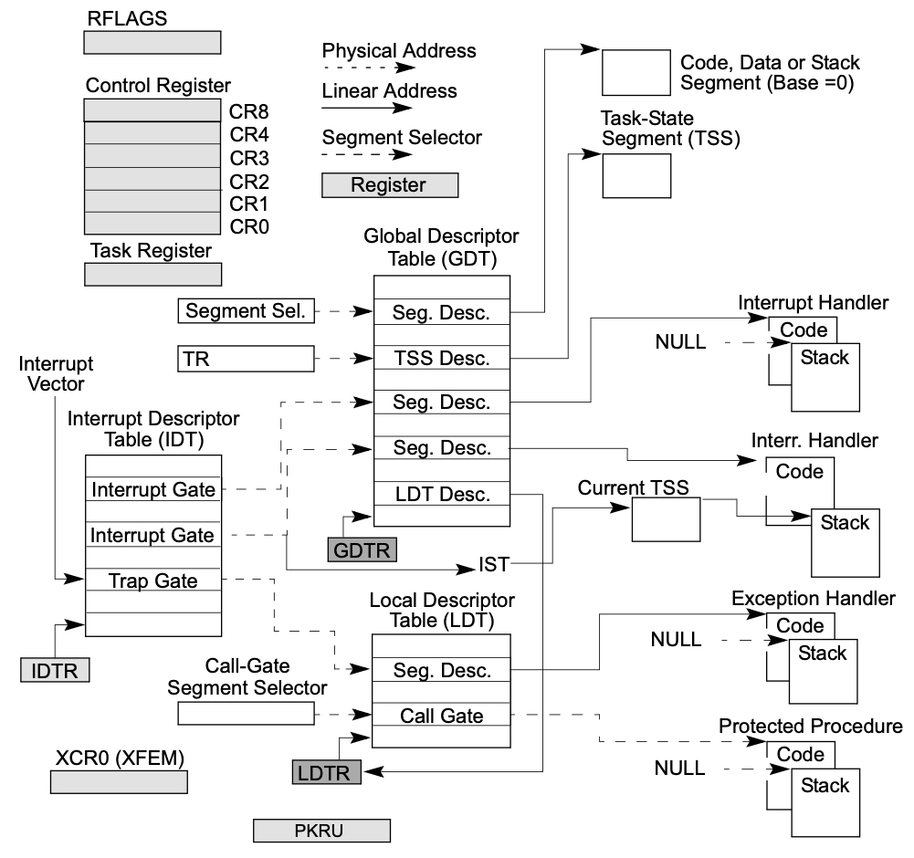
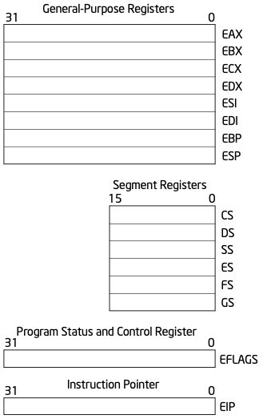
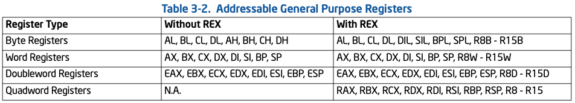
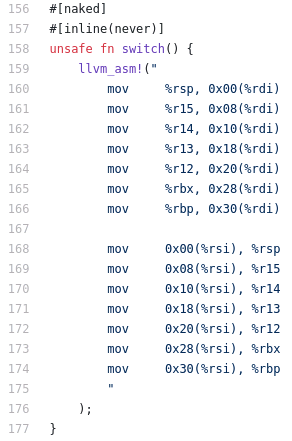
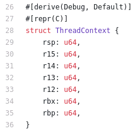
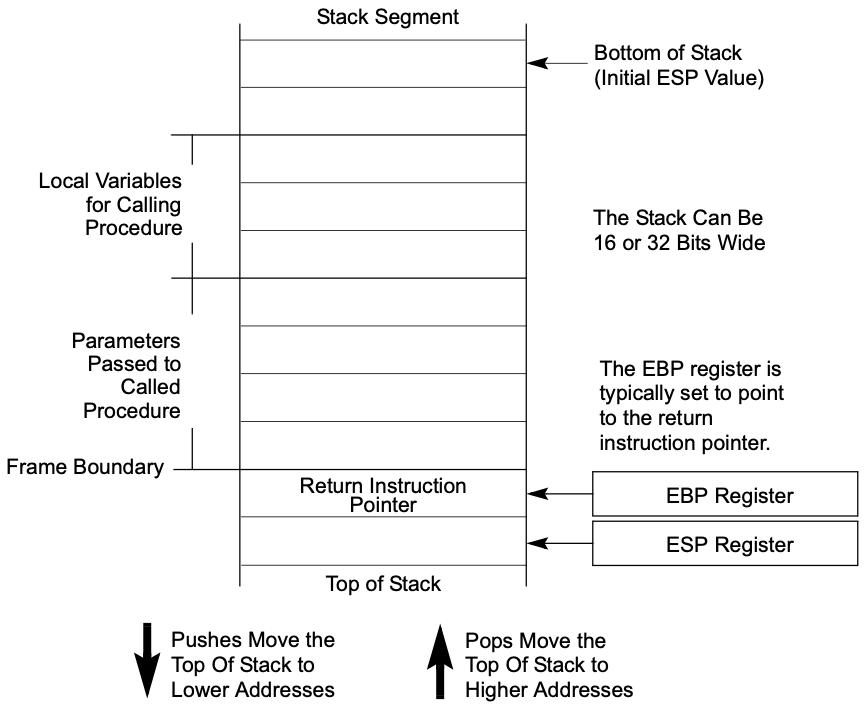
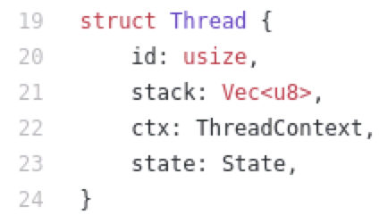
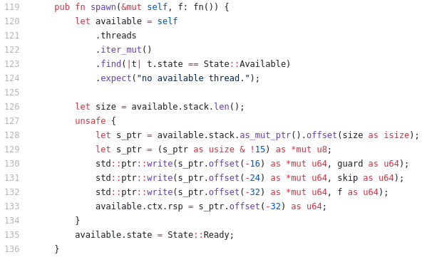
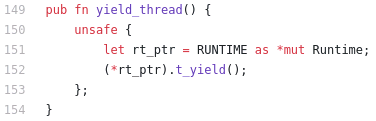
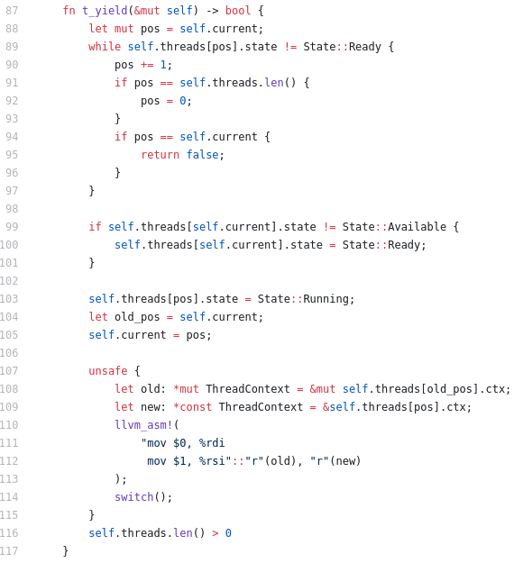

## 第十講 進程、線程和協程的實現

 * [v1](https://github.com/LearningOS/os-lectures/blob/819ca469608126937276764cf6be6c8bdb35e96c/lecture10/ref.md)
 * [v2](https://github.com/LearningOS/os-lectures/blob/be99e6e30b6210810d0dc310fedc9f743bf4ecab/lecture10/ref.md)
 * [v3](https://github.com/LearningOS/os-lectures/blob/faf60c62ccdd5260797c0ca9ad222dd218c4e13e/lecture10/ref.md)
 * v4

### 10.1 進程的實現

#### 1. 進程切換

[PPT講義](http://os.cs.tsinghua.edu.cn/oscourse/OS2015/lecture12?action=AttachFile&do=get&target=12-1.pptx)
#### 2. 進程創建

[PPT講義](http://os.cs.tsinghua.edu.cn/oscourse/OS2015/lecture12?action=AttachFile&do=get&target=12-2.pptx)

#### 3. 進程加載

[PPT講義](http://os.cs.tsinghua.edu.cn/oscourse/OS2015/lecture12?action=AttachFile&do=get&target=12-3.pptx)
#### 4. 進程等待與退出

[PPT講義](http://os.cs.tsinghua.edu.cn/oscourse/OS2015/lecture12?action=AttachFile&do=get&target=12-4.pptx)

#### 5. rCore進程和線程控制

[PDF講義](https://os.cs.tsinghua.edu.cn/oscourse/OS2020spring/lecture10?action=AttachFile&do=view&target=slide-10-05.pdf)

### 10.2 線程的實現

[Green Threads Explained in 200 Lines of Rust...](https://cfsamson.gitbook.io/green-threads-explained-in-200-lines-of-rust/)

[完整源代碼](https://github.com/cfsamson/example-greenthreads)

#### 1. 與CPU架構相關信息

[兩百行Rust代碼解析綠色線程原理（一）緒論及基本概念](https://zhuanlan.zhihu.com/p/100058478)

用戶線程調度是非搶佔式的；

CPU體系結構：寄存器

[Combined Volume Set of Intel® 64 and IA-32 Architectures Software Developer’s Manuals](https://software.intel.com/content/www/us/en/develop/articles/intel-sdm.html#combined)

System-Level Registers and Data Structures in IA-32e Mode

出處：[325462-sdm-vol-1-2abcd-3abcd.pdf](https://software.intel.com/content/dam/develop/external/us/en/documents-tps/325462-sdm-vol-1-2abcd-3abcd.pdf) P2859

出處：[325462-sdm-vol-1-2abcd-3abcd.pdf](https://software.intel.com/content/dam/develop/external/us/en/documents-tps/325462-sdm-vol-1-2abcd-3abcd.pdf) P76 Figure 3-4. General System and Application Programming Registers

出處：[325462-sdm-vol-1-2abcd-3abcd.pdf](https://software.intel.com/content/dam/develop/external/us/en/documents-tps/325462-sdm-vol-1-2abcd-3abcd.pdf) P77 Table 3-2. Addressable General Purpose Registers

彙編語言

#### 2. 線程上下文和線程棧

[兩百行Rust代碼解析綠色線程原理（二）一個能跑通的例子](https://zhuanlan.zhihu.com/p/100846626)

線程上下文[數據結構](https://github.com/cfsamson/example-greenthreads/blob/master/src/main.rs#L28)`ThreadContext`

[兩百行Rust代碼解析綠色線程原理（三）棧](https://zhuanlan.zhihu.com/p/100964432)

棧空間大小

1. 現代操作系統中啟動進程時，標準棧大小通常為8MB；
2. 可能出現“棧溢出”；
3. 當我們自己控制棧時，我們可以選擇我們想要的大小；
4. 可增長棧：當棧空間用完時，會分配一個更大的棧並將棧內容移到更大的棧上，並恢復程序繼續執行，不會導致棧溢出；（Go 語言）

棧佈局

出處：[325462-sdm-vol-1-2abcd-3abcd.pdf](https://software.intel.com/content/dam/develop/external/us/en/documents-tps/325462-sdm-vol-1-2abcd-3abcd.pdf) P152 Figure 6-1. Stack Structure

#### 3. 線程控制塊和運行時支持

[兩百行Rust代碼解析綠色線程原理（四）一個綠色線程的實現](https://zhuanlan.zhihu.com/p/101061389)

[裸函數](https://docs.microsoft.com/zh-cn/cpp/c-language/naked-functions?view=msvc-160)naked_functions：為了與編譯器協調處理函數調用和中斷處理中棧的使用，而定義的一個約定。它僅影響函數的 prolog 和 epilog 序列的編譯器代碼生成的性質。

線程控制塊[數據結構](https://github.com/cfsamson/example-greenthreads/blob/master/src/main.rs#L19)`Thread`

線程[運行時](https://github.com/cfsamson/example-greenthreads/blob/master/src/main.rs#L49)支持`Runtime`
new
run
t_return
t_yield

#### 4. 用戶線程API和線程切換

[線程API](https://github.com/cfsamson/example-greenthreads/blob/master/src/main.rs#L119)
spawn

yield_thread

[線程切換](https://github.com/cfsamson/example-greenthreads/blob/master/src/main.rs#L158)`switch`

#### 5. 用戶線程的操作系統依賴

[兩百行Rust代碼解析綠色線程原理（五）附錄：支持 Windows](https://zhuanlan.zhihu.com/p/101168659)

示例適用於 OSX、Linux 和 Windows

Windows棧

### 10.3 協程的實現

協程的實現([200行代碼講透RUST FUTURES](https://stevenbai.top/rust/futures_explained_in_200_lines_of_rust/))

#### 1. Rust語言中的Future

21.1 Background [PDF講義](https://os.cs.tsinghua.edu.cn/oscourse/OS2020spring/lecture21?action=AttachFile&do=view&target=slide-21-01.pdf)
21.2 Futures in Rust [PDF講義](https://os.cs.tsinghua.edu.cn/oscourse/OS2020spring/lecture21?action=AttachFile&do=view&target=slide-21-02.pdf)

#### 2. Generator機制和async/await語言機制

21.3 Generators and async/await [PDF講義](https://os.cs.tsinghua.edu.cn/oscourse/OS2020spring/lecture21?action=AttachFile&do=view&target=slide-21-03.pdf)

#### 3. Self-Referential Structs & Pin機制

21.4 Self-Referential Structs & Pin [PDF講義](https://os.cs.tsinghua.edu.cn/oscourse/OS2020spring/lecture21?action=AttachFile&do=view&target=slide-21-04.pdf)

#### 4. Waker 和 Reactor 機制21.5 Waker and Reactor [PDF講義](https://os.cs.tsinghua.edu.cn/oscourse/OS2020spring/lecture21?action=AttachFile&do=view&target=slide-21-05.pdf)

### 課後思考題

1. 在RISC-V上用C或Rust語言實現用戶線程支持庫；
2. 在Window、Linux和Mac OS上利用可用的語言和已有的操作系統支持，寫一個測例程序，比較各系統下創建進程、線程和協程的最大值和上下文切換開銷。