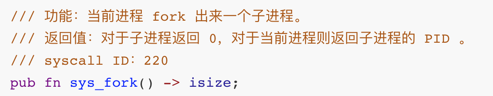
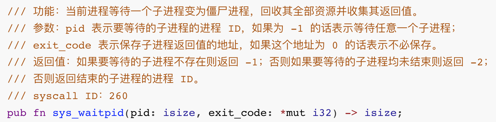
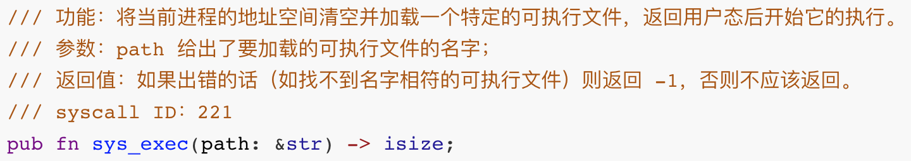
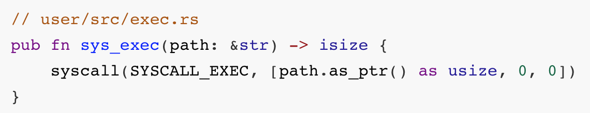
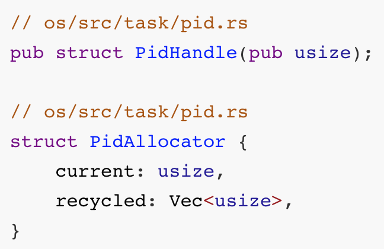
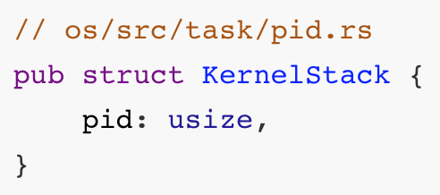
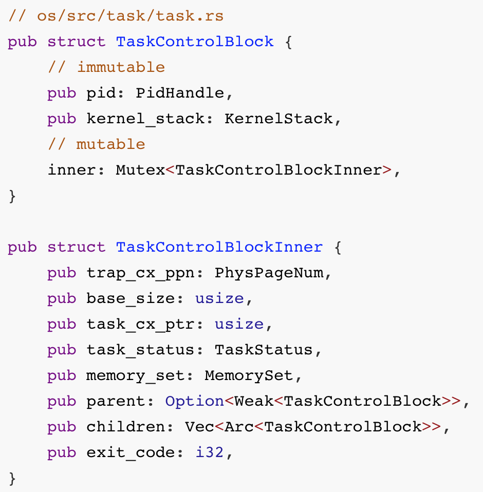
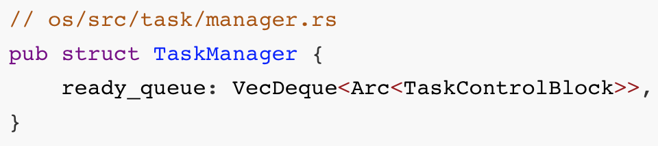
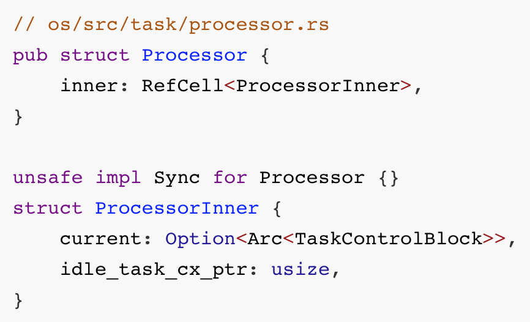
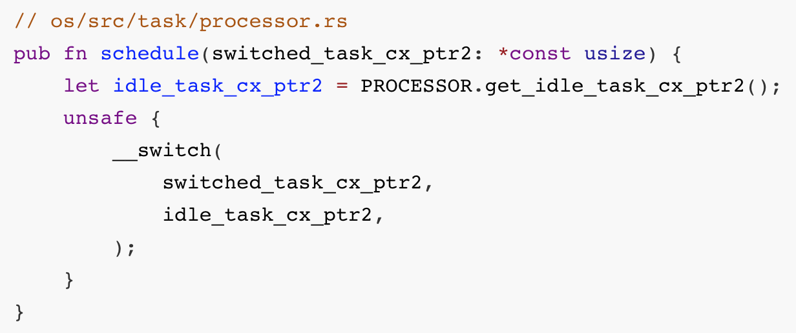

## rCore進程管理

* [v1](https://github.com/LearningOS/os-lectures/blob/d3a86df7dd85020cc35dacebd4f438619d25355b/lecture10/slide-10-02.md)
* [v2](https://github.com/LearningOS/os-lectures/blob/e096bea06a5b054aa9b87ffde6373c0a4cb3cda7/lecture10/slide-10-02.md)
* v3

### [rCore中的進程管理系統調用](https://rcore-os.github.io/rCore-Tutorial-Book-v3/chapter5/1process.html#id4)

#### `fork`

* 內核會創建一個子進程
* 子進程和調用 `fork` 父的進程在返回用戶態時的狀態幾乎完全相同：為子進程創建一個和父進程幾乎完全相同的應用地址空間。
* 父子進程的系統調用返回值`a0` 寄存器內容不同

#### `waitpid`

* 進程通過 `exit` 系統調用退出後，無法立即全部地回收所佔用資源
  * 內核棧
* 父進程通過 `waitpid` 系統調來獲取子進程的返回狀態並回收所佔據的全部資源，從而徹底銷燬子進程
  * 回收子進程的資源並收集它的一些信息

#### `exec`

* 執行不同的可執行文件：加載一個新的 ELF 可執行文件替換原有的應用地址空間並開始執行。
* `path` 作為 `&str` 類型是一個胖指針

調用方法

#### `exit`

* 進程退出：當應用調用 `sys_exit` 系統調用主動退出或者出錯由內核終止之後，會在內核中調用 `exit_current_and_run_next` 函數退出當前任務並切換到下一個。

用戶初始程序-initproc

外殼程序-user_shell

### 進程管理的核心數據結構

#### 進程標識符

#### 內核棧

#### 進程控制塊

#### 任務管理器

#### 處理器監視器

### 任務切換

