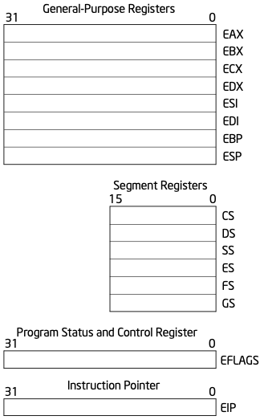
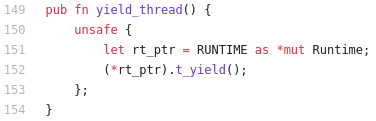

### 10.2 用戶線程的實現

參考文獻：

1. [Green Threads Explained in 200 Lines of Rust...](https://cfsamson.gitbook.io/green-threads-explained-in-200-lines-of-rust/)
2. [完整源代碼](https://github.com/cfsamson/example-greenthreads)
3. 知乎上的中文版本：[兩百行Rust代碼解析綠色線程原理（四）一個綠色線程的實現](https://zhuanlan.zhihu.com/p/101061389)

#### 1. 線程與CPU架構

##### CPU體系結構

用戶線程調度是非搶佔式的；

CPU體系結構：通用寄存器

出處：[Combined Volume Set of Intel® 64 and IA-32 Architectures Software Developer’s Manuals](https://software.intel.com/content/www/us/en/develop/articles/intel-sdm.html#combined)、[325462-sdm-vol-1-2abcd-3abcd.pdf](https://software.intel.com/content/dam/develop/external/us/en/documents-tps/325462-sdm-vol-1-2abcd-3abcd.pdf) P76 Figure 3-4. General System and Application Programming Registers

出處：[325462-sdm-vol-1-2abcd-3abcd.pdf](https://software.intel.com/content/dam/develop/external/us/en/documents-tps/325462-sdm-vol-1-2abcd-3abcd.pdf) P77 Table 3-2. Addressable General Purpose Registers

##### X86彙編語言

#### 2. 線程上下文和線程棧

##### 線程上下文[數據結構](https://github.com/cfsamson/example-greenthreads/blob/master/src/main.rs#L28)`ThreadContext`

##### 棧空間大小

1. 現代操作系統中啟動進程時，標準棧大小通常為8MB；
2. 可能出現“棧溢出”；
3. 當我們自己控制棧時，我們可以選擇我們想要的大小；
4. 可增長棧：當棧空間用完時，會分配一個更大的棧並將棧內容移到更大的棧上，並恢復程序繼續執行，不會導致棧溢出；（Go 語言）

##### 棧佈局

出處：[325462-sdm-vol-1-2abcd-3abcd.pdf](https://software.intel.com/content/dam/develop/external/us/en/documents-tps/325462-sdm-vol-1-2abcd-3abcd.pdf) P152 Figure 6-1. Stack Structure

#### 3. 線程控制塊和運行時支持

##### 線程控制塊[數據結構](https://github.com/cfsamson/example-greenthreads/blob/master/src/main.rs#L19)`Thread`

[裸函數](https://docs.microsoft.com/zh-cn/cpp/c-language/naked-functions?view=msvc-160)naked_functions：為了與編譯器協調處理函數調用和中斷處理中棧的使用，而定義的一個約定。它僅影響函數的 prolog 和 epilog 序列的編譯器代碼生成的性質。

##### 線程[運行時](https://github.com/cfsamson/example-greenthreads/blob/master/src/main.rs#L49)支持`Runtime`

new
run
t_return
t_yield

#### 4. 用戶線程API和線程切換

##### [線程API](https://github.com/cfsamson/example-greenthreads/blob/master/src/main.rs#L119)：`spawn`

##### [線程API](https://github.com/cfsamson/example-greenthreads/blob/master/src/main.rs#L119)：yield_thread

##### [線程切換](https://github.com/cfsamson/example-greenthreads/blob/master/src/main.rs#L158)`switch`

用戶線程的操作系統依賴：示例適用於 OSX、Linux 和 Windows

