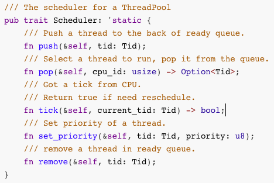
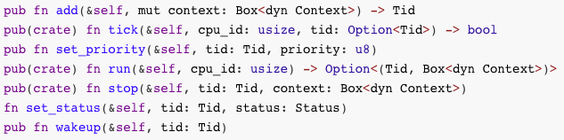
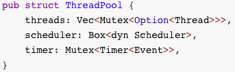
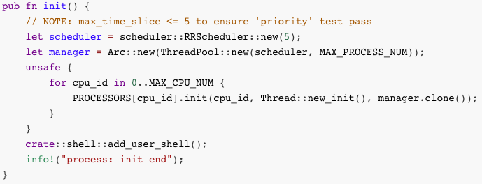
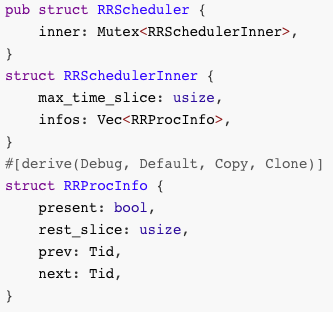
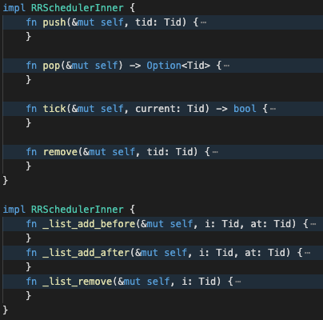

## 20200319-第十一講準備
2020春,操作系統課,準備
第十一講 處理機調度

[v1](https://github.com/LearningOS/os-lectures/blob/2ee6a37e314bd4fe2e9d57899b66d5cacd0ebada/lecture11/ref.md)

[v2](https://github.com/LearningOS/os-lectures/blob/3b6dbf6f3fca2abceed7a872b773d1c1758d5880/lecture11/ref.md)

### ref

http://os.cs.tsinghua.edu.cn/oscourse/OS2019spring/lecture15
2019年第十五講 處理機調度

rCore調度框架

### 11.1 處理機調度概念 
### 11.2 調度準則 
### 11.3 先來先服務、短進程優先和最高響應比優先調度算法 
### 11.4 時間片輪轉、多級反饋隊列、公平共享調度算法和ucore調度框架 
### 11.5 實時調度
### 11.6 優先級反置 
### 11.7 rCore調度框架和時間片輪轉調度算法

#### 調度框架與線程控制
/Users/xyong/github/rcore-thread/src/scheduler/mod.rs
pub trait Scheduler: 'static



```rust
/// The scheduler for a ThreadPool
pub trait Scheduler: 'static {
    /// Push a thread to the back of ready queue.
    fn push(&self, tid: Tid);
    /// Select a thread to run, pop it from the queue.
    fn pop(&self, cpu_id: usize) -> Option<Tid>;
    /// Got a tick from CPU.
    /// Return true if need reschedule.
    fn tick(&self, current_tid: Tid) -> bool;
    /// Set priority of a thread.
    fn set_priority(&self, tid: Tid, priority: u8);
    /// remove a thread in ready queue.
    fn remove(&self, tid: Tid);
}
```

/Users/xyong/github/rcore-thread/src/thread_pool.rs
self.scheduler.
與調度相關的線程控制函數



```rust
pub fn add(&self, mut context: Box<dyn Context>) -> Tid
pub(crate) fn tick(&self, cpu_id: usize, tid: Option<Tid>) -> bool
pub fn set_priority(&self, tid: Tid, priority: u8)
pub(crate) fn run(&self, cpu_id: usize) -> Option<(Tid, Box<dyn Context>)>
pub(crate) fn stop(&self, tid: Tid, context: Box<dyn Context>)
fn set_status(&self, tid: Tid, status: Status)
pub fn wakeup(&self, tid: Tid)
```
#### 調度數據結構

/Users/xyong/github/rcore-thread/src/scheduler/mod.rs
pub trait Scheduler: 'static
調度算法接口

/Users/xyong/github/rcore-thread/src/thread_pool.rs
pub struct ThreadPool
線程池數據結構
記錄調度算法相關信息和參數；



```rust 
pub struct ThreadPool {
    threads: Vec<Mutex<Option<Thread>>>,
    scheduler: Box<dyn Scheduler>,
    timer: Mutex<Timer<Event>>,
}
```

/Users/xyong/github/rCore/kernel/src/process/mod.rs
pub fn init()
初始化函數
指定調度算法；
初始化線程池；



```rust
pub fn init() {
    // NOTE: max_time_slice <= 5 to ensure 'priority' test pass
    let scheduler = scheduler::RRScheduler::new(5);
    let manager = Arc::new(ThreadPool::new(scheduler, MAX_PROCESS_NUM));
    unsafe {
        for cpu_id in 0..MAX_CPU_NUM {
            PROCESSORS[cpu_id].init(cpu_id, Thread::new_init(), manager.clone());
        }
    }
    crate::shell::add_user_shell();
    info!("process: init end");
}
```

#### 時間片輪轉調度算法

/Users/xyong/github/rcore-thread/src/scheduler/rr.rs
pub struct RRScheduler RR調度算法數據結構
struct RRSchedulerInner 線程雙向鏈表表頭數據結構
struct RRProcInfo 線程雙向鏈表節點數據結構



```rust
pub struct RRScheduler {
    inner: Mutex<RRSchedulerInner>,
}
struct RRSchedulerInner {
    max_time_slice: usize,
    infos: Vec<RRProcInfo>,
}
#[derive(Debug, Default, Copy, Clone)]
struct RRProcInfo {
    present: bool,
    rest_slice: usize,
    prev: Tid,
    next: Tid,
}
```
impl RRSchedulerInner
具體的調度接口實現函數




#### 時間片用完時的線程調度和切換過程

/Users/xyong/github/rCore/kernel/src/arch/riscv/interrupt.rs
pub extern "C" fn rust_trap(tf: &mut TrapFrame)
Trap::Interrupt(I::SupervisorTimer) => timer(),

/Users/xyong/github/rCore/kernel/src/trap.rs
pub fn timer()
processor().tick();

/Users/xyong/github/rcore-thread/src/processor.rs
pub fn tick(&self)
let need_reschedule = self.manager().tick(self.inner().id, tid);

/Users/xyong/github/rcore-thread/src/processor.rs
pub(crate) fn yield_now(&self)
.switch_to(&mut *inner.loop_context);

```rust
/Users/xyong/github/rCore/kernel/src/arch/riscv/interrupt.rs
	pub extern "C" fn rust_trap(tf: &mut TrapFrame)
/Users/xyong/github/rCore/kernel/src/trap.rs
	pub fn timer()
/Users/xyong/github/rcore-thread/src/processor.rs
	pub fn tick(&self)
/Users/xyong/github/rcore-thread/src/processor.rs
	pub(crate) fn yield_now(&self)
```

