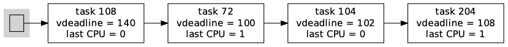
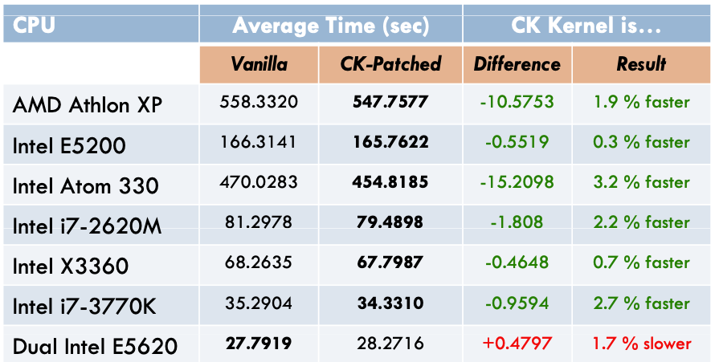
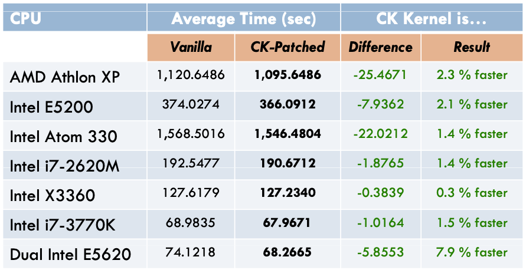

## BFS算法
### 幻燈片

#### BFS數據結構
https://www.cs.unm.edu/~eschulte/classes/cs587/data/bfs-v-cfs_groves-knockel-schulte.pdf
BFS vs.CFS Scheduler Comparison

P7: Figure4: BFS data structure

在多處理機情況的單就緒隊列（雙向鏈表）選擇，增加了隊列互斥訪問的開銷，但減少了負載均衡算法開銷。

#### BFS工作原理

http://vellvisher.github.io/papers_reports/doc/BFS_FreeBSD.pdf
Analysis of the BFS Scheduler in FreeBSD

BFS調度算法是一種時間片輪轉算法的變種。

##### 單就緒隊列

1. 所有CPU共享一個雙向鏈表結構的單就緒隊列；
2. 所有線程按優先級排隊；
3. 相同優先級的每個線程有一個時間片長度和虛擬最長等待時間；

##### 時間片大小選擇

由算法參數指定，可在1ms到1000ms間選擇，缺省設置為6ms；

##### 虛擬截止時間（Virtual Deadline）

 1. 它是一個關於就緒隊列中線程等待CPU最長時間的排序，並不是真實的截止時間；
 2. 為了讓線程在上次運行的CPU上運行，不同CPU對線程的虛擬截止時間加一個權重；
  3. 線程時間片用完時，重新計算虛擬截止時間；
  4. 事件等待結束時，虛擬截止時間保持不變，以搶先相同優先級的就緒線程；

##### 線程優先級

BFS有103個優先級，其中100個靜態的實時優先級，3個普通優級SCHEDISO (isochronous)、SCHEDNORMAL和SCHEDIDLEPRIO (idle priority scheduling)；

##### 相關線程狀態置換

時間片用完：重新設置虛擬截止時間後，插入就緒隊列；

事件等待結束：虛擬截止時間保持不變，搶先低優先級線程或插入就緒隊列；

##### 虛擬截止時間計算

依據當前時間、線程優先級和時間片設置計算；

offset = jiffies + (prior_atio ∗ rr_interval)
prioratio increases by 10% for every nice level

虛擬截止時間計算結果： https://wikimili.com/en/Brain_Fuck_Scheduler

#### BFS與CFS的性能對比(2012)
http://repo-ck.com/bench/cpu_schedulers_compared.pdf
CPU SCHEDULERS COMPARED

##### 測試用例集

1. Linux kernel v3.6.2.2的GCC編譯
2. Linux kernel v3.6.2內核源代碼樹的lrzip壓縮
3. 從720p到360p的MPEG2視頻ffmpeg壓縮

##### 測試硬件環境

##### 壓縮測試

##### 編譯測試

##### 視頻編碼測試

### ref

https://www.cs.unm.edu/~eschulte/classes/cs587/data/bfs-v-cfs_groves-knockel-schulte.pdf
BFS vs. CFS - SchedulerComparison

cpu-sched-multi.pdf - 10.6 Linux Multiprocessor Schedulers - BF Scheduler (BFS)

https://wikimili.com/en/Brain_Fuck_Scheduler
Brain Fuck Scheduler

https://www.cs.mcgill.ca/~mxia3/pdfs/Case_study__formal_verification_of_the_brain_fuck_scheduler.pdf
Formal verification of the Brain Fuck Scheduler

https://www.linux-magazine.com/Online/News/Con-Kolivas-Introduces-New-BFS-Scheduler
Con Kolivas Introduces New BFS Scheduler

http://ck.kolivas.org/patches/bfs/bfs-faq.txt
FAQS about BFS

http://ck.kolivas.org/
The BFS patch along with benchmark diagrams and other details are on ck.kolivas.org.

https://wikimili.com/en/Brain_Fuck_Scheduler
Brain Fuck Scheduler

##### BFS vs.CFS Scheduler Comparison
https://www.cs.unm.edu/~eschulte/classes/cs587/data/bfs-v-cfs_groves-knockel-schulte.pdf
BFS vs.CFS Scheduler Comparison

P7: Figure4: BFS data structure

BFS has only one system-wide runqueue containing all non-running tasks.
BFS removes the need for these complicated heuristics and algorithms by using a single system-wide queue to determine the next scheduled task.
BFS implements an earliest effective virtual deadline first policy and keeps track of the  virtual deadline of each task.
P7：這一段文字大致描述了BFS的思路：只使用一個隊列；所有線程按優先級排隊；相同優先級的每個線程有一個時間片長度和虛擬最長等待時間；線程時間片用完時，重新計算時間片長度；線程進入等待狀態時，等待時間保持；為了讓線程在上次運行的CPU上運行，不同CPU對線程的虛擬截止時間加一個權重；

##### BFS的算法描述

##### wikimili

https://wikimili.com/en/Brain_Fuck_Scheduler
Brain Fuck Scheduler

BFS uses a doubly linked list data structure.
The execution behavior is still a weighted variation of the Round-Robin Scheduler

virtual deadline formula

##### 新加坡的項目報告

http://vellvisher.github.io/papers_reports/doc/BFS_FreeBSD.pdf
Analysis of the BFS Scheduler in FreeBSD

###### Single Runqueue

single run-queue which is a double linked list shared by all the CPU’s

###### Interactivity

I/O Bound tasks or interactive tasks are decided basis on thefact that the tasks which wake uphave not used their quota of CPU time and have earlier effectivedeadlines making them likelyto preempt CPU bound tasks of same priority.

###### Round Robin Interval

This is the only tunable value and it is set to 6ms by default with a range from 1ms to 1000ms.

###### Task Insertion

The task is inserted as an O(1) insertion to the double link list run-queue.
Thelookup is O(n) in the worst casewhere n is the number of CPUs on the system.

###### Task Lookup

BFS has 103 priority queues with 100 dedicated to the static priority of realtime tasks, and theremaining 3 are, in order of best to worst priority, SCHEDISO (isochronous), SCHEDNORMAL,and SCHEDIDLEPRIO (idle priority scheduling).

a bitmap of running priorities
the lookup is O(n) in the worst case, where n is the totalnumber of CPUs.

###### Task Switching

Time Slice:  its time slicereplenished and the virtual deadline reset
Sleep: virtual deadline remain the same and the same values will be used again
Preemption: higher priority than a currently running task on any CPUs.

###### Virtual Deadline

no guarantee
a quota (time slice)equal to the rr_interval and a virtual deadline.

The virtual deadline is offset from the current time in jiffies.
jiffies + (prior_atio ∗ rr_interval)
prioratio increases by 10% for every nice level

##### BFS的性能分析
http://repo-ck.com/bench/cpu_schedulers_compared.pdf
CPU SCHEDULERS COMPARED