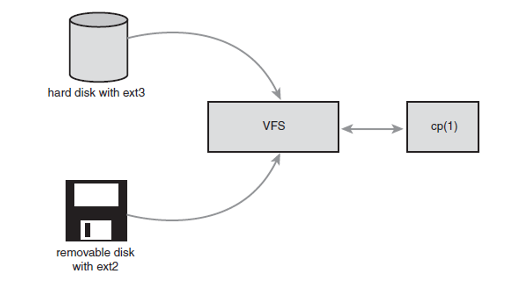
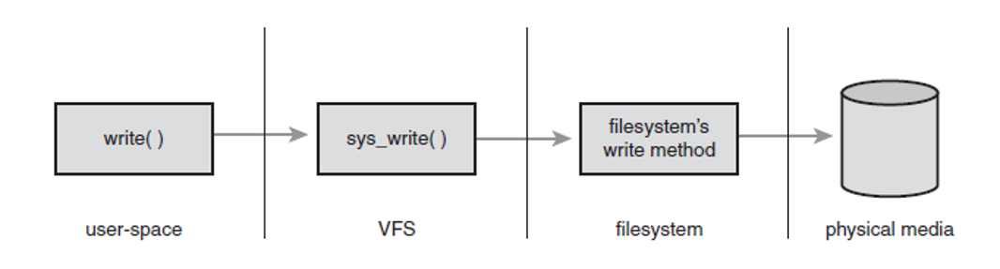
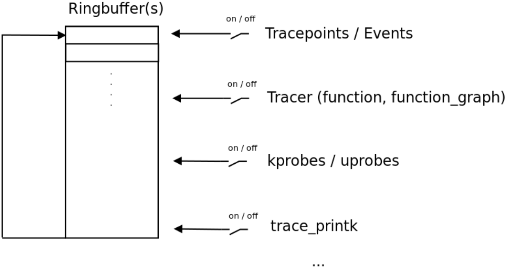
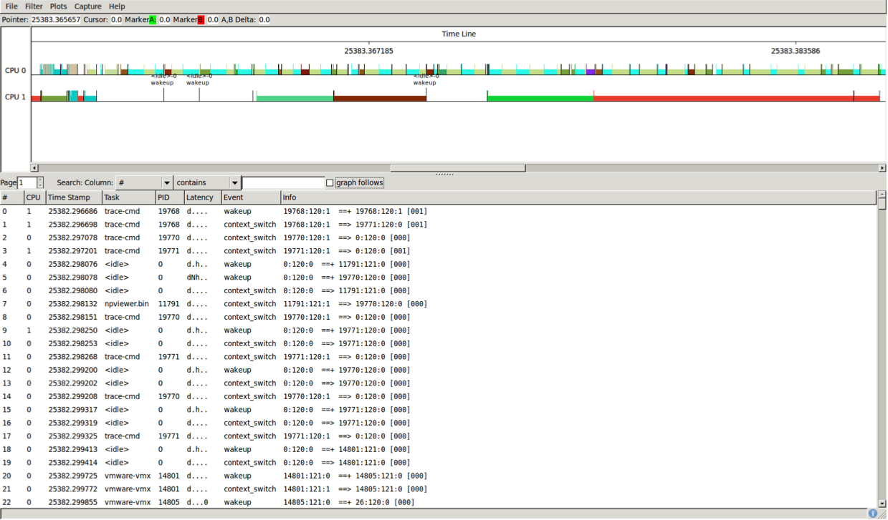
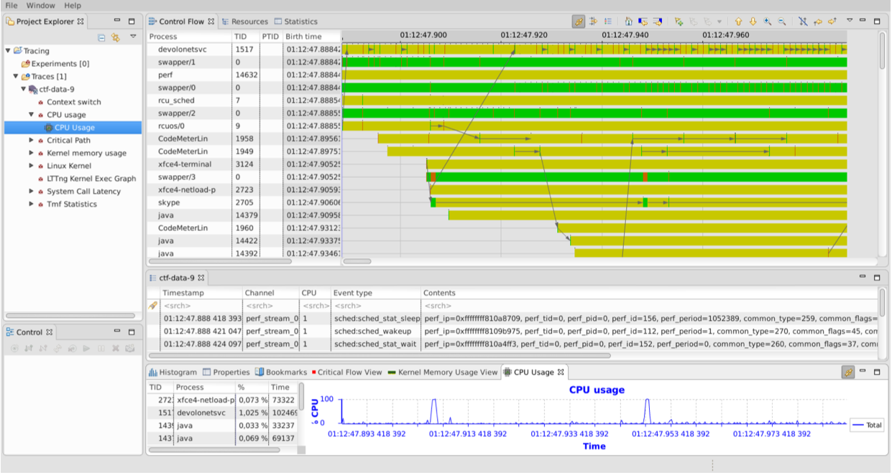

## 第十七講 文件系統擴展

* [v1](https://github.com/LearningOS/os-lectures/blob/ded5de1d168c7ed7bbf6845129a1455ccdaac432/lecture17/ref.md)：2020年的第十七講大綱
* [v2](https://github.com/LearningOS/os-lectures/blob/ab62be1d45ca15ee6aeab1ec049e99b1ec6ae1ae/lecture17/ref.md)：2021年第十七講大綱第一稿
* [v3](https://github.com/LearningOS/os-lectures/blob/aa2d7a17df4e07bb0aa2bb20f23d8c016b2329e6/lecture17/ref.md)：加了插圖的大綱
* [v4](https://github.com/LearningOS/os-lectures/blob/9e472285b6e67b39c25d316cc1207d19925b403f/lecture17/ref.md)：生成LaTeX前的大綱

### 17.1 目錄與文件別名

回顧：文件、文件組織、rCore的文件系統

  [PPT講義](http://os.cs.tsinghua.edu.cn/oscourse/OS2015/lecture21?action=AttachFile&do=get&target=21-1.pptx)   

### 17.2 空閒空間管理

  [空閒空間管理](http://os.cs.tsinghua.edu.cn/oscourse/OS2015/lecture21?action=AttachFile&do=get&target=21-5.pptx)

### 17.3 文件緩存

文件緩存和打開文件： [PPT講義](http://os.cs.tsinghua.edu.cn/oscourse/OS2015/lecture21?action=AttachFile&do=get&target=21-3.pptx)   

### 17.4 VFS

VFS（共享，緩存）：

[The virtual file system (VFS)](www.cs.uni.edu/~diesburg/courses/dd/notes/VFS.pptx)：這裡是一個55頁的幻燈片，主要介紹VFS的接口；

[Virtual File System](https://www.cs.unc.edu/~porter/courses/cse506/s16/slides/vfs.pdf)：這也是一個關於VFS的課程幻燈片；

#### Overview

##### What is VFS?



##### Common File System Interface


Enables system calls such as open(), read(), and write() to work regardless of file system or storage media

##### Basic File Model of File System



* Defines basic file model conceptual interfaces and data structures
* Low level file system drivers actually implement file-system-specific behavior

##### Four Primary Object Types in VFS

* Superblock: Represents a specific mounted file system
* Inode: Represents a specific file
* Dentry: Represents a directory entry, single component of a path name
* File: Represents an open file as associated with a process

#### Four Primary Object Types in VFS

##### VFS Operations

Each object contains operations object with methods
 * super_operations -- invoked on a specific  file system
 * inode_operations -- invoked on a specific inodes (which point to a file)
 * dentry_operations -- invoked on a specific directory entry
 * file_operations -- invoked on a file 

##### Superblock Object

 * Implemented by each file system
 * Used to store information describing that specific file system
 * Often physically written at the beginning of the partition and replicated throughout the file system
 * Found in <[linux/fs.h](https://elixir.bootlin.com/linux/latest/source/include/linux/fs.h#L1414)>
 * Code for creating, managing, and destroying superblock object is in fs/super.c
    * struct [super_block](https://elixir.bootlin.com/linux/latest/source/include/linux/fs.h#L1414)
    * [super_operations](https://elixir.bootlin.com/linux/v4.18.16/source/include/linux/fs.h#L1824)
 * Created and initialized via alloc_super()

##### Inode Object

* Represents all the information needed to manipulate a file or directory
* Constructed in memory, regardless of how file system stores metadata information
* [Inode Object Struct](https://elixir.bootlin.com/linux/latest/source/include/linux/fs.h#L610)
* [inode_operations](https://elixir.bootlin.com/linux/latest/source/include/linux/fs.h#L1862)

##### Dentry Object

 * VFS teats directories as a type of file
 * Dentry (directory entry) is a specific component in a path
Represented by struct dentry and defined in <linux/dcache.h>
 * struct [dentry](https://elixir.bootlin.com/linux/v5.7-rc4/source/include/linux/dcache.h#L89)
 * struct [dentry_operations](https://elixir.bootlin.com/linux/v5.7-rc4/source/include/linux/dcache.h#L135)

##### Dentry State

Valid dentry object can be in one of 3 states:
 * Used
 * Unused
 * Negative

##### Dentry Cache

 * Dentry objects stored in a dcache
 * Cache consists of three parts
 * Lists of used dentries linked off associated inode object
 * Doubly linked “least recently used” list of unused and negative dentry objects
 * Hash table and hash function used to quickly resolve given path to associated dentry object

##### File Object

 * Used to represent a file opened by a process
 * In-memory representation of an open file
 * Represented by struct file and defined in <linux/fs.h>
   * struct [file](https://elixir.bootlin.com/linux/latest/source/include/linux/fs.h#L915)
   * struct [file_operations](https://elixir.bootlin.com/linux/latest/source/include/linux/fs.h#L1820)

#### Implementing Your Own File System

##### Implementing Your Own File System

 * At minimum, define your own operation methods and helper procedures
    * super_operations 
    * inode_operations 
    * dentry_operations 
    * file_operations
 * For simple example file systems, take a look at ramfs and ext2

##### Implementing Your Own File System

* Sometimes it helps to trace a file operation
  * Start by tracing vfs_read() and vfs_write()
* VFS generic methods can give you a template on how to write your own file-system-specific methods
  * While updating your own file-system-specific structures

### 17.5 procfs

##### What is [procfs](https://en.wikipedia.org/wiki/Procfs)?

* [Tom Killian](http://dtrace.org/blogs/eschrock/2004/06/25/a-brief-history-of-proc/) wrote the first implementation of /proc, explained in his paper published in 1984.
  * It was designed to replace the venerable ptrace system call
* It presents information about processes and other system information
  * Provide a more convenient and standardized method for dynamically accessing process data held in the kernel
  * The proc file system acts as an interface to internal data structures in the kernel.
  * The proc filesystem provides a method of communication between kernel space and user space.
* The proc filesystem (procfs) is a special filesystem
  * It is mapped to a mount point named /proc at boot time.
  * All of them have a file size of 0, with the exception of kcore, mtrr  and self.
  * it as a window into the kernel. it just acts as a pointer to where the actual  process information resides.

##### The purpose and contents of procfs

* /proc/PID/fd
  * Directory,  which contains all file descriptors.
* /proc/PID/maps
  * Memory  maps to executables and library files.
* /proc/PID/status
  * Process  status in human readable form.
* /proc/mtrr
  * The Memory Type Range Registers (MTRRs) may be used to control processor  access to memory ranges.
  * This is most useful when you have a video (VGA)  card on a PCI or AGP bus.
  * This can increase performance of image write operations 2.5  times or more.

##### [Access the Linux kernel using the /proc filesystem](https://developer.ibm.com/technologies/linux/articles/l-proc/)

* kernel modules
  * dynamically add or remove code from the Linux kernel.
  * Inserting, checking, and removing an LKM
  * Reviewing the kernel output from the LKM
* Integrating into the /proc filesystem
  * To create a virtual file in the /proc filesystem, use the `create_proc_entry` function.
  * To remove a file from /proc, use the `remove_proc_entry` function.
  * Write to a /proc entry (from the user to the kernel) by using a `write_proc` function.
  * Read data from a /proc entry (from the kernel to the user) by using the `read_proc`function.

##### Interactive tour of /proc: `ls /proc`

Reading from and writing to /proc (configuring the kernel): 

```
cat /proc/sys/net/ipv4/ip_forward
0
echo "1" > /proc/sys/net/ipv4/ip_forward
cat /proc/sys/net/ipv4/ip_forward
1
```

##### [procfs, sysfs, debugfs in Linux](https://www.cnblogs.com/qiuheng/p/5761877.html)

 * procfs 歷史最早，最初就是用來跟內核交互的唯一方式，用來獲取處理器、內存、設備驅動、進程等各種信息。
 * sysfs 跟 kobject 框架緊密聯繫，而 kobject 是為設備驅動模型而存在的，所以 sysfs 是為設備驅動服務的。
 * debugfs 從名字來看就是為debug而生，所以更加靈活。

### 17.6 Using the Linux Tracing Infrastructure

#### Overview

##### Kerneltracing: Overview

* DebugFS / TraceFS interface
* Event Tracing
* Custom trace events
* Different tracers: function, function_graph, wakeup, wakeup_rt, ...
* Graphical frontend(s) available

##### Kerneltracing: Overview



##### Event tracing

 * Pre-defined Events in the kernel
 * Event groups
 * Each event comes with several options
 * Filtering based on event options

##### Step by Step for Event tracing

* Enable events
* Record a trace
* Analyze a trace
* Trace event format and filters
  * Each trace event has a specific format and parameters.
  * Put a filter on those parameters for recording a trace.

##### Tracing on multicore

 * One ringbuffer per cpu
 * Trace contains ALL events
 * The per_cpu directory contains a trace for each cpu
 * tracing_cpumask can limit tracing to specific cores

#### Tracers

##### Tracers

Available_tracers contains the tracers which are enabled in the kernel configuration.
 * function: Can turn all functions into trace events function_graph: Similiar to function, but contains a call graph
 * wakeup / wakeup_rt: Measure the wakeup time for tasks / rt tasks
 * irqsoff: useful for latency hunting. Identifies long sections with IRQs turned off
 *  ...

##### trace_printk()

* trace_printk() can be used to write messages to the tracing ring buffer
* Usage is similar to printk()

##### Tracing related kernel parameters

* Set and start specified tracer as early as possible.
* Dump the tracing ring buffer if an Oops occurs. Using orig_cpu it will only dump the buffer of the CPU which triggered the Oops.
* Only trace specific functions.
* Don't trace specific functions.
* Just enable trace events (comma separated list)

##### Dynamic kernel tracepoints: KPROBES

* Similar to Tracepoints
* Can be added / removed dynamically
* KPROBES for custom modules
  * tracepoint for the function hello_init

##### Dynamic Userspace Tracepoints: uprobes

* Similar to kprobes
* For userspace applications
* A uprobe event is set on a specific offset in a userland process
* Powerful method to correlate your kernel and userland events!

#### Graphical Front-end for Tracing Infrastructure

##### trace-cmd

* trace-cmd is a commandline utility for controlling and analysing kernel traces.
* trace-cmd record generates a file called trace.dat. This can be overridden by the -o option
* trace-cmd report uses the -i option for specifying an input file
* Recording traces via network

##### Kernelshark: A graphical front-end



##### Tracecompass

 * Uses the Common Trace Format (CTF)
 * perf can convert traces to CTF
 * perf uses libbabeltrace for the convertion
 * A recent version of libbabeltrace is needed

##### Tracecompass

