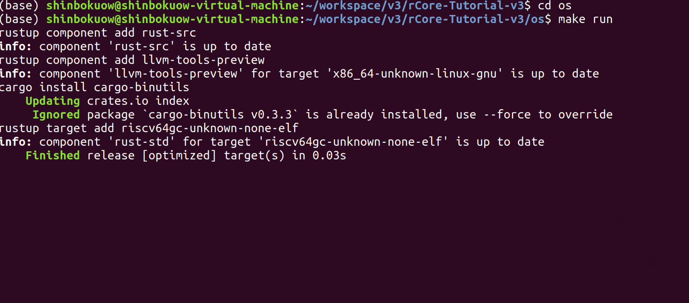
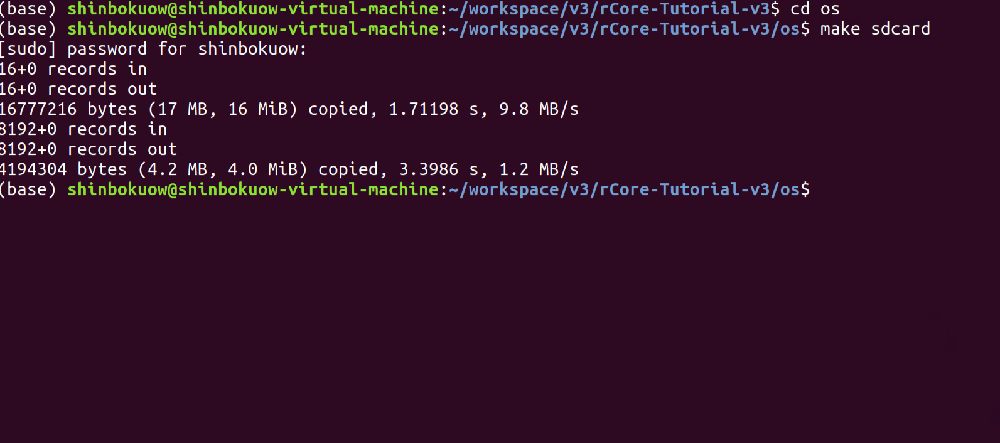
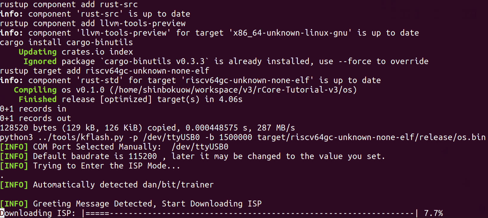

實驗環境配置
============

.. toctree::
   :hidden:
   :maxdepth: 4
   
本節我們將完成環境配置併成功運行 rCore-Tutorial-v3 。整個流程分為下面幾個部分：

- 系統環境配置
- C/Rust 開發環境配置
- QEMU 模擬器安裝
- 其他工具安裝
- 運行 rCore-Tutorial-v3

在線開發環境配置
-------------------------------------------------

Github Classroom方式進行在線OS 環境配置
~~~~~~~~~~~~~~~~~~~~~~~~~~~~~~~~~~~~~~~~~~~~~

注：這種方式目前主要用於 `2022年開源操作系統訓練營 <https://learningos.github.io/rust-based-os-comp2022/>`_ 

.. note::

   **基於 github classroom 的在線開發方式**
   
   基於 github classroom，可方便建立開發用的 git repository，並可基於 github 的 codespace （在線版 ubuntu +vscode）在線開發使用。整個開發環境僅僅需要一個網絡瀏覽器。

   1. 在網絡瀏覽器中用自己的 github  id 登錄 github.com
   2. 接收 `第一個實驗練習 setup-env-run-os1 的github classroom在線邀請 <https://classroom.github.com/a/hnoWuKGF>`_  ，根據提示一路選擇OK即可。
   3. 完成第二步後，你的第一個實驗練習 setup-env-run-os1 的 github repository 會被自動建立好，點擊此 github repository 的鏈接，就可看到你要完成的第一個實驗了。
   4. 在你的第一個實驗練習的網頁的中上部可以看到一個醒目的 `code`  綠色按鈕，點擊後，可以進一步看到  `codespace` 標籤和醒目的 `create codesapce on main` 綠色按鈕。請點擊這個綠色按鈕，就可以進入到在線的ubuntu +vscode環境中
   5. 再按照下面的環境安裝提示在 vscode 的 `console` 中安裝配置開發環境：rustc，qemu 等工具。注：也可在 vscode 的 `console` 中執行 ``make codespaces_setenv`` 來自動安裝配置開發環境（執行 ``sudo`` 需要root權限，僅需要執行一次）。
   6. **重要：** 在 vscode 的 `console` 中執行 `make setupclassroom_testX`  （該命令僅執行一次，X的範圍為 1-8）配置 github classroom 自動評分功能。
   7. 然後就可以基於在線 vscode 進行開發、運行、提交等完整的實驗過程了。

   上述的3，4，5步不是必須的，你也可以僅僅基於 ``Github Classroom`` 生成 git repository，並進行本地開發。

本地操作系統開發環境配置
-------------------------------------------------

目前實驗內容可支持在 `Ubuntu操作系統 <https://cdimage.ubuntu.com/releases/>`_ 、 `openEuler操作系統 <https://repo.openeuler.org/openEuler-20.03-LTS-SP2/ISO/>`_ 、 `龍蜥操作系統 <https://openanolis.cn/anolisos>`_ 等上面進行操作。對於 Windows10/11 和 macOS 上的用戶，可以使用WSL2、VMware Workstation 或 VirtualBox 等相關軟件，通過虛擬機方式安裝 Ubuntu18.04 / 20.04、openEuler操作系統、龍蜥操作系統等，並在上面進行實驗。

Windows的WSL2方式建立Linux環境
~~~~~~~~~~~~~~~~~~~~~~~~~~~~~~~~~~~~~~~~~~~~~

對於Windows10/11 的用戶可以通過系統內置的 WSL2 虛擬機（請不要使用 WSL1）來安裝 Ubuntu 18.04 / 20.04 。步驟如下：

- 升級 Windows 10/11 到最新版（Windows 10 版本 18917 或以後的內部版本）。注意，如果
  不是 Windows 10/11 專業版，可能需要手動更新，在微軟官網上下載。升級之後，
  可以在 PowerShell 中輸入 ``winver`` 命令來查看內部版本號。
- 「Windows 設置 > 更新和安全 > Windows 預覽體驗計劃」處選擇加入 “Dev 開發者模式”。
- 以管理員身份打開 PowerShell 終端並輸入以下命令：

  .. code-block::

     # 啟用 Windows 功能：“適用於 Linux 的 Windows 子系統”
     >> dism.exe /online /enable-feature /featurename:Microsoft-Windows-Subsystem-Linux /all /norestart

     # 啟用 Windows 功能：“已安裝的系統虛擬機平臺”
     >> dism.exe /online /enable-feature /featurename:VirtualMachinePlatform /all /norestart

     # <Distro> 改為對應從微軟應用商店安裝的 Linux 版本名，比如：`wsl --set-version Ubuntu 2`
     # 如果你沒有提前從微軟應用商店安裝任何 Linux 版本，請跳過此步驟
     >> wsl --set-version <Distro> 2

     # 設置默認為 WSL 2，如果 Windows 版本不夠，這條命令會出錯
     >> wsl --set-default-version 2

-  `下載 Linux 內核安裝包 <https://docs.microsoft.com/zh-cn/windows/wsl/install-win10#step-4---download-the-linux-kernel-update-package>`_
-  在微軟商店（Microsoft Store）中搜索並安裝 Ubuntu18.04 / 20.04。

VMware虛擬機方式進行本地OS開發環境配置
~~~~~~~~~~~~~~~~~~~~~~~~~~~~~~~~~~~~~~~~~~~~~

如果你打算使用 VMware 安裝虛擬機的話，我們已經配置好了一個能直接運行 rCore-Tutorial-v3 的 Ubuntu22.04 鏡像，它是一個 ``vmdk`` 格式的虛擬磁盤文件，只需要在 VMware 中新建一臺虛擬機，在設置虛擬磁盤的時候選擇它即可。`百度網盤鏈接 <https://pan.baidu.com/s/1yQHtQIXQUbHCbyqSPtuqqQ?pwd=pcxf>`_ 或者 `清華雲盤鏈接 <https://cloud.tsinghua.edu.cn/d/a9b7b0a1b4724c3f9c66/>`_ （目前是舊版的 Ubuntu18.04+QEMU5.0的鏡像）。已經創建好用戶 oslab ，密碼為一個空格。它已經安裝了中文輸入法和作為 Rust 集成開發環境的 Visual Studio Code，能夠更容易完成實驗並撰寫實驗報告。如果想要使用 VMWare 安裝 openEuler 虛擬機的話，可以在 `openEuler官網 <https://repo.openeuler.org/openEuler-20.03-LTS-SP2/ISO/>`_ 下載 ISO 自行安裝，接著需要參考網絡上的一些教程配置網絡和安裝圖形界面。

.. _link-docker-env:

Docker方式進行本地OS開發環境配置
~~~~~~~~~~~~~~~~~~~~~~~~~~~~~~~~~~~~~~~~~~~~~

.. note::

   **Docker 開發環境**

   感謝 qobilidop，dinghao188 和張漢東老師幫忙配置好的 Docker 開發環境，進入 Docker 開發環境之後不需要任何軟件工具鏈的安裝和配置，可以直接將 tutorial 運行起來，目前應該僅支持將 tutorial 運行在 QEMU 模擬器上。
   
   使用方法如下（以 Ubuntu18.04 為例）：

   1. 通過 ``su`` 切換到管理員賬戶 ``root`` （注：如果此前並未設置 ``root`` 賬戶的密碼需要先通過 ``sudo passwd`` 進行設置）, 在 ``rCore-Tutorial-v3`` 根目錄下，執行 ``make build_docker`` ，來建立基於docker的開發環境 ；
   2. 在 ``rCore-Tutorial-v3`` 根目錄下，執行 ``make docker`` 進入到 Docker 環境；
   3. 進入 Docker 之後，會發現當前處於根目錄 ``/`` ，我們通過 ``cd mnt`` 將當前工作路徑切換到 ``/mnt`` 目錄；
   4. 通過 ``ls`` 可以發現 ``/mnt`` 目錄下的內容和 ``rCore-Tutorial-v3`` 目錄下的內容完全相同，接下來就可以在這個環境下運行 tutorial 了。例如 ``cd os && make run`` 。    

.. chyyuu 下面的說法是面向github網頁的，在書中應該有改變???

你也可以在 Windows10/11 或 macOS 原生系統或者其他 Linux 發行版上進行實驗，基本上不會出現太大的問題。不過由於時間問題我們主要在 Ubuntu18.04 on x86-64上進行了測試，後面的配置也都是基於它的。如果遇到了問題的話，請在本節的討論區中留言，我們會盡量幫助解決。

手動進行本地OS開發環境配置
~~~~~~~~~~~~~~~~~~~~~~~~~~~~~~~~~~~~~~~~~~~~~

基於RISC-V硬件環境的配置
^^^^^^^^^^^^^^^^^^^^^^^^^^^^^^^^^^^^^^^^^^^^^

目前已經出現了可以在RISC-V 64（簡稱RV64）的硬件模擬環境（比如QEMU with RV64）和真實物理環境（如全志哪吒D1開發板、SiFive U740開發板）的Linux系統環境。但Linux RV64相對於Linux x86-64而言，雖然挺新穎的，但還不夠成熟，已經適配和預編譯好的應用軟件包相對少一些，適合hacker進行嘗試。如果同學有興趣，我們也給出多種相應的硬件模擬環境和真實物理環境的Linux for RV64發行版，以便於這類同學進行實驗：

- `Ubuntu for RV64的QEMU和SiFive U740開發板系統鏡像 <https://cdimage.ubuntu.com/releases/20.04.3/release/ubuntu-20.04.3-preinstalled-server-riscv64+unmatched.img.xz>`_
- `OpenEuler for RV64的QEMU系統鏡像 <https://repo.openeuler.org/openEuler-preview/RISC-V/Image/openEuler-preview.riscv64.qcow2>`_
- `Debian for RV64的D1哪吒開發板系統鏡像 <http://www.perfxlab.cn:8080/rvboards/RVBoards_D1_Debian_img_v0.6.1/RVBoards_D1_Debian_img_v0.6.1.zip>`_

注：後續的配置主要基於Linux for x86-64系統環境，如果同學採用Linux for RV64環境，需要自己配置。不過在同學比較熟悉的情況下，配置方法類似且更加簡單。可能存在的主要問題是，面向Linux for RV64的相關軟件包可能不全，這樣需要同學從源碼直接編譯出缺失的軟件包。

C 開發環境配置
^^^^^^^^^^^^^^^^^^^^^^^^^^^^^^^^^^^^^^^^^^^^^

在實驗或練習過程中，也會涉及部分基於C語言的開發，可以安裝基本的本機開發環境和交叉開發環境。下面是以Ubuntu 20.04為例，需要安裝的C 開發環境涉及的軟件：

.. code-block:: bash

   $ sudo apt-get update && sudo apt-get upgrade
   $ sudo apt-get install git build-essential gdb-multiarch qemu-system-misc gcc-riscv64-linux-gnu binutils-riscv64-linux-gnu

注：上述軟件不是Rust開發環境所必須的。且ubuntu 20.04的QEMU軟件版本低，而本書實驗需要安裝7.0以上版本的QEMU。

Rust 開發環境配置
^^^^^^^^^^^^^^^^^^^^^^^^^^^^^^^^^^^^^^^^^^^^^

首先安裝 Rust 版本管理器 rustup 和 Rust 包管理器 cargo，這裡我們用官方的安裝腳本來安裝：

.. code-block:: bash

   curl https://sh.rustup.rs -sSf | sh

如果通過官方的腳本下載失敗了，可以在瀏覽器的地址欄中輸入 `<https://sh.rustup.rs>`_ 來下載腳本，在本地運行即可。

如果官方的腳本在運行時出現了網絡速度較慢的問題，可選地可以通過修改 rustup 的鏡像地址（修改為中國科學技術大學的鏡像服務器）來加速：

.. code-block:: bash
   
   export RUSTUP_DIST_SERVER=https://mirrors.ustc.edu.cn/rust-static
   export RUSTUP_UPDATE_ROOT=https://mirrors.ustc.edu.cn/rust-static/rustup
   curl https://sh.rustup.rs -sSf | sh

或者使用tuna源來加速 `參見 rustup 幫助 <https://mirrors.tuna.tsinghua.edu.cn/help/rustup/>`_：

.. code-block:: bash
   
   export RUSTUP_DIST_SERVER=https://mirrors.tuna.edu.cn/rustup
   export RUSTUP_UPDATE_ROOT=https://mirrors.tuna.edu.cn/rustup/rustup
   curl https://sh.rustup.rs -sSf | sh

或者也可以通過在運行前設置命令行中的科學上網代理來實現：

.. code-block:: bash 

   # e.g. Shadowsocks 代理，請根據自身配置靈活調整下面的鏈接
   export https_proxy=http://127.0.0.1:1080
   export http_proxy=http://127.0.0.1:1080
   export ftp_proxy=http://127.0.0.1:1080

安裝完成後，我們可以重新打開一個終端來讓之前設置的環境變量生效。我們也可以手動將環境變量設置應用到當前終端，只需要輸入以下命令：

.. code-block:: bash

   source $HOME/.cargo/env

接下來，我們可以確認一下我們正確安裝了 Rust 工具鏈：

.. code-block:: bash
   
   rustc --version

可以看到當前安裝的工具鏈的版本。

.. code-block:: bash

   rustc 1.62.0-nightly (1f7fb6413 2022-04-10)

.. warning::
   目前用於操作系統實驗開發的 rustc 編譯器的版本不侷限在 1.46.0 這樣的數字上，你可以選擇更新版本的 rustc 編譯器。但注意只能用 rustc 的 nightly 類型的版本。

可通過如下命令安裝 rustc 的 nightly 版本，並把該版本設置為 rustc 的缺省版本。

.. code-block:: bash
   
   rustup install nightly
   rustup default nightly

我們最好把軟件包管理器 cargo 所用的軟件包鏡像地址 crates.io 也換成中國科學技術大學的鏡像服務器來加速三方庫的下載。我們打開（如果沒有就新建） ``~/.cargo/config`` 文件，並把內容修改為：

.. code-block:: toml

   [source.crates-io]
   registry = "https://github.com/rust-lang/crates.io-index"
   replace-with = 'ustc'
   [source.ustc]
   registry = "git://mirrors.ustc.edu.cn/crates.io-index"

同樣，也可以使用tuna源 `參見 crates.io 幫助 <https://mirrors.tuna.tsinghua.edu.cn/help/crates.io-index.git/>`_：

.. code-block:: toml

   [source.crates-io]
   replace-with = 'tuna'

   [source.tuna]
   registry = "https://mirrors.tuna.tsinghua.edu.cn/git/crates.io-index.git"

接下來安裝一些Rust相關的軟件包

.. code-block:: bash

   rustup target add riscv64gc-unknown-none-elf
   cargo install cargo-binutils
   rustup component add llvm-tools-preview
   rustup component add rust-src

.. warning::
   如果你換了另外一個rustc編譯器（必須是nightly版的），需要重新安裝上述rustc所需軟件包。rCore-Tutorial 倉庫中的 ``Makefile`` 包含了這些工具的安裝，如果你使用 ``make run`` 也可以不手動安裝。

至於 Rust 開發環境，推薦 JetBrains Clion + Rust插件 或者 Visual Studio Code 搭配 rust-analyzer 和 RISC-V Support 插件。

.. note::

   * JetBrains Clion是付費商業軟件，但對於學生和教師，只要在 JetBrains 網站註冊賬號，可以享受一定期限（半年左右）的免費使用的福利。
   * Visual Studio Code 是開源軟件，不用付費就可使用。
   * 當然，採用 VIM，Emacs 等傳統的編輯器也是沒有問題的。

QEMU 模擬器安裝
^^^^^^^^^^^^^^^^^^^^^^^^^^^^^^^^^^^^^^^^^^^^^

我們需要使用 QEMU 7.0 版本進行實驗，低版本的 QEMU 可能導致框架代碼不能正常運行。而很多 Linux 發行版的軟件包管理器默認軟件源中的 QEMU 版本過低，因此我們需要從源碼手動編譯安裝 QEMU 模擬器軟件。下面以 Ubuntu 18.04/20.04 上的安裝流程為例進行說明：

.. chyyuu warning::

   注意，如果安裝了 QEMU 6.0+ 版本，則目前需要將項目目錄下的 bootloader（也即 RustSBI）更新為最新的 0.2.0-alpha.6 版本。它們目前可以在 ``chX-dev`` 分支中找到。

首先我們安裝依賴包，獲取 QEMU 源代碼並手動編譯：

.. code-block:: bash

   # 安裝編譯所需的依賴包
   sudo apt install autoconf automake autotools-dev curl libmpc-dev libmpfr-dev libgmp-dev \
                 gawk build-essential bison flex texinfo gperf libtool patchutils bc \
                 zlib1g-dev libexpat-dev pkg-config  libglib2.0-dev libpixman-1-dev libsdl2-dev libslirp-dev \
                 git tmux python3 python3-pip ninja-build 
   # 下載源碼包 
   # 如果下載速度過慢可以使用我們提供的百度網盤鏈接：https://pan.baidu.com/s/1dykndFzY73nqkPL2QXs32Q 
   # 提取碼：jimc 
   wget https://download.qemu.org/qemu-7.0.0.tar.xz
   # 解壓
   tar xvJf qemu-7.0.0.tar.xz
   # 編譯安裝並配置 RISC-V 支持
   cd qemu-7.0.0
   ./configure --target-list=riscv64-softmmu,riscv64-linux-user  # 在第九章的實驗中，可以有圖形界面和網絡。如果要支持圖形界面，可添加 " --enable-sdl" 參數；如果要支持網絡，可添加 " --enable-slirp" 參數
   make -j$(nproc)

.. note::
   
   注意，上面的依賴包可能並不完全，比如在 Ubuntu 18.04 上：

   - 出現 ``ERROR: pkg-config binary 'pkg-config' not found`` 時，可以安裝 ``pkg-config`` 包；
   - 出現 ``ERROR: glib-2.48 gthread-2.0 is required to compile QEMU`` 時，可以安裝 
     ``libglib2.0-dev`` 包；
   - 出現 ``ERROR: pixman >= 0.21.8 not present`` 時，可以安裝 ``libpixman-1-dev`` 包。

   另外一些 Linux 發行版編譯 QEMU 的依賴包可以從 `這裡 <https://risc-v-getting-started-guide.readthedocs.io/en/latest/linux-qemu.html#prerequisites>`_ 找到。

之後我們可以在同目錄下 ``sudo make install`` 將 QEMU 安裝到 ``/usr/local/bin`` 目錄下，但這樣經常會引起衝突。個人來說更習慣的做法是，編輯 ``~/.bashrc`` 文件（如果使用的是默認的 ``bash`` 終端），在文件的末尾加入幾行：

.. code-block:: bash

   # 請注意，qemu-7.0.0 的父目錄可以隨著你的實際安裝位置靈活調整
   export PATH=$PATH:/path/to/qemu-7.0.0/build

隨後即可在當前終端 ``source ~/.bashrc`` 更新系統路徑，或者直接重啟一個新的終端。

此時我們可以確認 QEMU 的版本：

.. code-block:: bash

   qemu-system-riscv64 --version
   qemu-riscv64 --version

在其他缺少預編譯 QEMU with RV64 軟件包的Linux x86-64 環境（如openEuler操作系統）上，首先需要從 openEuler 社區維護的 QEMU 的 `riscv分支 <https://gitee.com/src-openeuler/qemu/tree/riscv/>`_ 下載 QEMU 源碼，並直接通過 rpmbuild 進行構建。

.. warning::

   請儘量不要安裝 ``qemu-kvm`` ，這可能會導致我們的框架無法正常運行。如果已經安裝，可以考慮換用 Docker 。

   另外，我們僅在 Qemu 7.0.0 版本上進行了測試，請儘量不要切換到其他版本。

K210 真機串口通信
^^^^^^^^^^^^^^^^^^^^^^^^^^^^^^^^^^^^^^^^^^^^^

為了能在 K210 真機上運行 Tutorial，我們還需要安裝基於 Python 的串口通信庫和簡易的串口終端。

.. code-block:: bash

   pip3 install pyserial
   sudo apt install python3-serial

GDB 調試支持
^^^^^^^^^^^^^^^^^^^^^^^^^^^^^^^^^^^^^^^^^^^^^

目前我們僅支持基於 QEMU 模擬器進行調試。在 ``os`` 目錄下 ``make debug`` 可以調試我們的內核，這需要安裝終端複用工具 ``tmux`` ，還需要支持 riscv64 指令集的 gdb 調試器 ``riscv64-unknown-elf-gdb`` 。該調試器包含在 riscv64 gcc 工具鏈中，工具鏈的預編譯版本可以在如下鏈接處下載：

- `Ubuntu 環境 <https://static.dev.sifive.com/dev-tools/riscv64-unknown-elf-gcc-8.3.0-2020.04.1-x86_64-linux-ubuntu14.tar.gz>`_
- `macOS 環境 <https://static.dev.sifive.com/dev-tools/riscv64-unknown-elf-gcc-8.3.0-2020.04.1-x86_64-apple-darwin.tar.gz>`_
- `Windows 環境 <https://static.dev.sifive.com/dev-tools/riscv64-unknown-elf-gcc-8.3.0-2020.04.1-x86_64-w64-mingw32.zip>`_
- `CentOS 環境 <https://static.dev.sifive.com/dev-tools/riscv64-unknown-elf-gcc-8.3.0-2020.04.1-x86_64-linux-centos6.tar.gz>`_

最新版的工具鏈可以在 `sifive 官方的 repo 中 <https://github.com/sifive/freedom-tools/releases>`_ 找到。

解壓後在 ``bin`` 目錄下即可找到 ``riscv64-unknown-elf-gdb`` 以及另外一些常用工具 ``objcopy/objdump/readelf`` 等。

在其他缺少預編譯 riscv64 gcc 工具鏈的 Linux x86-64 環境（如 openEuler 操作系統、龍蜥操作系統等）上，則需要 clone `riscv 工具鏈倉庫 <https://github.com/riscv-collab/riscv-gnu-toolchain>`_ 並參考其說明手動構建。

出於某些原因，我們全程使用 ``release`` 模式進行構建。為了正常進行調試，請確認各項目（如 ``os`` , ``user`` 和 ``easy-fs`` ）的 ``Cargo.toml`` 中包含如下配置：

.. code-block:: toml

   [profile.release]
   debug = true

此外，參考 ``os/Makefile`` ，還可以先打開一個終端頁面 ``make gdbserver`` 啟動 QEMU ，此後另開一個終端頁面在同目錄下 ``make gdbclient`` 將 GDB 客戶端連接到 QEMU 進行調試。我們推薦使用 `gdb-dashboard <https://github.com/cyrus-and/gdb-dashboard>`_ 插件，可以大大提升調試體驗。在本節的評論區已有同學提供了基於各種 IDE 的調試方法，也可參考。

運行 rCore-Tutorial-v3
------------------------------------------------------------

在 QEMU 模擬器上運行
~~~~~~~~~~~~~~~~~~~~~~~~~~~~~~~~~~~~~~~~~~~~~

如果是在 QEMU 模擬器上運行，只需在 ``os`` 目錄下 ``make run`` 即可。在內核加載完畢之後，可以看到目前可以用的
應用程序。 ``usertests`` 打包了其中的很大一部分，所以我們可以運行它，只需輸入在終端中輸入它的名字即可。

之後，可以先按下 ``Ctrl+a`` （即：先按下 Ctrl 不鬆開，再按下小寫字母 a 不放，隨後同時將兩個鍵鬆開） ，再按下 ``x`` 來退出 QEMU。

在 K210 平臺上運行
~~~~~~~~~~~~~~~~~~~~~~~~~~~~~~~~~~~~~~~~~~~~~

如果是在 K210 平臺上運行則略顯複雜。

首先，我們需要將 MicroSD 插入 PC 來將文件系統鏡像拷貝上去。

.. warning::

   在 ``os/Makefile`` 中我們默認設置 MicroSD 在當前操作系統中可以用設備 ``SDCARD=/dev/sdb`` 訪問。你可以使用 ``df -hT`` 命令來確認在你的環境中 MicroSD 是哪個設備，並在 ``make sdcard`` 之前對 ``os/Makefile`` 的 ``SDCARD`` 配置做出適當的修改。不然，這有可能導致 **設備 /dev/sdb 上數據丟失** ！
   
隨後，我們將 MicroSD 插入 K210 開發板，將 K210 開發板連接到 PC ，然後進入 ``os`` 目錄 ``make run BOARD=k210`` 在 K210 開發板上跑 rCore Tutorial 。 

之後，可以按下 ``Ctrl+]`` 來退出串口終端。

由於教程的 ch1~ch5 分支還沒有文件系統，在 K210 上運行這些分支無需 MicroSD 卡也不需要進行文件系統鏡像燒寫工作，直接切換到 `os` 目錄下 `make run BOARD=k210` 即可。

到這裡，恭喜你完成了實驗環境的配置，可以開始閱讀教程的正文部分了！

Q & A
----------------------------------------------------------------

當代碼跑不起來的時候，可以嘗試：

- 分支是否與 rCore-Tutorial-v3 原版倉庫（而非 fork 出來的倉庫）的對應分支同步。如不同步的話考慮通過 ``git pull`` 進行更新。注：這是因為 Rust 的版本更迭較快，如不及時更新的話曾經能正常運行的代碼也會無法運行。
- 項目根目錄下的 ``rust-toolchain`` 非常重要，它代表整個項目採用的 Rust 工具鏈版本。請務必保持其與原版倉庫對應分支一致。
- 項目根目錄下是否存在放置 RustSBI 的 ``bootloader/`` 目錄。如不存在的話可從原版倉庫的各分支上獲取。
- 通過 ``make clean`` 或者 ``cargo clean`` 刪除 ``os`` 或 ``user`` 目錄下的構建產物，並重新 ``make run`` 。注：出現這樣的問題通常說明框架的構建腳本存在 bug，可以提 issue。

如果懷疑遇到了網絡問題，可以檢查：

- 請按照本節說明進行 Rust 安裝和 crates.io 鏡像配置。通常情況下能夠解決 Rust 工具鏈更新和下載已發佈到 crates.io 上庫的問題。
- 如果發現在試圖從 github 上下載下述幾個庫的時候卡死，可以修改 ``os`` 和 ``user`` 目錄下的 ``Cargo.toml`` 替換為 gitee 上的鏡像。例如，將：
  
   .. code-block:: toml

      riscv = { git = "https://github.com/rcore-os/riscv", features = ["inline-asm"] }
      virtio-drivers = { git = "https://github.com/rcore-os/virtio-drivers" }
      k210-pac = { git = "https://github.com/wyfcyx/k210-pac" }
      k210-hal = { git = "https://github.com/wyfcyx/k210-hal" }
      k210-soc = { git = "https://github.com/wyfcyx/k210-soc" }
   
  替換為：

   .. code-block:: toml

      riscv = { git = "https://gitee.com/rcore-os/riscv", features = ["inline-asm"] }
      virtio-drivers = { git = "https://gitee.com/rcore-os/virtio-drivers" }
      k210-pac = { git = "https://gitee.com/wyfcyx/k210-pac" }
      k210-hal = { git = "https://gitee.com/wyfcyx/k210-hal" }
      k210-soc = { git = "https://gitee.com/wyfcyx/k210-soc" }
