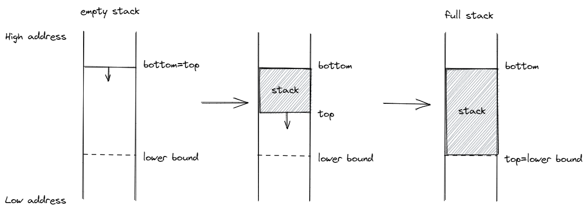

為內核支持函數調用
================================================

.. toctree::
   :hidden:
   :maxdepth: 5

本節導讀
--------------------------------------------------

上一節我們成功在 Qemu 上執行了內核的第一條指令，它是我們在 ``entry.asm`` 中手寫彙編代碼得到的。然而，我們無論如何也不想僅靠手寫彙編代碼的方式編寫我們的內核，絕大部分功能我們都想使用 Rust 語言來實現。不過為了將控制權轉交給我們使用 Rust 語言編寫的內核入口函數，我們確實需要手寫若干行彙編代碼進行一定的初始化工作。和之前一樣，這些彙編代碼放在 ``entry.asm`` 中，並在控制權被轉交給內核相關函數前最先被執行，但它們的功能會更加複雜。首先需要設置棧空間，來在內核內使能函數調用，隨後直接調用使用 Rust 編寫的內核入口函數，從而控制權便被移交給 Rust 代碼。這就是構建“三葉蟲”操作系統的第三個步驟。

在具體操作之前，我們首先會介紹很多函數調用和棧的背景知識。這些知識很重要，而且有一些思想會一直延續到後面的章節。但同時這些知識相對比較基礎，因此我們在正式開始介紹之前給出了一個知識點清單，有一定基礎的讀者可以參照此清單進行選讀。

.. note::

    **本節知識清單**

    請嘗試回答以下問題，如果對於自己的答案足夠自信的話則可以直接進入本節的 :ref:`實踐部分 <jump-practice>` 。

    - 如何使得函數返回時能夠跳轉到調用該函數的下一條指令，即使該函數在代碼中的多個位置被調用？
    - 對於一個函數而言，保證它調用某個子函數之前，以及該子函數返回到它之後（某些）通用寄存器的值保持不變有何意義？
    - 調用者函數和被調用者函數如何合作保證調用子函數前後寄存器內容保持不變？調用者保存和被調用者保存寄存器的保存與恢復各自由誰負責？它們暫時被保存在什麼位置？它們於何時被保存和恢復（如函數的開場白/退場白）？
    - 在 RISC-V 架構上，調用者保存和被調用者保存寄存器如何劃分的？ 
    - `sp` 和 `ra` 是調用者還是被調用者保存寄存器，為什麼這樣約定？
    - 如何使用寄存器傳遞函數調用的參數和返回值？如果寄存器數量不夠用了，如何傳遞函數調用的參數？

.. _term-function-call-and-stack:

函數調用與棧
----------------------------

從彙編指令的級別看待一段程序的執行，假如 CPU 依次執行的指令的物理地址序列為 :math:`\{a_n\}`，那麼這個序列會符合怎樣的模式呢？

.. _term-control-flow:

其中最簡單的無疑就是 CPU 一條條連續向下執行指令，也即滿足遞推公式 :math:`a_{n+1}=a_n+L`，這裡我們假設該平臺的指令是定長的且均為 :math:`L` 字節（常見情況為 2/4 字節）。但是執行序列並不總是符合這種模式，當位於物理地址 :math:`a_n` 的指令是一條跳轉指令的時候，該模式就有可能被破壞。跳轉指令對應於我們在程序中構造的 **控制流** (Control Flow) 的多種不同結構，比如分支結構（如 if/switch 語句）和循環結構（如 for/while 語句）。用來實現上述兩種結構的跳轉指令，只需實現跳轉功能，也就是將 pc 寄存器設置到一個指定的地址即可。

.. _term-function-call:

另一種控制流結構則顯得更為複雜： **函數調用** (Function Call)。我們大概清楚調用函數整個過程中代碼執行的順序，如果是從源代碼級的視角來看，我們會去執行被調用函數的代碼，等到它返回之後，我們會回到調用函數對應語句的下一行繼續執行。那麼我們如何用匯編指令來實現這一過程？首先在調用的時候，需要有一條指令跳轉到被調用函數的位置，這個看起來和其他控制結構沒什麼不同；但是在被調用函數返回的時候，我們卻需要返回那條跳轉過來的指令的下一條繼續執行。這次用來返回的跳轉究竟跳轉到何處，在對應的函數調用發生之前是不知道的。比如，我們在兩個不同的地方調用同一個函數，顯然函數返回之後會回到不同的地址。這是一個很大的不同：其他控制流都只需要跳轉到一個 *編譯期固定下來* 的地址，而函數調用的返回跳轉是跳轉到一個 *運行時確定* （確切地說是在函數調用發生的時候）的地址。

.. image:: function-call.png
   :align: center
   :name: function-call

對此，指令集必須給用於函數調用的跳轉指令一些額外的能力，而不只是單純的跳轉。在 RISC-V 架構上，有兩條指令即符合這樣的特徵：

.. list-table:: RISC-V 函數調用跳轉指令
   :widths: 20 30
   :header-rows: 1
   :align: center

   * - 指令
     - 指令功能
   * - :math:`\text{jal}\ \text{rd},\ \text{imm}[20:1]`
     - :math:`\text{rd}\leftarrow\text{pc}+4`

       :math:`\text{pc}\leftarrow\text{pc}+\text{imm}`
   * - :math:`\text{jalr}\ \text{rd},\ (\text{imm}[11:0])\text{rs}`
     - :math:`\text{rd}\leftarrow\text{pc}+4`
       
       :math:`\text{pc}\leftarrow\text{rs}+\text{imm}`

.. _term-source-register:
.. _term-immediate:
.. _term-destination-register:

.. note::

   **RISC-V 指令各部分含義**

   在大多數只與通用寄存器打交道的指令中， rs 表示 **源寄存器** (Source Register)， imm 表示 **立即數** (Immediate)，是一個常數，二者構成了指令的輸入部分；而 rd 表示 **目標寄存器** (Destination Register)，它是指令的輸出部分。rs 和 rd 可以在 32 個通用寄存器 x0~x31 中選取。但是這三個部分都不是必須的，某些指令只有一種輸入類型，另一些指令則沒有輸出部分。

.. _term-pseudo-instruction:

從中可以看出，這兩條指令在設置 pc 寄存器完成跳轉功能之前，還將當前跳轉指令的下一條指令地址保存在 rd 寄存器中，即 :math:`\text{rd}\leftarrow\text{pc}+4` 這條指令的含義。（這裡假設所有指令的長度均為 4 字節）在 RISC-V 架構中，通常使用 ``ra`` 寄存器（即 ``x1`` 寄存器）作為其中的 ``rd`` 對應的具體寄存器，因此在函數返回的時候，只需跳轉回 ``ra``  所保存的地址即可。事實上在函數返回的時候我們常常使用一條 **彙編偽指令** (Pseudo Instruction) 跳轉回調用之前的位置： ``ret`` 。它會被彙編器翻譯為 ``jalr x0, 0(x1)``，含義為跳轉到寄存器 ``ra`` 保存的物理地址，由於 ``x0`` 是一個恆為 ``0`` 的寄存器，在 ``rd`` 中保存這一步被省略。

總結一下，在進行函數調用的時候，我們通過 ``jalr`` 指令保存返回地址並實現跳轉；而在函數即將返回的時候，則通過 ``ret`` 偽指令回到跳轉之前的下一條指令繼續執行。這樣，RISC-V 的這兩條指令就實現了函數調用流程的核心機制。

由於我們是在 ``ra`` 寄存器中保存返回地址的，我們要保證它在函數執行的全程不發生變化，不然在 ``ret`` 之後就會跳轉到錯誤的位置。事實上編譯器除了函數調用的相關指令之外確實基本上不使用 ``ra`` 寄存器。也就是說，如果在函數中沒有調用其他函數，那 ``ra`` 的值不會變化，函數調用流程能夠正常工作。但遺憾的是，在實際編寫代碼的時候我們常常會遇到函數 **多層嵌套調用** 的情形。我們很容易想象，如果函數不支持嵌套調用，那麼編程將會變得多麼複雜。如果我們試圖在一個函數 :math:`f` 中調用一個子函數，在跳轉到子函數 :math:`g` 的同時，ra 會被覆蓋成這條跳轉指令的下一條的地址，而 ra 之前所保存的函數 :math:`f` 的返回地址將會 `永久丟失` 。 

.. _term-function-context:
.. _term-activation-record:

因此，若想正確實現嵌套函數調用的控制流，我們必須通過某種方式保證：在一個函數調用子函數的前後，``ra`` 寄存器的值不能發生變化。但實際上，這並不僅僅侷限於 ``ra`` 一個寄存器，而是作用於所有的通用寄存器。這是因為，編譯器是獨立編譯每個函數的，因此一個函數並不能知道它所調用的子函數修改了哪些寄存器。而站在一個函數的視角，在調用子函數的過程中某些寄存器的值被覆蓋的確會對它接下來的執行產生影響。因此這是必要的。我們將由於函數調用，在控制流轉移前後需要保持不變的寄存器集合稱之為 **函數調用上下文** (Function Call Context) 。

.. _term-save-restore:

由於每個 CPU 只有一套寄存器，我們若想在子函數調用前後保持函數調用上下文不變，就需要物理內存的幫助。確切的說，在調用子函數之前，我們需要在物理內存中的一個區域 **保存** (Save) 函數調用上下文中的寄存器；而在函數執行完畢後，我們會從內存中同樣的區域讀取並 **恢復** (Restore) 函數調用上下文中的寄存器。實際上，這一工作是由子函數的調用者和被調用者（也就是子函數自身）合作完成。函數調用上下文中的寄存器被分為如下兩類：

.. _term-callee-saved:
.. _term-caller-saved:

- **被調用者保存(Callee-Saved) 寄存器** ：被調用的函數可能會覆蓋這些寄存器，需要被調用的函數來保存的寄存器，即由被調用的函數來保證在調用前後，這些寄存器保持不變；
- **調用者保存(Caller-Saved) 寄存器** ：被調用的函數可能會覆蓋這些寄存器，需要發起調用的函數來保存的寄存器，即由發起調用的函數來保證在調用前後，這些寄存器保持不變。

從名字中可以看出，函數調用上下文由調用者和被調用者分別保存，其具體過程分別如下：

- 調用函數：首先保存不希望在函數調用過程中發生變化的 **調用者保存寄存器** ，然後通過 jal/jalr 指令調用子函數，返回之後恢復這些寄存器。
- 被調用函數：在被調用函數的起始，先保存函數執行過程中被用到的 **被調用者保存寄存器** ，然後執行函數，最後在函數退出之前恢復這些寄存器。

.. _term-prologue:
.. _term-epilogue:

我們發現無論是調用函數還是被調用函數，都會因調用行為而需要兩段匹配的保存和恢復寄存器的彙編代碼，可以分別將其稱為 **開場** (Prologue) 和 **結尾** (Epilogue)，它們會由編譯器幫我們自動插入，來完成相關寄存器的保存與恢復。一個函數既有可能作為調用者調用其他函數，也有可能作為被調用者被其他函數調用。

.. chyyuu

  對於這個函數而言，如果在執行的時候需要修改被調用者保存寄存器，而必須在函數開頭的開場和結尾處進行保存；對於調用者保存寄存器則可以沒有任何顧慮的隨便使用，因為它在約定中本就不需要承擔保證調用者保存寄存器保持不變的義務。

.. note::

   **寄存器保存與編譯器優化**

   這裡值得說明的是，調用者和被調用者實際上只需分別按需保存調用者保存寄存器和被調用者保存寄存器的一個子集。對於調用函數而言，在調用子函數的時候，即使子函數修改了調用者保存寄存器，編譯器在調用函數中插入的代碼會恢復這些寄存器；而對於被調用函數而言，在其執行過程中沒有使用到的被調用者保存寄存器也無需保存。編譯器在進行後端代碼生成時，知道在這兩個場景中分別有哪些值得保存的寄存器。從這一角度也可以理解為何要將函數調用上下文分成兩類：可以讓編譯器儘可能早地優化掉一些無用的寄存器保存與恢復操作，提高程序的執行性能。

.. chyyuu 最好有個例子說明

.. _term-calling-convention:

調用規範
----------------

**調用規範** (Calling Convention) 約定在某個指令集架構上，某種編程語言的函數調用如何實現。它包括了以下內容：

1. 函數的輸入參數和返回值如何傳遞；
2. 函數調用上下文中調用者/被調用者保存寄存器的劃分；
3. 其他的在函數調用流程中對於寄存器的使用方法。

調用規範是對於一種確定的編程語言來說的，因為一般意義上的函數調用只會在編程語言的內部進行。當一種語言想要調用用另一門編程語言編寫的函數接口時，編譯器就需要同時清楚兩門語言的調用規範，並對寄存器的使用做出調整。

.. note::

   **RISC-V 架構上的 C 語言調用規範**

   RISC-V 架構上的 C 語言調用規範可以在 `這裡 <https://riscv.org/wp-content/uploads/2015/01/riscv-calling.pdf>`_ 找到。
   它對通用寄存器的使用做出瞭如下約定：

   .. list-table:: RISC-V 寄存器功能分類
      :widths: 20 20 40
      :align: center
      :header-rows: 1

      * - 寄存器組
        - 保存者
        - 功能
      * - a0~a7（ ``x10~x17`` ）
        - 調用者保存
        - 用來傳遞輸入參數。其中的 a0 和 a1 還用來保存返回值。
      * - t0~t6( ``x5~x7,x28~x31`` )
        - 調用者保存
        - 作為臨時寄存器使用，在被調函數中可以隨意使用無需保存。
      * - s0~s11( ``x8~x9,x18~x27`` )
        - 被調用者保存
        - 作為臨時寄存器使用，被調函數保存後才能在被調函數中使用。

   剩下的 5 個通用寄存器情況如下：

   - zero( ``x0`` ) 之前提到過，它恆為零，函數調用不會對它產生影響；
   - ra( ``x1`` ) 是被調用者保存的。被調用者函數可能也會調用函數，在調用之前就需要修改 ``ra`` 使得這次調用能正確返回。因此，每個函數都需要在開頭保存 ``ra`` 到自己的棧幀中，並在結尾使用 ``ret`` 返回之前將其恢復。棧幀是當前執行函數用於存儲局部變量和函數返回信息的內存結構。
   - sp( ``x2`` ) 是被調用者保存的。這個是之後就會提到的棧指針 (Stack Pointer) 寄存器，它指向下一個將要被存儲的棧頂位置。
   - fp( ``s0`` )，它既可作為s0臨時寄存器，也可作為棧幀指針（Frame Pointer）寄存器，表示當前棧幀的起始位置，是一個被調用者保存寄存器。fp 指向的棧幀起始位置 和 sp 指向的棧幀的當前棧頂位置形成了所對應函數棧幀的空間範圍。 
   - gp( ``x3`` ) 和 tp( ``x4`` ) 在一個程序運行期間都不會變化，因此不必放在函數調用上下文中。它們的用途在後面的章節會提到。

   更加詳細的內容可以參考 Cornell 大學的 `CS 3410: Computer System Organization and Programming 課件內容 <http://www.cs.cornell.edu/courses/cs3410/2019sp/schedule/slides/10-calling-notes-bw.pdf>`_ 。

.. _term-stack:
.. _term-stack-pointer:
.. _term-stack-frame:

之前我們討論了函數調用上下文的保存/恢復時機以及寄存器的選擇，但我們並沒有詳細說明這些寄存器保存在哪裡，只是用“內存中的一塊區域”草草帶過。實際上，它更確切的名字是 **棧** (Stack) 。  ``sp`` 寄存器常用來保存 **棧指針** (Stack Pointer)，它指向內存中棧頂地址。在 RISC-V 架構中，棧是從高地址向低地址增長的。在一個函數中，作為起始的開場代碼負責分配一塊新的棧空間，即將 ``sp`` 
的值減小相應的字節數即可，於是物理地址區間 :math:`[\text{新sp},\text{舊sp})` 對應的物理內存的一部分便可以被這個函數用來進行函數調用上下文的保存/恢復，這塊物理內存被稱為這個函數的 **棧幀** (Stack Frame)。同理，函數中的結尾代碼負責將開場代碼分配的棧幀回收，這也僅僅需要將 ``sp`` 的值增加相同的字節數回到分配之前的狀態。這也可以解釋為什麼 ``sp`` 是一個被調用者保存寄存器。

.. note::

  **棧幀 stack frame**
 
  我們知道程序在執行函數調用時，調用者函數和被調用函數使用的是同一個棧。在通常的情況下，我們並不需要區分調用者函數和被調用函數分別使用了棧的哪個部分。但是，當我們需要在執行過程中對函數調用進行調試或backtrace的時候，這一信息就很重要了。簡單的說，棧幀（stack frame）就是一個函數所使用的棧的一部分區域，所有函數的棧幀串起來就組成了一個完整的函數調用棧。一般而言，當前執行函數的棧幀的兩個邊界分別由棧指針 (Stack Pointer)寄存器和棧幀指針（frame pointer）寄存器來限定。

.. figure:: CallStack.png
   :align: center

   函數調用與棧幀：如圖所示，我們能夠看到在程序依次調用 a、調用 b、調用 c、c 返回、b 返回整個過程中棧幀的分配/回收以及 ``sp`` 寄存器的變化。
   圖中標有 a/b/c 的塊分別代表函數 a/b/c 的棧幀。

.. _term-lifo:

.. note::

   **數據結構中的棧與實現函數調用所需要的棧**

   從數據結構的角度來看，棧是一個 **後入先出** (Last In First Out, LIFO) 的線性表，支持向棧頂壓入一個元素以及從棧頂彈出一個元素兩種操作，分別被稱為 push 和 pop。從它提供的接口來看，它只支持訪問棧頂附近的元素。因此在實現的時候需要維護一個指向棧頂的指針來表示棧當前的狀態。

   我們這裡的棧與數據結構中的棧原理相同，在很多方面可以一一對應。棧指針 ``sp`` 可以對應到指向棧頂的指針，對於棧幀的分配/回收可以分別對應到 ``push`` / ``pop`` 操作。如果將我們的棧看成一個內存分配器，它之所以可以這麼簡單，是因為它回收的內存一定是 *最近一次分配* 的內存，從而只需要類似 ``push`` / ``pop`` 的兩種操作即可。

在合適的編譯選項設置之下，一個函數的棧幀內容可能如下圖所示：

.. figure:: StackFrame.png
   :align: center

   函數棧幀中的內容

它的開頭和結尾分別在 sp(x2) 和 fp(s0) 所指向的地址。按照地址從高到低分別有以下內容，它們都是通過 ``sp`` 加上一個偏移量來訪問的：

- ``ra`` 寄存器保存其返回之後的跳轉地址，是一個被調用者保存寄存器；
- 父親棧幀的結束地址 ``fp`` ，是一個被調用者保存寄存器；
- 其他被調用者保存寄存器 ``s1`` ~ ``s11`` ；
- 函數所使用到的局部變量。

因此，棧上多個 ``fp`` 信息實際上保存了一條完整的函數調用鏈，通過適當的方式我們可以實現對函數調用關係的跟蹤。

``ra`` 、 ``sp`` 和 ``fp`` 是和函數調用緊密相關的寄存器，我們用一個例子來展示真實編譯器生成的彙編代碼會如何使用這些寄存器。首先，無論對於內核本身還是第二章後出現的應用程序，我們修改 ``.cargo/config`` :

.. code-block::

    // .cargo/config

    [build]
    target = "riscv64gc-unknown-none-elf"

    [target.riscv64gc-unknown-none-elf]
    rustflags = [
        "-Clink-args=-Tsrc/linker.ld", "-Cforce-frame-pointers=yes"
    ]

這可以設置我們的默認編譯目標，同時調整編譯選項，設置鏈接腳本以及強制打開 ``fp`` 選項，這樣才會避免 ``fp`` 相關指令被編譯器優化掉。隨後，我們可以使用 ``rust-objdump`` 工具反彙編內核或者應用程序可執行文件，並找到某個函數的入口。然後，我們能夠看到在函數的開場和結尾階段，編譯器會生成類似的彙編代碼：

.. code-block:: riscv

    # 開場
    # 為當前函數分配 64 字節的棧幀
    addi	sp, sp, -64
    # 將 ra 和 fp 壓棧保存
    sd	ra, 56(sp)
    sd	s0, 48(sp)
    # 更新 fp 為當前函數棧幀頂端地址
    addi	s0, sp, 64

    # 函數執行
    # 中間如果再調用了其他函數會修改 ra

    # 結尾
    # 恢復 ra 和 fp
    ld	ra, 56(sp)
    ld	s0, 48(sp)
    # 退棧
    addi	sp, sp, 64
    # 返回，使用 ret 指令或其他等價的實現方式
    ret    

至此，我們基本上說明了函數調用是如何基於棧來實現的。不過我們可以暫時先忽略掉這些細節，因為我們現在只是需要在初始化階段完成棧的設置，也就是設置好棧指針 ``sp`` 寄存器，編譯器會幫我們自動完成後面的函數調用相關機制的代碼生成。麻煩的是， ``sp`` 的值也不能隨便設置，至少我們需要保證它指向合法的物理內存，而且不能與程序的其他代碼、數據段相交，因為在函數調用的過程中，棧區域裡面的內容會被修改。如何保證這一點呢？

.. _jump-practice:

分配並使用啟動棧
-------------------------------------------

我們在 ``entry.asm`` 中分配啟動棧空間，並在控制權被轉交給 Rust 入口之前將棧指針 ``sp`` 設置為棧頂的位置。

.. code-block:: asm
    :linenos:

    # os/src/entry.asm
        .section .text.entry
        .globl _start
    _start:
        la sp, boot_stack_top
        call rust_main

        .section .bss.stack
        .globl boot_stack_lower_bound
    boot_stack_lower_bound:
        .space 4096 * 16
        .globl boot_stack_top
    boot_stack_top:

我們在第 11 行在內核的內存佈局中預留了一塊大小為 4096 * 16 字節也就是 :math:`64\text{KiB}` 的空間用作接下來要運行的程序的棧空間。在 RISC-V 架構上，棧是從高地址向低地址增長。因此，最開始的時候棧為空，棧頂和棧底位於相同的位置，我們用更高地址的符號 ``boot_stack_top`` 來標識棧頂的位置。同時，我們用更低地址的符號 ``boot_stack_lower_bound`` 來標識棧能夠增長到的下限位置，它們都被設置為全局符號供其他目標文件使用。如下圖所示：

    
第 8 行可以看到我們將這塊空間放置在一個名為 ``.bss.stack`` 的段中，在鏈接腳本 ``linker.ld`` 中可以看到 ``.bss.stack`` 段最終會被彙集到 ``.bss`` 段中：

.. code-block::

    .bss : {
        *(.bss.stack)
        sbss = .;
        *(.bss .bss.*)
        *(.sbss .sbss.*)
    }
    ebss = .;

前面我們提到過 ``.bss`` 段一般放置需要被初始化為零的數據。然而棧並不需要在使用前被初始化為零，因為在函數調用的時候我們會插入棧幀覆蓋已有的數據。我們嘗試將其放置到全局數據 ``.data`` 段中但最後未能成功，因此才決定將其放置到 ``.bss`` 段中。全局符號 ``sbss`` 和 ``ebss`` 分別指向 ``.bss`` 段除 ``.bss.stack`` 以外的起始和終止地址，我們在使用這部分數據之前需要將它們初始化為零，這個過程將在下一節進行。

回到 ``entry.asm`` ，可以發現在控制權轉交給 Rust 入口之前會執行兩條指令，它們分別位於 ``entry.asm`` 的第 5、6 行。第 5 行我們將棧指針 ``sp`` 設置為先前分配的啟動棧棧頂地址，這樣 Rust 代碼在進行函數調用和返回的時候就可以正常在啟動棧上分配和回收棧幀了。在我們設計好的內存佈局中，這塊啟動棧所用的內存並不會和內核的其他代碼、數據段產生衝突，它們是從物理上隔離的。然而如果啟動棧溢出（比如在內核代碼中出現了太多的函數調用），那麼分配的棧幀將有可能覆蓋內核其他部分的代碼、數據從而出現十分詭異的錯誤。目前我們只能儘量避免棧溢出的情況發生，到了第四章，藉助地址空間抽象和 MMU 硬件的幫助，我們可以做到完全禁止棧溢出。第 6 行我們通過偽指令 ``call`` 調用 Rust 編寫的內核入口點 ``rust_main`` 將控制權轉交給 Rust 代碼，該入口點在 ``main.rs`` 中實現：

.. code-block:: rust

    // os/src/main.rs
    #[no_mangle]
    pub fn rust_main() -> ! {
        loop {}
    }

這裡需要注意的是需要通過宏將 ``rust_main`` 標記為 ``#[no_mangle]`` 以避免編譯器對它的名字進行混淆，不然在鏈接的時候， ``entry.asm`` 將找不到 ``main.rs`` 提供的外部符號 ``rust_main`` 從而導致鏈接失敗。在 ``rust_main`` 函數的開場白中，我們將第一次在棧上分配棧幀並保存函數調用上下文，它也是內核運行全程中最底層的棧幀。

在內核初始化中，需要先完成對 ``.bss`` 段的清零。這是內核很重要的一部分初始化工作，在使用任何被分配到 ``.bss`` 段的全局變量之前我們需要確保 ``.bss`` 段已被清零。我們就在 ``rust_main`` 的開頭完成這一工作，由於控制權已經被轉交給 Rust ，我們終於不用手寫彙編代碼而是可以用 Rust 來實現這一功能了：

.. code-block:: rust
    :linenos:

    // os/src/main.rs
    #[no_mangle]
    pub fn rust_main() -> ! {
        clear_bss();
        loop {}
    }

    fn clear_bss() {
        extern "C" {
            fn sbss();
            fn ebss();
        }
        (sbss as usize..ebss as usize).for_each(|a| {
            unsafe { (a as *mut u8).write_volatile(0) }
        });
    }

在函數 ``clear_bss`` 中，我們會嘗試從其他地方找到全局符號 ``sbss`` 和 ``ebss`` ，它們由鏈接腳本 ``linker.ld`` 給出，並分別指出需要被清零的 ``.bss`` 段的起始和終止地址。接下來我們只需遍歷該地址區間並逐字節進行清零即可。

.. note::

    **Rust Tips：外部符號引用**

    extern "C" 可以引用一個外部的 C 函數接口（這意味著調用它的時候要遵從目標平臺的 C 語言調用規範）。但我們這裡只是引用位置標誌並將其轉成 usize 獲取它的地址。由此可以知道 ``.bss`` 段兩端的地址。

.. note::

    **Rust Tips：迭代器與閉包**

    代碼第 13 行用到了 Rust 的迭代器與閉包的語法，它們在很多情況下能夠提高開發效率。如讀者感興趣的話也可以將其改寫為等價的 for 循環實現。

.. _term-raw-pointer:
.. _term-dereference:

.. warning::

    **Rust Tips：Unsafe**

    代碼第 14 行，我們將 ``.bss`` 段內的一個地址轉化為一個 **裸指針** (Raw Pointer)，並將它指向的值修改為 0。這在 C 語言中是一種司空見慣的操作，但在 Rust 中我們需要將他包裹在 unsafe 塊中。這是因為，Rust 認為對於裸指針的 **解引用** (Dereference) 是一種 unsafe 行為。

    相比 C 語言，Rust 進行了更多的語義約束來保證安全性（內存安全/類型安全/併發安全），這在編譯期和運行期都有所體現。但在某些時候，尤其是與底層硬件打交道的時候，在 Rust 的語義約束之內沒法滿足我們的需求，這個時候我們就需要將超出了 Rust 語義約束的行為包裹在 unsafe 塊中，告知編譯器不需要對它進行完整的約束檢查，而是由程序員自己負責保證它的安全性。當代碼不能正常運行的時候，我們往往也是最先去檢查 unsafe 塊中的代碼，因為它沒有受到編譯器的保護，出錯的概率更大。

    C 語言中的指針相當於 Rust 中的裸指針，它無所不能但又太過於靈活，程序員對其不謹慎的使用常常會引起很多內存不安全問題，最常見的如懸垂指針和多次回收的問題，Rust 編譯器沒法確認程序員對它的使用是否安全，因此將其劃到 unsafe Rust 的領域。在 safe Rust 中，我們有引用 ``&/&mut`` 以及各種功能各異的智能指針 ``Box<T>/RefCell<T>/Rc<T>`` 可以使用，只要按照 Rust 的規則來使用它們便可藉助編譯器在編譯期就解決很多潛在的內存不安全問題。

本節我們介紹了函數調用和棧的背景知識，通過分配棧空間並正確設置棧指針在內核中使能了函數調用併成功將控制權轉交給 Rust 代碼，從此我們終於可以利用強大的 Rust 語言來編寫內核的各項功能了。下一節中我們將進行構建“三葉蟲”操作系統的最後一個步驟：即基於 RustSBI 提供的服務成功在屏幕上打印 ``Hello, world!`` 。
