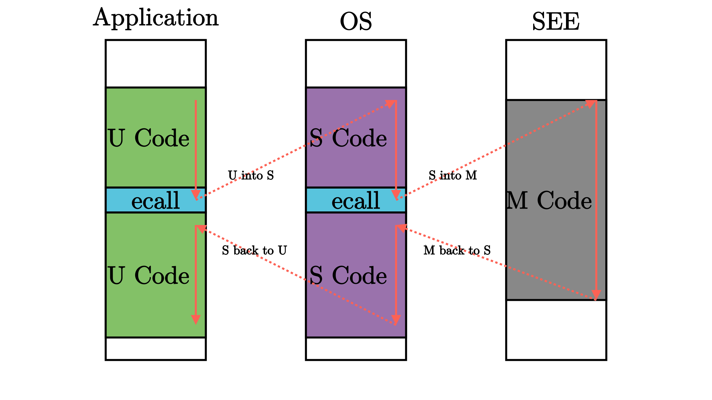

特權級機制
=====================================

.. toctree::
   :hidden:
   :maxdepth: 5

本節導讀
-------------------------------

為了保護我們的批處理操作系統不受到出錯應用程序的影響並全程穩定工作，單憑軟件實現是很難做到的，而是需要 CPU 提供一種特權級隔離機制，使 CPU 在執行應用程序和操作系統內核的指令時處於不同的特權級。本節主要介紹了特權級機制的軟硬件設計思路，以及 RISC-V 的特權級架構，包括特權指令的描述。

特權級的軟硬件協同設計
------------------------------------------

實現特權級機制的根本原因是應用程序運行的安全性不可充分信任。在上一章裡，操作系統以庫的形式和應用緊密連接在一起，構成一個整體來執行。隨著應用需求的增加，操作系統的體積也越來越大；同時應用自身也會越來越複雜。由於操作系統會被頻繁訪問，來給多個應用提供服務，所以它可能的錯誤會比較快地被發現。但應用自身的錯誤可能就不會很快發現。由於二者通過編譯器形成一個單一執行程序來執行，導致即使是應用程序本身的問題，也會讓操作系統受到連累，從而可能導致整個計算機系統都不可用了。

所以，計算機科學家和工程師就想到一個方法，讓相對安全可靠的操作系統運行在一個硬件保護的安全執行環境中，不受到應用程序的破壞；而讓應用程序運行在另外一個無法破壞操作系統的受限執行環境中。

為確保操作系統的安全，對應用程序而言，需要限制的主要有兩個方面：

- 應用程序不能訪問任意的地址空間（這個在第四章會進一步講解，本章不會涉及）
- 應用程序不能執行某些可能破壞計算機系統的指令（本章的重點）

假設有了這樣的限制，我們還需要確保應用程序能夠得到操作系統的服務，即應用程序和操作系統還需要有交互的手段。使得低特權級軟件只能做高特權級軟件允許它做的，且超出低特權級軟件能力的功能必須尋求高特權級軟件的幫助。這樣，高特權級軟件（操作系統）就成為低特權級軟件（一般應用）的軟件執行環境的重要組成部分。

為了實現這樣的特權級機制，需要進行軟硬件協同設計。一個比較簡潔的方法就是，處理器設置兩個不同安全等級的執行環境：用戶態特權級的執行環境和內核態特權級的執行環境。且明確指出可能破壞計算機系統的內核態特權級指令子集，規定內核態特權級指令子集中的指令只能在內核態特權級的執行環境中執行。處理器在執行指令前會進行特權級安全檢查，如果在用戶態執行環境中執行這些內核態特權級指令，會產生異常。

為了讓應用程序獲得操作系統的函數服務，採用傳統的函數調用方式（即通常的 ``call`` 和 ``ret`` 指令或指令組合）將會直接繞過硬件的特權級保護檢查。為了解決這個問題， RISC-V 提供了新的機器指令：執行環境調用指令（Execution Environment Call，簡稱 ``ecall`` ）和一類執行環境返回（Execution Environment Return，簡稱 ``eret`` ）指令。其中：

-  ``ecall`` 具有用戶態到內核態的執行環境切換能力的函數調用指令；
-  ``sret`` ：具有內核態到用戶態的執行環境切換能力的函數返回指令。

.. note:: **sret 與 eret 的聯繫與區別**

  ``eret`` 代表一類執行環境返回指令，而 ``sret`` 特指從 Supervisor 模式的執行環境（即 OS 內核）返回的那條指令，也是本書中主要用到的指令。除了 ``sret`` 之外， ``mret`` 也屬於執行環境返回指令，當從 Machine 模式的執行環境返回時使用， RustSBI 會用到這條指令。

硬件具有了這樣的機制後，還需要操作系統的配合才能最終完成對操作系統自身的保護。首先，操作系統需要提供相應的功能代碼，能在執行 ``sret`` 前準備和恢復用戶態執行應用程序的上下文。其次，在應用程序調用 ``ecall`` 指令後，能夠檢查應用程序的系統調用參數，確保參數不會破壞操作系統。

.. note::
  
  一般來說， ``ecall`` 這條指令和 ``eret`` 這類指令分別可以用來讓 CPU 從當前特權級切換到比當前高一級的特權級和切換到不高於當前的特權級，因此上面提到的兩條指令的功能僅是其中一種用法。在本書中，大多數情況我們只需考慮這種用法即可。

  讀者可能會好奇一共有多少種不同的特權級，在不同的指令集體系結構中特權級的數量也是不同的。x86 和 RISC-V 設計了多達 4 種特權級，而對於一般的操作系統而言，其實只要兩種特權級就夠了。

.. _riscv-priv-arch:

RISC-V 特權級架構
------------------------------------------

RISC-V 架構中一共定義了 4 種特權級：

.. list-table:: RISC-V 特權級
   :widths: 30 30 60
   :header-rows: 1
   :align: center

   * - 級別
     - 編碼
     - 名稱
   * - 0
     - 00
     - 用戶/應用模式 (U, User/Application)
   * - 1
     - 01
     - 監督模式 (S, Supervisor)
   * - 2
     - 10
     - 虛擬監督模式 (H, Hypervisor)
   * - 3
     - 11
     - 機器模式 (M, Machine)

其中，級別的數值越大，特權級越高，掌控硬件的能力越強。從表中可以看出， M 模式處在最高的特權級，而 U 模式處於最低的特權級。在CPU硬件層面，除了M模式必須存在外，其它模式可以不存在。

之前我們給出過支持應用程序運行的一套 :ref:`執行環境棧 <app-software-stack>` ，現在我們站在特權級架構的角度去重新看待它：

.. image:: PrivilegeStack.png
   :align: center
   :name: PrivilegeStack

.. _term-see:

和之前一樣，白色塊表示一層執行環境，黑色塊表示相鄰兩層執行環境之間的接口。這張圖片給出了能夠支持運行 Unix 這類複雜系統的軟件棧。其中操作系統內核代碼運行在 S 模式上；應用程序運行在 U 模式上。運行在 M 模式上的軟件被稱為 **監督模式執行環境** (SEE, Supervisor Execution Environment)，如在操作系統運行前負責加載操作系統的 Bootloader -- RustSBI。站在運行在 S 模式上的軟件視角來看，它的下面也需要一層執行環境支撐，因此被命名為 SEE，它需要在相比 S 模式更高的特權級下運行，一般情況下 SEE 在 M 模式上運行。

.. note::

   **按需實現 RISC-V 特權級**

   RISC-V 架構中，只有 M 模式是必須實現的，剩下的特權級則可以根據跑在 CPU 上應用的實際需求進行調整：

   - 簡單的嵌入式應用只需要實現 M 模式；
   - 帶有一定保護能力的嵌入式系統需要實現 M/U 模式；
   - 複雜的多任務系統則需要實現 M/S/U 模式。
   - 到目前為止，(Hypervisor, H)模式的特權規範還沒完全制定好，所以本書不會涉及。

之前我們提到過，執行環境的功能之一是在執行它支持的上層軟件之前進行一些初始化工作。我們之前提到的引導加載程序會在加電後對整個系統進行初始化，它實際上是 SEE 功能的一部分，也就是說在 RISC-V 架構上的引導加載程序一般運行在 M 模式上。此外，編程語言相關的標準庫也會在執行應用程序員編寫的應用程序之前進行一些初始化工作。但在這張圖中我們並沒有將應用程序的執行環境詳細展開，而是統一歸類到 U 模式軟件，也就是應用程序中。

回顧第一章，當時只是實現了簡單的支持單個裸機應用的庫級別的“三葉蟲”操作系統，它和應用程序全程運行在 S 模式下，應用程序很容易破壞沒有任何保護的執行環境--操作系統。而在後續的章節中，我們會涉及到RISC-V的 M/S/U 三種特權級：其中應用程序和用戶態支持庫運行在 U 模式的最低特權級；操作系統內核運行在 S 模式特權級（在本章表現為一個簡單的批處理系統），形成支撐應用程序和用戶態支持庫的執行環境；而第一章提到的預編譯的 bootloader -- ``RustSBI`` 實際上是運行在更底層的 M 模式特權級下的軟件，是操作系統內核的執行環境。整個軟件系統就由這三層運行在不同特權級下的不同軟件組成。

在特權級相關機制方面，本書正文中我們重點關心 RISC-V 的 S/U 特權級， M 特權級的機制細節則是作為可選內容在 :doc:`/appendix-c/index` 中講解，有興趣的同學可以參考。

.. _term-trap:

執行環境的另一種功能是對上層軟件的執行進行監控管理。監控管理可以理解為，當上層軟件執行的時候出現了一些異常或特殊情況，導致需要用到執行環境中提供的功能，因此需要暫停上層軟件的執行，轉而運行執行環境的代碼。由於上層軟件和執行環境被設計為運行在不同的特權級，這個過程也往往（而 **不一定** ）伴隨著 CPU 的 **特權級切換** 。當執行環境的代碼運行結束後，我們需要回到上層軟件暫停的位置繼續執行。在 RISC-V 架構中，這種與常規控制流（順序、循環、分支、函數調用）不同的 **異常控制流** (ECF, Exception Control Flow) 被稱為 **異常（Exception）** ，是 RISC-V 語境下的 Trap 種類之一。

.. _term-exception:

用戶態應用直接觸發從用戶態到內核態的異常的原因總體上可以分為兩種：其一是用戶態軟件為獲得內核態操作系統的服務功能而執行特殊指令；其二是在執行某條指令期間產生了錯誤（如執行了用戶態不允許執行的指令或者其他錯誤）並被 CPU 檢測到。下表中我們給出了 RISC-V 特權級規範定義的會可能導致從低特權級到高特權級的各種 **異常**：

.. list-table:: RISC-V 異常一覽表
   :align: center
   :header-rows: 1
   :widths: 30 30 60

   * - Interrupt
     - Exception Code
     - Description
   * - 0
     - 0
     - Instruction address misaligned
   * - 0
     - 1
     - Instruction access fault
   * - 0
     - 2
     - Illegal instruction
   * - 0
     - 3
     - Breakpoint
   * - 0
     - 4
     - Load address misaligned
   * - 0
     - 5
     - Load access fault
   * - 0
     - 6
     - Store/AMO address misaligned
   * - 0
     - 7
     - Store/AMO access fault
   * - 0
     - 8
     - Environment call from U-mode
   * - 0
     - 9
     - Environment call from S-mode
   * - 0
     - 11
     - Environment call from M-mode
   * - 0
     - 12
     - Instruction page fault
   * - 0
     - 13
     - Load page fault
   * - 0
     - 15
     - Store/AMO page fault

.. _term-environment-call:

其中 **斷點** (Breakpoint) 和 **執行環境調用** (Environment call) 兩種異常（為了與其他非有意為之的異常區分，會把這種有意為之的指令稱為 *陷入* 或 *trap* 類指令，此處的陷入為操作系統中傳統概念）是通過在上層軟件中執行一條特定的指令觸發的：執行 ``ebreak`` 這條指令之後就會觸發斷點陷入異常；而執行 ``ecall`` 這條指令時候則會隨著 CPU 當前所處特權級而觸發不同的異常。從表中可以看出，當 CPU 分別處於 M/S/U 三種特權級時執行 ``ecall`` 這條指令會觸發三種異常（分別參考上表 Exception Code 為 11/9/8 對應的行）。

.. _term-sbi:
.. _term-abi:

在這裡我們需要說明一下執行環境調用 ``ecall`` ，這是一種很特殊的 *陷入* 類的指令， :ref:`上圖 <PrivilegeStack>` 中相鄰兩特權級軟件之間的接口正是基於這種陷入機制實現的。M 模式軟件 SEE 和 S 模式的內核之間的接口被稱為 **監督模式二進制接口** (Supervisor Binary Interface, SBI)，而內核和 U 模式的應用程序之間的接口被稱為 **應用程序二進制接口** (Application Binary Interface, ABI)，當然它有一個更加通俗的名字—— **系統調用** (syscall, System Call) 。而之所以叫做二進制接口，是因為它與高級編程語言的內部調用接口不同，是機器/彙編指令級的一種接口。事實上 M/S/U 三個特權級的軟件可分別由不同的編程語言實現，即使是用同一種編程語言實現的，其調用也並不是普通的函數調用控制流，而是 **陷入異常控制流** ，在該過程中會切換 CPU 特權級。因此只有將接口下降到機器/彙編指令級才能夠滿足其跨高級語言的通用性和靈活性。

可以看到，在這樣的架構之下，每層特權級的軟件都只能做高特權級軟件允許它做的、且不會產生什麼撼動高特權級軟件的事情，一旦低特權級軟件的要求超出了其能力範圍，就必須尋求高特權級軟件的幫助，否則就是一種異常行為了。因此，在軟件（應用、操作系統等）執行過程中我們經常能夠看到特權級切換。如下圖所示：

.. _term-csr:

其他的異常則一般是在執行某一條指令的時候發生了某種錯誤（如除零、無效地址訪問、無效指令等），或處理器認為處於當前特權級下執行的當前指令是高特權級指令或會訪問不應該訪問的高特權級的資源（可能危害系統）。碰到這些情況，就需要將控制轉交給高特權級的軟件（如操作系統）來處理。當錯誤/異常恢復後，則可重新回到低優先級軟件去執行；如果不能恢復錯誤/異常，那高特權級軟件可以殺死和清除低特權級軟件，避免破壞整個執行環境。

.. _term-csr-instr:

RISC-V的特權指令
^^^^^^^^^^^^^^^^^^^^^^^^^

與特權級無關的一般的指令和通用寄存器 ``x0`` ~ ``x31`` 在任何特權級都可以執行。而每個特權級都對應一些特殊指令和 **控制狀態寄存器** (CSR, Control and Status Register) ，來控制該特權級的某些行為並描述其狀態。當然特權指令不僅具有讀寫 CSR 的指令，還有其他功能的特權指令。

如果處於低特權級狀態的處理器執行了高特權級的指令，會產生非法指令錯誤的異常。這樣，位於高特權級的執行環境能夠得知低特權級的軟件出現了錯誤，這個錯誤一般是不可恢復的，此時執行環境會將低特權級的軟件終止。這在某種程度上體現了特權級保護機制的作用。

在 RISC-V 中，會有兩類屬於高特權級 S 模式的特權指令：

- 指令本身屬於高特權級的指令，如 ``sret`` 指令（表示從 S 模式返回到 U 模式）。
- 指令訪問了 :ref:`S模式特權級下才能訪問的寄存器 <term-s-mod-csr>` 或內存，如表示S模式系統狀態的 **控制狀態寄存器** ``sstatus`` 等。

.. list-table:: RISC-V S模式特權指令
   :align: center
   :header-rows: 1
   :widths: 30 60

   * - 指令
     - 含義
   * - sret
     - 從 S 模式返回 U 模式：在 U 模式下執行會產生非法指令異常
   * - wfi
     - 處理器在空閒時進入低功耗狀態等待中斷：在 U 模式下執行會產生非法指令異常
   * - sfence.vma
     - 刷新 TLB 緩存：在 U 模式下執行會產生非法指令異常     
   * - 訪問 S 模式 CSR 的指令
     - 通過訪問 :ref:`sepc/stvec/scause/sscartch/stval/sstatus/satp等CSR <term-s-mod-csr>` 來改變系統狀態：在 U 模式下執行會產生非法指令異常

在下一節中，我們將看到 :ref:`在 U 模式下運行的用戶態應用程序 <term-csr-instr-app>` ，如果執行上述 S 模式特權指令，將會產生非法指令異常，從而看出 RISC-V 的特權模式提供了對操作系統一定程度的保護。

.. 
   * - mret
     - 從M模式返回S/U模式。在S/U模式下執行會產生非法指令異常
   隨著特權級的逐漸降低，硬件的能力受到限制，
   從每一個特權級看來，比它特權級更低的部分都可以看成是它的應用。（這個好像沒啥用？）
   M 模式是每個 RISC-V CPU 都需要實現的模式，而剩下的模式都是可選的。常見的模式組合：普通嵌入式應用只需要在 M 模式上運行；追求安全的
   嵌入式應用需要在 M/U 模式上運行；像 Unix 這樣比較複雜的系統這需要 M/S/U 三種模式。
   RISC-V 特權級規範中給出了一些特權寄存器和特權指令...
   重要的是保護，也就是特權級的切換。當 CPU 處於低特權級的時候，如果發生了錯誤或者一些需要處理的情況，CPU 會切換到高特權級進行處理。這個
   就是所謂的 Trap 機制。
   RISC-V 架構規範分為兩部分： `RISC-V 無特權級規範 <https://github.com/riscv/riscv-isa-manual/releases/download/Ratified-IMAFDQC/riscv-spec-20191213.pdf>`_ 
   和 `RISC-V 特權級規範 <https://github.com/riscv/riscv-isa-manual/releases/download/Ratified-IMFDQC-and-Priv-v1.11/riscv-privileged-20190608.pdf>`_ 。
   RISC-V 無特權級規範中給出的指令和寄存器無論在 CPU 處於哪個特權級下都可以使用。
