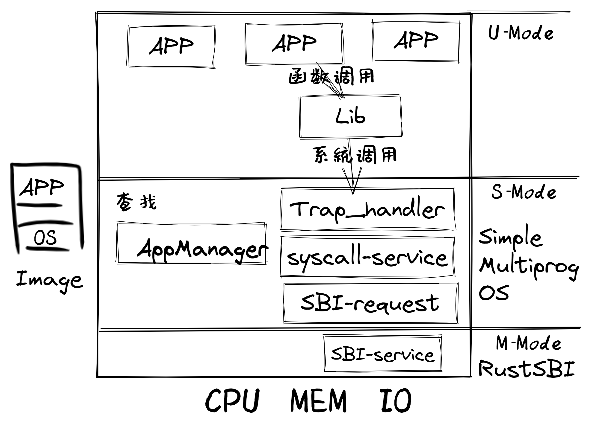

引言
========================================

本章導讀
--------------------------

..
  chyyuu：有一個ascii圖，畫出我們做的OS。

提高系統的性能和效率是操作系統的核心目標之一，本章展現了操作系統在性能上的一系列功能改進：

- 通過提前加載應用程序到內存，減少應用程序切換開銷
- 通過協作機制支持程序主動放棄處理器，提高系統執行效率
- 通過搶佔機制支持程序被動放棄處理器，保證不同程序對處理器資源使用的公平性，也進一步提高了應用對 I/O 事件的響應效率

上一章，我們實現了一個安全的“鄧式魚” 批處理操作系統。首先，它能夠自動按照順序加載並運行序列中的每一個應用，當一個應用運行結束之後無需操作員的手動替換；另一方面，在硬件級特權隔離機制的幫助下，運行在更高特權級的操作系統不會受到有意或者無意出錯的應用的影響；在硬件異常觸發機制的幫助下，可以全方位監控運行在用戶態低特權級的應用執行，一旦應用越過了特權級界限或主動申請獲得操作系統的服務，就會觸發 Trap 並進入到批處理系統中進行處理。無論原因是應用出錯或是應用聲明自己執行完畢，批處理系統都只需要加載應用序列中的下一個應用並讓其執行。可以看到批處理系統的特性是：在內存中同一時間最多隻需駐留一個應用。這是因為只有當一個應用出錯或退出之後，批處理系統才會去將另一個應用加載到相同的一塊內存區域。

而計算機硬件在快速發展，內存容量在逐漸增大，處理器的速度也在增加，外設 I/O 性能方面的進展不大。這就使得以往內存只能放下一個程序的情況得到很大改善，但處理器的空閒程度加大了。於是科學家就開始考慮在內存中儘量同時駐留多個應用，這樣處理器的利用率就會提高。但只有一個程序執行完畢後或主動放棄執行，處理器才能執行另外一個程序。我們把這種運行方式稱為 **多道程序（Multiprogramming）** 。

協作式操作系統 
^^^^^^^^^^^^^^^^^^^^^^^^^^^^^^^^^^^^^^

早期的計算機系統大部分是單處理器計算機系統，由於計算機系統很昂貴，所以是多人共用一臺計算機。當處理器進一步發展後，它與 I/O 的速度差距也進一步拉大。這時計算機科學家發現，在 **多道程序** 運行方式下，一個程序如果不讓出處理器，其他程序是無法執行的。如果一個應用由於 I/O 操作讓處理器空閒下來或讓處理器忙等，那其他需要處理器資源進行計算的應用還是沒法使用空閒的處理器資源。於是就想到，讓應用在執行 I/O 操作或空閒時，可以主動 *釋放處理器* ，讓其他應用繼續執行。當然執行 *放棄處理器* 的操作算是一種對處理器資源的直接管理，所以應用程序可以發出這樣的系統調用，讓操作系統來具體完成。這樣的操作系統就是支持 **多道程序** 或 **協作式多任務** 的協作式操作系統。

搶佔式操作系統
^^^^^^^^^^^^^^^^^^^^^^^^^^^^^^^^^^^^^^^^

計算機科學家很快發現，編寫應用程序的科學家（簡稱應用程序員）來自不同的領域，他們不一定有友好互助的意識，也不瞭解其它程序的執行情況，很難（也沒必要）有提高整個系統利用率上的大局觀。在他們的腦海裡，整個計算機就應該是為他們自己的應用準備的，不用考慮其他程序的運行。這導致應用程序員在編寫程序時，無法做到在程序的合適位置放置 **放棄處理器的系統調用請求** ，這樣系統的整體利用率還是無法提高。

所以，站在系統的層面，還是需要有一種辦法能強制打斷應用程序的執行，來提高整個系統的效率，讓在整個系統中執行的多個程序之間佔用計算機資源的情況相對公平一些。根據計算機系統的硬件設計，為提高 I/O 效率，外設可以通過硬件中斷機制來與處理機進行 I/O 交互操作。這種硬件中斷機制可隨時打斷應用程序的執行，並讓操作系統來完成對外設的 I/O 響應。

而操作系統可進一步利用某種以固定時長為時間間隔的外設中斷（比如時鐘中斷）來強制打斷一個程序的執行，這樣一個程序只能運行一段時間（可以簡稱為一個時間片, Time Slice）就一定會讓出處理器，且操作系統可以在處理外設的 I/O 響應後，讓不同應用程序分時佔用處理器執行，並可通過統計程序佔用處理器的總執行時間，來評估運行的程序對處理器資源的消耗。我們把這種運行方式稱為 **分時共享（Time Sharing）** 或 **搶佔式多任務（Multitasking）** ，也可合併在一起稱為 **分時多任務** 。 

.. _term-task:

我們可以把一個程序的一次完整執行過程稱為一次 **任務** (Task)，把一個程序在一個時間片（Time Slice）上佔用處理器執行的過程稱為一個 **任務片** (Task Slice)。操作系統對不同程序的執行過程中的 **任務片** 進行調度和管理，即通過平衡各個程序在整個時間段上的任務片數量，就能達到一定程度的系統公平和高效的系統效率。在一個包含多個時間片的時間段上，會有屬於不同程序的多個任務片在輪流佔用處理器執行，這樣的操作系統就是支持 **分時多任務** 或 **搶佔式多任務** 的搶佔式操作系統。

.. chyyuu 中斷的歷史  https://people.cs.clemson.edu/~mark/interrupts.html  
   http://www.cap-lore.com/Hardware/int.html
   https://en.wikipedia.org/wiki/Interrupt
   https://multicians.org/thvv/7094.html  IBM 7094 和 CTSS 提到 約翰.麥卡錫寫的 "A Time Sharing Operator Program for Our Projected IBM 709" dated January 1, 1959 that proposed interactive time-shared debugging.
   http://www-formal.stanford.edu/jmc/history/timesharing/timesharing.html   約翰.麥卡錫寫的對分時的歷史的回憶

.. chyyuu 
   https://en.wikipedia.org/wiki/Batch_processing 介紹了具有多道程序功能的第三代計算機[3]於 1960 年代開始出現
   https://en.wikipedia.org/wiki/Computer_multitasking
   https://en.wikipedia.org/wiki/Cooperative_multitasking
   http://www.classiccmp.org/cini/pdf/HT68K/HT68K%20TCJ30p37.pdf Joe Bartel (November 5, 2011). "Non-Preemptive Multitasking" (PDF). classiccmp.org. Retrieved August 15, 2015.

   https://en.wikipedia.org/wiki/Microsoft_Windows#Windows_3.x
   https://en.wikipedia.org/wiki/Classic_Mac_OS
   https://en.wikipedia.org/wiki/Time-sharing_system_evolution
   THE EVOLUTION OF OPERATING SYSTEMS∗ PER BRINCH HANSEN 2000

   https://en.wikipedia.org/wiki/Compatible_Time-Sharing_System 介紹了CTSS
   http://www-formal.stanford.edu/jmc/history/timesharing/timesharing.html 約翰麥卡錫，斯坦福大學 對分時歷史的回憶

.. note::

   **支持多道程序的各種操作系統**
   
   支持多道程序的第一臺計算機是 1961 年的英國 Leo III 計算機，支持在計算機內存中加載幾個不同的程序，並從第一個開始依次運行。當第一個程序到達等待外圍設備的指令時，該程序的執行上下文被保存下來，內存中的第二個程序就有機會運行。該過程一直持續到所有程序運行完畢。但 1960 年以後，美國人已經佔領了英國計算機市場的大部分，他們的機器設計得更好，更可靠，最重要的是更便宜。隨著時間的推移，英國的計算機制造逐漸消失。

   **協作式操作系統**

   對於計算機硬件而言，中斷機制很早就出現了，但利用中斷機制實現搶佔式多任務，會涉及到不少併發的問題，這對操作系統設計是一個比較大的挑戰。所以一些相對簡單的操作系統採用協作式的任務調度管理方式，如微軟早期（1990~1998 年）的 Windows 3.x/9x 操作系統和蘋果早期（1987~2001 年）的 Mac OS 操作系統中的 MultiFinder 擴展功能。Windows 和 Mac OS 都是有著漂亮的 GUI 界面的操作系統，它們都採用了協作多任務處理模型，這意味著只有在前臺應用程序主動讓出控制權時（比如，在等待鍵盤或鼠標輸入時），才將 CPU 時間分配給後臺應用程序執行。由於具有便於沒有計算機知識的人上手的GUI界面，儘管早期 Windows 操作系統任務管理能力較弱，它仍迅速佔領 PC 市場，統治了我們的桌面。

 
   **分時共享（Time Sharing）的本質**

   1959 年 1 月 1 日，John McCarthy 在 MIT 的一份未發表的備忘錄中提出了分時共享最初想法：“我想提出一個在 IBM 709 計算機上的操作系統的設計思路，它將大大減少用戶/程序員在機器上求解問題的時間 ... 。能夠讓計算機以可承受的成本提供快速響應的唯一方法是通過分時共享。也就是說，當一個用戶對某些輸出進行處理時，計算機必須去照顧到其他用戶。我認為該提案指出了未來所有計算機的操作方式，我們有機會在計算機使用方式上開拓出一大步。”

   在 1961 年的春天，John McCarthy 進一步解釋了他的遠見卓識：“我所說的分時計算機系統是指通過一些遠程控制檯與許多用戶同步互動的計算機系統。這樣一個系統對每個用戶來說就像一臺大型的私人電腦。當用戶需要服務時，他只需開始輸入請求服務的信息。計算機隨時準備關注他可能敲擊的任何鍵。因為程序可能 ... 在人與人之間的互動中只做相對較短的工作,所以必須不斷地在二級存儲中來回穿梭,這是不經濟的做法。因此,需要有一個大的主存儲器。 ... 最後的要求是二級存儲要足夠大,以維持用戶的文件,這樣用戶就不需要有單獨的卡或磁帶輸入輸出單元。”

   從 John McCarthy 的文章中，我們可以看到，分時共享的核心目標是讓多個用戶共享使用一臺計算機，且每個用戶感覺自己是在獨佔這臺強大的計算機。為達到這一目標，需要計算機硬件和操作系統充分協作，達到兩個要素：及時響應和快速執行。首先，計算機要有硬件中斷機制，這樣在必要的時候（用戶敲鍵盤或時間片到了），硬件能通過中斷打斷當前執行的應用程序，把控制權交給操作系統，讓操作系統切換到需要及時響應用戶需求的應用程序。其次，計算機要有足夠大的主存，這樣應用程序都能放到主存中，這是實現快速保存/恢復程序執行狀態並能快速持續執行程序的重要條件之一。

   **搶佔式操作系統：支持現代雲計算的古老 Compatible Time-Sharing System (CTSS) 操作系統**

   搶佔式操作系統的典型代表是支持分時多任務的操作系統。CTSS 操作系統是 MIT 的 Fernando J. Corbató 帶領團隊開發的第一個分時操作系統。CTSS 於 1961 年 11 月首次在 MIT 的 IBM 709 上演示，在 1963-1973年期間，為麻省理工學院用戶提供服務。CTSS 的“兼容性”是指兼容以往的批處理運行方式，即在同一臺計算機上運行後臺作業，這通常比分時功能使用更多的計算資源。

   CTSS 操作系統包括一個位於處理器保護模式（內核態）中的內核，內核中的監管功能只能通過軟件中斷（即系統調用接口）來調用，這與運行在內核態的現代操作系統一樣。處理器分配調度算法是多級反饋隊列算法，調度的時間片單位為 200 ms。硬件產生時鐘中斷後會跳轉到 CTSS 操作系統內核中進行進一步處理（比如進行任務切換）。

   CTSS 操作系統的實現允許一臺昂貴的大型機被大量不同用戶群分時併發使用，且每個用戶感覺上是在獨佔這臺強大的機器，這在當時引起了廣泛的關注，並影響了後續一系列操作系統的發展，現在的操作系統基本上都支持分時共享的基礎功能。CTSS 是操作系統又一個革命性的突破。

本章所介紹的多道程序和分時多任務系統都有一些共同的特點：在內存中同一時間可以駐留多個應用，而且所有的應用都是在系統啟動的時候分別加載到內存的不同區域中。由於目前計算機系統中只有一個處理器核，所以同一時間最多隻有一個應用在執行（即處於運行狀態），剩下的應用處於就緒狀態或等待狀態，需要內核將處理器分配給它們才能開始執行。一旦應用開始執行，它就處於運行狀態了。

本章主要是設計和實現建立支持 **多道程序** 的二疊紀“鋸齒螈” [#prionosuchus]_ 初級操作系統、支持 **多道程序** 的三疊紀“始初龍” [#eoraptor]_ 協作式操作系統和支持 **分時多任務** 的三疊紀“腔骨龍” [#coelophysis]_ 搶佔式操作系統，從而對可支持運行一批應用程序的多種執行環境有一個全面和深入的理解，並可歸納抽象出 **任務** 、 **任務切換** 等操作系統的概念。

.. hint::

   同學也許會有疑問：由於只有一個處理器，即使這樣做，同一時間最多還是隻能運行一個應用，還浪費了更多的內存來把所有的應用都加載進來。那麼這樣做有什麼意義呢？

   同學可以帶著這個問題繼續看下去。後面我們會介紹這樣做到底能夠解決什麼問題。

.. hint::

   **批處理與多道程序的區別是什麼？**

   對於批處理系統而言，它在一段時間內可以處理一批程序，但內存中只放一個程序，處理器一次只能運行一個程序，只有在一個程序運行完畢後再把另外一個程序調入內存，並執行。即批處理系統不能交錯執行多個程序。

   對於支持多道程序的系統而言，它在一段時間內也可以處理一批程序，但內存中可以放多個程序，一個程序在執行過程中，可以主動（協作式）或被動（搶佔式）地放棄自己的執行，讓另外一個程序執行。即支持多道程序的系統可以交錯地執行多個程序，這樣系統的利用率會更高。

實踐體驗
-------------------------------------

.. _term-multiprogramming:
.. _term-time-sharing-multitasking:

**多道程序** (Multiprogramming) 和 **分時多任務** (Time-Sharing Multitasking) 對於應用的要求是不同的，因此我們分別為它們編寫了不同的應用，代碼也被放在兩個不同的分支上。對於它們更加深入的講解請參考本章正文，我們在引言中僅給出運行代碼的方法。

獲取多道程序的代碼：

.. code-block:: console

   $ git clone https://github.com/rcore-os/rCore-Tutorial-v3.git
   $ cd rCore-Tutorial-v3
   $ git checkout ch3-coop

獲取分時多任務系統的代碼：

.. code-block:: console

   $ git clone https://github.com/rcore-os/rCore-Tutorial-v3.git
   $ cd rCore-Tutorial-v3
   $ git checkout ch3

在 qemu 模擬器上運行本章代碼：

.. code-block:: console

   $ cd os
   $ make run

多道程序的應用分別會輸出一個不同的字母矩陣。當他們交替執行的時候，我們將看到字母行的交錯輸出：

.. code-block::

    [RustSBI output]
    [kernel] Hello, world!
    AAAAAAAAAA [1/5]
    BBBBBBBBBB [1/2]
    CCCCCCCCCC [1/3]
    AAAAAAAAAA [2/5]
    BBBBBBBBBB [2/2]
    CCCCCCCCCC [2/3]
    AAAAAAAAAA [3/5]
    Test write_b OK!
    [kernel] Application exited with code 0
    CCCCCCCCCC [3/3]
    AAAAAAAAAA [4/5]
    Test write_c OK!
    [kernel] Application exited with code 0
    AAAAAAAAAA [5/5]
    Test write_a OK!
    [kernel] Application exited with code 0
    [kernel] Panicked at src/task/mod.rs:106 All applications completed!

分時多任務系統應用分為兩種。編號為 00/01/02 的應用分別會計算質數 3/5/7 的冪次對一個大質數取模的餘數，並會將結果階段性輸出。編號為 03 的應用則會等待三秒鐘之後再退出。以 k210 平臺為例，我們將會看到 00/01/02 三個應用分段完成它們的計算任務，而應用 03 由於等待時間過長總是最後一個結束執行。

.. code-block::

    [RustSBI output]
    [kernel] Hello, world!
    power_3 [10000/200000]
    power_3 [20000/200000]
    power_3 [30000/200000power_5 [10000/140000]
    power_5 [20000/140000]
    power_5 [30000/140000power_7 [10000/160000]
    power_7 [20000/160000]
    power_7 [30000/160000]
    ]
    power_3 [40000/200000]
    power_3 [50000/200000]
    power_3 [60000/200000]
    power_5 [40000/140000]
    power_5 [50000/140000]
    power_5 [60000/140000power_7 [40000/160000]
    power_7 [50000/160000]
    power_7 [60000/160000]
    ]
    power_3 [70000/200000]
    power_3 [80000/200000]
    power_3 [90000/200000]
    power_5 [70000/140000]
    power_5 [80000/140000]
    power_5 [90000/140000power_7 [70000/160000]
    power_7 [80000/160000]
    power_7 [90000/160000]
    ]
    power_3 [100000/200000]
    power_3 [110000/200000]
    power_3 [120000/]
    power_5 [100000/140000]
    power_5 [110000/140000]
    power_5 [120000/power_7 [100000/160000]
    power_7 [110000/160000]
    power_7 [120000/160000200000]
    power_3 [130000/200000]
    power_3 [140000/200000]
    power_3 [150000140000]
    power_5 [130000/140000]
    power_5 [140000/140000]
    5^140000 = 386471875]
    power_7 [130000/160000]
    power_7 [140000/160000]
    power_7 [150000/160000/200000]
    power_3 [160000/200000]
    power_3 [170000/200000]
    power_3 [
    Test power_5 OK!
    [kernel] Application exited with code 0
    ]
    power_7 [160000/160000]
    7180000/200000]
    power_3 [190000/200000]
    power_3 [200000/200000]
    3^200000 = 871008973^160000 = 667897727
    Test power_7 OK!
    [kernel] Application exited with code 0

    Test power_3 OK!
    [kernel] Application exited with code 0
    Test sleep OK!
    [kernel] Application exited with code 0
    [kernel] Panicked at src/task/mod.rs:98 All applications completed!
    [rustsbi] reset triggered! todo: shutdown all harts on k210; program halt. Type: 0, reason: 0

輸出結果看上去有一些混亂，原因是用戶程序的每個 ``println!`` 往往會被拆分成多個 ``sys_write`` 系統調用提交給內核。有興趣的同學可以參考 ``println!`` 宏的實現。

另外需要說明的是一點是：與上一章不同，應用的編號不再決定其被加載運行的先後順序，而僅僅能夠改變應用被加載到內存中的位置。

本章代碼樹
-----------------------------------

鋸齒螈多道程序操作系統 - Multiprog OS的總體結構如下圖所示：

通過上圖，大致可以看出Qemu把包含多個app的列表和MultiprogOS的image鏡像加載到內存中，RustSBI（bootloader）完成基本的硬件初始化後，跳轉到MultiprogOS起始位置，MultiprogOS首先進行正常運行前的初始化工作，即建立棧空間和清零bss段，然後通過改進的 `AppManager` 內核模塊從app列表中把所有app都加載到內存中，並按指定順序讓app在用戶態一個接一個地執行。app在執行過程中，會通過系統調用的方式得到MultiprogOS提供的OS服務，如輸出字符串等。

始初龍協作式多道程序操作系統 -- CoopOS的總體結構如下圖所示：

.. image:: ../../os-lectures/lec4/figs/more-task-multiprog-os-detail.png
   :align: center
   :scale: 20 %
   :name: more-task-multiprog-os-detail
   :alt: 始初龍協作式多道程序操作系統 -- CoopOS總體結構

通過上圖，大致可以看出相對於MultiprogOS，CoopOS進一步改進了 `AppManager` 內核模塊，把它拆分為負責加載應用的 `Loader` 內核模塊和管理應用運行過程的 `TaskManager` 內核模塊。 `TaskManager` 通過 `task` 任務控制塊來管理應用程序的執行過程，支持應用程序主動放棄 CPU 並切換到另一個應用繼續執行，從而提高系統整體執行效率。應用程序在運行時有自己所在的內存空間和棧，確保被切換時相關信息不會被其他應用破壞。如果當前應用程序正在運行，則該應用對應的任務處於運行（Running）狀態；如果該應用主動放棄處理器，則該應用對應的任務處於就緒（Ready）狀態。操作系統進行任務切換時，需要把要暫停任務的上下文（即任務用到的通用寄存器）保存起來，把要繼續執行的任務的上下文恢復為暫停前的內容，這樣就能讓不同的應用協同使用處理器了。

腔骨龍分時多任務操作系統 -- TimesharingOS的總體結構如下圖所示：

.. image:: ../../os-lectures/lec4/figs/time-task-multiprog-os-detail.png
   :align: center
   :scale: 20 %
   :name: time-task-multiprog-os-detail
   :alt: 腔骨龍分時多任務操作系統 -- TimesharingOS總體結構

通過上圖，大致可以看出相對於CoopOS，TimesharingOS最大的變化是改進了 `Trap_handler` 內核模塊，支持時鐘中斷，從而可以搶佔應用的執行。並通過進一步改進 `TaskManager` 內核模塊，提供任務調度功能，這樣可以在收到時鐘中斷後統計任務的使用時間片，如果任務的時間片用完後，則切換任務。從而可以公平和高效地分時執行多個應用，提高系統的整體效率。

位於 ``ch3`` 分支上的腔骨龍分時多任務操作系統 -- TimesharingOS 的源代碼如下所示：

這裡

.. code-block::
    :linenos:
    :emphasize-lines: 14

    ./os/src
    Rust        18 Files   511 Lines
    Assembly     3 Files    82 Lines

    ├── bootloader
    │   └── rustsbi-qemu.bin
    ├── LICENSE
    ├── os
    │   ├── build.rs
    │   ├── Cargo.toml
    │   ├── Makefile
    │   └── src
    │       ├── batch.rs(移除：功能分別拆分到 loader 和 task 兩個子模塊)
    │       ├── config.rs(新增：保存內核的一些配置)
    │       ├── console.rs
    │       ├── entry.asm
    │       ├── lang_items.rs
    │       ├── link_app.S
    │       ├── linker-qemu.ld
    │       ├── loader.rs(新增：將應用加載到內存並進行管理)
    │       ├── main.rs(修改：主函數進行了修改)
    │       ├── sbi.rs(修改：引入新的 sbi call set_timer)
    │       ├── sync
    │       │   ├── mod.rs
    │       │   └── up.rs
    │       ├── syscall(修改：新增若干 syscall)
    │       │   ├── fs.rs
    │       │   ├── mod.rs
    │       │   └── process.rs
    │       ├── task(新增：task 子模塊，主要負責任務管理)
    │       │   ├── context.rs(引入 Task 上下文 TaskContext)
    │       │   ├── mod.rs(全局任務管理器和提供給其他模塊的接口)
    │       │   ├── switch.rs(將任務切換的彙編代碼解釋為 Rust 接口 __switch)
    │       │   ├── switch.S(任務切換的彙編代碼)
    │       │   └── task.rs(任務控制塊 TaskControlBlock 和任務狀態 TaskStatus 的定義)
    │       ├── timer.rs(新增：計時器相關)
    │       └── trap
    │           ├── context.rs
    │           ├── mod.rs(修改：時鐘中斷相應處理)
    │           └── trap.S
    ├── README.md
    ├── rust-toolchain
    └── user
        ├── build.py(新增：使用 build.py 構建應用使得它們佔用的物理地址區間不相交)
        ├── Cargo.toml
        ├── Makefile(修改：使用 build.py 構建應用)
        └── src
            ├── bin(修改：換成第三章測例)
            │   ├── 00power_3.rs
            │   ├── 01power_5.rs
            │   ├── 02power_7.rs
            │   └── 03sleep.rs
            ├── console.rs
            ├── lang_items.rs
            ├── lib.rs
            ├── linker.ld
            └── syscall.rs

本章代碼導讀
-----------------------------------------------------

本章的重點是實現對應用之間的協作式和搶佔式任務切換的操作系統支持。與上一章的操作系統實現相比，有如下一些不同的情況導致實現上也有差異：

- 多個應用同時放在內存中，所以他們的起始地址是不同的，且地址範圍不能重疊
- 應用在整個執行過程中會暫停或被搶佔，即會有主動或被動的任務切換

這些實現上差異主要集中在對應用程序執行過程的管理、支持應用程序暫停的系統調用和主動切換應用程序所需的時鐘中斷機制的管理。
  
對於第一個不同情況，需要對應用程序的地址空間佈局進行調整，每個應用的地址空間都不相同，且不能重疊。這並不要修改應用程序本身，而是通過一個腳本 ``build.py`` 來針對每個應用程序修改鏈接腳本 ``linker.ld`` 中的 ``BASE_ADDRESS`` ，讓編譯器在編譯不同應用時用到的 ``BASE_ADDRESS`` 都不同，且有足夠大的地址間隔。這樣就可以讓每個應用所在的內存空間是不同的。

對於第二個不同情況，需要實現任務切換，這就需要在上一章的 Trap 上下文切換的基礎上，再加上一個 Task 上下文切換，才能完成完整的任務切換。這裡面的關鍵數據結構是表示應用執行上下文的 ``TaskContext`` 數據結構和具體完成上下文切換的彙編語言編寫的 ``__switch`` 函數。一個應用的執行需要被操作系統管理起來，這是通過 ``TaskControlBlock`` 數據結構來表示應用執行上下文的動態執行過程和狀態（運行態、就緒態等）。而為了做好應用程序第一次執行的前期初始化準備， ``TaskManager`` 數據結構的全局變量實例 ``TASK_MANAGER`` 描述了應用程序初始化所需的數據， 而對 ``TASK_MANAGER`` 的初始化賦值過程是實現這個準備的關鍵步驟。

應用程序可以在用戶態執行中主動暫停，這需要有新的系統調用 ``sys_yield`` 的實現來支持；為了支持搶佔應用執行的搶佔式切換，還要添加對時鐘中斷的處理。有了時鐘中斷，就可以在確定時間間隔內打斷應用的執行，並主動切換到另外一個應用，這部分主要是通過對 ``trap_handler`` 函數中進行擴展，來完成在時鐘中斷產生時可能進行的任務切換。 ``TaskManager`` 數據結構的成員函數 ``run_next_task`` 來具體實現基於任務控制塊的任務切換，並會具體調用 ``__switch`` 函數完成硬件相關部分的任務上下文切換。

如果理解了上面的數據結構和相關函數的關係和相互調用的情況，那麼就比較容易理解本章改進的“鋸齒螈”、“始初龍”和“腔骨龍”操作系統了。

.. [#prionosuchus] 鋸齒螈身長可達9米，是迄今出現過的最大的兩棲動物，是二疊紀時期江河湖泊和沼澤中的頂級掠食者。
.. [#eoraptor] 始初龍（也稱始盜龍）是後三疊紀時期的兩足食肉動物，也是目前所知最早的恐龍，它們只有一米長，卻代表著恐龍的黎明。
.. [#coelophysis] 腔骨龍（也稱虛形龍）最早出現於三疊紀晚期，它體形纖細，善於奔跑，以小型動物為食。
