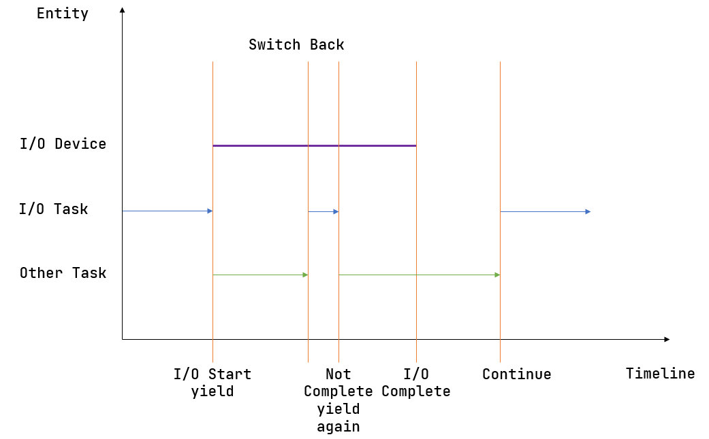
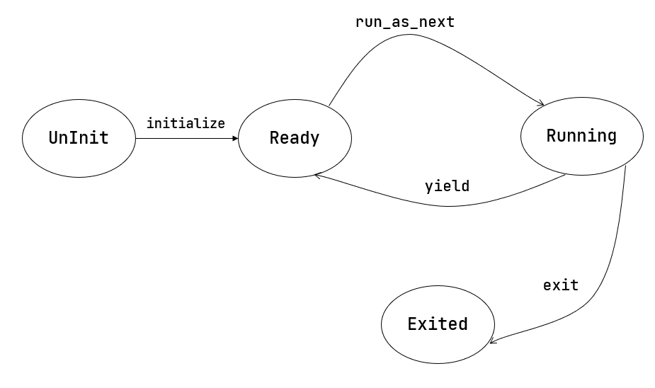

多道程序與協作式調度
=========================================

本節導讀
--------------------------

上一節我們已經介紹了任務切換是如何實現的，最終我們將其封裝為一個函數 ``__switch`` 。但是在實際使用的時候，我們需要知道何時調用該函數，以及如何確定傳入函數的兩個參數——分別代表正待換出和即將被換入的兩條 Trap 控制流。本節我們就來介紹任務切換的第一種實際應用場景：多道程序，並設計實現三疊紀“始初龍”協作式操作系統 [#eoraptor]_ 。

本節的一個重點是展示進一步增強的操作系統管理能力的和對處理器資源的相對高效利用。為此，對 **任務** 的概念進行進一步擴展和延伸：形成了

- 任務運行狀態：任務從開始到結束執行過程中所處的不同運行狀態：未初始化、準備執行、正在執行、已退出
- 任務控制塊：管理程序的執行過程的任務上下文，控制程序的執行與暫停
- 任務相關係統調用：應用程序和操作系統之間的接口，用於程序主動暫停 ``sys_yield`` 和主動退出 ``sys_exit``

這些都是三疊紀“始初龍”協作式操作系統 [#eoraptor]_ 需要具有的功能。本節的代碼可以在 ``ch3-coop`` 分支上找到。

多道程序背景與 yield 系統調用
-------------------------------------------------------------------------

還記得第二章中介紹的批處理系統的設計初衷嗎？它是注意到 CPU 並沒有一直在執行應用程序，在一個應用程序運行結束直到下一個應用程序開始運行的這段時間，可能需要操作員取出上一個程序的執行結果並手動進行穿孔卡片（卡片記錄了程序內容）的替換，這段空檔期對於寶貴的 CPU 計算資源是一種巨大的浪費。於是批處理系統橫空出世，它可以自動連續完成應用的加載和運行，並將一些本不需要 CPU 完成的簡單任務交給廉價的外圍設備，從而讓 CPU 能夠更加專注於計算任務本身，大大提高了 CPU 的利用率。

.. _term-input-output:

儘管 CPU 可以一直在跑應用了，但是其利用率仍有上升的空間。隨著應用需求的不斷複雜，有的時候會在內核的監督下訪問一些外設，它們也是計算機系統的另一個非常重要的組成部分，即 **輸入/輸出** (I/O, Input/Output) 。CPU 會把 I/O 請求傳遞給外設，待外設處理完畢之後， CPU 便可以從外設讀到其發出的 I/O 請求的處理結果。比如在從作為外部存儲的磁盤上讀取數據的時候，CPU 將要讀取的扇區的編號以及放置讀數據的內存物理地址傳給磁盤，在磁盤把扇區數據拷貝到物理內存的事務完成之後，CPU 就能在物理內存中看到要讀取的數據了。

在 CPU 對外設發出了 I/O 請求之後，由於 CPU 速度遠快於外設速度，使得 CPU 不能立即繼續執行，而是要等待（忙等或睡眠等）外設將請求處理完畢並拿到完整的處理結果之後才能繼續。那麼如何知道外設是否已經完成了請求呢？通常外設會提供一個可讀的寄存器記錄它目前的工作狀態，於是 CPU 需要不斷原地循環讀取它直到它的結果顯示設備已經將請求處理完畢了，才能繼續執行（這就是 **忙等** 的含義）。然而，外設的計算速度和 CPU 相比可能慢了幾個數量級，這就導致 CPU 有大量時間浪費在等待外設這件事情上，這段時間它幾乎沒有做任何事情，也在一定程度上造成了 CPU 的利用率不夠理想。

我們暫時考慮 CPU 只能單向地通過讀取外設提供的寄存器信息來獲取外設處理 I/O 的完成狀態。多道程序的思想在於：內核同時管理多個應用。如果外設處理 I/O 的時間足夠長，那我們可以先進行任務切換去執行其他應用；在某次切換回來之後，應用再次讀取設備寄存器，發現 I/O 請求已經處理完畢了，那麼就可以根據返回的 I/O 結果繼續向下執行了。這樣的話，只要同時存在的應用足夠多，就能一定程度上隱藏 I/O 外設處理相對於 CPU 的延遲，保證 CPU 不必浪費時間在等待外設上，而是幾乎一直在進行計算。這種任務切換，是讓應用 **主動** 調用 ``sys_yield`` 系統調用來實現的，這意味著應用主動交出 CPU 的使用權給其他應用。

這正是本節標題的後半部分“協作式”的含義。一個應用會持續運行下去，直到它主動調用 ``sys_yield`` 系統調用來交出 CPU 使用權。內核將很大的權力下放到應用，讓所有的應用互相協作來最終達成最大化 CPU 利用率，充分利用計算資源這一終極目標。在計算機發展的早期，由於應用基本上都是一些簡單的計算任務，且程序員都比較遵守規則，因此內核可以信賴應用，這樣協作式的方案是沒有問題的。

上圖描述了一種多道程序執行的典型情況。其中橫軸為時間線，縱軸為正在執行的實體。開始時，某個應用（藍色）向外設提交了一個請求，隨即可以看到對應的外設（紫色）開始工作。但是它要工作相當長的一段時間，因此應用（藍色）不會去等待它結束而是會調用 ``sys_yield`` 主動交出 CPU 使用權來切換到另一個應用（綠色）。另一個應用（綠色）在執行了一段時間之後調用了 ``sys_yield`` ，此時內核決定讓應用（藍色）繼續執行。它檢查了一下外設的工作狀態，發現請求尚未處理完，於是再次調用 ``sys_yield`` 。然後另一個應用（綠色）執行了一段時間之後 ``sys_yield`` 再次切換回這個應用（藍色），這次的不同是它發現外設已經處理完請求了，於是它終於可以向下執行了。

上面我們是通過“避免無謂的外設等待來提高 CPU 利用率”這一切入點來引入 ``sys_yield`` 。但其實調用 ``sys_yield`` 不一定與外設有關。隨著內核功能的逐漸複雜，我們還會遇到其他需要等待的事件，我們都可以立即調用 ``sys_yield`` 來避免等待過程造成的浪費。

.. note::

    **sys_yield 的缺點**

    請同學思考一下， ``sys_yield`` 存在哪些缺點？

    當應用調用它主動交出 CPU 使用權之後，它下一次再被允許使用 CPU 的時間點與內核的調度策略與當前的總體應用執行情況有關，很有可能遠遠遲於該應用等待的事件（如外設處理完請求）達成的時間點。這就會造成該應用的響應延遲不穩定或者很長。比如，設想一下，敲擊鍵盤之後隔了數分鐘之後才能在屏幕上看到字符，這已經超出了人類所能忍受的範疇。但也請不要擔心，我們後面會有更加優雅的解決方案。

.. _term-sys-yield:

我們給出 ``sys_yield`` 的標準接口：

.. code-block:: rust
    :caption: 第三章新增系統調用（一）

    /// 功能：應用主動交出 CPU 所有權並切換到其他應用。
    /// 返回值：總是返回 0。
    /// syscall ID：124
    fn sys_yield() -> isize;

然後是用戶庫對應的實現和封裝：

.. code-block:: rust
    
    // user/src/syscall.rs

    pub fn sys_yield() -> isize {
        syscall(SYSCALL_YIELD, [0, 0, 0])
    }

    // user/src/lib.rs

    pub fn yield_() -> isize { sys_yield() }

注意： ``yield`` 是 Rust 的關鍵字，因此我們只能將應用直接調用的接口命名為 ``yield_`` 。

接下來我們介紹內核應如何實現該系統調用。

任務控制塊與任務運行狀態
---------------------------------------------------------

在第二章批處理系統中我們只需知道目前執行到第幾個應用就行了，因為在一段時間內，內核只管理一個應用，當它出錯或退出之後內核會將其替換為另一個。然而，一旦引入了任務切換機制就沒有那麼簡單了。在一段時間內，內核需要管理多個未完成的應用，而且我們不能對應用完成的順序做任何假定，並不是先加入的應用就一定會先完成。這種情況下，我們必須在內核中對每個應用分別維護它的運行狀態，目前有如下幾種：

.. code-block:: rust
    :linenos:

    // os/src/task/task.rs

    #[derive(Copy, Clone, PartialEq)]
    pub enum TaskStatus {
        UnInit, // 未初始化
        Ready, // 準備運行
        Running, // 正在運行
        Exited, // 已退出
    }

.. note::

    **Rust Tips：#[derive]**

    通過 ``#[derive(...)]`` 可以讓編譯器為你的類型提供一些 Trait 的默認實現。

    - 實現了 ``Clone`` Trait 之後就可以調用 ``clone`` 函數完成拷貝；
    - 實現了 ``PartialEq`` Trait 之後就可以使用 ``==`` 運算符比較該類型的兩個實例，從邏輯上說只有
      兩個相等的應用執行狀態才會被判為相等，而事實上也確實如此。
    - ``Copy`` 是一個標記 Trait，決定該類型在按值傳參/賦值的時候採用移動語義還是複製語義。

.. _term-task-control-block:

僅僅有這個是不夠的，內核還需要保存一個應用的更多信息，我們將它們都保存在一個名為 **任務控制塊** (Task Control Block) 的數據結構中：

.. code-block:: rust
    :linenos:

    // os/src/task/task.rs

    #[derive(Copy, Clone)]
    pub struct TaskControlBlock {
        pub task_status: TaskStatus,
        pub task_cx: TaskContext,
    }

可以看到我們還在 ``task_cx`` 字段中維護了上一小節中提到的任務上下文。任務控制塊非常重要，它是內核管理應用的核心數據結構。在後面的章節我們還會不斷向裡面添加更多內容，從而實現內核對應用更全面的管理。

.. _term-coop-impl:

任務管理器
--------------------------------------

我們還需要一個全局的任務管理器來管理這些用任務控制塊描述的應用：

.. code-block:: rust

    // os/src/task/mod.rs

    pub struct TaskManager {
        num_app: usize,
        inner: UPSafeCell<TaskManagerInner>,
    }

    struct TaskManagerInner {
        tasks: [TaskControlBlock; MAX_APP_NUM],
        current_task: usize,
    }

其中仍然使用到了變量與常量分離的編程風格：字段 ``num_app`` 仍然表示任務管理器管理的應用的數目，它在 ``TaskManager`` 初始化之後就不會發生變化；而包裹在 ``TaskManagerInner`` 內的任務控制塊數組 ``tasks`` 以及表示 CPU 正在執行的應用編號 ``current_task`` 會在執行應用的過程中發生變化：每個應用的運行狀態都會發生變化，而 CPU 執行的應用也在不斷切換。因此我們需要將 ``TaskManagerInner`` 包裹在 ``UPSafeCell`` 內以獲取其內部可變性以及單核上安全的運行時借用檢查能力。

再次強調，這裡的 ``current_task`` 與第二章批處理系統中的含義不同。在批處理系統中，它除了表示 CPU 正在執行哪個應用外，表示一個既定的應用序列中的執行進度，可推測出在該應用之前的應用都已經執行完畢，之後的應用都沒有執行；而在本章，我們只能通過它知道 CPU 正在執行哪個應用，而不能推測出其他應用的任何信息。

我們可重用並擴展之前初始化 ``TaskManager`` 的全局實例 ``TASK_MANAGER`` ：

.. code-block:: rust
    :linenos:

    // os/src/task/mod.rs

    lazy_static! {
        pub static ref TASK_MANAGER: TaskManager = {
            let num_app = get_num_app();
            let mut tasks = [
                TaskControlBlock {
                    task_cx: TaskContext::zero_init(),
                    task_status: TaskStatus::UnInit
                };
                MAX_APP_NUM
            ];
            for i in 0..num_app {
                tasks[i].task_cx = TaskContext::goto_restore(init_app_cx(i));
                tasks[i].task_status = TaskStatus::Ready;
            }
            TaskManager {
                num_app,
                inner: unsafe { UPSafeCell::new(TaskManagerInner {
                    tasks,
                    current_task: 0,
                })},
            }
        };
    }

- 第 5 行：調用 ``loader`` 子模塊提供的 ``get_num_app`` 接口獲取鏈接到內核的應用總數，後面會用到；
- 第 6~12 行：創建一個初始化的 ``tasks`` 數組，其中的每個任務控制塊的運行狀態都是 ``UnInit`` ：表示尚未初始化；
- 第 13~16 行：依次對每個任務控制塊進行初始化，將其運行狀態設置為 ``Ready`` ：表示可以運行，並初始化它的
  任務上下文；
- 從第 17 行開始：創建 ``TaskManager`` 實例並返回。

注意我們無需和第二章一樣將 ``TaskManager`` 標記為 ``Sync`` ，因為編譯器可以根據 ``TaskManager`` 字段的情況自動推導出 ``TaskManager`` 是 ``Sync`` 的。

實現 sys_yield 和 sys_exit 系統調用
----------------------------------------------------------------------------

``sys_yield`` 表示應用自己暫時放棄對CPU的當前使用權，進入 ``Ready`` 狀態。其實現用到了 ``task`` 子模塊提供的 ``suspend_current_and_run_next`` 接口：

.. code-block:: rust

    // os/src/syscall/process.rs

    use crate::task::suspend_current_and_run_next;

    pub fn sys_yield() -> isize {
        suspend_current_and_run_next();
        0
    }

這個接口如字面含義，就是暫停當前的應用並切換到下個應用。

``sys_exit`` 表示應用退出執行。它同樣也改成基於 ``task`` 子模塊提供的 ``exit_current_and_run_next`` 接口：

.. code-block:: rust

    // os/src/syscall/process.rs

    use crate::task::exit_current_and_run_next;

    pub fn sys_exit(exit_code: i32) -> ! {
        println!("[kernel] Application exited with code {}", exit_code);
        exit_current_and_run_next();
        panic!("Unreachable in sys_exit!");
    }

它的含義是退出當前的應用並切換到下個應用。在調用它之前我們打印應用的退出信息並輸出它的退出碼。如果是應用出錯也應該調用該接口，不過我們這裡並沒有實現，有興趣的同學可以嘗試。

那麼 ``suspend_current_and_run_next`` 和 ``exit_current_and_run_next`` 各是如何實現的呢？

.. code-block:: rust

    // os/src/task/mod.rs

    pub fn suspend_current_and_run_next() {
        mark_current_suspended();
        run_next_task();
    }

    pub fn exit_current_and_run_next() {
        mark_current_exited();
        run_next_task();
    }

它們都是先修改當前應用的運行狀態，然後嘗試切換到下一個應用。修改運行狀態比較簡單，實現如下：

.. code-block:: rust
    :linenos:

    // os/src/task/mod.rs

    fn mark_current_suspended() {
        TASK_MANAGER.mark_current_suspended();
    }

    fn mark_current_exited() {
        TASK_MANAGER.mark_current_exited();
    }

    impl TaskManager {
        fn mark_current_suspended(&self) {
            let mut inner = self.inner.borrow_mut();
            let current = inner.current_task;
            inner.tasks[current].task_status = TaskStatus::Ready;
        }

        fn mark_current_exited(&self) {
            let mut inner = self.inner.borrow_mut();
            let current = inner.current_task;
            inner.tasks[current].task_status = TaskStatus::Exited;
        }
    }

以 ``mark_current_suspended`` 為例。它調用了全局任務管理器 ``TASK_MANAGER`` 的 ``mark_current_suspended`` 方法。其中，首先獲得裡層 ``TaskManagerInner`` 的可變引用，然後根據其中記錄的當前正在執行的應用 ID 對應在任務控制塊數組 ``tasks`` 中修改狀態。

接下來看看 ``run_next_task`` 的實現：

.. code-block:: rust
    :linenos:
    :emphasize-lines: 16

    // os/src/task/mod.rs

    fn run_next_task() {
        TASK_MANAGER.run_next_task();
    }

    impl TaskManager {
        fn run_next_task(&self) {
            if let Some(next) = self.find_next_task() {
                let mut inner = self.inner.exclusive_access();
                let current = inner.current_task;
                inner.tasks[next].task_status = TaskStatus::Running;
                inner.current_task = next;
                let current_task_cx_ptr = &mut inner.tasks[current].task_cx as *mut TaskContext;
                let next_task_cx_ptr = &inner.tasks[next].task_cx as *const TaskContext;
                drop(inner);
                // before this, we should drop local variables that must be dropped manually
                unsafe {
                    __switch(
                        current_task_cx_ptr,
                        next_task_cx_ptr,
                    );
                }
                // go back to user mode
            } else {
                panic!("All applications completed!");
            }
        }
    }

``run_next_task`` 使用任務管理器的全局實例 ``TASK_MANAGER`` 的 ``run_next_task`` 方法。它會調用 ``find_next_task`` 方法嘗試尋找一個運行狀態為 ``Ready`` 的應用並返回其 ID 。注意到其返回的類型是 ``Option<usize>`` ，也就是說不一定能夠找到，當所有的應用都退出並將自身狀態修改為 ``Exited`` 就會出現這種情況，此時 ``find_next_task`` 應該返回 ``None`` 。如果能夠找到下一個可運行的應用的話，我們就可以分別拿到當前應用 ``current_task_cx_ptr`` 和即將被切換到的應用 ``next_task_cx_ptr`` 的任務上下文指針，然後調用 ``__switch`` 接口進行切換。如果找不到的話，說明所有的應用都運行完畢了，我們可以直接 panic 退出內核。

注意：（第 16 行代碼）在實際切換之前我們需要手動 drop 掉我們獲取到的 ``TaskManagerInner`` 的來自 ``UPSafeCell`` 的借用標記。因為一般情況下它是在函數退出之後才會被自動釋放，從而 ``TASK_MANAGER`` 的 ``inner`` 字段得以迴歸到未被借用的狀態，之後可以再借用。如果不手動 drop 的話，編譯器會在 ``__switch`` 返回時，也就是當前應用被切換回來的時候才 drop，這期間我們都不能修改 ``TaskManagerInner`` ，甚至不能讀（因為之前是可變借用），會導致內核 panic 報錯退出。正因如此，我們需要在 ``__switch`` 前提早手動 drop 掉 ``inner`` 。

方法 ``find_next_task`` 又是如何實現的呢？

.. code-block:: rust
    :linenos:

    // os/src/task/mod.rs

    impl TaskManager {
        fn find_next_task(&self) -> Option<usize> {
            let inner = self.inner.exclusive_access();
            let current = inner.current_task;
            (current + 1..current + self.num_app + 1)
                .map(|id| id % self.num_app)
                .find(|id| {
                    inner.tasks[*id].task_status == TaskStatus::Ready
                })
        }
    }

``TaskManagerInner`` 的 ``tasks`` 是一個固定的任務控制塊組成的表，長度為 ``num_app`` ，可以用下標 ``0~num_app-1`` 來訪問得到每個應用的控制狀態。我們的任務就是找到 ``current_task`` 後面第一個狀態為 ``Ready`` 的應用。因此從 ``current_task + 1`` 開始循環一圈，需要首先對 ``num_app`` 取模得到實際的下標，然後檢查它的運行狀態。

.. note:: 

    **Rust 語法卡片：迭代器**

    ``a..b`` 實際上表示左閉右開區間 :math:`[a,b)` ，在 Rust 中，它會被表示為類型 ``core::ops::Range`` ，標準庫中為它實現好了 ``Iterator`` trait，因此它也是一個迭代器。

    關於迭代器的使用方法如 ``map/find`` 等，請參考 Rust 官方文檔。

我們可以總結一下應用的運行狀態變化圖：

第一次進入用戶態
------------------------------------------

在應用真正跑起來之前，需要 CPU 第一次從內核態進入用戶態。我們在第二章批處理系統中也介紹過實現方法，只需在內核棧上壓入構造好的 Trap 上下文，然後 ``__restore`` 即可。本章的思路大致相同，但是有一些變化。

當被任務切換出去的應用即將再次運行的時候，它實際上是通過 ``__switch`` 函數又完成一次任務切換，只是這次是被切換進來，取得了 CPU 的使用權。如果該應用是之前被切換出去的，那麼它需要有任務上下文和內核棧上的 Trap 上下文，讓切換機制可以正常工作。但是如果應用是第一次被執行，那內核應該怎麼辦呢？類似構造 Trap 上下文的方法，內核需要在應用的任務控制塊上構造一個用於第一次執行的任務上下文。我們是在創建 ``TaskManager`` 的全局實例 ``TASK_MANAGER`` 的時候來進行這個初始化的。

.. code-block:: rust

    // os/src/task/mod.rs

    for i in 0..num_app {
        tasks[i].task_cx = TaskContext::goto_restore(init_app_cx(i));
        tasks[i].task_status = TaskStatus::Ready;
    }

    // os/src/task/context.rs

    impl TaskContext {
        pub fn goto_restore(kstack_ptr: usize) -> Self {
            extern "C" { fn __restore(); }
            Self {
                ra: __restore as usize,
                sp: kstack_ptr,
                s: [0; 12],
            }
        }
    }

    // os/src/loader.rs

    pub fn init_app_cx(app_id: usize) -> usize {
        KERNEL_STACK[app_id].push_context(
            TrapContext::app_init_context(get_base_i(app_id), USER_STACK[app_id].get_sp()),
        )
    }

對於每個任務，我們先調用 ``init_app_cx`` 構造該任務的 Trap 上下文（包括應用入口地址和用戶棧指針）並將其壓入到內核棧頂。接著調用 ``TaskContext::goto_restore`` 來構造每個任務保存在任務控制塊中的任務上下文。它設置任務上下文中的內核棧指針將任務上下文的 ``ra`` 寄存器設置為 ``__restore`` 的入口地址。這樣，在 ``__switch`` 從它上面恢復並返回之後就會直接跳轉到 ``__restore`` ，此時棧頂是一個我們構造出來第一次進入用戶態執行的 Trap 上下文，就和第二章的情況一樣了。

需要注意的是， ``__restore`` 的實現需要做出變化：它 **不再需要** 在開頭 ``mv sp, a0`` 了。因為在 ``__switch`` 之後，``sp`` 就已經正確指向了我們需要的 Trap 上下文地址。

在 ``rust_main`` 中我們調用 ``task::run_first_task`` 來開始應用的執行：

.. code-block:: rust
    :linenos:

    // os/src/task/mod.rs

    impl TaskManager {
        fn run_first_task(&self) -> ! {
            let mut inner = self.inner.exclusive_access();
            let task0 = &mut inner.tasks[0];
            task0.task_status = TaskStatus::Running;
            let next_task_cx_ptr = &task0.task_cx as *const TaskContext;
            drop(inner);
            let mut _unused = TaskContext::zero_init();
            // before this, we should drop local variables that must be dropped manually
            unsafe {
                __switch(
                    &mut _unused as *mut TaskContext,
                    next_task_cx_ptr,
                );
            }
            panic!("unreachable in run_first_task!");
        }

    pub fn run_first_task() {
        TASK_MANAGER.run_first_task();
    }

這裡我們取出即將最先執行的編號為 0 的應用的任務上下文指針 ``next_task_cx_ptr`` 並希望能夠切換過去。注意 ``__switch`` 有兩個參數分別表示當前應用和即將切換到的應用的任務上下文指針，其第一個參數存在的意義是記錄當前應用的任務上下文被保存在哪裡，也就是當前應用內核棧的棧頂，這樣之後才能繼續執行該應用。但在 ``run_first_task`` 的時候，我們並沒有執行任何應用， ``__switch`` 前半部分的保存僅僅是在啟動棧上保存了一些之後不會用到的數據，自然也無需記錄啟動棧棧頂的位置。

因此，我們顯式在啟動棧上分配了一個名為 ``_unused`` 的任務上下文，並將它的地址作為第一個參數傳給 ``__switch`` ，這樣保存一些寄存器之後的啟動棧棧頂的位置將會保存在此變量中。然而無論是此變量還是啟動棧我們之後均不會涉及到，一旦應用開始運行，我們就開始在應用的用戶棧和內核棧之間開始切換了。這裡聲明此變量的意義僅僅是為了避免覆蓋到其他數據。

我們的“始初龍”協作式操作系統就算是實現完畢了。它支持把多個應用的代碼和數據放置到內存中；並能夠執行每個應用；在應用程序發出 ``sys_yield`` 系統調用時，能切換應用，從而讓 CPU 儘可能忙於每個應用的計算任務，提高了任務調度的靈活性和 CPU 的使用效率。但“始初龍”協作式操作系統中任務調度的主動權在於應用程序的“自覺性”上，操作系統自身缺少強制的任務調度的手段，下一節我們將開始改進這方面的問題。

.. [#eoraptor] 始初龍（也稱始盜龍）是後三疊紀時期的兩足食肉動物，也是目前所知最早的恐龍，它們只有一米長，卻代表著恐龍的黎明。