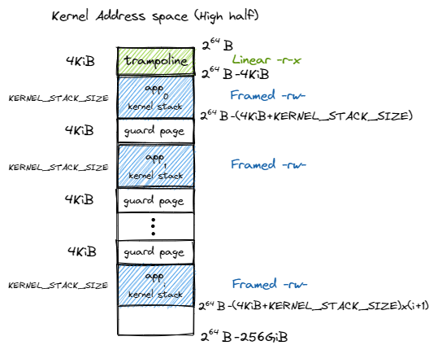
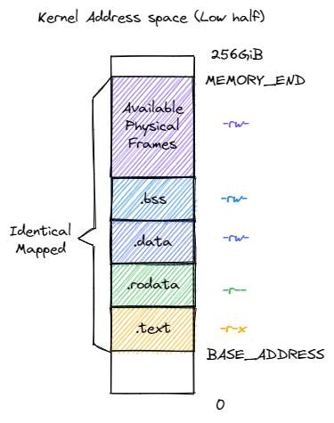
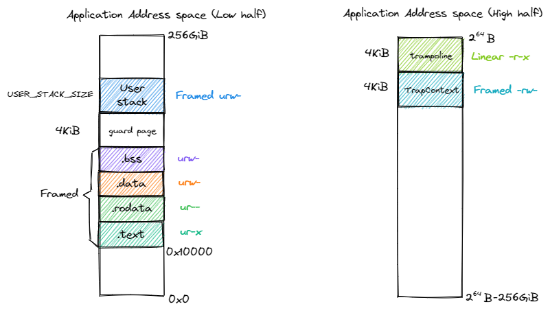

內核與應用的地址空間
================================================

本節導讀
--------------------------

頁表 ``PageTable`` 只能以頁為單位幫助我們維護一個虛擬內存到物理內存的地址轉換關係，它本身對於計算機系統的整個虛擬/物理內存空間並沒有一個全局的描述和掌控。操作系統通過對不同頁表的管理，來完成對不同應用和操作系統自身所在的虛擬內存，以及虛擬內存與物理內存映射關係的全面管理。這種管理是建立在 **地址空間** 的抽象上，用來表明正在運行的應用或內核自身所在執行環境中的可訪問的內存空間。本節
我們就在內核中通過基於頁表的各種數據結構實現地址空間的抽象，並介紹內核和應用的虛擬和物理地址空間中各需要包含哪些內容。

實現地址空間抽象
------------------------------------------

.. _term-vm-map-area:

邏輯段：一段連續地址的虛擬內存
^^^^^^^^^^^^^^^^^^^^^^^^^^^^^^^^^^^^^^^^^^^^^^^^^^^^^

我們以邏輯段 ``MapArea`` 為單位描述一段連續地址的虛擬內存。所謂邏輯段，就是指地址區間中的一段實際可用（即 MMU 通過查多級頁表可以正確完成地址轉換）的地址連續的虛擬地址區間，該區間內包含的所有虛擬頁面都以一種相同的方式映射到物理頁幀，具有可讀/可寫/可執行等屬性。

.. code-block:: rust

    // os/src/mm/memory_set.rs

    pub struct MapArea {
        vpn_range: VPNRange,
        data_frames: BTreeMap<VirtPageNum, FrameTracker>,
        map_type: MapType,
        map_perm: MapPermission,
    }

其中 ``VPNRange`` 描述一段虛擬頁號的連續區間，表示該邏輯段在地址區間中的位置和長度。它是一個迭代器，可以使用 Rust 的語法糖 for-loop 進行迭代。有興趣的同學可以參考 ``os/src/mm/address.rs`` 中它的實現。

.. note::

    **Rust Tips：迭代器 Iterator**

    Rust編程的迭代器模式允許你對一個序列的項進行某些處理。迭代器（iterator）是負責遍歷序列中的每一項和決定序列何時結束的控制邏輯。對於如何使用迭代器處理元素序列和如何實現 Iterator trait 來創建自定義迭代器的內容，可以參考 `Rust 程序設計語言-中文版第十三章第二節 <https://kaisery.github.io/trpl-zh-cn/ch13-02-iterators.html>`_

``MapType`` 描述該邏輯段內的所有虛擬頁面映射到物理頁幀的同一種方式，它是一個枚舉類型，在內核當前的實現中支持兩種方式：

.. code-block:: rust

    // os/src/mm/memory_set.rs

    #[derive(Copy, Clone, PartialEq, Debug)]
    pub enum MapType {
        Identical,
        Framed,
    }

其中 ``Identical`` 表示上一節提到的恆等映射方式；而 ``Framed`` 則表示對於每個虛擬頁面都有一個新分配的物理頁幀與之對應，虛地址與物理地址的映射關係是相對隨機的。恆等映射方式主要是用在啟用多級頁表之後，內核仍能夠在虛存地址空間中訪問一個特定的物理地址指向的物理內存。

當邏輯段採用 ``MapType::Framed`` 方式映射到物理內存的時候， ``data_frames`` 是一個保存了該邏輯段內的每個虛擬頁面和它被映射到的物理頁幀 ``FrameTracker`` 的一個鍵值對容器 ``BTreeMap`` 中，這些物理頁幀被用來存放實際內存數據而不是作為多級頁表中的中間節點。和之前的 ``PageTable`` 一樣，這也用到了 RAII 的思想，將這些物理頁幀的生命週期綁定到它所在的邏輯段 ``MapArea`` 下，當邏輯段被回收之後這些之前分配的物理頁幀也會自動地同時被回收。

``MapPermission`` 表示控制該邏輯段的訪問方式，它是頁表項標誌位 ``PTEFlags`` 的一個子集，僅保留 U/R/W/X 四個標誌位，因為其他的標誌位僅與硬件的地址轉換機制細節相關，這樣的設計能避免引入錯誤的標誌位。

.. code-block:: rust

    // os/src/mm/memory_set.rs

    bitflags! {
        pub struct MapPermission: u8 {
            const R = 1 << 1;
            const W = 1 << 2;
            const X = 1 << 3;
            const U = 1 << 4;
        }
    }

.. _term-vm-memory-set:

地址空間：一系列有關聯的邏輯段
^^^^^^^^^^^^^^^^^^^^^^^^^^^^^^^^^^^^^^^^^

**地址空間** 是一系列有關聯的不一定連續的邏輯段，這種關聯一般是指這些邏輯段組成的虛擬內存空間與一個運行的程序（目前把一個運行的程序稱為任務，後續會稱為進程）綁定，即這個運行的程序對代碼和數據的直接訪問範圍限制在它關聯的虛擬地址空間之內。這樣我們就有任務的地址空間，內核的地址空間等說法了。地址空間使用 ``MemorySet`` 類型來表示：

.. code-block:: rust

    // os/src/mm/memory_set.rs

    pub struct MemorySet {
        page_table: PageTable,
        areas: Vec<MapArea>,
    }

它包含了該地址空間的多級頁表 ``page_table`` 和一個邏輯段 ``MapArea`` 的向量 ``areas`` 。注意 ``PageTable`` 下掛著所有多級頁表的節點所在的物理頁幀，而每個 ``MapArea`` 下則掛著對應邏輯段中的數據所在的物理頁幀，這兩部分合在一起構成了一個地址空間所需的所有物理頁幀。這同樣是一種 RAII 風格，當一個地址空間 ``MemorySet`` 生命週期結束後，這些物理頁幀都會被回收。

地址空間 ``MemorySet`` 的方法如下：

.. code-block:: rust
    :linenos:

    // os/src/mm/memory_set.rs

    impl MemorySet {
        pub fn new_bare() -> Self {
            Self {
                page_table: PageTable::new(),
                areas: Vec::new(),
            }
        }
        fn push(&mut self, mut map_area: MapArea, data: Option<&[u8]>) {
            map_area.map(&mut self.page_table);
            if let Some(data) = data {
                map_area.copy_data(&self.page_table, data);
            }
            self.areas.push(map_area);
        }
        /// Assume that no conflicts.
        pub fn insert_framed_area(
            &mut self,
            start_va: VirtAddr, end_va: VirtAddr, permission: MapPermission
        ) {
            self.push(MapArea::new(
                start_va,
                end_va,
                MapType::Framed,
                permission,
            ), None);
        }
        pub fn new_kernel() -> Self;
        /// Include sections in elf and trampoline and TrapContext and user stack,
        /// also returns user_sp and entry point.
        pub fn from_elf(elf_data: &[u8]) -> (Self, usize, usize);
    }

- 第 4 行， ``new_bare`` 方法可以新建一個空的地址空間；
- 第 10 行， ``push`` 方法可以在當前地址空間插入一個新的邏輯段 ``map_area`` ，如果它是以 ``Framed`` 方式映射到物理內存，還可以可選地在那些被映射到的物理頁幀上寫入一些初始化數據 ``data`` ；
- 第 18 行， ``insert_framed_area`` 方法調用 ``push`` ，可以在當前地址空間插入一個 ``Framed`` 方式映射到物理內存的邏輯段。注意該方法的調用者要保證同一地址空間內的任意兩個邏輯段不能存在交集，從後面即將分別介紹的內核和應用的地址空間佈局可以看出這一要求得到了保證；
- 第 29 行， ``new_kernel`` 可以生成內核的地址空間；具體實現將在後面討論；
- 第 32 行， ``from_elf`` 分析應用的 ELF 文件格式的內容，解析出各數據段並生成對應的地址空間；具體實現將在後面討論。

在實現 ``push`` 方法在地址空間中插入一個邏輯段 ``MapArea`` 的時候，需要同時維護地址空間的多級頁表 ``page_table`` 記錄的虛擬頁號到頁表項的映射關係，也需要用到這個映射關係來找到向哪些物理頁幀上拷貝初始數據。這用到了 ``MapArea`` 提供的另外幾個方法：

.. code-block:: rust
    :linenos:
    
    // os/src/mm/memory_set.rs

    impl MapArea {
        pub fn new( 
            start_va: VirtAddr,
            end_va: VirtAddr,
            map_type: MapType,
            map_perm: MapPermission
        ) -> Self {
            let start_vpn: VirtPageNum = start_va.floor();
            let end_vpn: VirtPageNum = end_va.ceil();
            Self {
                vpn_range: VPNRange::new(start_vpn, end_vpn),
                data_frames: BTreeMap::new(),
                map_type,
                map_perm,
            }
        }
        pub fn map(&mut self, page_table: &mut PageTable) {
            for vpn in self.vpn_range {
                self.map_one(page_table, vpn);
            }
        }
        pub fn unmap(&mut self, page_table: &mut PageTable) {
            for vpn in self.vpn_range {
                self.unmap_one(page_table, vpn);
            }
        }
        /// data: start-aligned but maybe with shorter length
        /// assume that all frames were cleared before
        pub fn copy_data(&mut self, page_table: &PageTable, data: &[u8]) {
            assert_eq!(self.map_type, MapType::Framed);
            let mut start: usize = 0;
            let mut current_vpn = self.vpn_range.get_start();
            let len = data.len();
            loop {
                let src = &data[start..len.min(start + PAGE_SIZE)];
                let dst = &mut page_table
                    .translate(current_vpn)
                    .unwrap()
                    .ppn()
                    .get_bytes_array()[..src.len()];
                dst.copy_from_slice(src);
                start += PAGE_SIZE;
                if start >= len {
                    break;
                }
                current_vpn.step();
            }
        }
    }

- 第 4 行的 ``new`` 方法可以新建一個邏輯段結構體，注意傳入的起始/終止虛擬地址會分別被下取整/上取整為虛擬頁號並傳入迭代器 ``vpn_range`` 中；
- 第 19 行的 ``map`` 和第 24 行的 ``unmap`` 可以將當前邏輯段到物理內存的映射從傳入的該邏輯段所屬的地址空間的多級頁表中加入或刪除。可以看到它們的實現是遍歷邏輯段中的所有虛擬頁面，並以每個虛擬頁面為單位依次在多級頁表中進行鍵值對的插入或刪除，分別對應 ``MapArea`` 的 ``map_one`` 和 ``unmap_one`` 方法，我們後面將介紹它們的實現；
- 第 31 行的 ``copy_data`` 方法將切片 ``data`` 中的數據拷貝到當前邏輯段實際被內核放置在的各物理頁幀上，從而在地址空間中通過該邏輯段就能訪問這些數據。調用它的時候需要滿足：切片 ``data`` 中的數據大小不超過當前邏輯段的總大小，且切片中的數據會被對齊到邏輯段的開頭，然後逐頁拷貝到實際的物理頁幀。

  從第 36 行開始的循環會遍歷每一個需要拷貝數據的虛擬頁面，在數據拷貝完成後會在第 48 行通過調用 ``step`` 方法，該方法來自於 ``os/src/mm/address.rs`` 中為 ``VirtPageNum`` 實現的 ``StepOne`` Trait，感興趣的同學可以閱讀代碼確認其實現。

  每個頁面的數據拷貝需要確定源 ``src`` 和目標 ``dst`` 兩個切片並直接使用 ``copy_from_slice`` 完成複製。當確定目標切片 ``dst`` 的時候，第 39 行從傳入的當前邏輯段所屬的地址空間的多級頁表中，手動查找迭代到的虛擬頁號被映射到的物理頁幀，並通過 ``get_bytes_array`` 方法獲取該物理頁幀的字節數組型可變引用，最後再獲取它的切片用於數據拷貝。

接下來介紹對邏輯段中的單個虛擬頁面進行映射/解映射的方法 ``map_one`` 和 ``unmap_one`` 。顯然它們的實現取決於當前邏輯段被映射到物理內存的方式：

.. code-block:: rust
    :linenos:

    // os/src/mm/memory_set.rs

    impl MapArea {
        pub fn map_one(&mut self, page_table: &mut PageTable, vpn: VirtPageNum) {
            let ppn: PhysPageNum;
            match self.map_type {
                MapType::Identical => {
                    ppn = PhysPageNum(vpn.0);
                }
                MapType::Framed => {
                    let frame = frame_alloc().unwrap();
                    ppn = frame.ppn;
                    self.data_frames.insert(vpn, frame);
                }
            }
            let pte_flags = PTEFlags::from_bits(self.map_perm.bits).unwrap();
            page_table.map(vpn, ppn, pte_flags);
        }
        pub fn unmap_one(&mut self, page_table: &mut PageTable, vpn: VirtPageNum) {
            match self.map_type {
                MapType::Framed => {
                    self.data_frames.remove(&vpn);
                }
                _ => {}
            }
            page_table.unmap(vpn);
        }
    }

- 對於第 4 行的 ``map_one`` 來說，在虛擬頁號 ``vpn`` 已經確定的情況下，它需要知道要將一個怎麼樣的頁表項插入多級頁表。頁表項的標誌位來源於當前邏輯段的類型為 ``MapPermission`` 的統一配置，只需將其轉換為 ``PTEFlags`` ；而頁表項的物理頁號則取決於當前邏輯段映射到物理內存的方式：

  - 當以恆等映射 ``Identical`` 方式映射的時候，物理頁號就等於虛擬頁號；
  - 當以 ``Framed`` 方式映射時，需要分配一個物理頁幀讓當前的虛擬頁面可以映射過去，此時頁表項中的物理頁號自然就是
    這個被分配的物理頁幀的物理頁號。此時還需要將這個物理頁幀掛在邏輯段的 ``data_frames`` 字段下。

  當確定了頁表項的標誌位和物理頁號之後，即可調用多級頁表 ``PageTable`` 的 ``map`` 接口來插入鍵值對。
- 對於第 19 行的 ``unmap_one`` 來說，基本上就是調用 ``PageTable`` 的 ``unmap`` 接口刪除以傳入的虛擬頁號為鍵的鍵值對即可。然而，當以 ``Framed`` 映射的時候，不要忘記同時將虛擬頁面被映射到的物理頁幀 ``FrameTracker`` 從 ``data_frames`` 中移除，這樣這個物理頁幀才能立即被回收以備後續分配。

內核地址空間
------------------------------------------

.. _term-isolation:

在本章之前，內核和應用代碼的訪存地址都被視為一個物理地址，並直接訪問物理內存，而在分頁模式開啟之後，CPU先拿到虛存地址，需要通過 MMU 的地址轉換變成物理地址，再交給 CPU 的訪存單元去訪問物理內存。地址空間抽象的重要意義在於 **隔離** (Isolation) ，當內核讓應用執行前，內核需要控制 MMU 使用這個應用的多級頁表進行地址轉換。由於每個應用地址空間在創建的時候也順帶設置好了多級頁表，使得只有那些存放了它的代碼和數據的物理頁幀能夠通過該多級頁表被映射到，這樣它就只能訪問自己的代碼和數據而無法觸及其他應用或內核的內容。

.. _term-trampoline-first:

啟用分頁模式下，內核代碼的訪存地址也會被視為一個虛擬地址並需要經過 MMU 的地址轉換，因此我們也需要為內核對應構造一個地址空間，它除了仍然需要允許內核的各數據段能夠被正常訪問之後，還需要包含所有應用的內核棧以及一個 **跳板** (Trampoline) 。我們會在本章的後續部分再深入介紹 :ref:`跳板的實現 <term-trampoline>` 。

下圖是軟件看到的 64 位地址空間在 SV39 分頁模式下實際可能通過 MMU 檢查的最高 :math:`256\text{GiB}` （之前在 :ref:`這裡 <high-and-low-256gib>` 中解釋過最高和最低 :math:`256\text{GiB}` 的問題）：

可以看到，跳板放在最高的一個虛擬頁面中。接下來則是從高到低放置每個應用的內核棧，內核棧的大小由 ``config`` 子模塊的 ``KERNEL_STACK_SIZE`` 給出。它們的映射方式為 ``MapPermission`` 中的 rw 兩個標誌位，意味著這個邏輯段僅允許 CPU 處於內核態訪問，且只能讀或寫。

.. _term-guard-page:

注意相鄰兩個內核棧之間會預留一個 **保護頁面** (Guard Page) ，它是內核地址空間中的空洞，多級頁表中並不存在與它相關的映射。它的意義在於當內核棧空間不足（如調用層數過多或死遞歸）的時候，代碼會嘗試訪問空洞區域內的虛擬地址，然而它無法在多級頁表中找到映射，便會觸發異常，此時控制權會交給內核 trap handler 函數進行異常處理。由於編譯器會對訪存順序和局部變量在棧幀中的位置進行優化，我們難以確定一個已經溢出的棧幀中的哪些位置會先被訪問，但總的來說，空洞區域被設置的越大，我們就能越早捕獲到這一可能覆蓋其他重要數據的錯誤異常。由於我們的內核非常簡單且內核棧的大小設置比較寬裕，在當前的設計中我們僅將空洞區域的大小設置為單個頁面。

下面則給出了內核地址空間的低 :math:`256\text{GiB}` 的佈局：

內核的四個邏輯段 ``.text/.rodata/.data/.bss`` 被恆等映射到物理內存，這使得我們在無需調整內核內存佈局 ``os/src/linker.ld`` 的情況下就仍能象啟用頁表機制之前那樣訪問內核的各個段。注意我們借用頁表機制對這些邏輯段的訪問方式做出了限制，這都是為了在硬件的幫助下能夠儘可能發現內核中的 bug ，在這裡：

- 四個邏輯段的 U 標誌位均未被設置，使得 CPU 只能在處於 S 特權級（或以上）時訪問它們；
- 代碼段 ``.text`` 不允許被修改；
- 只讀數據段 ``.rodata`` 不允許被修改，也不允許從它上面取指執行；
- ``.data/.bss`` 均允許被讀寫，但是不允許從它上面取指執行。

此外， :ref:`之前 <modify-page-table>` 提到過內核地址空間中需要存在一個恆等映射到內核數據段之外的可用物理頁幀的邏輯段，這樣才能在啟用頁表機制之後，內核仍能以純軟件的方式讀寫這些物理頁幀。它們的標誌位僅包含 rw ，意味著該邏輯段只能在 S 特權級以上訪問，並且只能讀寫。

下面我們給出創建內核地址空間的方法 ``new_kernel`` ：

.. code-block:: rust
    :linenos:

    // os/src/mm/memory_set.rs

    extern "C" {
        fn stext();
        fn etext();
        fn srodata();
        fn erodata();
        fn sdata();
        fn edata();
        fn sbss_with_stack();
        fn ebss();
        fn ekernel();
        fn strampoline();
    }

    impl MemorySet {
        /// Without kernel stacks.
        pub fn new_kernel() -> Self {
            let mut memory_set = Self::new_bare();
            // map trampoline
            memory_set.map_trampoline();
            // map kernel sections
            println!(".text [{:#x}, {:#x})", stext as usize, etext as usize);
            println!(".rodata [{:#x}, {:#x})", srodata as usize, erodata as usize);
            println!(".data [{:#x}, {:#x})", sdata as usize, edata as usize);
            println!(".bss [{:#x}, {:#x})", sbss_with_stack as usize, ebss as usize);
            println!("mapping .text section");
            memory_set.push(MapArea::new(
                (stext as usize).into(),
                (etext as usize).into(),
                MapType::Identical,
                MapPermission::R | MapPermission::X,
            ), None);
            println!("mapping .rodata section");
            memory_set.push(MapArea::new(
                (srodata as usize).into(),
                (erodata as usize).into(),
                MapType::Identical,
                MapPermission::R,
            ), None);
            println!("mapping .data section");
            memory_set.push(MapArea::new(
                (sdata as usize).into(),
                (edata as usize).into(),
                MapType::Identical,
                MapPermission::R | MapPermission::W,
            ), None);
            println!("mapping .bss section");
            memory_set.push(MapArea::new(
                (sbss_with_stack as usize).into(),
                (ebss as usize).into(),
                MapType::Identical,
                MapPermission::R | MapPermission::W,
            ), None);
            println!("mapping physical memory");
            memory_set.push(MapArea::new(
                (ekernel as usize).into(),
                MEMORY_END.into(),
                MapType::Identical,
                MapPermission::R | MapPermission::W,
            ), None);
            memory_set
        }
    }

``new_kernel`` 將映射跳板和地址空間中最低 :math:`256\text{GiB}` 中的內核邏輯段。第 3 行開始，我們從 ``os/src/linker.ld`` 中引用了很多表示各個段位置的符號，而後在 ``new_kernel`` 中，我們從低地址到高地址依次創建 5 個邏輯段並通過 ``push`` 方法將它們插入到內核地址空間中，上面我們已經詳細介紹過這 5 個邏輯段。跳板是通過 ``map_trampoline`` 方法來映射的，我們也將在本章最後一節進行講解。

.. _term-vm-app-addr-space:

應用地址空間
------------------------------------------

現在我們來介紹如何創建應用的地址空間。在前面的章節中，我們直接將丟棄了所有符號信息的應用二進制鏡像鏈接到內核，在初始化的時候內核僅需將他們加載到正確的初始物理地址就能使它們正確執行。但本章中，我們希望效仿內核地址空間的設計，同樣藉助頁表機制使得應用地址空間的各個邏輯段也可以有不同的訪問方式限制，這樣可以提早檢測出應用的錯誤並及時將其終止以最小化它對系統帶來的惡劣影響。

在第三章中，每個應用鏈接腳本中的起始地址被要求是不同的，這樣它們的代碼和數據存放的位置才不會產生衝突。但這是一種對於應用開發者很不方便的設計。現在，藉助地址空間的抽象，我們終於可以讓所有應用程序都使用同樣的起始地址，這也意味著所有應用可以使用同一個鏈接腳本了：

.. code-block:: 
    :linenos:

    /* user/src/linker.ld */

    OUTPUT_ARCH(riscv)
    ENTRY(_start)

    BASE_ADDRESS = 0x10000;

    SECTIONS
    {
        . = BASE_ADDRESS;
        .text : {
            *(.text.entry)
            *(.text .text.*)
        }
        . = ALIGN(4K);
        .rodata : {
            *(.rodata .rodata.*)
        }
        . = ALIGN(4K);
        .data : {
            *(.data .data.*)
        }
        .bss : {
            *(.bss .bss.*)
        }
        /DISCARD/ : {
            *(.eh_frame)
            *(.debug*)
        }
    }

我們將起始地址 ``BASE_ADDRESS`` 設置為 :math:`\text{0x10000}` （我們這裡並不設置為 :math:`\text{0x0}` ，因為它一般代表空指針），顯然它只能是一個地址空間中的虛擬地址而非物理地址。事實上由於我們將入口彙編代碼段放在最低的地方，這也是整個應用的入口點。我們只需清楚這一事實即可，而無需像之前一樣將其硬編碼到代碼中。此外，在 ``.text`` 和 ``.rodata`` 中間以及 ``.rodata`` 和 ``.data`` 中間我們進行了頁面對齊，因為前後兩個邏輯段的訪問方式限制是不同的，由於我們只能以頁為單位對這個限制進行設置，因此就只能將下一個邏輯段對齊到下一個頁面開始放置。而 ``.data`` 和 ``.bss`` 兩個邏輯段由於訪問限制相同（可讀寫），它們中間則無需進行頁面對齊。

下圖展示了應用地址空間的佈局：

    
左側給出了應用地址空間最低 :math:`256\text{GiB}` 的佈局：從 :math:`\text{0x10000}` 開始向高地址放置應用內存佈局中的各個邏輯段，最後放置帶有一個保護頁面的用戶棧。這些邏輯段都是以 ``Framed`` 方式映射到物理內存的，從訪問方式上來說都加上了 U 標誌位代表 CPU 可以在 U 特權級也就是執行應用代碼的時候訪問它們。右側則給出了最高的 :math:`256\text{GiB}` ，可以看出它只是和內核地址空間一樣將跳板放置在最高頁，還將 Trap 上下文放置在次高頁中。這兩個虛擬頁面雖然位於應用地址空間，但是它們並不包含 U 標誌位，事實上它們在地址空間切換的時候才會發揮作用，請同樣參考本章的最後一節。

在 ``os/src/build.rs`` 中，我們不再將丟棄了所有符號的應用二進制鏡像鏈接進內核，因為在應用二進制鏡像中，內存佈局中各個邏輯段的位置和訪問限制等信息都被裁剪掉了。我們直接使用保存了邏輯段信息的 ELF 格式的應用可執行文件。這樣 ``loader`` 子模塊的設計實現也變得精簡：

.. code-block:: rust

    // os/src/loader.rs

    pub fn get_num_app() -> usize {
        extern "C" { fn _num_app(); }
        unsafe { (_num_app as usize as *const usize).read_volatile() }
    }

    pub fn get_app_data(app_id: usize) -> &'static [u8] {
        extern "C" { fn _num_app(); }
        let num_app_ptr = _num_app as usize as *const usize;
        let num_app = get_num_app();
        let app_start = unsafe {
            core::slice::from_raw_parts(num_app_ptr.add(1), num_app + 1)
        };
        assert!(app_id < num_app);
        unsafe {
            core::slice::from_raw_parts(
                app_start[app_id] as *const u8,
                app_start[app_id + 1] - app_start[app_id]
            )
        }
    }

它僅需要提供兩個函數： ``get_num_app`` 獲取鏈接到內核內的應用的數目，而 ``get_app_data`` 則根據傳入的應用編號取出對應應用的 ELF 格式可執行文件數據。它們和之前一樣仍是基於 ``build.rs`` 生成的 ``link_app.S`` 給出的符號來確定其位置，並實際放在內核的數據段中。 ``loader`` 模塊中原有的內核和用戶棧則分別作為邏輯段放在內核和用戶地址空間中，我們無需再去專門為其定義一種類型。

在創建應用地址空間的時候，我們需要對 ``get_app_data`` 得到的 ELF 格式數據進行解析，找到各個邏輯段所在位置和訪問限制並插入進來，最終得到一個完整的應用地址空間：

.. code-block:: rust
    :linenos:

    // os/src/mm/memory_set.rs

    impl MemorySet {
        /// Include sections in elf and trampoline and TrapContext and user stack,
        /// also returns user_sp and entry point.
        pub fn from_elf(elf_data: &[u8]) -> (Self, usize, usize) {
            let mut memory_set = Self::new_bare();
            // map trampoline
            memory_set.map_trampoline();
            // map program headers of elf, with U flag
            let elf = xmas_elf::ElfFile::new(elf_data).unwrap();
            let elf_header = elf.header;
            let magic = elf_header.pt1.magic;
            assert_eq!(magic, [0x7f, 0x45, 0x4c, 0x46], "invalid elf!");
            let ph_count = elf_header.pt2.ph_count();
            let mut max_end_vpn = VirtPageNum(0);
            for i in 0..ph_count {
                let ph = elf.program_header(i).unwrap();
                if ph.get_type().unwrap() == xmas_elf::program::Type::Load {
                    let start_va: VirtAddr = (ph.virtual_addr() as usize).into();
                    let end_va: VirtAddr = ((ph.virtual_addr() + ph.mem_size()) as usize).into();
                    let mut map_perm = MapPermission::U;
                    let ph_flags = ph.flags();
                    if ph_flags.is_read() { map_perm |= MapPermission::R; }
                    if ph_flags.is_write() { map_perm |= MapPermission::W; }
                    if ph_flags.is_execute() { map_perm |= MapPermission::X; }
                    let map_area = MapArea::new(
                        start_va,
                        end_va,
                        MapType::Framed,
                        map_perm,
                    );
                    max_end_vpn = map_area.vpn_range.get_end();
                    memory_set.push(
                        map_area,
                        Some(&elf.input[ph.offset() as usize..(ph.offset() + ph.file_size()) as usize])
                    );
                }
            }
            // map user stack with U flags
            let max_end_va: VirtAddr = max_end_vpn.into();
            let mut user_stack_bottom: usize = max_end_va.into();
            // guard page
            user_stack_bottom += PAGE_SIZE;
            let user_stack_top = user_stack_bottom + USER_STACK_SIZE;
            memory_set.push(MapArea::new(
                user_stack_bottom.into(),
                user_stack_top.into(),
                MapType::Framed,
                MapPermission::R | MapPermission::W | MapPermission::U,
            ), None);
            // map TrapContext
            memory_set.push(MapArea::new(
                TRAP_CONTEXT.into(),
                TRAMPOLINE.into(),
                MapType::Framed,
                MapPermission::R | MapPermission::W,
            ), None);
            (memory_set, user_stack_top, elf.header.pt2.entry_point() as usize)
        }
    }

- 第 9 行，我們將跳板插入到應用地址空間；
- 第 11 行，我們使用外部 crate ``xmas_elf`` 來解析傳入的應用 ELF 數據並可以輕鬆取出各個部分。:ref:`此前 <term-elf>` 我們簡要介紹過 ELF 格式的佈局。第 14 行，我們取出 ELF 的魔數來判斷它是不是一個合法的 ELF 。 
  
  第 15 行，我們可以直接得到 program header 的數目，然後遍歷所有的 program header 並將合適的區域加入到應用地址空間中。這一過程的主體在第 17~39 行之間。第 19 行我們確認 program header 的類型是 ``LOAD`` ，這表明它有被內核加載的必要，此時不必理會其他類型的 program header 。接著通過 ``ph.virtual_addr()`` 和 ``ph.mem_size()`` 來計算這一區域在應用地址空間中的位置，通過 ``ph.flags()`` 來確認這一區域訪問方式的限制並將其轉換為 ``MapPermission`` 類型（注意它默認包含 U 標誌位）。最後我們在第 27 行創建邏輯段 ``map_area`` 並在第 34 行 ``push`` 到應用地址空間。在 ``push`` 的時候我們需要完成數據拷貝，當前 program header 數據被存放的位置可以通過 ``ph.offset()`` 和 ``ph.file_size()`` 來找到。 注意當存在一部分零初始化的時候， ``ph.file_size()`` 將會小於 ``ph.mem_size()`` ，因為這些零出於縮減可執行文件大小的原因不應該實際出現在 ELF 數據中。
- 我們從第 40 行開始處理用戶棧。注意在前面加載各個 program header 的時候，我們就已經維護了 ``max_end_vpn`` 記錄目前涉及到的最大的虛擬頁號，只需緊接著在它上面再放置一個保護頁面和用戶棧即可。
- 第 53 行則在應用地址空間中映射次高頁面來存放 Trap 上下文。
- 第 59 行返回的時候，我們不僅返回應用地址空間 ``memory_set`` ，也同時返回用戶棧虛擬地址 ``user_stack_top`` 以及從解析 ELF 得到的該應用入口點地址，它們將被我們用來創建應用的任務控制塊。

小結一下，本節講解了 **地址空間** 這一抽象概念的含義與對應的具體數據結構設計與實現，並進一步介紹了在分頁機制的幫助下，內核和應用各自的地址空間的基本組成和創建這兩種地址空間的基本方法。接下來，需要考慮如何把地址空間與之前的分時多任務結合起來，實現一個更加安全和強大的內核，這還需要進一步拓展內核功能 -- 建立具體的內核虛擬地址空間和應用虛擬地址空間、實現不同地址空間的切換，即能切換不同應用之間的地址空間，以及應用與內核之間的地址空間。在下一節，我們將講解如何構建基於地址空間的分時多任務操作系統 -- “頭甲龍”。

.. hint::
    
    **內核如何訪問應用的數據？** 

    應用應該不能直接訪問內核的數據，但內核可以訪問應用的數據，這是如何做的？由於內核要管理應用，所以它負責構建自身和其他應用的多級頁表。如果內核獲得了一個應用數據的虛地址，內核就可以通過查詢應用的頁表來把應用的虛地址轉換為物理地址，內核直接訪問這個地址（注：內核自身的虛實映射是恆等映射），就可以獲得應用數據的內容了。