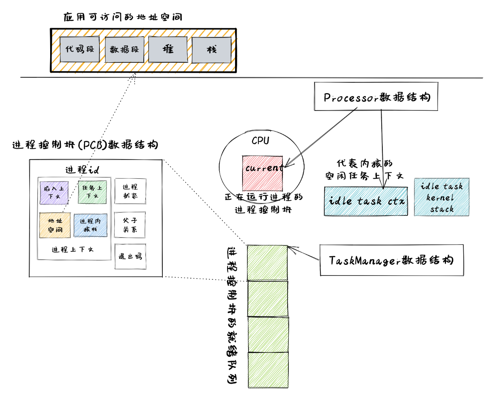

進程管理的核心數據結構
===================================

本節導讀
-----------------------------------

為了更好實現進程管理，同時也使得操作系統整體架構更加靈活，能夠滿足後續的一些需求，我們需要重新設計一些數據結構包含的內容及接口。本節將按照如下順序來進行介紹：

- 基於應用名的應用鏈接：在編譯階段的鏈接過程中，生成包含多個應用和應用位置信息的 ``link_app.S`` 文件。
- 基於應用名的加載器：根據應用名字來加載應用的 ELF 文件中代碼段和數據段到內存中，為創建一個新進程做準備。
- 進程標識符 ``PidHandle`` 以及內核棧 ``KernelStack`` ：進程控制塊的重要組成部分。
- 任務控制塊 ``TaskControlBlock`` ：表示進程的核心數據結構。
- 任務管理器 ``TaskManager`` ：管理進程集合的核心數據結構。
- 處理器管理結構 ``Processor`` ：用於進程調度，維護進程的處理器狀態。

應用的鏈接與加載支持
------------------------------------------------------------------------

基於應用名的應用鏈接
^^^^^^^^^^^^^^^^^^^^^^^^^^^^^^^^^^^^^^^^

在實現 ``exec`` 系統調用的時候，我們需要根據應用的名字而不僅僅是一個編號來獲取應用的 ELF 格式數據。因此原有的鏈接和加載接口需要做出如下變更：

在 Rust 編譯&鏈接輔助程序 ``os/build.rs`` 中，會讀取位於 ``user/src/bin`` 中應用程序對應的執行文件，並生成 ``link_app.S`` ，按順序保存鏈接進來的每個應用的名字：
  
.. code-block:: rust
    :linenos:
    :emphasize-lines: 8-13

    // os/build.rs

    for i in 0..apps.len() {
        writeln!(f, r#"    .quad app_{}_start"#, i)?;
    }
    writeln!(f, r#"    .quad app_{}_end"#, apps.len() - 1)?;

    writeln!(f, r#"
    .global _app_names
    _app_names:"#)?;
    for app in apps.iter() {
        writeln!(f, r#"    .string "{}""#, app)?;
    }

    for (idx, app) in apps.iter().enumerate() {
        ...
    }

第 8~13 行，我們按照順序將各個應用的名字通過 ``.string`` 偽指令放到數據段中，注意鏈接器會自動在每個字符串的結尾加入分隔符 ``\0`` ，它們的位置則由全局符號 ``_app_names`` 指出。這樣在編譯操作系統的過程中，會生成如下的 ``link_app.S`` 文件：

.. code-block::
    :linenos:

        .section .data
        .global _num_app
    _num_app:
        .quad 15
        .quad app_0_start
        .quad app_1_start
    ......
        .global _app_names
    _app_names:
        .string "exit"
        .string "fantastic_text"
    ......        
        .section .data
        .global app_0_start
        .global app_0_end
        .align 3
    app_0_start:
        .incbin "../user/target/riscv64gc-unknown-none-elf/release/exit"
    app_0_end:  
    ......

在這個文件中，可以看到應用代碼和表示應用的元數據信息都放在數據段。第10行是第一個應用的名字 ``exit`` ，第13~14行是第一個應用 ``exit`` 在OS鏡像文件中的開始和結束位置；第18行是第一個應用 ``exit`` 的ELF格式執行文件的內容，

基於應用名的應用加載器
^^^^^^^^^^^^^^^^^^^^^^^^^^^^^^^^^^^^^^^^

而在加載器 ``loader.rs`` 中，我們會分析 ``link_app.S`` 中的內容，並用一個全局可見的 *只讀* 向量 ``APP_NAMES`` 來按照順序將所有應用的名字保存在內存中：

.. code-block:: Rust

    // os/src/loader.rs

    lazy_static! {
        static ref APP_NAMES: Vec<&'static str> = {
            let num_app = get_num_app();
            extern "C" { fn _app_names(); }
            let mut start = _app_names as usize as *const u8;
            let mut v = Vec::new();
            unsafe {
                for _ in 0..num_app {
                    let mut end = start;
                    while end.read_volatile() != '\0' as u8 {
                        end = end.add(1);
                    }
                    let slice = core::slice::from_raw_parts(start, end as usize - start as usize);
                    let str = core::str::from_utf8(slice).unwrap();
                    v.push(str);
                    start = end.add(1);
                }
            }
            v
        };
    }

使用 ``get_app_data_by_name`` 可以按照應用的名字來查找獲得應用的 ELF 數據，而 ``list_apps`` 在內核初始化時被調用，它可以打印出所有可用的應用的名字。

.. code-block:: rust

    // os/src/loader.rs

    pub fn get_app_data_by_name(name: &str) -> Option<&'static [u8]> {
        let num_app = get_num_app();
        (0..num_app)
            .find(|&i| APP_NAMES[i] == name)
            .map(|i| get_app_data(i))
    }

    pub fn list_apps() {
        println!("/**** APPS ****");
        for app in APP_NAMES.iter() {
            println!("{}", app);
        }
        println!("**************/")
    }

這樣，操作系統就可以讀取並加載某個應用的執行文件到內存中了，這就為通過 ``exec`` 系統調用創建新進程做好了前期準備。

進程標識符和內核棧
------------------------------------------------------------------------

進程標識符
^^^^^^^^^^^^^^^^^^^^^^^^^^^^^^^^^^^^^^^^

同一時間存在的所有進程都有一個唯一的進程標識符，它們是互不相同的整數，這樣才能表示表示進程的唯一性。這裡我們使用 RAII 的思想，將其抽象為一個 ``PidHandle`` 類型，當它的生命週期結束後對應的整數會被編譯器自動回收：

.. code-block:: rust

    // os/src/task/pid.rs

    pub struct PidHandle(pub usize);

類似之前的物理頁幀分配器 ``FrameAllocator`` ，我們實現一個同樣使用簡單棧式分配策略的進程標識符分配器 ``PidAllocator`` ，並將其全局實例化為 ``PID_ALLOCATOR`` ：

.. code-block:: rust

    // os/src/task/pid.rs

    struct PidAllocator {
        current: usize,
        recycled: Vec<usize>,
    }

    impl PidAllocator {
        pub fn new() -> Self {
            PidAllocator {
                current: 0,
                recycled: Vec::new(),
            }
        }
        pub fn alloc(&mut self) -> PidHandle {
            if let Some(pid) = self.recycled.pop() {
                PidHandle(pid)
            } else {
                self.current += 1;
                PidHandle(self.current - 1)
            }
        }
        pub fn dealloc(&mut self, pid: usize) {
            assert!(pid < self.current);
            assert!(
                self.recycled.iter().find(|ppid| **ppid == pid).is_none(),
                "pid {} has been deallocated!", pid
            );
            self.recycled.push(pid);
        }
    }

    lazy_static! {
        static ref PID_ALLOCATOR : UPSafeCell<PidAllocator> = unsafe {
            UPSafeCell::new(PidAllocator::new())
        };
    }

``PidAllocator::alloc`` 將會分配出去一個將 ``usize`` 包裝之後的 ``PidHandle`` 。我們將其包裝為一個全局分配進程標識符的接口 ``pid_alloc`` 提供給內核的其他子模塊：

.. code-block:: rust

    // os/src/task/pid.rs

    pub fn pid_alloc() -> PidHandle {
        PID_ALLOCATOR.exclusive_access().alloc()
    }

同時我們也需要為 ``PidHandle`` 實現 ``Drop`` Trait 來允許編譯器進行自動的資源回收：

.. code-block:: rust

    // os/src/task/pid.rs

    impl Drop for PidHandle {
        fn drop(&mut self) {
            PID_ALLOCATOR.exclusive_access().dealloc(self.0);
        }
    }

內核棧
^^^^^^^^^^^^^^^^^^^^^^^^^^^^^^^^^^^^^^^^

在前面的章節中我們介紹過 :ref:`內核地址空間佈局 <kernel-as-high>` ，當時我們將每個應用的內核棧按照應用編號從小到大的順序將它們作為邏輯段從高地址到低地址放在內核地址空間中，且兩兩之間保留一個守護頁面使得我們能夠儘可能早的發現內核棧溢出問題。從本章開始，我們將應用編號替換為進程標識符。我們可以在內核棧 ``KernelStack`` 中保存著它所屬進程的 PID ：

.. code-block:: rust

    // os/src/task/pid.rs

    pub struct KernelStack {
        pid: usize,
    }

它提供以下方法：

.. code-block:: rust
    :linenos:

    // os/src/task/pid.rs

    /// Return (bottom, top) of a kernel stack in kernel space.
    pub fn kernel_stack_position(app_id: usize) -> (usize, usize) {
        let top = TRAMPOLINE - app_id * (KERNEL_STACK_SIZE + PAGE_SIZE);
        let bottom = top - KERNEL_STACK_SIZE;
        (bottom, top)
    }

    impl KernelStack {
        pub fn new(pid_handle: &PidHandle) -> Self {
            let pid = pid_handle.0;
            let (kernel_stack_bottom, kernel_stack_top) = kernel_stack_position(pid);
            KERNEL_SPACE
                .exclusive_access()
                .insert_framed_area(
                    kernel_stack_bottom.into(),
                    kernel_stack_top.into(),
                    MapPermission::R | MapPermission::W,
                );
            KernelStack {
                pid: pid_handle.0,
            }
        }
        pub fn push_on_top<T>(&self, value: T) -> *mut T where
            T: Sized, {
            let kernel_stack_top = self.get_top();
            let ptr_mut = (kernel_stack_top - core::mem::size_of::<T>()) as *mut T;
            unsafe { *ptr_mut = value; }
            ptr_mut
        }
        pub fn get_top(&self) -> usize {
            let (_, kernel_stack_top) = kernel_stack_position(self.pid);
            kernel_stack_top
        }
    }

- 第 11 行， ``new`` 方法可以從一個 ``PidHandle`` ，也就是一個已分配的進程標識符中對應生成一個內核棧 ``KernelStack`` 。它調用了第 4 行聲明的 ``kernel_stack_position`` 函數來根據進程標識符計算內核棧在內核地址空間中的位置，隨即在第 14 行將一個邏輯段插入內核地址空間 ``KERNEL_SPACE`` 中。
- 第 25 行的 ``push_on_top`` 方法可以將一個類型為 ``T`` 的變量壓入內核棧頂並返回其裸指針，這也是一個泛型函數。它在實現的時候用到了第 32 行的 ``get_top`` 方法來獲取當前內核棧頂在內核地址空間中的地址。

內核棧 ``KernelStack`` 也用到了 RAII 的思想，具體來說，實際保存它的物理頁幀的生命週期與它綁定在一起，當 ``KernelStack`` 生命週期結束後，這些物理頁幀也將會被編譯器自動回收：

.. code-block:: rust

    // os/src/task/pid.rs

    impl Drop for KernelStack {
        fn drop(&mut self) {
            let (kernel_stack_bottom, _) = kernel_stack_position(self.pid);
            let kernel_stack_bottom_va: VirtAddr = kernel_stack_bottom.into();
            KERNEL_SPACE
                .exclusive_access()
                .remove_area_with_start_vpn(kernel_stack_bottom_va.into());
        }
    }

這僅需要為 ``KernelStack`` 實現 ``Drop`` Trait，一旦它的生命週期結束則在內核地址空間中將對應的邏輯段刪除（為此在 ``MemorySet`` 中新增了一個名為 ``remove_area_with_start_vpn`` 的方法，感興趣的同學可以參考其實現），由前面章節的介紹我們知道這也就意味著那些物理頁幀被同時回收掉了。

進程控制塊
------------------------------------------------------------------------

在內核中，每個進程的執行狀態、資源控制等元數據均保存在一個被稱為 **進程控制塊** (PCB, Process Control Block) 的結構中，它是內核對進程進行管理的單位，故而是一種極其關鍵的內核數據結構。在內核看來，它就等價於一個進程。

承接前面的章節，我們僅需對任務控制塊 ``TaskControlBlock`` 進行若干改動並讓它直接承擔進程控制塊的功能：

.. code-block:: rust
    :linenos:

    // os/src/task/task.rs

    pub struct TaskControlBlock {
        // immutable
        pub pid: PidHandle,
        pub kernel_stack: KernelStack,
        // mutable
        inner: UPSafeCell<TaskControlBlockInner>,
    }

    pub struct TaskControlBlockInner {
        pub trap_cx_ppn: PhysPageNum,
        pub base_size: usize,
        pub task_cx: TaskContext,
        pub task_status: TaskStatus,
        pub memory_set: MemorySet,
        pub parent: Option<Weak<TaskControlBlock>>,
        pub children: Vec<Arc<TaskControlBlock>>,
        pub exit_code: i32,
    }

任務控制塊中包含兩部分：

- 在初始化之後就不再變化的元數據：直接放在任務控制塊中。這裡將進程標識符 ``PidHandle`` 和內核棧 ``KernelStack`` 放在其中；
- 在運行過程中可能發生變化的元數據：則放在 ``TaskControlBlockInner`` 中，將它再包裹上一層 ``UPSafeCell<T>`` 放在任務控制塊中。這是因為在我們的設計中外層只能獲取任務控制塊的不可變引用，若想修改裡面的部分內容的話這需要 ``UPSafeCell<T>`` 所提供的內部可變性。

``TaskControlBlockInner`` 中則包含下面這些內容：

- ``trap_cx_ppn`` 指出了應用地址空間中的 Trap 上下文（詳見第四章）被放在的物理頁幀的物理頁號。
- ``base_size`` 的含義是：應用數據僅有可能出現在應用地址空間低於 ``base_size`` 字節的區域中。藉助它我們可以清楚的知道應用有多少數據駐留在內存中。
- ``task_cx`` 將暫停的任務的任務上下文保存在任務控制塊中。
- ``task_status`` 維護當前進程的執行狀態。
- ``memory_set`` 表示應用地址空間。
- ``parent`` 指向當前進程的父進程（如果存在的話）。注意我們使用 ``Weak`` 而非 ``Arc`` 來包裹另一個任務控制塊，因此這個智能指針將不會影響父進程的引用計數。
- ``children`` 則將當前進程的所有子進程的任務控制塊以 ``Arc`` 智能指針的形式保存在一個向量中，這樣才能夠更方便的找到它們。
- 當進程調用 exit 系統調用主動退出或者執行出錯由內核終止的時候，它的退出碼 ``exit_code`` 會被內核保存在它的任務控制塊中，並等待它的父進程通過 waitpid 回收它的資源的同時也收集它的 PID 以及退出碼。

注意我們在維護父子進程關係的時候大量用到了引用計數 ``Arc/Weak`` 。進程控制塊的本體是被放到內核堆上面的，對於它的一切訪問都是通過智能指針 ``Arc/Weak`` 來進行的，這樣是便於建立父子進程的雙向鏈接關係（避免僅基於 ``Arc`` 形成環狀鏈接關係）。當且僅當智能指針 ``Arc`` 的引用計數變為 0 的時候，進程控制塊以及被綁定到它上面的各類資源才會被回收。子進程的進程控制塊並不會被直接放到父進程控制塊中，因為子進程完全有可能在父進程退出後仍然存在。

``TaskControlBlockInner`` 提供的方法主要是對於它內部的字段的快捷訪問：

.. code-block:: rust

    // os/src/task/task.rs

    impl TaskControlBlockInner {
        pub fn get_trap_cx(&self) -> &'static mut TrapContext {
            self.trap_cx_ppn.get_mut()
        }
        pub fn get_user_token(&self) -> usize {
            self.memory_set.token()
        }
        fn get_status(&self) -> TaskStatus {
            self.task_status
        }
        pub fn is_zombie(&self) -> bool {
            self.get_status() == TaskStatus::Zombie
        }
    }

而任務控制塊 ``TaskControlBlock`` 目前提供以下方法：

.. code-block:: rust

    // os/src/task/task.rs

    impl TaskControlBlock {
        pub fn inner_exclusive_access(&self) -> RefMut<'_, TaskControlBlockInner> {
            self.inner.exclusive_access()
        }
        pub fn getpid(&self) -> usize {
            self.pid.0
        }
        pub fn new(elf_data: &[u8]) -> Self {...}
        pub fn exec(&self, elf_data: &[u8]) {...}
        pub fn fork(self: &Arc<TaskControlBlock>) -> Arc<TaskControlBlock> {...}
    }

- ``inner_exclusive_access`` 通過 ``UPSafeCell<T>.exclusive_access()`` 來得到一個 ``RefMut<'_, TaskControlBlockInner>`` ，它可以被看成一個內層 ``TaskControlBlockInner`` 的可變引用並可以對它指向的內容進行修改。
- ``getpid`` 以 ``usize`` 的形式返回當前進程的進程標識符。
- ``new`` 用來創建一個新的進程，目前僅用於內核中手動創建唯一一個初始進程 ``initproc`` 。
- ``exec`` 用來實現 ``exec`` 系統調用，即當前進程加載並執行另一個 ELF 格式可執行文件。
- ``fork`` 用來實現 ``fork`` 系統調用，即當前進程 fork 出來一個與之幾乎相同的子進程。

``new/exec/fork`` 的實現我們將在下一小節再介紹。

任務管理器
------------------------------------------------------------------------

在前面的章節中，任務管理器 ``TaskManager`` 不僅負責管理所有的任務，還維護著 CPU 當前在執行哪個任務。由於這種設計不夠靈活，不能拓展到後續的多核環境，我們需要將任務管理器對於 CPU 的監控職能拆分到下面即將介紹的處理器管理結構 ``Processor`` 中去，任務管理器自身僅負責管理所有任務。在這裡，任務指的就是進程。

.. code-block:: rust
    :linenos:

    // os/src/task/manager.rs

    pub struct TaskManager {
        ready_queue: VecDeque<Arc<TaskControlBlock>>,
    }

    /// A simple FIFO scheduler.
    impl TaskManager {
        pub fn new() -> Self {
            Self { ready_queue: VecDeque::new(), }
        }
        pub fn add(&mut self, task: Arc<TaskControlBlock>) {
            self.ready_queue.push_back(task);
        }
        pub fn fetch(&mut self) -> Option<Arc<TaskControlBlock>> {
            self.ready_queue.pop_front()
        }
    }

    lazy_static! {
        pub static ref TASK_MANAGER: UPSafeCell<TaskManager> = unsafe {
            UPSafeCell::new(TaskManager::new())
        };
    }

    pub fn add_task(task: Arc<TaskControlBlock>) {
        TASK_MANAGER.exclusive_access().add(task);
    }

    pub fn fetch_task() -> Option<Arc<TaskControlBlock>> {
        TASK_MANAGER.exclusive_access().fetch()
    }

``TaskManager`` 將所有的任務控制塊用引用計數 ``Arc`` 智能指針包裹後放在一個雙端隊列 ``VecDeque`` 中。正如之前介紹的那樣，我們並不直接將任務控制塊放到 ``TaskManager`` 裡面，而是將它們放在內核堆上，在任務管理器中僅存放他們的引用計數智能指針，這也是任務管理器的操作單位。這樣做的原因在於，任務控制塊經常需要被放入/取出，如果直接移動任務控制塊自身將會帶來大量的數據拷貝開銷，而對於智能指針進行移動則沒有多少開銷。其次，允許任務控制塊的共享引用在某些情況下能夠讓我們的實現更加方便。

``TaskManager`` 提供 ``add/fetch`` 兩個操作，前者表示將一個任務加入隊尾，後者則表示從隊頭中取出一個任務來執行。從調度算法來看，這裡用到的就是最簡單的 RR 算法。全局實例 ``TASK_MANAGER`` 則提供給內核的其他子模塊 ``add_task/fetch_task`` 兩個函數。

.. chyyuu 在我們的設計中，即使在多核情況下，我們也只有單個任務管理器共享給所有的核來使用。然而在其他設計中，每個核可能都有一個自己獨立的任務管理器來管理僅可以在自己上面運行的任務。

處理器管理結構
------------------------------------------------------------------------

處理器管理結構 ``Processor`` 負責從任務管理器 ``TaskManager`` 中分出去的維護 CPU 狀態的職責：

.. code-block:: rust

    // os/src/task/processor.rs

    pub struct Processor {
        current: Option<Arc<TaskControlBlock>>,
        idle_task_cx: TaskContext,
    }

    impl Processor {
        pub fn new() -> Self {
            Self {
                current: None,
                idle_task_cx: TaskContext::zero_init(),
            }
        }
    }

在 ``Processor`` 中存放所有在運行過程中可能變化的內容，目前包括：

- ``current`` 表示在當前處理器上正在執行的任務；
- ``idle_task_cx`` 表示當前處理器上的 idle 控制流的任務上下文。

``Processor`` 是描述CPU 執行狀態 的數據結構。在單核CPU環境下，我們僅創建單個 ``Processor`` 的全局實例 ``PROCESSOR`` ：

.. code-block:: rust

    // os/src/task/processor.rs

    lazy_static! {
        pub static ref PROCESSOR: UPSafeCell<Processor> = unsafe {
            UPSafeCell::new(Processor::new())
        };
    }

正在執行的任務
^^^^^^^^^^^^^^^^^^^^^^^^^^^^^^^^^^^^^^^^^^^^^^^^^

在搶佔式調度模型中，在一個處理器上執行的任務常常被換入或換出，因此我們需要維護在一個處理器上正在執行的任務，可以查看它的信息或是對它進行替換：

.. code-block:: rust
    :linenos:

    // os/src/task/processor.rs

    impl Processor {
        pub fn take_current(&mut self) -> Option<Arc<TaskControlBlock>> {
            self.current.take()
        }
        pub fn current(&self) -> Option<Arc<TaskControlBlock>> {
            self.current.as_ref().map(|task| Arc::clone(task))
        }
    }

    pub fn take_current_task() -> Option<Arc<TaskControlBlock>> {
        PROCESSOR.exclusive_access().take_current()
    }

    pub fn current_task() -> Option<Arc<TaskControlBlock>> {
        PROCESSOR.exclusive_access().current()
    }

    pub fn current_user_token() -> usize {
        let task = current_task().unwrap();
        let token = task.inner_exclusive_access().get_user_token();
        token
    }

    pub fn current_trap_cx() -> &'static mut TrapContext {
        current_task().unwrap().inner_exclusive_access().get_trap_cx()
    }

- 第 4 行的 ``Processor::take_current`` 可以取出當前正在執行的任務。
- 第 7 行的 ``Processor::current`` 返回當前執行的任務的一份拷貝。
- 第 12 行的 ``take_current_task`` 以及第 16 行的 ``current_task`` 是對 ``Processor::take_current/current`` 進行封裝並提供給內核其他子模塊的接口。
- 第 20 行的 ``current_user_token`` 和第 26 行的 ``current_trap_cx`` 基於 ``current_task`` 實現，可以提供當前正在執行的任務的更多信息。

任務調度的 idle 控制流
^^^^^^^^^^^^^^^^^^^^^^^^^^^^^^^^^^^^^^^^^^^^^^^^^

 ``Processor`` 有一個不同的 idle 控制流，它運行在這個 CPU 核的啟動棧上，功能是嘗試從任務管理器中選出一個任務來在當前 CPU 核上執行。在內核初始化完畢之後，會通過調用 ``run_tasks`` 函數來進入 idle 控制流：

.. code-block:: rust
    :linenos:

    // os/src/task/processor.rs

    pub fn run_tasks() {
        loop {
            let mut processor = PROCESSOR.exclusive_access();
            if let Some(task) = fetch_task() {
                let idle_task_cx_ptr = processor.get_idle_task_cx_ptr();
                // access coming task TCB exclusively
                let mut task_inner = task.inner_exclusive_access();
                let next_task_cx_ptr = &task_inner.task_cx as *const TaskContext;
                task_inner.task_status = TaskStatus::Running;
                // stop exclusively accessing coming task TCB manually
                drop(task_inner);
                processor.current = Some(task);
                // stop exclusively accessing processor manually
                drop(processor);
                unsafe {
                    __switch(
                        idle_task_cx_ptr,
                        next_task_cx_ptr,
                    );
                }
            }
        }
    }    

    impl Processor {
        fn get_idle_task_cx_ptr(&mut self) -> *mut TaskContext {
            &mut self.idle_task_cx as *mut _
        }  
    }

可以看到，調度功能的主體是 ``run_tasks()`` 。它循環調用 ``fetch_task`` 直到順利從任務管理器中取出一個任務，隨後便準備通過任務切換的方式來執行：

- 第 7 行得到 ``__switch`` 的第一個參數，也就是當前 idle 控制流的 task_cx_ptr，這調用了第 25 行的 ``Processor.get_idle_task_cx_ptr`` 方法。
- 第 9~11 行需要先獲取從任務管理器中取出對應的任務控制塊，並獲取任務塊內部的 ``next_task_cx_ptr`` 作為 ``__switch`` 的第二個參數，然後修改任務的狀態為 ``Running`` 。
- 第 13 行需要手動回收對即將執行任務的任務控制塊的借用標記，使得後續我們仍可以訪問該任務控制塊。這裡我們不能依賴編譯器在 ``if let`` 塊結尾時的自動回收，因為中間我們會在自動回收之前調用 ``__switch`` ，這將導致我們在實際上已經結束訪問卻沒有進行回收的情況下切換到下一個任務，最終可能違反 ``UPSafeCell`` 的借用約定而使得內核報錯退出。同理在第 16 行我們手動回收 ``PROCESSOR`` 的借用標記。
- 第 14 行我們修改當前 ``Processor`` 正在執行的任務為我們取出的任務。注意這裡相當於 ``Arc<TaskControlBlock>`` 形式的任務從任務管理器流動到了處理器管理結構中。也就是說，在穩定的情況下，每個尚未結束的進程的任務控制塊都只能被引用一次，要麼在任務管理器中，要麼則是在代表 CPU 處理器的 ``Processor`` 中。
- 第 18 行我們調用 ``__switch`` 來從當前的 idle 控制流切換到接下來要執行的任務。

上面介紹了從 idle 控制流通過任務調度切換到某個任務開始執行的過程。而反過來，當一個應用用盡了內核本輪分配給它的時間片或者它主動調用 ``yield`` 系統調用交出 CPU 使用權之後，內核會調用 ``schedule`` 函數來切換到 idle 控制流並開啟新一輪的任務調度。

.. code-block:: rust

    // os/src/task/processor.rs

    pub fn schedule(switched_task_cx_ptr: *mut TaskContext) {
        let mut processor = PROCESSOR.exclusive_access();
        let idle_task_cx_ptr = processor.get_idle_task_cx_ptr();
        drop(processor);
        unsafe {
            __switch(
                switched_task_cx_ptr,
                idle_task_cx_ptr,
            );
        }
    }

這裡，我們需要傳入即將被切換出去的任務的 task_cx_ptr 來在合適的位置保存任務上下文，之後就可以通過 ``__switch`` 來切換到 idle 控制流。從源代碼來看，切換回去之後，內核將跳轉到 ``run_tasks`` 中 ``__switch`` 返回之後的位置，也即開啟了下一輪的調度循環。
