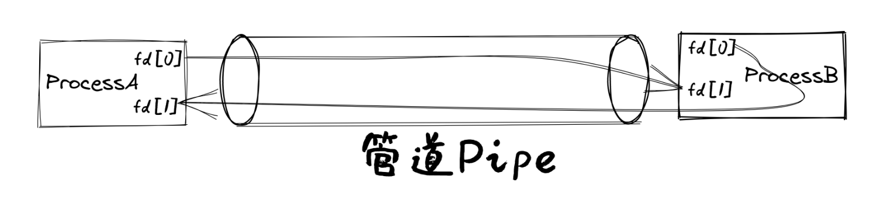

管道
============================================

本節導讀
--------------------------------------------

在上一節，我們實現了基於文件接口的標準輸入和輸出，這樣一個進程可以根據不同的輸入產生對應的輸出。本節我們將基於上一節介紹的文件接口 ``File`` 來把不同進程的輸入和輸出連接起來，從而在不改變應用程序代碼的情況下，讓操作系統具有進程間信息交換和功能組合的能力。這需要我們實現一種父子進程間的單向進程間通信機制——管道，併為此實現兩個新的系統調用 ``sys_pipe`` 和 ``sys_close`` 。

管道機制簡介
--------------------------------------------

.. chyyuu 進一步介紹一下pipe的歷史???

首先來介紹什麼是 **管道** (Pipe) 。管道是一種進程間通信機制，由操作系統提供，並可通過直接編程或在shell程序的幫助下輕鬆地把不同進程（目前是父子進程之間或子子進程之間）的輸入和輸出對接起來。我們也可以將管道看成一個有一定緩衝區大小的字節隊列，它分為讀和寫兩端，需要通過不同的文件描述符來訪問。讀端只能用來從管道中讀取，而寫端只能用來將數據寫入管道。由於管道是一個隊列，讀取數據的時候會從隊頭讀取並彈出數據，而寫入數據的時候則會把數據寫入到隊列的隊尾。由於管道的緩衝區大小是有限的，一旦整個緩衝區都被填滿就不能再繼續寫入，就需要等到讀端讀取並從隊列中彈出一些數據之後才能繼續寫入。當緩衝區為空的時候，讀端自然也不能繼續從裡面讀取數據，需要等到寫端寫入了一些數據之後才能繼續讀取。

一般在shell程序中， ``“|”`` 是管道符號，即兩個命令之間的一道豎槓。我們通過管道符號組合的命令，就可以瞭解登錄Linux的用戶的各種情況：

.. code-block:: shell

    who                     # 登錄Linux的用戶信息
    who | grep chyyuu       # 是否用戶ID為chyyuu的用戶登錄了
    who | grep chyyuu | wc  # chyyuu用戶目前在線登錄的個數

管道的系統調用原型及使用方法
--------------------------------------------

接下來，我們將逐步嘗試實現上面描述的管道的初步效果。我們新增一個系統調用來為當前進程打開一個代表管道的文件集（包含一個只讀文件，一個只寫文件）：

.. code-block:: rust

    /// 功能：為當前進程打開一個管道。
    /// 參數：pipe 表示應用地址空間中的一個長度為 2 的 usize 數組的起始地址，內核需要按順序將管道讀端
    /// 和寫端的文件描述符寫入到數組中。
    /// 返回值：如果出現了錯誤則返回 -1，否則返回 0 。可能的錯誤原因是：傳入的地址不合法。
    /// syscall ID：59
    pub fn sys_pipe(pipe: *mut usize) -> isize;

在用戶庫中會將其包裝為 ``pipe`` 函數：

.. code-block:: rust

    // user/src/syscall.rs

    const SYSCALL_PIPE: usize = 59;

    pub fn sys_pipe(pipe: &mut [usize]) -> isize {
        syscall(SYSCALL_PIPE, [pipe.as_mut_ptr() as usize, 0, 0])
    }

    // user/src/lib.rs

    pub fn pipe(pipe_fd: &mut [usize]) -> isize { sys_pipe(pipe_fd) }

只有當一個管道的所有讀端文件/寫端文件都被關閉之後，管道佔用的資源才會被回收，因此我們需要通過關閉文件的系統調用 ``sys_close`` （它會在用戶庫中被包裝為 ``close`` 函數。） ，來儘可能早的關閉之後不再用到的讀端的文件和寫端的文件。

我們來從簡單的管道測例 ``pipetest`` 中介紹管道的使用方法：

.. code-block:: rust
    :linenos:

    // user/src/bin/pipetest.rs

    #![no_std]
    #![no_main]

    #[macro_use]
    extern crate user_lib;

    use user_lib::{fork, close, pipe, read, write, wait};

    static STR: &str = "Hello, world!";

    #[no_mangle]
    pub fn main() -> i32 {
        // create pipe
        let mut pipe_fd = [0usize; 2];
        pipe(&mut pipe_fd);
        // read end
        assert_eq!(pipe_fd[0], 3);
        // write end
        assert_eq!(pipe_fd[1], 4);
        if fork() == 0 {
            // child process, read from parent
            // close write_end
            close(pipe_fd[1]);
            let mut buffer = [0u8; 32];
            let len_read = read(pipe_fd[0], &mut buffer) as usize;
            // close read_end
            close(pipe_fd[0]);
            assert_eq!(core::str::from_utf8(&buffer[..len_read]).unwrap(), STR);
            println!("Read OK, child process exited!");
            0
        } else {
            // parent process, write to child
            // close read end
            close(pipe_fd[0]);
            assert_eq!(write(pipe_fd[1], STR.as_bytes()), STR.len() as isize);
            // close write end
            close(pipe_fd[1]);
            let mut child_exit_code: i32 = 0;
            wait(&mut child_exit_code);
            assert_eq!(child_exit_code, 0);
            println!("pipetest passed!");
            0
        }
    }

在父進程中，我們通過 ``pipe`` 打開一個管道文件數組，其中 ``pipe_fd[0]`` 保存了管道讀端的文件描述符，而 ``pipe_fd[1]`` 保存了管道寫端的文件描述符。在 ``fork`` 之後，子進程會完全繼承父進程的文件描述符表，於是子進程也可以通過同樣的文件描述符來訪問同一個管道的讀端和寫端。之前提到過管道是單向的，在這個測例中我們希望管道中的數據從父進程流向子進程，也即父進程僅通過管道的寫端寫入數據，而子進程僅通過管道的讀端讀取數據。

因此，在第 25 和第 36 行，分別第一時間在子進程中關閉管道的寫端和在父進程中關閉管道的讀端。父進程在第 37 行將字符串 ``STR`` 寫入管道的寫端，隨後在第 39 行關閉管道的寫端；子進程在第 27 行從管道的讀端讀取字符串，並在第 29 行關閉。

如果想在父子進程之間實現雙向通信，我們就必須創建兩個管道。有興趣的同學可以參考測例 ``pipe_large_test`` 。

基於文件的管道
--------------------------------------------

我們將管道的一端（讀端或寫端）抽象為 ``Pipe`` 類型：

.. code-block:: rust

    // os/src/fs/pipe.rs

    pub struct Pipe {
        readable: bool,
        writable: bool,
        buffer: Arc<Mutex<PipeRingBuffer>>,
    }

``readable`` 和 ``writable`` 分別指出該管道端可否支持讀取/寫入，通過 ``buffer`` 字段還可以找到該管道端所在的管道自身。後續我們將為它實現 ``File`` Trait ，之後它便可以通過文件描述符來訪問。

而管道自身，也就是那個帶有一定大小緩衝區的字節隊列，我們抽象為 ``PipeRingBuffer`` 類型：

.. code-block:: rust

    // os/src/fs/pipe.rs

    const RING_BUFFER_SIZE: usize = 32;

    #[derive(Copy, Clone, PartialEq)]
    enum RingBufferStatus {
        FULL,
        EMPTY,
        NORMAL,
    }

    pub struct PipeRingBuffer {
        arr: [u8; RING_BUFFER_SIZE],
        head: usize,
        tail: usize,
        status: RingBufferStatus,
        write_end: Option<Weak<Pipe>>,
    }

- ``RingBufferStatus`` 記錄了緩衝區目前的狀態：``FULL`` 表示緩衝區已滿不能再繼續寫入； ``EMPTY`` 表示緩衝區為空無法從裡面讀取；而 ``NORMAL`` 則表示除了 ``FULL`` 和 ``EMPTY`` 之外的其他狀態。
- ``PipeRingBuffer`` 的 ``arr/head/tail`` 三個字段用來維護一個循環隊列，其中 ``arr`` 為存放數據的數組， ``head`` 為循環隊列隊頭的下標， ``tail`` 為循環隊列隊尾的下標。
- ``PipeRingBuffer`` 的 ``write_end`` 字段還保存了它的寫端的一個弱引用計數，這是由於在某些情況下需要確認該管道所有的寫端是否都已經被關閉了，通過這個字段很容易確認這一點。

從內存管理的角度，每個讀端或寫端中都保存著所屬管道自身的強引用計數，且我們確保這些引用計數只會出現在管道端口 ``Pipe`` 結構體中。於是，一旦一個管道所有的讀端和寫端均被關閉，便會導致它們所屬管道的引用計數變為 0 ，循環隊列緩衝區所佔用的資源被自動回收。雖然 ``PipeRingBuffer`` 中保存了一個指向寫端的引用計數，但是它是一個弱引用，也就不會出現循環引用的情況導致內存洩露。

.. chyyuu 介紹弱引用???

管道創建
~~~~~~~~~~~~~~~~~~~~~~~~~~~~~~~~~

通過 ``PipeRingBuffer::new`` 可以創建一個新的管道：

.. code-block:: rust

    // os/src/fs/pipe.rs

    impl PipeRingBuffer {
        pub fn new() -> Self {
            Self {
                arr: [0; RING_BUFFER_SIZE],
                head: 0,
                tail: 0,
                status: RingBufferStatus::EMPTY,
                write_end: None,
            }
        }
    }

``Pipe`` 的 ``read/write_end_with_buffer`` 方法可以分別從一個已有的管道創建它的讀端和寫端：

.. code-block:: rust

    // os/src/fs/pipe.rs

    impl Pipe {
        pub fn read_end_with_buffer(buffer: Arc<Mutex<PipeRingBuffer>>) -> Self {
            Self {
                readable: true,
                writable: false,
                buffer,
            }
        }
        pub fn write_end_with_buffer(buffer: Arc<Mutex<PipeRingBuffer>>) -> Self {
            Self {
                readable: false,
                writable: true,
                buffer,
            }
        }
    }

可以看到，讀端和寫端的訪問權限進行了相應設置：不允許向讀端寫入，也不允許從寫端讀取。

通過 ``make_pipe`` 方法可以創建一個管道並返回它的讀端和寫端：

.. code-block:: rust
    
    // os/src/fs/pipe.rs

    impl PipeRingBuffer {
        pub fn set_write_end(&mut self, write_end: &Arc<Pipe>) {
            self.write_end = Some(Arc::downgrade(write_end));
        }
    }

    /// Return (read_end, write_end)
    pub fn make_pipe() -> (Arc<Pipe>, Arc<Pipe>) {
        let buffer = Arc::new(Mutex::new(PipeRingBuffer::new()));
        let read_end = Arc::new(
            Pipe::read_end_with_buffer(buffer.clone())
        );
        let write_end = Arc::new(
            Pipe::write_end_with_buffer(buffer.clone())
        );
        buffer.lock().set_write_end(&write_end);
        (read_end, write_end)
    }

注意，我們調用 ``PipeRingBuffer::set_write_end`` 在管道中保留它的寫端的弱引用計數。

現在來實現創建管道的系統調用 ``sys_pipe`` ：

.. code-block:: rust
    :linenos:

    // os/src/task/task.rs

    impl TaskControlBlockInner {
        pub fn alloc_fd(&mut self) -> usize {
            if let Some(fd) = (0..self.fd_table.len())
                .find(|fd| self.fd_table[*fd].is_none()) {
                fd
            } else {
                self.fd_table.push(None);
                self.fd_table.len() - 1
            }
        }
    }

    // os/src/syscall/fs.rs

    pub fn sys_pipe(pipe: *mut usize) -> isize {
        let task = current_task().unwrap();
        let token = current_user_token();
        let mut inner = task.acquire_inner_lock();
        let (pipe_read, pipe_write) = make_pipe();
        let read_fd = inner.alloc_fd();
        inner.fd_table[read_fd] = Some(pipe_read);
        let write_fd = inner.alloc_fd();
        inner.fd_table[write_fd] = Some(pipe_write);
        *translated_refmut(token, pipe) = read_fd;
        *translated_refmut(token, unsafe { pipe.add(1) }) = write_fd;
        0
    }

``TaskControlBlockInner::alloc_fd`` 可以在進程控制塊中分配一個最小的空閒文件描述符來訪問一個新打開的文件。它先從小到大遍歷所有曾經被分配過的文件描述符嘗試找到一個空閒的，如果沒有的話就需要拓展文件描述符表的長度並新分配一個。

在 ``sys_pipe`` 中，第 21 行我們調用 ``make_pipe`` 創建一個管道並獲取其讀端和寫端，第 22~25 行我們分別為讀端和寫端分配文件描述符並將它們放置在文件描述符表中的相應位置中。第 26~27 行我們則是將讀端和寫端的文件描述符寫回到應用地址空間。

管道讀寫
~~~~~~~~~~~~~~~~~~~~~~~~~~~~~~~~~

首先來看如何為 ``Pipe`` 實現 ``File`` Trait 的 ``read`` 方法，即從管道的讀端讀取數據。在此之前，我們需要對於管道循環隊列進行封裝來讓它更易於使用：

.. code-block:: rust
    :linenos:

    // os/src/fs/pipe.rs

    impl PipeRingBuffer {
        pub fn read_byte(&mut self) -> u8 {
            self.status = RingBufferStatus::NORMAL;
            let c = self.arr[self.head];
            self.head = (self.head + 1) % RING_BUFFER_SIZE;
            if self.head == self.tail {
                self.status = RingBufferStatus::EMPTY;
            }
            c
        }
        pub fn available_read(&self) -> usize {
            if self.status == RingBufferStatus::EMPTY {
                0
            } else {
                if self.tail > self.head {
                    self.tail - self.head
                } else {
                    self.tail + RING_BUFFER_SIZE - self.head
                }
            }
        }
        pub fn all_write_ends_closed(&self) -> bool {
            self.write_end.as_ref().unwrap().upgrade().is_none()
        }
    }

``PipeRingBuffer::read_byte`` 方法可以從管道中讀取一個字節，注意在調用它之前需要確保管道緩衝區中不是空的。它會更新循環隊列隊頭的位置，並比較隊頭和隊尾是否相同，如果相同的話則說明管道的狀態變為空 ``EMPTY`` 。僅僅通過比較隊頭和隊尾是否相同不能確定循環隊列是否為空，因為它既有可能表示隊列為空，也有可能表示隊列已滿。因此我們需要在 ``read_byte`` 的同時進行狀態更新。

``PipeRingBuffer::available_read`` 可以計算管道中還有多少個字符可以讀取。我們首先需要判斷隊列是否為空，因為隊頭和隊尾相等可能表示隊列為空或隊列已滿，兩種情況 ``available_read`` 的返回值截然不同。如果隊列為空的話直接返回 0，否則根據隊頭和隊尾的相對位置進行計算。

``PipeRingBuffer::all_write_ends_closed`` 可以判斷管道的所有寫端是否都被關閉了，這是通過嘗試將管道中保存的寫端的弱引用計數升級為強引用計數來實現的。如果升級失敗的話，說明管道寫端的強引用計數為 0 ，也就意味著管道所有寫端都被關閉了，從而管道中的數據不會再得到補充，待管道中僅剩的數據被讀取完畢之後，管道就可以被銷燬了。

下面是 ``Pipe`` 的 ``read`` 方法的實現：

.. code-block:: rust
    :linenos:

    // os/src/fs/pipe.rs

    impl File for Pipe {
        fn read(&self, buf: UserBuffer) -> usize {
            assert!(self.readable());
            let want_to_read = buf.len();
            let mut buf_iter = buf.into_iter();
            let mut already_read = 0usize;
            loop {
                let mut ring_buffer = self.buffer.exclusive_access();
                let loop_read = ring_buffer.available_read();
                if loop_read == 0 {
                    if ring_buffer.all_write_ends_closed() {
                        return already_read;
                    }
                    drop(ring_buffer);
                    suspend_current_and_run_next();
                    continue;
                }
                for _ in 0..loop_read {
                    if let Some(byte_ref) = buf_iter.next() {
                        unsafe {
                            *byte_ref = ring_buffer.read_byte();
                        }
                        already_read += 1;
                        if already_read == want_to_read {
                            return want_to_read;
                        }
                    } else {
                        return already_read;
                    }
                }
            }
        }
    }

- 第 7 行的 ``buf_iter`` 將傳入的應用緩衝區 ``buf`` 轉化為一個能夠逐字節對於緩衝區進行訪問的迭代器，每次調用 ``buf_iter.next()`` 即可按順序取出用於訪問緩衝區中一個字節的裸指針。
- 第 8 行的 ``already_read`` 用來維護實際有多少字節從管道讀入應用的緩衝區。
- ``File::read`` 的語義是要從文件中最多讀取應用緩衝區大小那麼多字符。這可能超出了循環隊列的大小，或者由於尚未有進程從管道的寫端寫入足夠的字符，因此我們需要將整個讀取的過程放在一個循環中，當循環隊列中不存在足夠字符的時候暫時進行任務切換，等待循環隊列中的字符得到補充之後再繼續讀取。
  
  這個循環從第 9 行開始，第 11 行我們用 ``loop_read`` 來表示循環這一輪次中可以從管道循環隊列中讀取多少字符。如果管道為空則會檢查管道的所有寫端是否都已經被關閉，如果是的話，說明我們已經沒有任何字符可以讀取了，這時可以直接返回；否則我們需要等管道的字符得到填充之後再繼續讀取，因此我們調用 ``suspend_current_and_run_next`` 切換到其他任務，等到切換回來之後回到循環開頭再看一下管道中是否有字符了。在調用之前我們需要手動釋放管道自身的鎖，因為切換任務時候的 ``__switch`` 跨越了正常函數調用的邊界。

  如果 ``loop_read`` 不為 0 ，在這一輪次中管道中就有 ``loop_read`` 個字節可以讀取。我們可以迭代應用緩衝區中的每個字節指針，並調用 ``PipeRingBuffer::read_byte`` 方法來從管道中進行讀取。如果這 ``loop_read`` 個字節均被讀取之後還沒有填滿應用緩衝區，就需要進入循環的下一個輪次，否則就可以直接返回了。在具體實現的時候注意邊界條件的判斷。

``Pipe`` 的 ``write`` 方法 -- 即通過管道的寫端向管道中寫入數據的實現和 ``read`` 的原理類似，篇幅所限在這裡不再贅述，感興趣的同學可自行參考其實現。

這樣我們就為管道 ``Pipe`` 實現了上節中的通用文件接口 ``File`` trait，並將其順利整合到了文件子系統中。上一節我們提到子進程會繼承父進程的所有文件描述符，管道自然也包括在內，使得父子進程可以使用共享的單向管道進行通信了。

小結
--------------------------------------------

這一章講述的重點是一種有趣的進程間通信的機制--管道。通過管道，能夠把不同進程的輸入和輸出連接在一起，實現進程功能的組合。為了能夠統一表示輸入，輸出，以及管道，我們給出了與 **地址空間** 、 **進程** 齊名的操作系統抽象 **文件** ，並基於文件重構了操作系統的輸入/輸出機制。目前，僅僅實現了非常簡單的基於父子進程的管道機制。在操作系統層面，還缺乏對命令行參數的支持，在應用層面，還缺少I/O重定向和shell程序中基於 "|" 管道符號的支持。但我們已經建立了基本的進程通信機制，實現了支持協作的白堊紀“迅猛龍”操作系統的大部分功能，使得應用程序之間可以合作完成更復雜的工作。
但如果要讓相互獨立的應用程序之間也能合作，還需要對應用的執行參數進行一定的擴展，支持進程執行的命令行參數。這樣才能在應用程序的層面，完善I/O重定向，並在shell中支持基於 "|" 管道符號，形成更加靈活的獨立進程間的通信能力和shell命令行支持。
