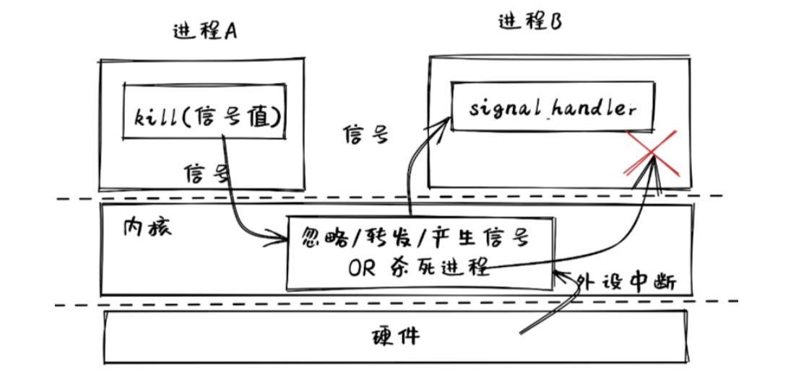
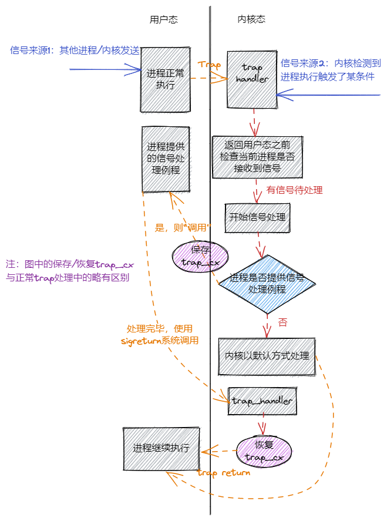

信號
============================================

本節導讀
--------------------------------------------

在本節之前的 IPC 機制主要集中在進程間的數據傳輸和數據交換方面，這需要兩個進程之間相互合作，同步地來實現。比如，一個進程發出 ``read`` 系統調用，另外一個進程需要發出對應的 ``write`` 系統調用，這樣兩個進程才能協同完成基於 ``pipe`` 機制的數據傳輸。這種雙向協作的方式不太適合單向的事件通知機制。

在進程間還存在“事件通知”的需求：操作系統或某進程希望能單方面通知另外一個正在忙其它事情的進程產生了某個事件，並讓這個進程能迅速響應。如果採用之前同步的 IPC 機制，難以高效地應對這樣的需求。比如，用戶想中斷當前正在運行的一個程序，於是他敲擊 `Ctrl-C` 的組合鍵，正在運行的程序會迅速退出它正在做的任何事情，截止程序的執行。

我們需要有一種類似於硬件中斷的軟件級異步通知機制，使得進程在接收到特定事件的時候能夠暫停當前的工作並及時響應事件，並在響應事件之後可以恢復當前工作繼續執行。如果進程沒有接收到任何事件，它可以執行自己的任務。這裡的暫停與恢復的工作，都由操作系統來完成，應用程序只需設置好響應某事件的事件處理例程就夠了。這在很大程度上簡化了應用程序響應事件的開發工作。這些需求和想法推動了 **信號** (Signal) 機制的產生。

信號機制簡介
--------------------------------------------

信號（Signals）是類 UNIX 操作系統中實現進程間通信的一種異步通知機制，用來提醒某進程一個特定事件已經發生，需要及時處理。當一個信號發送給一個進程時，操作系統會中斷接收到信號的進程的正常執行流程並對信號進行處理。如果該進程定義了信號的處理函數，那麼這個處理函數會被調用，否則就執行默認的處理行為，比如讓該進程退出。在處理完信號之後，如果進程還沒有退出，則會恢復並繼續進程的正常執行。

如果將信號與硬件中斷進行比較，我們可以把信號描述為軟件中斷。當硬件發出中斷後，中斷響應的對象是操作系統，並由操作系統預設的中斷處理例程來具體地進行中斷的響應和處理；對於信號來說，當某進程或操作系統發出信號時，會指定信號響應的對象，即某個進程的 ``pid`` ，並由該進程預設的信號處理例程來進行具體的信號響應。

進程間發送的信號是某種事件，為了簡單起見，UNIX 採用了整數來對信號進行編號，這些整數編號都定義了對應的信號的宏名，宏名都是以 SIG 開頭，比如SIGABRT, SIGKILL, SIGSTOP, SIGCONT。

信號的發送方可以是進程或操作系統內核：進程可以通過系統調用 ``kill`` 給其它進程發信號；內核在碰到特定事件，比如用戶對當前進程按下 ``Ctrl+C`` 按鍵時，內核會收到包含 ``Ctrl+C`` 按鍵的外設中斷和按鍵信息，隨後會向正在運行的當前進程發送 ``SIGINT`` 信號，將其終止。

信號的接收方是一個進程，接收到信號有多種處理方式，最常見的三種如下：

- 忽略：就像信號沒有發生過一樣。
- 捕獲：進程會調用相應的處理函數進行處理。
- 終止：終止進程。

如果應用沒有手動設置接收到某種信號之後如何處理，則操作系統內核會以默認方式處理該信號，一般是終止收到信號的進程或者忽略此信號。每種信號都有自己的默認處理方式。

.. note::

   **Linux 有哪些信號？** 

   Linux 中有 62 個信號，每個信號代表著某種事件，一般情況下，當進程收到某個信號時，意味著該信號所代表的事件發生了。下面列出了一些常見的信號。

   ===========  ========================================================== 
    信號         含義      
   ===========  ==========================================================  
    SIGABRT     非正常的進程退出，可能由調用 ``abort`` 函數產生
    SIGCHLD     進程狀態變更時（通常是進程退出時），由內核發送給它的父進程
    SIGINT      在終端界面按下 ``CTRL+C`` 組合鍵時，由內核會發送給當前終端的前臺進程
    SIGKILL     終止某個進程，由內核或其他進程發送給被終止進程
    SIGSEGV     非法內存訪問異常，由內核發送給觸發異常的進程
    SIGILL      非法指令異常，由內核發送給觸發異常的進程
    SIGTSTP     在終端界面按下  ``CTRL+Z`` 組合鍵時，會發送給當前進程讓它暫停
    SIGSTOP     也用於暫停進程，與 ``SIGTSTP`` 的區別在於 ``SIGSTOP`` 不能被忽略或捕獲，即 ``SIGTSTP`` 更加靈活
    SIGCONT     恢復暫停的進程繼續執行
    SIGUSR1/2   用戶自定義信號 1/2
   ===========  ==========================================================

   和之前介紹過的硬件中斷一樣，信號作為軟件中斷也可以分成同步和異步兩種，這裡的同步/異步指的是信號的觸發同步/異步於接收到信號進程的執行。比如 ``SIGILL`` 和 ``SIGSEGV`` 就屬於同步信號，而 ``SIGCHLD`` 和 ``SIGINT`` 就屬於異步信號。

信號處理流程
--------------------------------------------

信號的處理流程如下圖所示：

信號有兩種來源：最開始的時候進程在正常執行，此時可能內核或者其他進程給它發送了一個信號，這些就屬於異步信號，是信號的第一種來源；信號的第二種來源則是由進程自身的執行觸發，在處理 Trap 的時候內核會將相應的信號直接附加到進程控制塊中，這種屬於同步信號。

內核會在 Trap 處理完成即將返回用戶態之前檢查要返回到的進程是否還有信號待處理。如果需要處理的話，取決於進程是否提供該種信號的處理函數，有兩種處理方法：

- 如果進程通過下面介紹的 ``sigaction`` 系統調用提供了相應信號的處理函數，那麼內核會將該進程 Trap 進來時留下的 Trap 上下文保存在另一個地方，並回到用戶態執行進程提供的處理函數。內核要求處理函數的編寫者在函數的末尾手動進行另一個 ``sigreturn`` 系統調用，表明處理結束並請求恢復進程原來的執行。內核將處理該系統調用並恢復之前保存的 Trap 上下文，等到再次回到用戶態的時候，便會繼續進程在處理信號之前的執行。
- 反之，如果進程未提供處理函數，這是一種比較簡單的情況。此時，內核會直接默認的方式處理信號。之後便會回到用戶態繼續進程原先的執行。

信號機制系統調用原型
--------------------------------------------

發送信號
~~~~~~~~~~~~~~~~~~~~~~~~~~~~~~~~~~~~~~~~~~~~

為了與其他進程進行通信，一個進程可以使用 ``kill`` 系統調用發送信號給另一個進程：

.. code-block:: rust

    // user/src/lib.rs

    /// 功能：當前進程向另一個進程（可以是自身）發送一個信號。
    /// 參數：pid 表示接受信號的進程的進程 ID, signum 表示要發送的信號的編號。
    /// 返回值：如果傳入參數不正確（比如指定進程或信號類型不存在）則返回 -1 ,否則返回 0 。
    /// syscall ID: 129
    pub fn kill(pid: usize, signum: i32) -> isize;

我們的內核中各信號的編號定義如下：

.. code-block:: rust

    // user/src/lib.rs

    pub const SIGDEF: i32 = 0; // Default signal handling
    pub const SIGHUP: i32 = 1;
    pub const SIGINT: i32 = 2;
    pub const SIGQUIT: i32 = 3;
    pub const SIGILL: i32 = 4;
    pub const SIGTRAP: i32 = 5;
    pub const SIGABRT: i32 = 6;
    pub const SIGBUS: i32 = 7;
    pub const SIGFPE: i32 = 8;
    pub const SIGKILL: i32 = 9;
    ...

從中可以看出，每次調用 ``kill`` 只能發送一個類型的信號。 

處理信號
~~~~~~~~~~~~~~~~~~~~~~~~~~~~~~~~~~~~~~~~~~~~

與信號處理相關的系統調用則有三個：

- ``sys_sigaction`` :設置信號處理例程
- ``sys_procmask`` :設置進程的信號屏蔽掩碼
- ``sys_sigreturn`` :清除棧幀，從信號處理例程返回

下面依次對它們進行說明。

首先，進程可以通過 ``sigaction`` 系統調用捕獲某種信號，即：當接收到某種信號的時候，暫停進程當前的執行，調用進程為該種信號提供的函數對信號進行處理，處理完成之後再恢復進程原先的執行。 ``sigaction`` 的接口如下：

.. code-block:: rust

    // os/src/syscall/process.rs

    /// 功能：為當前進程設置某種信號的處理函數，同時保存設置之前的處理函數。
    /// 參數：signum 表示信號的編號，action 表示要設置成的處理函數的指針
    /// old_action 表示用於保存設置之前的處理函數的指針（SignalAction 結構稍後介紹）。
    /// 返回值：如果傳入參數錯誤（比如傳入的 action 或 old_action 為空指針或者）
    /// 信號類型不存在返回 -1 ，否則返回 0 。
    /// syscall ID: 134
    pub fn sys_sigaction(
        signum: i32,
        action: *const SignalAction,
        old_action: *mut SignalAction,
    ) -> isize;

為了讓編寫應用更加方便，用戶庫 ``user_lib`` 中的接口略有不同：

.. code-block:: rust

    // user/src/lib.rs

    pub fn sigaction(
        signum: i32,
        action: Option<&SignalAction>,
        old_action: Option<&mut SignalAction>,
    ) -> isize;

注意這裡參數 ``action`` 和 ``old_action`` 使用引用而非裸指針，且有一層 ``Option`` 包裹，這樣能減少對於不安全的裸指針的使用。在傳參的時候，如果傳遞實際存在的引用則使用 ``Some`` 包裹，而用 ``None`` 來代替空指針，這樣可以提前對引用和空指針做出區分。在具體實現的時候，再將 ``None`` 轉換為空指針：

.. code-block:: rust

    // user/src/lib.rs

    pub fn sigaction(
        signum: i32,
        action: Option<&SignalAction>,
        old_action: Option<&mut SignalAction>,
    ) -> isize {
        sys_sigaction(
            signum,
            action.map_or(core::ptr::null(), |a| a),
            old_action.map_or(core::ptr::null_mut(), |a| a)
        )
    }

接下來介紹 ``SignalAction`` 數據結構。方便起見，我們將其對齊到 16 字節使得它不會跨虛擬頁面：

.. code-block:: rust

    // user/src/lib.rs

    /// Action for a signal
    #[repr(C, align(16))]
    #[derive(Debug, Clone, Copy)]
    pub struct SignalAction {
        pub handler: usize,
        pub mask: SignalFlags,
    }

可以看到它有兩個字段： ``handler`` 表示信號處理例程的入口地址； ``mask`` 則表示執行該信號處理例程期間的信號掩碼。這個信號掩碼是用於在執行信號處理例程的期間屏蔽掉一些信號，每個 ``handler`` 都可以設置它在執行期間屏蔽掉哪些信號。“屏蔽”的意思是指在執行該信號處理例程期間，即使 Trap 到內核態發現當前進程又接收到了一些信號，只要這些信號被屏蔽，內核就不會對這些信號進行處理而是直接回到用戶態繼續執行信號處理例程。但這不意味著這些被屏蔽的信號就此被忽略，它們仍被記錄在進程控制塊中，當信號處理例程執行結束之後它們便不再被屏蔽，從而後續可能被處理。

``mask`` 作為一個掩碼可以代表屏蔽掉一組信號，因此它的類型 ``SignalFlags`` 是一個信號集合：

.. code-block:: rust

    // user/src/lib.rs

    bitflags! {
        pub struct SignalFlags: i32 {
            const SIGDEF = 1; // Default signal handling
            const SIGHUP = 1 << 1;
            const SIGINT = 1 << 2;
            const SIGQUIT = 1 << 3;
            const SIGILL = 1 << 4;
            const SIGTRAP = 1 << 5;
            ...
            const SIGSYS = 1 << 31;
        }
    }

需要注意的是，我們目前的實現比較簡單，暫時不支持信號嵌套，也就是在執行一個信號處理例程期間再去執行另一個信號處理例程。

``sigaction`` 可以設置某個信號處理例程的信號掩碼，而 ``sigprocmask`` 是設置這個進程的全局信號掩碼：

.. code-block:: rust

    // user/src/lib.rs

    /// 功能：設置當前進程的全局信號掩碼。
    /// 參數：mask 表示當前進程要設置成的全局信號掩碼，代表一個信號集合，
    /// 在集合中的信號始終被該進程屏蔽。
    /// 返回值：如果傳入參數錯誤返回 -1 ，否則返回之前的信號掩碼 。
    /// syscall ID: 135
    pub fn sigprocmask(mask: u32) -> isize;

最後一個系統調用是 ``sigreturn`` 。介紹信號處理流程的時候提到過，在進程向內核提供的信號處理例程末尾，函數的編寫者需要手動插入一個 ``sigreturn`` 系統調用來通知內核信號處理過程結束，可以恢復進程先前的執行。它的接口如下：

.. code-block:: rust

    // user/src/lib.rs

    /// 功能：進程通知內核信號處理例程退出，可以恢復原先的進程執行。
    /// 返回值：如果出錯返回 -1，否則返回 0 。
    /// syscall ID: 139
    pub fn sigreturn() -> isize;

信號系統調用使用示例
~~~~~~~~~~~~~~~~~~~~~~~~~~~~~~~~~~~~~~~~~~~~

我們來從簡單的信號例子 ``sig_simple`` 中介紹如何使用信號機制：

.. code-block:: rust
    :linenos:

    // user/src/bin/sig_simple.rs

    #![no_std]
    #![no_main]

    extern crate user_lib;

    // use user_lib::{sigaction, sigprocmask, SignalAction, SignalFlags, fork, exit, wait, kill, getpid, sleep, sigreturn};
    use user_lib::*;

    fn func() {
        println!("user_sig_test passed");
        sigreturn();
    }

    #[no_mangle]
    pub fn main() -> i32 {
        let mut new = SignalAction::default();
        let mut old = SignalAction::default();
        new.handler = func as usize;

        println!("signal_simple: sigaction");
        if sigaction(SIGUSR1, Some(&new), Some(&mut old)) < 0 {
            panic!("Sigaction failed!");
        }
        println!("signal_simple: kill");
        if kill(getpid() as usize, SIGUSR1) < 0 {
            println!("Kill failed!");
            exit(1);
        }
        println!("signal_simple: Done");
        0
    }

在此進程中：

- 在第 18~20 行，首先建立了 ``new`` 和 ``old`` 兩個 ``SignalAction`` 結構的變量，並設置 ``new.handler`` 為信號處理例程 ``func`` 的地址。 
- 然後在第 23 行，調用 ``sigaction`` 函數，提取 ``new`` 結構中的信息設置當前進程收到 ``SIGUSR1`` 信號之後的處理方式，其效果是該進程在收到 ``SIGUSR1`` 信號後，會執行 ``func`` 函數來具體處理響應此信號。 
- 接著在第 27 行，通過 ``getpid`` 函數獲得自己的 pid，並以自己的 pid 和 ``SIGUSR1`` 為參數，調用 ``kill`` 函數，給自己發 ``SIGUSR1`` 信號。

執行這個應用，可以看到下面的輸出：

.. code-block::

    >> sig_simple
    signal_simple: sigaction
    signal_simple: kill
    user_sig_test passed
    signal_simple: Done
    
可以看出，看到進程在收到自己給自己發送的 ``SIGUSR1`` 信號之後，內核調用它作為信號處理例程的 ``func`` 函數並打印出了標誌性輸出。在信號處理例程結束之後，還能夠看到含有 ``Done`` 的輸出，這意味著進程原先的執行被正確恢復。 

.. 操作系統在收到 ``sys_kill`` 系統調用後，會保存該進程老的 Trap 上下文，然後修改其 Trap 上下文，使得從內核返回到該進程的 ``func`` 函數執行，並在 ``func`` 函數的末尾，進程通過調用 ``sigreturn`` 函數，恢復到該進程之前被 ``func`` 函數截斷的地方，即 ``sys_kill`` 系統調用後的指令處，繼續執行，直到進程結束。

設計與實現信號機制
---------------------------------------------

我們將信號機制的實現劃分為兩部分：

- 一是進程通過 ``sigaction`` 系統調用設置信號處理例程和通過 ``sigprocmask`` 設置進程全局信號掩碼。這些操作只需簡單修改進程控制塊中新增的相關數據結構即可，比較簡單。
- 二是如何向進程發送信號、進程如何接收信號、而信號又如何被處理，這些操作需要結合到本書前面的章節介紹的對於 Trap 處理流程，因此會比較複雜。

設置信號處理例程和信號掩碼
~~~~~~~~~~~~~~~~~~~~~~~~~~~~~~~~~~~~~~~~~~~~~~~~~~~~~

為了實現進程設置信號處理例程和信號掩碼的功能，我們需要在進程控制塊 ``TaskControlBlock`` 中新增以下數據結構（這些數據結構在進程創建之後可能被修改，因此將它們放置在內部可變的 inner 中）：

.. code-block:: rust

    // os/src/task/task.rs

    pub struct TaskControlBlockInner {
        ...
        pub signal_mask: SignalFlags,
        pub signal_actions: SignalActions,
        ...
    }

其中， ``signal_mask`` 表示進程的全局信號掩碼，其類型 ``SignalFlags`` 與用戶庫 ``user_lib`` 中的相同，表示一個信號集合。在 ``signal_mask`` 這個信號集合內的信號將被該進程全局屏蔽。

進程可以通過 ``sigprocmask`` 系統調用直接設置自身的全局信號掩碼：

.. code-block:: rust

    // os/src/process.rs

    pub fn sys_sigprocmask(mask: u32) -> isize {
        if let Some(task) = current_task() {
            let mut inner = task.inner_exclusive_access();
            let old_mask = inner.signal_mask;
            if let Some(flag) = SignalFlags::from_bits(mask) {
                inner.signal_mask = flag;
                old_mask.bits() as isize
            } else {
                -1
            }
        } else {
            -1
        }
    }

進程控制塊中的 ``signal_actions`` 的類型是 ``SignalActions`` ，是一個 ``SignalAction`` （同樣與 ``user_lib`` 中的定義相同）的定長數組，其中每一項都記錄進程如何響應對應的信號：

.. code-block:: rust

    // os/src/task/signal.rs

    pub const MAX_SIG: usize = 31;

    // os/src/task/action.rs

    #[derive(Clone)]
    pub struct SignalActions {
        pub table: [SignalAction; MAX_SIG + 1],
    }

於是，在 ``sigaction`` 系統調用的時候我們只需要更新當前進程控制塊的 ``signal_actions`` 即可：

.. code-block:: rust
    :linenos:

    // os/src/syscall/process.rs

    fn check_sigaction_error(signal: SignalFlags, action: usize, old_action: usize) -> bool {
        if action == 0
            || old_action == 0
            || signal == SignalFlags::SIGKILL
            || signal == SignalFlags::SIGSTOP
        {
            true
        } else {
            false
        }
    }

    pub fn sys_sigaction(
        signum: i32,
        action: *const SignalAction,
        old_action: *mut SignalAction,
    ) -> isize {
        let token = current_user_token();
        let task = current_task().unwrap();
        let mut inner = task.inner_exclusive_access();
        if signum as usize > MAX_SIG {
            return -1;
        }
        if let Some(flag) = SignalFlags::from_bits(1 << signum) {
            if check_sigaction_error(flag, action as usize, old_action as usize) {
                return -1;
            }
            let prev_action = inner.signal_actions.table[signum as usize];
            *translated_refmut(token, old_action) = prev_action;
            inner.signal_actions.table[signum as usize] = *translated_ref(token, action);
            0
        } else {
            -1
        }
    }

其中：

- ``check_sigaction_error`` 用來檢查 ``sigaction`` 的參數是否有錯誤（有錯誤的話返回 true）。這裡的檢查比較簡單，如果傳入的 ``action`` 或者 ``old_action`` 為空指針則視為錯誤。另一種錯誤則是信號類型為 ``SIGKILL`` 或者 ``SIGSTOP`` ，這是因為我們的內核參考 Linux 內核規定不允許進程對這兩種信號設置信號處理例程，而只能由內核對它們進行處理。
- ``sys_sigaction`` 首先會調用 ``check_sigactio_error`` 進行檢查，如果沒有錯誤的話，則會使用 ``translated_ref(mut)`` 將進程提交的信號處理例程保存到進程控制塊，隨後將此前的處理例程保存到進程中的指定位置。注意使用 ``translated_ref(mut)`` 的前提是類型 ``T`` 不會跨頁，我們通過設置 ``SignalAction`` 對齊到 16 字節來保證這一點。

信號的產生
~~~~~~~~~~~~~~~~~~~~~~~~~~~~~~~~~~~~~~~~~~~~~~

信號的產生有以下幾種方式：

1. 進程通過 ``kill`` 系統調用給自己或者其他進程發送信號。
2. 內核檢測到某些事件給某個進程發送信號，但這個事件與接收信號的進程的執行無關。典型的例子如： ``SIGCHLD`` 當子進程的狀態改變後由內核發送給父進程。可以看出這可以用來實現更加靈活的進程管理，但我們的內核為了簡單目前並沒有實現 ``SIGCHLD`` 這類信號。
3. 前兩種屬於異步信號，最後一種則屬於同步信號：即進程執行的時候觸發了某些條件，於是在 Trap 到內核處理的時候，內核給該進程發送相應的信號。比較常見的例子是進程執行的時候出錯，比如段錯誤 ``SIGSEGV`` 和非法指令異常 ``SIGILL`` 。

首先來看 ``kill`` 系統調用的實現：

.. code-block:: rust

    // os/src/task/task.rs

    pub struct TaskControlBlockInner {
        ...
        pub signals: SignalFlags,
        ...
    }

    // os/src/syscall/process.rs

    pub fn sys_kill(pid: usize, signum: i32) -> isize {
        if let Some(task) = pid2task(pid) {
            if let Some(flag) = SignalFlags::from_bits(1 << signum) {
                // insert the signal if legal
                let mut task_ref = task.inner_exclusive_access();
                if task_ref.signals.contains(flag) {
                    return -1;
                }
                task_ref.signals.insert(flag);
                0
            } else {
                -1
            }
        } else {
            -1
        }
    }

這需要在進程控制塊的可變部分中新增一個 ``signals`` 字段記錄對應進程目前已經收到了哪些信號尚未處理，它的類型同樣是 ``SignalFlags`` 表示一個信號集合。 ``sys_kill`` 的實現也比較簡單：就是調用 ``pid2task`` 得到傳入進程 ID 對應的進程控制塊，然後把要發送的信號插入到 ``signals`` 字段中。

然後是進程執行出錯的情況（比如訪存錯誤或非法指令異常），這會 Trap 到內核並在 ``trap_handler`` 中由內核將對應信號發送到當前進程：

.. code-block:: rust

    // os/src/trap/mod.rs

    #[no_mangle]
    pub fn trap_handler() -> ! {
        ...
        match scause.cause() {
            ...
            Trap::Exception(Exception::StoreFault)
            | Trap::Exception(Exception::StorePageFault)
            | Trap::Exception(Exception::InstructionFault)
            | Trap::Exception(Exception::InstructionPageFault)
            | Trap::Exception(Exception::LoadFault)
            | Trap::Exception(Exception::LoadPageFault) => {
                /*
                println!(
                    "[kernel] {:?} in application, bad addr = {:#x}, bad instruction = {:#x}, kernel killed it.",
                    scause.cause(),
                    stval,
                    current_trap_cx().sepc,
                );
                */
                current_add_signal(SignalFlags::SIGSEGV);
            }
            Trap::Exception(Exception::IllegalInstruction) => {
                current_add_signal(SignalFlags::SIGILL);
            ...
        }
        ...
    }

    // os/src/task/mod.rs

    pub fn current_add_signal(signal: SignalFlags) {
        let task = current_task().unwrap();
        let mut task_inner = task.inner_exclusive_access();
        task_inner.signals |= signal;
    }

信號的處理
~~~~~~~~~~~~~~~~~~~~~~~~~~~~~~~~~~~~~~~~~~~~~

在 ``trap_handler`` 完成 Trap 處理並返回用戶態之前，會調用 ``handle_signals`` 函數處理當前進程此前接收到的信號：

.. code-block:: rust

    // os/src/task/task.rs

    pub struct TaskControlBlockInner {
        ...
        pub killed: bool,
        pub frozen: bool,
        ...
    }

    // os/src/task/mod.rs

    pub fn handle_signals() {
        loop {
            check_pending_signals();
            let (frozen, killed) = {
                let task = current_task().unwrap();
                let task_inner = task.inner_exclusive_access();
                (task_inner.frozen, task_inner.killed)
            };
            if !frozen || killed {
                break;
            }
            suspend_current_and_run_next();
        }
    }

可以看到 ``handle_signals`` 是一個無限循環，真正處理信號的邏輯在 ``check_pending_signals`` 函數中。這樣做是為了處理 ``SIGSTOP`` 和 ``SIGCONT`` 這一對信號：當進程收到 ``SIGSTOP`` 信號之後，它的執行將被暫停，等到該進程收到 ``SIGCONT`` 信號之後再繼續執行。我們在進程控制塊中新增 ``frozen`` 字段表示進程目前是否已收到 ``SIGSTOP`` 信號被暫停，而 ``killed`` 字段表示進程是否已被殺死。這個循環的意義在於：只要進程還處於暫停且未被殺死的狀態就會停留在循環中等待 ``SIGCONT`` 信號的到來。如果 ``frozen`` 為真，證明還沒有收到 ``SIGCONT`` 信號，進程仍處於暫停狀態，循環的末尾我們調用 ``suspend_current_and_run_next`` 函數切換到其他進程期待其他進程將 ``SIGCONT`` 信號發過來。

``check_pending_signals`` 會檢查收到的信號並對它們進行處理，在這個過程中會更新上面的 ``frozen`` 和 ``killed`` 字段：

.. code-block:: rust
    :linenos:

    // os/src/task/mod.rs

    fn check_pending_signals() {
        for sig in 0..(MAX_SIG + 1) {
            let task = current_task().unwrap();
            let task_inner = task.inner_exclusive_access();
            let signal = SignalFlags::from_bits(1 << sig).unwrap();
            if task_inner.signals.contains(signal) && (!task_inner.signal_mask.contains(signal)) {
                let mut masked = true;
                let handling_sig = task_inner.handling_sig;
                if handling_sig == -1 {
                    masked = false;
                } else {
                    let handling_sig = handling_sig as usize;
                    if !task_inner.signal_actions.table[handling_sig]
                        .mask
                        .contains(signal)
                    {
                        masked = false;
                    }
                }
                if !masked {
                    drop(task_inner);
                    drop(task);
                    if signal == SignalFlags::SIGKILL
                        || signal == SignalFlags::SIGSTOP
                        || signal == SignalFlags::SIGCONT
                        || signal == SignalFlags::SIGDEF
                    {
                        // signal is a kernel signal
                        call_kernel_signal_handler(signal);
                    } else {
                        // signal is a user signal
                        call_user_signal_handler(sig, signal);
                        return;
                    }
                }
            }
        }
    }

- 第 4 行的最外層循環遍歷所有信號；
- 第 8 行檢查當前進程是否接收到了遍歷到的信號（條件 1）以及該信號是否未被當前進程全局屏蔽（條件 2）；
- 第 9 ~ 21 行檢查該信號是否未被當前正在執行的信號處理例程屏蔽（條件 3）；
- 當 3 個條件全部滿足的時候，則在第 23 ~ 36 行開始處理該信號。目前的設計是：如果信號類型為 ``SIGKILL/SIGSTOP/SIGCONT/SIGDEF`` 四者之一，則該信號只能由內核來處理，調用 ``call_kernel_signal_handler`` 函數來處理；否則調用 ``call_user_signal_handler`` 函數嘗試使用進程提供的信號處理例程來處理。

.. code-block:: rust

    // os/src/task/task.rs

    pub struct TaskControlBlockInner {
        ...
        pub handling_sig: isize,
        pub trap_ctx_backup: Option<TrapContext>,
        ...
    }

    // os/src/task/mod.rs

    fn call_kernel_signal_handler(signal: SignalFlags) {
        let task = current_task().unwrap();
        let mut task_inner = task.inner_exclusive_access();
        match signal {
            SignalFlags::SIGSTOP => {
                task_inner.frozen = true;
                task_inner.signals ^= SignalFlags::SIGSTOP;
            }
            SignalFlags::SIGCONT => {
                if task_inner.signals.contains(SignalFlags::SIGCONT) {
                    task_inner.signals ^= SignalFlags::SIGCONT;
                    task_inner.frozen = false;
                }
            }
            _ => {
                // println!(
                //     "[K] call_kernel_signal_handler:: current task sigflag {:?}",
                //     task_inner.signals
                // );
                task_inner.killed = true;
            }
        }
    }

    fn call_user_signal_handler(sig: usize, signal: SignalFlags) {
        let task = current_task().unwrap();
        let mut task_inner = task.inner_exclusive_access();

        let handler = task_inner.signal_actions.table[sig].handler;
        if handler != 0 {
            // user handler

            // handle flag
            task_inner.handling_sig = sig as isize;
            task_inner.signals ^= signal;

            // backup trapframe
            let mut trap_ctx = task_inner.get_trap_cx();
            task_inner.trap_ctx_backup = Some(*trap_ctx);

            // modify trapframe
            trap_ctx.sepc = handler;

            // put args (a0)
            trap_ctx.x[10] = sig;
        } else {
            // default action
            println!("[K] task/call_user_signal_handler: default action: ignore it or kill process");
        }
    }

- ``call_kernel_signal_handler`` 對於 ``SIGSTOP`` 和 ``SIGCONT`` 特殊處理：清除掉接收到的信號避免它們再次被處理，然後更新 ``frozen`` 字段；對於其他的信號都按照默認的處理方式即殺死當前進程，於是將 ``killed`` 字段設置為真，這樣的進程會在 Trap 返回用戶態之前就通過調度切換到其他進程。
- 在實現 ``call_user_signal_handler`` 之前，還需在進程控制塊中新增兩個字段： ``handling_sig`` 表示進程正在執行哪個信號的處理例程； ``trap_ctx_backup`` 則表示進程執行信號處理例程之前的 Trap 上下文。因為我們要 Trap 回到用戶態執行信號處理例程，原來的 Trap 上下文會被覆蓋，所以我們將其保存在進程控制塊中。
- ``call_user_signal_handler`` 首先檢查進程是否提供了該信號的處理例程，如果沒有提供的話直接忽略該信號。否則就調用信號處理例程：除了更新 ``handling_sig`` 和 ``signals`` 之外，還將當前的 Trap 上下文保存在 ``trap_ctx_backup`` 中。然後修改 Trap 上下文的 ``sepc`` 到應用設置的例程地址使得 Trap 回到用戶態之後就會跳轉到例程入口並開始執行。注意我們並沒有修改 Trap 上下文中的 ``sp`` ，這意味著例程還會在原先的用戶棧上執行。這是為了實現方便，在 Linux 的實現中，內核會為每次例程的執行重新分配一個用戶棧。最後，我們修改 Trap 上下文的 ``a0`` 寄存器，使得信號類型能夠作為參數被例程接收。

回到 ``handle_signals`` ，從 ``handle_signals`` 退出之後會回到 ``trap_handler`` 中，這裡在回到用戶態之前會檢查當前進程是否出錯並可以退出：

.. code-block:: rust

    // os/src/trap/mod.rs

    #[no_mangle]
    pub fn trap_handler() -> ! {
        ...
        handle_signals();

        // check error signals (if error then exit)
        if let Some((errno, msg)) = check_signals_error_of_current() {
            println!("[kernel] {}", msg);
            exit_current_and_run_next(errno);
        }
        trap_return();
    }

這裡的錯誤涵蓋了 ``SIGINT/SIGSEGV/SIGILL`` 等，可以看 ``check_signals_error_of_current`` 的實現。出錯之後會直接打印信息並調用 ``exit_current_and_run_next`` 退出當前進程並進行調度。

最後還需要補充 ``sigreturn`` 的實現。在信號處理例程的結尾需要插入這個系統調用來結束信號處理並繼續進程原來的執行：

.. code-block:: rust
    :linenos:

    // os/src/syscall/process.rs

    pub fn sys_sigreturn() -> isize {
        if let Some(task) = current_task() {
            let mut inner = task.inner_exclusive_access();
            inner.handling_sig = -1;
            // restore the trap context
            let trap_ctx = inner.get_trap_cx();
            *trap_ctx = inner.trap_ctx_backup.unwrap();
            trap_ctx.x[10] as isize
        } else {
            -1
        }
    }

這裡只是將進程控制塊中保存的記錄了處理信號之前的進程上下文的 ``trap_ctx_backup`` 覆蓋到當前的 Trap 上下文。這樣接下來 Trap 回到用戶態就會繼續原來進程的執行了。注意在第 10 行，我們將 ``trap_ctx`` 中的 ``a0`` 的值作為系統調用返回值而不是使用 0 這種特定值，不然的話，在返回用戶態恢復 Trap 上下文的時候，原來進程上下文中的 ``a0`` 寄存器將會被這些特定值覆蓋，使得進程無法在信號處理完成後恢復正常執行。

小結
--------------------------------------------

信號作為一種軟件中斷機制和硬件中斷有很多相似之處：比如它們都可以用某種方式屏蔽，還細分為全局屏蔽和局部屏蔽；它們的處理都有一定延遲，硬件中斷每個 CPU 週期僅在固定的階段被檢查，而信號只有在 Trap 陷入內核態之後才被檢查並處理。這個延遲還與屏蔽、優先級和軟件或硬件層面的調度策略有關。

這裡僅僅給出了一個基本的信號機制的使用和實現的過程描述，在實際操作系統中，信號處理的過程要複雜很多，有興趣的同學可以查找實際操作系統（如 Linux ）在信號處理上的具體實現。

至此，我們基本上完成了“迅猛龍”操作系統，它具有 UNIX 的很多核心特徵，比如進程管理、虛存管理、文件系統、管道、I/O 重定向、信號等，是一個典型的宏內核操作系統。雖然它還缺少很多優化的算法、機制和策略，但我們已經一步一步地建立了一個相對完整的操作系統框架和核心模塊實現。在這個過程中，我們經歷了從簡單到複雜的 LibOS、批處理、多道程序、分時多任務、虛存支持、進程支持、文件系統支持等各種操作系統的設計過程，相信同學對操作系統的總體設計也有了一個連貫的多層次的理解。而且我們可以在這個操作系統的框架下，進一步擴展和改進它的設計實現，支持更多的功能並提高性能，這將是我們後續會進一步講解的內容。

參考
--------------------------------------------

- https://venam.nixers.net/blog/unix/2016/10/21/unix-signals.html
- https://www.onitroad.com/jc/linux/man-pages/linux/man2/sigreturn.2.html
- http://web.stanford.edu/class/cs110/
