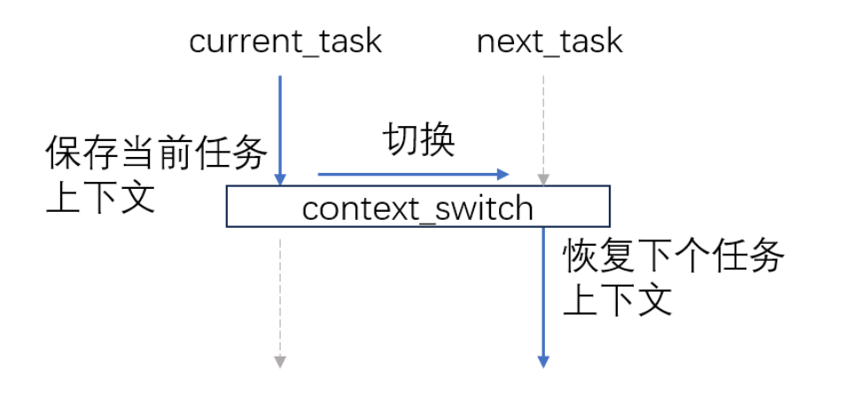

用戶態的線程管理
=========================================

本節導讀
-----------------------------------------

在本章的起始介紹中，給出了線程的基本定義，但沒有具體的實現，這可能讓同學在理解線程上還有些不夠深入。其實實現多線程不一定需要操作系統的支持，完全可以在用戶態實現。本節的主要目標是理解線程的基本要素、多線程應用的執行方式以及如何在用戶態構建一個多線程的基本執行環境(即線程管理運行時， Thread Manager Runtime)。

在這裡，我們首先分析了一個簡單的用戶態多線程應用的執行過程，然後設計支持這種簡單多線程應用的執行環境，包括線程的總體結構、管理線程執行的線程控制塊數據結構、以及對線程管理相關的重要函數：線程創建和線程切換。安排本節的原因在於：它能幫助我們直接理解線程最核心的設計思想與具體實現，並對後續在有進程支持的操作系統內核中進一步實現線程機制打下一個基礎。

用戶態多線程應用
------------------------------------------------

我們先看看一個簡單的用戶態多線程應用。

.. code-block:: rust
    :linenos:

    // 多線程基本執行環境的代碼
    ...
    // 多線程應用的主體代碼
    fn main() {
        let mut runtime = Runtime::new();
        runtime.init();
        runtime.spawn(|| {
            println!("TASK 1 STARTING");
            let id = 1;
            for i in 0..10 {
                println!("task: {} counter: {}", id, i);
                yield_task();
            }
            println!("TASK 1 FINISHED");
        });
        runtime.spawn(|| {
            println!("TASK 2 STARTING");
            let id = 2;
            for i in 0..15 {
                println!("task: {} counter: {}", id, i);
                yield_task();
            }
            println!("TASK 2 FINISHED");
        });
        runtime.run();
    }

可以看出，多線程應用的結構很簡單，大致含義如下：

- 第 5~6 行 首先是多線程執行環境的創建和初始化，具體細節在後續小節會進一步展開講解。
- 第 7~15 行 創建了第一個線程；第 16~24 行 創建了第二個線程。這兩個線程都是用閉包的形式創建的。
- 第 25 行 開始執行這兩個線程。

這裡面需要注意的是第12行和第21行的 ``yield_task()`` 函數。這個函數與我們在第二章講的 :ref:`sys_yield系統調用 <term-sys-yield>` 在功能上是一樣的，即當前線程主動交出CPU並切換到其它線程執行。

假定同學在一個linux for RISC-V 64的開發環境中，我們可以執行上述的程序：

.. chyyuu 建立linux for RISC-V 64的開發環境的說明???

注：可參看指導，建立linux for RISC-V 64的開發環境

.. code-block:: console

    $ git clone -b rv64 https://github.com/chyyuu/example-greenthreads.git
    $ cd example-greenthreads
    $ cargo run
    ...
	TASK 1 STARTING
	task: 1 counter: 0
	TASK 2 STARTING
	task: 2 counter: 0
	task: 1 counter: 1
	task: 2 counter: 1
	...
	task: 1 counter: 9
	task: 2 counter: 9
	TASK 1 FINISHED
	...
	task: 2 counter: 14
	TASK 2 FINISHED

可以看到，在一個進程內的兩個線程交替執行。這是如何實現的呢？

多線程的基本執行環境
------------------------------------------------

線程的運行需要一個執行環境，這個執行環境可以是操作系統內核，也可以是更簡單的用戶態的一個線程管理運行時庫。如果是基於用戶態的線程管理運行時庫來實現對線程的支持，那我們需要對線程的管理、調度和執行方式進行一些限定。由於是在用戶態進行線程的創建，調度切換等，這就意味著我們不需要操作系統提供進一步的支持，即操作系統不需要感知到這種線程的存在。如果一個線程A想要運行，它只有等到目前正在運行的線程B主動交出處理器的使用權，從而讓線程管理運行時庫有機會得到處理器的使用權，且線程管理運行時庫通過調度，選擇了線程A，再完成線程B和線程A的線程上下文切換後，線程A才能佔用處理器並運行。這其實就是第三章講到的 :ref:`任務切換的設計與實現 <term-task-switch-impl>` 和 :ref:`協作式調度 <term-coop-impl>` 的另外一種更簡單的具體實現。

線程的結構與執行狀態
^^^^^^^^^^^^^^^^^^^^^^^^^^^^^^^^^^^^^^^

為了實現用戶態的協作式線程管理，我們首先需要考慮這樣的線程大致的結構應該是什麼？在上一節的 :ref:`線程的基本定義 <term-thread-define>` 中，已經給出了具體的答案：

- 線程ID
- 執行狀態
- 當前指令指針(PC)
- 通用寄存器集合
- 棧

基於這個定義，就可以實現線程的結構了。把上述內容集中在一起管理，形成線程控制塊：

.. code-block:: rust
    :linenos:

    //線程控制塊
	struct Task {
	    id: usize,            // 線程ID
	    stack: Vec<u8>,       // 棧
	    ctx: TaskContext,     // 當前指令指針(PC)和通用寄存器集合
	    state: State,         // 執行狀態
	}

	struct TaskContext {
	    // 15 u64
	    x1: u64,  //ra: return address，即當前正在執行線程的當前指令指針(PC)
	    x2: u64,  //sp
	    x8: u64,  //s0,fp
	    x9: u64,  //s1
	    x18: u64, //x18-27: s2-11
	    x19: u64,
	    ...
	    x27: u64,
	    nx1: u64, //new return address, 即下一個要執行線程的當前指令指針(PC)
	}

線程在執行過程中的狀態與之前描述的進程執行狀態類似，表明線程在執行過程中的動態執行特徵：

.. code-block:: rust
    :linenos:

	enum State {
	    Available, // 初始態：線程空閒，可被分配一個任務去執行
	    Running,   // 運行態：線程正在執行
	    Ready,     // 就緒態：線程已準備好，可恢復執行
	}

下面的線程管理初始化過程中，會創建一個線程控制塊向量，其中的每個線程控制塊對應到一個已創建的線程（其狀態為 `Running` 或 `Ready` ）或還沒加入一個具體的線程（此時其狀態為 `Available` ）。當創建線程並分配一個空閒的線程控制塊給這個線程時，管理此線程的線程控制塊的狀態將轉為 `Ready` 狀態。當線程管理運行時調度切換此線程佔用處理器執行時，會把此線程的線程控制塊的狀態設置為 `Running` 狀態。

線程管理運行時初始化
^^^^^^^^^^^^^^^^^^^^^^^^^^^^^^^^^^^^^^^

線程管理運行時負責整個應用中的線程管理。當然，它也需要完成自身的初始化工作。這裡主要包括兩個函數：

-  `Runtime::new()` 主要有三個步驟：

  - 初始化應用主線程控制塊（其TID為 `0` ），並設置其狀態為 `Running` 狀態；
  - 初始化 `tasks` 線程控制塊向量，加入應用主線程控制塊和空閒線程控制塊，為後續的線程創建做好準備；
  - 包含 `tasks` 線程控制塊向量和 `current` 當前線程id（初始值為0， 表示當前正在運行的線程是應用主線程），來建立 `Runtime` 變量；

-  `Runtime::init()` ，把線程管理運行時的 `Runtime` 自身的地址指針賦值給全局可變變量 `RUNTIME`

.. code-block:: rust
    :linenos:

	impl Task {
	    fn new(id: usize) -> Self {
	        Task {
	            id,
	            stack: vec![0_u8; DEFAULT_STACK_SIZE],
	            ctx: TaskContext::default(),
	            state: State::Available,
	        }
	    }
	}
	impl Runtime {
	    pub fn new() -> Self {
	        // This will be our base task, which will be initialized in the `running` state
	        let base_task = Task {
	            id: 0,
	            stack: vec![0_u8; DEFAULT_STACK_SIZE],
	            ctx: TaskContext::default(),
	            state: State::Running,
	        };

	        // We initialize the rest of our tasks.
	        let mut tasks = vec![base_task];
	        let mut available_tasks: Vec<Task> = (1..MAX_TASKS).map(|i| Task::new(i)).collect();
	        tasks.append(&mut available_tasks);

	        Runtime {
	            tasks,
	            current: 0,
	        }
	    }

	    pub fn init(&self) {
	        unsafe {
	            let r_ptr: *const Runtime = self;
	            RUNTIME = r_ptr as usize;
	        }
	    }
	}    
	...
	fn main() {
	    let mut runtime = Runtime::new();
	    runtime.init();
	    ...
	}    

這樣，在應用的 `main()` 函數中，首先會依次調用上述兩個函數。這樣線程管理運行時會附在TID為 `0` 的應用主線程上，處於運行正在運行的 `Running` 狀態。而且，線程管理運行時也建立好了空閒線程控制塊向量。後續創建線程時，會從此空閒線程控制塊向量中找到一個空閒線程控制塊，來綁定要創建的線程，並進行後續的管理。

線程創建
^^^^^^^^^^^^^^^^^^^^^^^^^^^^^^^^^^^^^^^

當應用要創建一個線程時，會調用 `runtime.spawn` 函數。這個函數主要完成的功能是：

- 第4~12行，在線程向量中查找一個狀態為 `Available` 的空閒線程控制塊；
- 第14~20行，初始化該空閒線程的線程控制塊；

  - `x1` 寄存器：老的返回地址 -- `guard` 函數地址
  - `nx1` 寄存器：新的返回地址 -- 輸入參數 `f` 函數地址
  - `x2` 寄存器：新的棧地址 --  available.stack+size

.. code-block:: rust
    :linenos:

	impl Runtime {
	    pub fn spawn(&mut self, f: fn()) {
	        let available = self
	            .tasks
	            .iter_mut()
	            .find(|t| t.state == State::Available)
	            .expect("no available task.");

	        let size = available.stack.len();
	        unsafe {
	            let s_ptr = available.stack.as_mut_ptr().offset(size as isize);
	            let s_ptr = (s_ptr as usize & !7) as *mut u8;

	            available.ctx.x1 = guard as u64;  //ctx.x1  is old return address
	            available.ctx.nx1 = f as u64;     //ctx.nx1 is new return address
	            available.ctx.x2 = s_ptr.offset(-32) as u64; //cxt.x2 is sp

	        }
	        available.state = State::Ready;
	    }
	}
	...
	fn guard() {
	    unsafe {
	        let rt_ptr = RUNTIME as *mut Runtime;
	        (*rt_ptr).t_return();
	    };
	}
	...
	fn main() {
        ...
	    runtime.spawn(|| {
	        println!("TASK 1 STARTING");
	        let id = 1;
	        for i in 0..10 {
	            println!("task: {} counter: {}", id, i);
	            yield_task();
	        }
	        println!("TASK 1 FINISHED");
	    });
	    ...
	}   

線程切換
^^^^^^^^^^^^^^^^^^^^^^^^^^^^^^^^^^^^^^^

當應用要切換線程時，會調用 `yield_task` 函數，通過 `runtime.t_yield` 函數來完成具體的切換過程。`runtime.t_yield` 這個函數主要完成的功能是：

- 第4~12行，在線程向量中查找一個狀態為 `Ready` 的線程控制塊；
- 第14~20行， 把當前運行的線程的狀態改為 `Ready` ，把新就緒線程的狀態改為 `Running` ，把 `runtime` 的 `current` 設置為這個新線程控制塊的id；
- 第23行，調用匯編代碼寫的函數 `switch` ，完成兩個線程的棧和上下文的切換；

.. code-block:: rust
    :linenos:

	impl Runtime {
	    fn t_yield(&mut self) -> bool {
	        let mut pos = self.current;
	        while self.tasks[pos].state != State::Ready {
	            pos += 1;
	            if pos == self.tasks.len() {
	                pos = 0;
	            }
	            if pos == self.current {
	                return false;
	            }
	        }

	        if self.tasks[self.current].state != State::Available {
	            self.tasks[self.current].state = State::Ready;
	        }

	        self.tasks[pos].state = State::Running;
	        let old_pos = self.current;
	        self.current = pos;

	        unsafe {
	            switch(&mut self.tasks[old_pos].ctx, &self.tasks[pos].ctx);
	        }
	        self.tasks.len() > 0
	    }
	}

	pub fn yield_task() {
	    unsafe {
	        let rt_ptr = RUNTIME as *mut Runtime;
	        (*rt_ptr).t_yield();
	    };
	}

這裡還需分析一下彙編函數 `switch` 的具體實現細節，才能完全掌握線程切換的完整過程。注意到切換線程控制塊的函數 `t_yield` 已經完成了當前運行線程的 `state` ， `id` 這兩個部分，還缺少：當前指令指針(PC)、通用寄存器集合和棧。所以 `switch` 主要完成的就是完成這剩下的三部分的切換。

- 第7，14，16，23行，完成當前指令指針(PC)的切換；
- 第8，17行，完成棧指針的切換；
- 第9-13，18-22行，完成通用寄存器集合的切換；

.. code-block:: rust
    :linenos:

	#[naked]
	#[inline(never)]
	unsafe fn switch(old: *mut TaskContext, new: *const TaskContext) {
	    // a0: old, a1: new
	    asm!("
	        //if comment below lines: sd x1..., ld x1..., TASK2 can not finish, and will segment fault
	        sd x1, 0x00(a0)
	        sd x2, 0x08(a0)
	        sd x8, 0x10(a0)
	        sd x9, 0x18(a0)
	        sd x18, 0x20(a0) # sd x18..x27
	        ...
	        sd x27, 0x68(a0)
	        sd x1, 0x70(a0)

	        ld x1, 0x00(a1)
	        ld x2, 0x08(a1)
	        ld x8, 0x10(a1)
	        ld x9, 0x18(a1)
	        ld x18, 0x20(a1) #ld x18..x27
	        ...
	        ld x27, 0x68(a1)
	        ld t0, 0x70(a1)

	        jr t0
	    ",
                options(noreturn)
	    );
	}

這裡需要注意兩個細節。第一個是寄存器集合的保存數量。在保存通用寄存器集合時，並沒有保存所有的通用寄存器，其原因是根據RISC-V的函數調用約定，有一部分寄存器是由調用函數 `Caller` 來保存的，所以就不需要被調用函數 `switch` 來保存了。第二個是當前指令指針(PC)的切換。在具體切換過程中，是基於函數返回地址來進行切換的。即首先把 `switch` 的函數返回地址 `ra` (即 `x1` )寄存器保存在 `TaskContext` 中，在此函數的倒數第二步，恢復切換後要執行線程的函數返回地址，即 `ra` 寄存器到 `t0` 寄存器，然後調用 `jr t0` 即完成了函數的返回。 

開始執行
^^^^^^^^^^^^^^^^^^^^^^^^^^^^^^^^^^^^^^^	

有了上述線程管理運行時的各種功能支持，就可以開始線程的正常執行了。假設完成了線程管理運行時初始化，並創建了幾個線程。當執行 `runtime.run()`  函數，通過 `t_yield` 函數時，將切換線程管理運行時所在的應用主線程到另外一個處於 `Ready` 狀態的線程，讓那個線程開始執行。當所有的線程都執行完畢後，會回到  `runtime.run()`  函數，通過 `std::process::exit(0)` 來退出該應用進程，整個應用的運行就結束了。

.. code-block:: rust
    :linenos:

	impl Runtime {
	   pub fn run(&mut self) -> ! {
	        while self.t_yield() {}
	        std::process::exit(0);
	    }
	}
	...
	fn main() {
        ...
		runtime.run();
	}   

注：本節的內容參考了Carl Fredrik Samson設計實現的 "Green Threads Example" [#explain_green_thread]_ [#code_green_thread]_ ，並把代碼移植到了Linux for RISC-V64上。

.. [#explain_green_thread] https://cfsamson.gitbook.io/green-threads-explained-in-200-lines-of-rust/ 

.. [#code_green_thread] https://github.com/cfsamson/example-greenthreads
