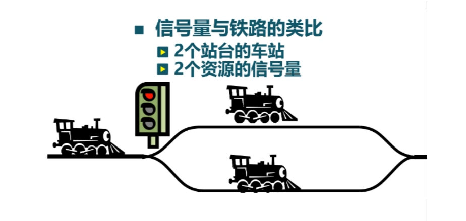
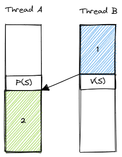
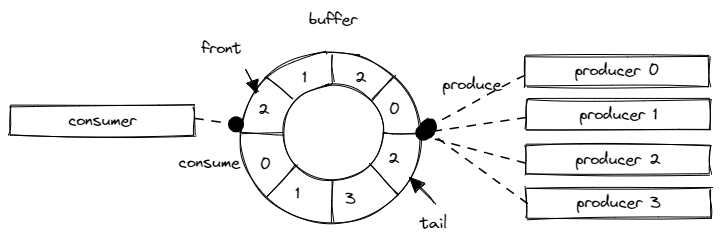

信號量機制
=========================================

本節導讀
-----------------------------------------

.. chyyuu https://en.wikipedia.org/wiki/Semaphore_(programming)

在上一節中，我們介紹了互斥鎖的起因、使用和實現過程。通過互斥鎖，可以讓線程在臨界區執行時，獨佔共享資源。然而，當我們需要一種線程間更靈活的同步訪問需求，如要求同時最多隻允許 N 個線程在臨界區中訪問共享資源，或讓某個線程等待另外一個線程執行到某一階段後再繼續執行的同步過程等，互斥鎖這種方式就有點力不從心了。

在本節中，將介紹功能更加強大和靈活的同步互斥機制 -- 信號量(Semaphore) 的設計思路，使用方式和在操作系統中的具體實現。可以看到，在實現信號量的時候可能會用到互斥鎖和處理器提供的原子指令，因此它是一種更高級的同步互斥機制。

.. _term-synchronization:
.. _term-sync-primitives:

.. note::

    **同步互斥**

    **同步** (Synchronization) 和 **互斥** (Mutual Exclusion) 事實上是在多線程併發訪問過程中出現的兩種不同需求。同步指的是線程執行順序上的一些約束，比如一個線程必須等待另一個線程執行到某個階段之後才能繼續向下執行；而互斥指的是多線程在訪問共享資源的時候，同一時間最多隻有一個線程能夠在共享資源的臨界區中。

    同步和互斥的界限其實比較模糊。比如，互斥也可以看成是一種同步需求，即一個線程在進入臨界區之前必須等待當前在臨界區中的線程（如果存在）退出臨界區；而對於一種特定的同步需求，線程間也往往需要某些共享狀態，線程需要通過查看或修改這些共享狀態來進入等待或喚醒等待的線程。為了能夠正確訪問這些共享狀態，就需要互斥。所以，二者之間是一種“你中有我，我中有你”的關係，我們就將這兩種需求統稱為 **同步互斥** ，而將針對於這種需求比較通用的解決方案稱之為 **同步互斥原語** （簡稱為 **同步原語** ，英文 Synchronization Primitives ）。

信號量的起源和基本思路
-----------------------------------------

.. _term-semaphore:

1963 年前後，當時的數學家兼計算機科學家 Edsger Dijkstra 和他的團隊為 Electrologica X8 開發一款名為 THE 多道程序的操作系統的時候，提出了 **信號量** (Semaphore) 的概念。信號量是一種同步原語，用一個變量或一種抽象數據類型實現，用於控制多個線程對共享資源的訪問。1965 年，Dijkstra 發表了論文手稿 "Cooperating sequential processes" ，詳細論述了在多個順序代碼執行流（在論文中被稱為 Sequential Processes ）的併發執行過程中，如果沒有約束機制則會產生不確定的執行結果。為此，他提出了信號量的設計思路，能夠讓這些松耦合的順序代碼執行流能夠在同步需求的約束下正確併發執行。

.. 對於由於不當互斥同步操作引入的死鎖（論文用語：Deadly Embrace），可通過其設計的銀行家算法（The Banker's Algorithm）來解決。注：銀行家算法將在下一節講解。

信號量相比互斥鎖是一種更為強大和靈活的同步原語。它用來描述這樣一種同步需求：初始狀態下，某種資源的可用數量為一個非負整數 :math:`N` 。線程可以在某個時刻佔用一個該種資源，並在使用過後將資源返還。然而，如果此時已經沒有可用的資源了，也就是說所有這類資源都已經被其他線程佔用了，那麼當前線程就需要暫時進入等待，等待其他線程至少返回一個資源之後再重新嘗試佔用資源或是直接向下執行。可以結合現實中這樣一個例子來形象理解信號量：考慮一個火車站只有兩個站臺，最多可以同時停放兩列火車。那麼就可以用一個 :math:`N=2` 的信號量來描述站臺資源。設想，當一列火車嘗試進站時，它會嘗試佔用一個站臺來停車。如果此時仍有空閒的站臺，那麼它會看到綠色的信號燈而順利進站；否則，它會看到信號燈為紅色，此時它需要在站外等待空出一個站臺再進站。 

.. Edsger Dijkstra和他的團隊提出的信號量是對互斥鎖的一種巧妙的擴展。上一節中的互斥鎖的初始值一般設置為 1 的整型變量， 表示臨界區還沒有被某個線程佔用。互斥鎖用 0 表示臨界區已經被佔用了，用 1 表示臨界區為空。再通過 lock/unlock 操作來協調多個線程輪流獨佔臨界區執行。而信號量的初始值可設置為 N 的整數變量, 如果 N 大於 0， 表示最多可以有N個線程進入臨界區執行，如果 N 小於等於 0 ， 表示不能有線程進入臨界區了，必須在後續操作中讓信號量的值加 1 ，才能喚醒某個等待的線程。

信號量支持兩種操作：P 操作（來自荷蘭語中的 Proberen ，意為嘗試）和 V 操作（來自荷蘭語中的 Verhogen ，意為增加），其中 P 操作表示線程嘗試佔用一個資源，而與之匹配的 V 操作表示線程將佔用的資源歸還。P 操作和 V 操作也是基於阻塞-喚醒機制實現的。當進行 P 操作的時候，如果此時沒有可用的資源，則當前線程會被阻塞；而進行 V 操作的時候，如果返還之後有了可用的資源，且此時有線程被阻塞，那麼就可以考慮喚醒它們。從數據結構層面，信號量中存在一個整數變量表示當前資源的狀態，同時還有一個阻塞隊列保存所有被阻塞的線程。在信號量不同的實現中，整數變量的具體含義以及阻塞隊列中的內容都是不同的。它們其實也屬於所有線程都能訪問到的共享資源，但是不用擔心其互斥性。因為線程不會直接訪問它們，而是隻能通過 P 操作和 V 操作，操作系統保證這兩個操作中包括整數變量的修改和阻塞/喚醒線程的整個流程是原子的。

.. Dijkstra對信號量設立兩種操作：P（Proberen（荷蘭語），嘗試）操作和V（Verhogen（荷蘭語），增加）操作。P操作是檢查信號量的值是否大於0，若該值大於0，則將其值減1並繼續（表示可以進入臨界區了）；若該值為0，則線程將睡眠。注意，此時P操作還未結束。而且由於信號量本身是一種臨界資源（可回想一下上一節的鎖，其實也是一種臨界資源），所以在P操作中，檢查/修改信號量值以及可能發生的睡眠這一系列操作是一個不可分割的原子操作過程。通過原子操作才能保證一旦P操作開始，則在該操作完成或阻塞睡眠之前，其他線程均不允許訪問該信號量。

.. V操作會對信號量的值加1，然後檢查是否有一個或多個線程在該信號量上睡眠等待。如有，則選擇其中的一個線程喚醒並允許該線程繼續完成它的P操作；如沒有，則直接返回。注意，信號量的值加1，並可能喚醒一個線程的一系列操作同樣也是不可分割的原子操作過程。不會有某個進程因執行v操作而阻塞。

.. 如果信號量是一個任意的整數，通常被稱為計數信號量（Counting Semaphore），或一般信號量（General Semaphore）；如果信號量只有0或1的取值，則稱為二值信號量（Binary Semaphore）。可以看出，互斥鎖只是信號量的一種特例 -- 二值信號量，信號量很好地解決了最多隻允許N個線程訪問臨界資源的情況。

一種信號量實現的偽代碼如下所示：

.. code-block:: rust
    :linenos:

    fn P(S) { 
        if S >= 1
            // 如果還有可用資源，更新資源剩餘數量 S 
            S = S - 1;
            // 使用資源
        else
            // 已經沒有可用資源
            // 阻塞當前線程並將其加入阻塞隊列
            <block and enqueue the thread>;
    }

    fn V(S) { 
        if <some threads are blocked on the queue>
            // 如果已經有線程在阻塞隊列中
            // 則喚醒這個線程 
            <unblock a thread>;
        else
            // 否則只需恢復 1 資源可用數量
            S = S + 1;
    }

在上述實現中信號量中的整數變量 :math:`S`` 為非負整數。當 :math:`S>0` 時，表示還有 :math:`S` 個可用資源；當 :math:`S=0` 時，表示沒有可用資源且可能已經有線程被阻塞。顯然 :math:`S` 應該被初始化為 :math:`N` 。這種情形下 P 操作和 V 操作的具體實現可以參考註釋。注意，阻塞在 P 操作中的線程一經被喚醒就會立即進入臨界區而不會檢查此時是否有可用資源。這是因為 **進行 V 操作的線程直接將資源移交給了它喚醒的線程** ，於是此時並沒有更新資源可用數量。

.. _link-the-second-sem-impl:

下面是另外一種信號量實現的偽代碼：

.. code-block:: rust
    :linenos:

    fn P(S) { 
        S = S - 1;
        if 0 > S then 
            // 阻塞當前線程並將其加入阻塞隊列
            <block and enqueue the thread>;
    }

    fn V(S) { 
        S = S + 1;
        if <some threads are blocked on the queue>
            // 如果已經有線程在阻塞隊列中
            // 則喚醒這個線程
            <unblock a thread>;
    }

上述實現中，整數變量 :math:`S` 的含義如下：當 :math:`S>0` 時，表示還有 :math:`S` 個可用資源；當 :math:`S=0` 時，表示所有可用資源恰好耗盡；當 :math:`S<0` 時，表示此時有 :math:`-S` 個線程被阻塞。顯然 :math:`S` 也應該被初始化為 :math:`N` 。對於 P 操作，我們首先將 :math:`S` 減一，如果發現 :math:`S<0` ，說明之前 :math:`S\leq0` ，一定沒有可用資源了，於是需要阻塞當前線程；對於 V 操作，這裡將 :math:`S` 加一可以這樣理解：如果此時沒有線程被阻塞則恢復 1 個可用資源；否則將阻塞線程數減少 1 ，因為當前線程將資源移交給了其中一個被阻塞的線程並喚醒了它。

這只是信號量的兩種不同實現，本質上是相同的。

.. 在上述實現中，S的取值範圍為大於等於0 的整數。 S的初值一般設置為一個大於0的正整數，表示可以進入臨界區的線程數。當S取值為1，表示是二值信號量，也就是互斥鎖了。使用信號量實現線程互斥訪問臨界區的偽代碼如下：

.. .. code-block:: rust
    :linenos:

    let static mut S: semaphore = 1;

    // Thread i
    fn  foo() {
        ...
        P(S);
        execute Cricital Section;
        V(S);
        ...
    }
    
.. 在這種實現中，S的初值一般設置為一個大於0的正整數，表示可以進入臨界區的線程數。但S的取值範圍可以是小於 0 的整數，表示等待進入臨界區的睡眠線程數。

信號量的使用方法
---------------------------------------------------------

信號量的初始資源可用數量 :math:`N` 是一個非負整數，它決定了信號量的用途。如果 :math:`N` 為大於 0 的任意整數，我們稱之為計數信號量 (Counting Semaphore) 或者一般信號量 (General Semaphore) ，它可以用來進行上面描述過的那種資源管理。特別地，當 :math:`N=1` 的時候，我們稱其為二值信號量 (Binary Semaphore) 。從定義上容易看出它和互斥鎖是等價的。因此，互斥鎖可以看成信號量的一種特例。

然而，當 :math:`N=0` 的時候，信號量就與資源管理無關了，而是可以用作一種比較通用的同步原語。比如，現在的需求是：線程 A 需要等待線程 B 執行到了某一階段之後再向下執行。假設有一個 :math:`N=0` 的信號量。那麼，在線程 A 需要等待的時候可以對該信號量進行 P 操作，於是線程會被阻塞。在線程 B 執行完指定階段之後再對該信號量進行 V 操作就能夠喚醒線程 A 向下執行。如下圖所示：

在線程 A 和 B 上分別對一個 :math:`N=0` 的信號量使用 P 操作和 V 操作即可保證：在線程 B 的代碼塊 1 執行 **完畢** 之後才會 **開始** 執行線程 A 的代碼塊 2 。換句話說，在線程 A 的代碼塊 2 的開頭就可以假定此前線程 B 的代碼塊 1 已經執行完畢了。這在很多情況下是一種很有用的同步約束關係。

.. 信號量的另一種用途是用於實現同步（synchronization）。比如，把信號量的初始值設置為 0 ，當一個線程A對此信號量執行一個P操作，那麼該線程立即會被阻塞睡眠。之後有另外一個線程B對此信號量執行一個V操作，就會將線程A喚醒。這樣線程B中執行V操作之前的代碼序列B-stmts和線程A中執行P操作之後的代碼A-stmts序列之間就形成了一種確定的同步執行關係，即線程B的B-stmts會先執行，然後才是線程A的A-stmts開始執行。相關偽代碼如下所示：

.. .. code-block:: rust
    :linenos:

    let static mut S: semaphore = 0;
    
    //Thread A
    ...
    P(S);
    Label_2:
    A-stmts after Thread B::Label_1;
    ...

    //Thread B
    ...
    B-stmts before Thread A::Label_2;
    Label_1:
    V(S);

    ...    

.. _term-lost-wakeup:

.. note::

    **喚醒丟失問題**

    在上面線程 A 和 B 的同步問題中，其實未必總先是線程 A 執行到 P 操作被阻塞住，然後線程 B 執行 V 操作喚醒線程 A 。也有另一種可能是線程 B 先執行 V 操作，隨後線程 A 再執行 P 操作。那麼在線程 B 執行 V 操作的時候，信號量的阻塞隊列中是沒有任何線程的，此時 B 無法喚醒 A 。但如果此時 B 什麼都不做，那麼之後 A 執行 P 操作陷入阻塞的時候就沒有任何線程能夠喚醒 A 了，這將導致 A 無法順利執行。
    
    這種問題被我們稱為 **喚醒丟失** (Lost Wakeup) 問題。為了解決這個問題，我們需要 B 在進行 V 操作的時候即使沒有線程需要喚醒，也需要一種方法將這次可能的喚醒記錄下來。請同學思考我們在上面的信號量實現中是如何解決這個問題的。

信號量的系統調用接口
----------------------------------------------------

和互斥鎖一樣，我們將信號量也視為進程內的一種由操作系統管理並由進程內所有線程共享的資源。同個進程內可以有多個不同信號量，它們之間通過信號量 ID （與互斥鎖或其他資源的的 ID 獨立）來區分。相關係統調用接口如下：

.. code-block:: rust
    :linenos:

    /// 功能：為當前進程新增一個信號量。
    /// 參數：res_count 表示該信號量的初始資源可用數量，即 N ，為一個非負整數。
    /// 返回值：假定該操作必定成功，返回創建的信號量的 ID 。
    /// syscall ID : 1020
    pub fn sys_semaphore_create(res_count: usize) -> isize;
    /// 功能：對當前進程內的指定信號量進行 V 操作。
    /// 參數：sem_id 表示要進行 V 操作的信號量的 ID 。
    /// 返回值：假定該操作必定成功，返回 0 。
    pub fn sys_semaphore_up(sem_id: usize) -> isize;
    /// 功能：對當前進程內的指定信號量進行 P 操作。
    /// 參數：sem_id 表示要進行 P 操作的信號量的 ID 。
    /// 返回值：假定該操作必定成功，返回 0 。
    pub fn sys_semaphore_down(sem_id: usize) -> isize;

可以看到，這裡我們分別用 down 和 up 這樣比較形象的名字作為 P 操作和 V 操作的別名，因為 P 操作和 V 操作通常分別導致整數變量 :math:`S` 的降低和增加。這幾個系統調用也會在用戶庫 ``user_lib`` 被直接封裝為 ``semaphore_create/down/up`` 。

信號量的應用
-------------------------------------------

這裡給出兩個應用：第一個是信號量作為同步原語來解決條件同步問題；第二個則是生產者和消費者基於一個有限緩衝進行協作的複雜問題。

.. _link-cond-sync:

條件同步問題
~~~~~~~~~~~~~~~~~~~~~~~~~~~~~~~~~~~~~~~~~~~

來看這樣一個例子：

.. code-block:: rust
    :linenos:

    // user/src/bin/sync_sem.rs

    const SEM_SYNC: usize = 0;

    unsafe fn first() -> ! {
        sleep(10);
        println!("First work and wakeup Second");
        semaphore_up(SEM_SYNC);
        exit(0)
    }

    unsafe fn second() -> ! {
        println!("Second want to continue,but need to wait first");
        semaphore_down(SEM_SYNC);
        println!("Second can work now");
        exit(0)
    }

    #[no_mangle]
    pub fn main() -> i32 {
        // create semaphores
        assert_eq!(semaphore_create(0) as usize, SEM_SYNC);
        // create threads
        let threads = vec![
            thread_create(first as usize, 0),
            thread_create(second as usize, 0),
        ];
        // wait for all threads to complete
        for thread in threads.iter() {
            waittid(*thread as usize);
        }
        println!("sync_sem passed!");
        0
    }

其中，兩個線程併發執行，第一個線程執行 ``first`` 函數而第二個線程執行 ``second`` 函數。我們想要達到的同步約束是：在第二個線程執行 ``second`` 的後一行打印之前，第一個線程必須完成 ``first`` 中的打印。於是，根據上面關於信號量用法的介紹，第 22 行我們調用 ``semaphore_create`` 函數創建一個用於同步的 :math:`N=0` 的信號量，其 ID 應為 ``SEM_SYNC`` 。為了實現同步約束，則只需第一個線程在 ``first`` 中的打印結束後進行信號量的 V（也就是 up） 操作，而第二個線程在 ``second`` 後一次打印之前進行信號量的 P （也就是 down）操作，這樣即可解決這個問題。

生產者和消費者問題
~~~~~~~~~~~~~~~~~~~~~~~~~~~~~~~~~~~~~~~~~~~~~

生產者-消費者問題（也稱為有限緩衝問題）是 Dijkstra 自 1965 年以來描述的一系列同步互斥問題中的一個。如圖所示，一共有 5 個線程在同進程下進行協作，其中有 4 個生產者（Producer，圖中右側）和 1 個消費者（Consumer，圖中左側），它們共享一個容量有限的環形緩衝區（圖中間）。生產者的職責是將輸入放入緩衝區，而消費者則從緩衝區中取出數據進行處理。然而，這兩種操作並不總是能夠立即成功的。比如，當緩衝區已滿的情況下，生產者就無法將數據放入緩衝區，需要等消費者取出數據空出緩衝區槽位；而當緩衝區為空沒有數據的時候，消費者也無法從中取出數據，需要等生產者將數據填充到緩衝區。考慮使用信號量來實現上述同步需求，可以看成管理以下資源：

- 空閒槽位資源，初始數量 :math:`N` 等於緩衝區容量。生產者每次寫入需要佔用 1 個，消費者每次讀取恢復 1 個；
- 可用數據資源，初始數量 :math:`N=0` （最開始緩衝區為空）。消費者每次讀取佔用 1 個，生產者每次寫入恢復 1 個；
- 將緩衝區以及相應指針（即 ``front`` 和 ``tail`` ）整體上視作一種共享資源，那麼生產者和消費者的寫入和讀取都會對這個共享資源進行修改。注意 **信號量只保證無可用資源時進行阻塞，但並不保證訪問共享資源的互斥性，甚至這可能是兩種不同資源** 。因此，我們還需要引入互斥鎖對緩衝區進行保護，這裡使用一個 :math:`N=1` 的二值信號量來實現。

代碼如下：

.. code-block:: rust
    :linenos:

    // user/src/bin/mpsc_sem.rs

    const SEM_MUTEX: usize = 0;
    const SEM_EMPTY: usize = 1;
    const SEM_AVAIL: usize = 2;
    const BUFFER_SIZE: usize = 8;
    static mut BUFFER: [usize; BUFFER_SIZE] = [0; BUFFER_SIZE];
    static mut FRONT: usize = 0;
    static mut TAIL: usize = 0;
    const PRODUCER_COUNT: usize = 4;
    const NUMBER_PER_PRODUCER: usize = 100;

    unsafe fn producer(id: *const usize) -> ! {
        let id = *id;
        for _ in 0..NUMBER_PER_PRODUCER {
            semaphore_down(SEM_EMPTY);
            semaphore_down(SEM_MUTEX);
            BUFFER[TAIL] = id;
            TAIL = (TAIL + 1) % BUFFER_SIZE;
            semaphore_up(SEM_MUTEX);
            semaphore_up(SEM_AVAIL);
        }
        exit(0)
    }

    unsafe fn consumer() -> ! {
        for _ in 0..PRODUCER_COUNT * NUMBER_PER_PRODUCER {
            semaphore_down(SEM_AVAIL);
            semaphore_down(SEM_MUTEX);
            print!("{} ", BUFFER[FRONT]);
            FRONT = (FRONT + 1) % BUFFER_SIZE;
            semaphore_up(SEM_MUTEX);
            semaphore_up(SEM_EMPTY);
        }
        println!("");
        exit(0)
    }

    #[no_mangle]
    pub fn main() -> i32 {
        // create semaphores
        assert_eq!(semaphore_create(1) as usize, SEM_MUTEX);
        assert_eq!(semaphore_create(BUFFER_SIZE) as usize, SEM_EMPTY);
        assert_eq!(semaphore_create(0) as usize, SEM_AVAIL);
        // create threads
        let ids: Vec<_> = (0..PRODUCER_COUNT).collect();
        let mut threads = Vec::new();
        for i in 0..PRODUCER_COUNT {
            threads.push(thread_create(
                producer as usize,
                &ids.as_slice()[i] as *const _ as usize,
            ));
        }
        threads.push(thread_create(consumer as usize, 0));
        // wait for all threads to complete
        for thread in threads.iter() {
            waittid(*thread as usize);
        }
        println!("mpsc_sem passed!");
        0
    }

第 42-44 行分別創建了二值信號量 ``SEM_MUTEX`` ，描述空閒槽位資源的信號量 ``SEM_EMPTY`` 以及描述可用數據資源的信號量 ``SEM_AVAIL`` 。生產者線程會執行 ``producer`` 函數，循環的每次迭代向共享緩衝區寫入數據。於是在寫入之前需要進行信號量 ``SEM_EMPTY`` 的 down 操作嘗試佔用一個空閒槽位資源，而在寫入之後進行信號量 ``SEM_AVAIL`` 的 up 操作釋放一個可用數據資源。相對的，消費者線程會執行 ``consumer`` 函數，循環的每次迭代從共享緩衝區讀取數據。於是在讀入之前需要進行信號量 ``SEM_AVAIL`` 的 down 操作嘗試佔用一個可用數據資源，而在讀取之後進行信號量 ``SEM_EMPTY`` 的 up 操作釋放一個空閒槽位資源。兩個線程對共享緩衝區的操作都需要用二值信號量 ``SEM_MUTEX`` 來保護。

從這個例子可以看出，信號量的使用可以是非常靈活的。同一個信號量的 P 操作和 V 操作不一定是連續的，甚至可以不在一個線程上。

.. hint::

    請同學們思考：能否將二值信號量的 down 和 up 操作放在循環每次迭代的最外層？為什麼？

實現信號量
------------------------------------------

現在我們來看操作系統如何實現信號量相關的系統調用。首先，和互斥鎖一樣，信號量也是進程內的一種資源，而且同一個進程內也可以有多個不同的信號量，我們可以通過它們的組合來實現更加複雜的同步需求。因此，從數據結構角度看，需要將一個信號量表加入到進程控制塊 PCB 中：

.. code-block:: rust
    :linenos:
    :emphasize-lines: 6

    // os/src/task/process.rs

    pub struct ProcessControlBlockInner {
        ...
        pub mutex_list: Vec<Option<Arc<dyn Mutex>>>,
        pub semaphore_list: Vec<Option<Arc<Semaphore>>>,
        ...
    }

在內核中，信號量是一個叫做 ``Semaphore`` 內核數據結構，定義如下：

.. code-block:: rust
    :linenos:

    // os/src/sync/semaphore.rs

    pub struct Semaphore {
        pub inner: UPSafeCell<SemaphoreInner>,
    }

    pub struct SemaphoreInner {
        pub count: isize,
        pub wait_queue: VecDeque<Arc<TaskControlBlock>>,
    }

    impl Semaphore {
        pub fn new(res_count: usize) -> Self {...}
        pub fn up(&self) {...}
        pub fn down(&self) {...}
    }

其中包括一個整數變量 ``count`` （也就是上面信號量基本思路中的整數變量 S）以及保存阻塞在該信號量中的所有線程的阻塞隊列 ``wait_queue`` 。信號量 ``Semaphore`` 支持三種操作：創建 ``new`` （帶有一個參數 ``res_count`` ，也即信號量初始可用資源數量 :math:`N` ）以及 up （也即 V 操作）和 down （也即 P 操作）。相關的系統調用主要是找到當前進程中的指定信號量實例，隨後再調用它的這幾種方法來實現的，在此不再贅述。於是我們主要看這幾種方法是如何實現的：

.. code-block:: rust
    :linenos:

    // os/src/sync/semaphore.rs

    impl Semaphore {
        pub fn new(res_count: usize) -> Self {
            Self {
                inner: unsafe {
                    UPSafeCell::new(SemaphoreInner {
                        count: res_count as isize,
                        wait_queue: VecDeque::new(),
                    })
                },
            }
        }

        pub fn up(&self) {
            let mut inner = self.inner.exclusive_access();
            inner.count += 1;
            if inner.count <= 0 {
                if let Some(task) = inner.wait_queue.pop_front() {
                    wakeup_task(task);
                }
            }
        }

        pub fn down(&self) {
            let mut inner = self.inner.exclusive_access();
            inner.count -= 1;
            if inner.count < 0 {
                inner.wait_queue.push_back(current_task().unwrap());
                drop(inner);
                block_current_and_run_next();
            }
        }
    }

``new`` 方法比較簡單。而 ``up`` 和 ``down`` 方法和我們在信號量基本思路中介紹的 :ref:`信號量的第二種實現 <link-the-second-sem-impl>` 一致。只需要注意如何使用阻塞-喚醒機制的核心接口 ``block_current_and_run_next`` 和 ``wakeup_task`` 即可。

.. 操作系統如何實現信號量系統調用呢？我們首先考慮一下與此相關的核心數據結構，然後考慮與數據結構相關的相關函數/方法的實現。

.. 在線程的眼裡，信號量是一種每個線程能看到的共享資源，且可以存在多個不同信號量來合理使用不同的資源。所以我們可以把信號量也看成四一種資源，可放在一起讓進程來管理，如下面代碼第9行所示。這裡需要注意的是： ``semaphore_list: Vec<Option<Arc<Semaphore>>>`` 表示的是信號量資源的列表。而 ``Semaphore`` 是信號量的內核數據結構，由信號量值和等待隊列組成。操作系統需要顯式地施加某種控制，來確定當一個線程執行P操作和V操作時，如何讓線程睡眠或喚醒線程。在這裡，P操作是由 ``Semaphore`` 的 ``down`` 方法實現，而V操作是由 ``Semaphore`` 的 ``up`` 方法實現。

小結
-----------------------------------------------------

本節我們介紹了相比互斥鎖更加靈活強大的同步原語——信號量，並用它解決了條件同步和經典的生產者-消費者問題。但是要看到的是，信號量還是比較複雜的。對於程序員來說開發和閱讀代碼比較困難，且比較容易出錯，對程序員的要求比較高。

參考文獻
----------------------------------------------------

- Dijkstra, Edsger W. Cooperating sequential processes (EWD-123) (PDF). E.W. Dijkstra Archive. Center for American History, University of Texas at Austin. (transcription) (September 1965)  https://www.cs.utexas.edu/users/EWD/transcriptions/EWD01xx/EWD123.html
- Downey, Allen B. (2016) [2005]. "The Little Book of Semaphores" (2nd ed.). Green Tea Press.
- Leppäjärvi, Jouni (May 11, 2008). "A pragmatic, historically oriented survey on the universality of synchronization primitives" (pdf). University of Oulu, Finland.
- `Producer-consumer problem, Wikipedia <https://en.wikipedia.org/wiki/Producer%E2%80%93consumer_problem>`_