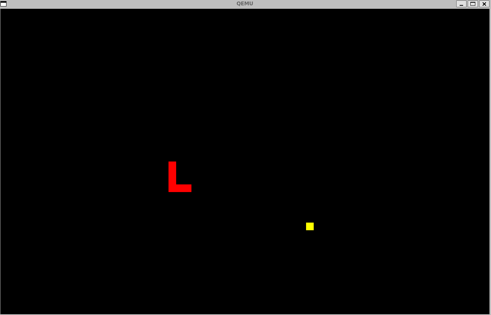

引言
=========================================

本章導讀
-----------------------------------------

上一章的 達科塔盜龍”操作系統和慈母龍操作系統已經具備了傳統操作系統中的內在重要因素，如進程、文件、地址空間、進程間通信、線程併發執行、支持線程安全訪問共享資源的同步互斥機制等，應用程序也能通過操作系統輸入輸出字符，讀寫在磁盤上的數據。不過與我們常見的操作系統（如Linux,Windows等）比起來，好像感知與交互的I/O能力還比較弱。

終於到了I/O設備管理這一章了。人靠衣裳馬靠鞍，如果操作系統不能把計算機的外設功能給發揮出來，那應用程序感知外在環境的能力和展示內在計算的能力都會大打折扣。比如基於中斷和DMA機制的高性能I/O處理，圖形化顯示，鍵盤與鼠標輸入等，這些操作系統新技能將在本章展現出來。所以本章要完成的操作系統的核心目標是： **讓應用能便捷地訪問外設** 。

.. _term-dma-concept:

.. note::

   DMA機制

   DMA（Direct Memory Access）是一種用於在計算機系統中傳輸I/O數據的技術。它允許I/O設備通過DMA控制器直接將設備中的I/O數據讀入內存或把內存中的數據寫入I/O設備，而整個數據傳輸過程無需處理器的介入。這意味著處理器可以在DMA傳輸期間執行其他任務，從而提高系統的性能和效率。I/O設備通過DMA控制器訪問的內存稱為DMA內存。

以往操作系統對設備的訪問
~~~~~~~~~~~~~~~~~~~~~~~~~~~~~~~~~~~~~~~~~~~~~~

其實在第一章就非常簡單介紹了QEMU模擬的RISC-V 64計算機中存在的外設：UART、時鐘、virtio-net/block/console/gpu等。並且LibOS模式的操作系統就已通過RustSBI間接地接觸過串口設備了，即通過RustSBI提供的一個SBI調用 ``SBI_CONSOLE_PUTCHAR`` 來完成字符輸出功能的。

在第三章，為了能實現搶佔式調度，引入了時鐘這個外設，結合硬件中斷機制，並通過SBI調用 ``SBI_SET_TIMER`` 來幫助操作系統在固定時間間隔內獲得控制權。而到了第五章，我們通過另外一個SBI調用 ``SBI_CONSOLE_GETCHAR`` 來獲得輸入的字符能力。這時的操作系統就擁有了與使用者進行簡單字符交互的能力了。

後來在第六章又引入了另外一個外設virtio-block設備，即一個虛擬的磁盤設備。還通過這個存儲設備完成了對數據的持久存儲，並在其上實現了管理存儲設備上持久性數據的文件系統。對virtio-block設備的I/O訪問沒有通過RustSBI來完成，而是直接調用了 ``virtio_drivers`` crate中的 ``virtio-blk`` 設備驅動程序來實現。但我們並沒有深入分析這個設備驅動程序的具體實現。

可以說在操作系統中，I/O設備管理無處不在，且與I/O設備相關的操作系統代碼--設備驅動程序在整個操作系統中的代碼量比例是最高的（Linux/Windows等都達到了75%以上），也是出錯概率最大的地方。雖然前面章節的操作系統已經涉及了很多I/O設備訪問的相關處理，但我們並沒有對I/O設備進行比較全面的分析和講解。這主要是由於各種I/O設備差異性比較大，操作系統很難像進程/地址空間/文件那樣，對各種I/O設備建立一個一致通用的抽象和對應的解決方案。

但I/O設備非常重要，由於各種I/O(輸入輸出)設備的存在才使得計算機的強大功能得以展現在大眾面前，事實上對於各種I/O設備的高效管理是計算機系統操作系統能夠在大眾中普及的重要因素。比如對於手機而言，大眾關注的不是CPU有多快，內存有多大，而是關注顯示是否流暢，觸摸是否敏捷這些外設帶來的人機交互體驗。而這些體驗在很大程度上取決於操作系統對外設的管理與訪問效率。

另外，對I/O設備的管理體現了操作系統最底層的設計機制，如中斷，併發，異步，緩衝，同步互斥等。這對上層的進程，地址空間，文件等有著深刻的影響。所以在設計和實現了進程，地址空間，文件這些經典的操作系統抽象概念後，我們需要再重新思考一下，具備多種I/O設備管理能力的操作系統應該如何設計，特別是是否能給I/O設備也建立一個操作系統抽象。如果同學帶著這些問題來思考和實踐，將會對操作系統有更全面的體會。

.. note::

   **UNIX誕生是從磁盤驅動程序開始的** 

   回顧UNIX誕生的歷史，你會發現一個有趣的故事：貝爾實驗室的Ken Tompson在退出Mulitics操作系統開發後，還是想做繼續操作系統方面的探索。他先是給一臺閒置的PDP-7計算機的磁盤驅動器寫了一個包含磁盤調度算法的磁盤驅動程序，希望提高磁盤I/O讀寫速度。為了測試磁盤訪問性能，Ken Tompson花了三週時間寫了一個操作系統，這就是Unix的誕生。這說明是磁盤驅動程序促使了UNIX的誕生。

.. chyyuu 可以介紹包括各種外設的 PC OS??? 
   https://blog.ysndr.de/posts/essays/2021-12-12-rust-for-iot/
   https://english.stackexchange.com/questions/56183/origin-of-the-term-driver-in-computer-science
   https://en.wikipedia.org/wiki/MS-DOS
   https://en.wikipedia.org/wiki/Microsoft_Windows
   https://en.wikipedia.org/wiki/MacOS
   https://en.wikipedia.org/wiki/IOS_version_history
   https://en.wikipedia.org/wiki/Android_(operating_system)
   https://en.wikipedia.org/wiki/History_of_the_graphical_user_interface

.. note::

   設備驅動程序是操作系統的一部分？

   我們都知道計算機是由CPU、內存和I/O設備組成的。即使是圖靈創造的圖靈機這一理論模型，也有其必須存在的I/O設備：筆和紙。1946年出現的遠古計算機ENIAC，都具有讀卡器和打卡器來讀入和輸出穿孔卡片中的數據。當然，這些外設不需要額外編寫軟件，直接通過硬件電路就可以完成I/O操作了。但後續磁帶和磁盤等外設的出現，使得需要通過軟件來管理越來越複雜的外設功能了，這樣設備驅動程序（Device Driver）就出現了，它甚至出現在操作系統之前，以子程序庫的形式存在，以便於應用程序來訪問硬件。

   隨著計算機外部設備越來越多，越來越複雜，設備驅動程序在操作系統中的代碼比重也越來越大。甚至某些操作系統的名稱直接加入了外設名，如微軟在 1981 年至 1995 年間主導了個人計算機市場的DOS操作系統的全稱是“Disk Operating System”。1973 年，施樂 PARC 開發了Alto個人電腦，它是第一臺具有圖形用戶界面(GUI) 的計算機，直接影響了蘋果公司和微軟公司設計的帶圖形界面的操作系統。微軟後續開發的操作系統名稱“Windows”也直接體現了圖形顯示設備（顯卡）能夠展示的抽象概念，顯卡驅動和基於顯卡驅動的圖形界面子系統在Windows操作系統中始終處於非常重要的位置。

   目前評價操作系統被產業界接受的程度有一個公認的量化指標，該操作系統的設備驅動程序支持的外設種類和數量。量越大說明它在市場上的接受度就越高。正是由於操作系統能夠訪問和管理各種外設，才給了應用程序豐富多彩的功能。

本章的目標是深入理解I/O設備管理，並將站在I/O設備管理的角度來分析I/O設備的特徵，操作系統與I/O設備的交互方式。接著會進一步通過串口，磁盤，圖形顯示等各種外設的具體實現來展現操作系統是如何管理I/O設備的，並展現設備驅動與操作系統內核其它重要部分的交互, 通過擴展操作系統的I/O能力，形成具有靈活感知和捕獵能力的侏羅獵龍 [#juravenator]_ 操作系統。

實踐體驗
-----------------------------------------

裸機設備驅動程序
~~~~~~~~~~~~~~~~~~

獲取代碼：

.. code-block:: console

   $ git clone https://github.com/rcore-os/virtio-drivers.git
   $ cd virtio-drivers
   $ cd examples/riscv

在 qemu 模擬器上運行：

.. code-block:: console

   $ make qemu
   ... #可以看到測試用例發現並初始化和操作各個虛擬化設備的情況
   [ INFO] Detected virtio MMIO device with vendor id 0x554D4551, device type Block, version Modern
   [ INFO] Detected virtio MMIO device with vendor id 0x554D4551, device type GPU, version Modern
   [ INFO] Detected virtio MMIO device with vendor id 0x554D4551, device type Input, version Modern
   [ INFO] Detected virtio MMIO device with vendor id 0x554D4551, device type Network, version Modern
   ...

在這個測例中，可以看到對塊設備（virtio-blk）、網絡設備（virtio-net）、鍵盤鼠標類設備（virtio-input）、顯示設備（virtio-gpu）的識別、初始化和初步的操作。

侏羅獵龍操作系統
~~~~~~~~~~~~~~~~~~~~~~~~~~~~

.. code-block:: console

   $ git clone https://github.com/rcore-os/rCore-Tutorial-v3.git
   $ cd rCore-Tutorial-v3
   $ git checkout ch9

在 qemu 模擬器上運行：

.. code-block:: console

   $ cd os
   $ make run GUI=on
   >> gui_snake     #在OS啟動後的shell界面中執行gui——snake遊戲應用

在這個應用中，可以看到 ``gui_snake`` 圖形應用通過操作系統提供的UART串口驅動和 ``virtio-gui`` 顯示驅動提供的服務來實現的一個貪吃蛇交互式小遊戲。下面是該應用的演示圖：其中紅色為貪吃蛇，黃色方塊為食物。玩家可以使用wasd（分別表示上左下右）控制貪吃蛇的行進方向。由於控制是基於和前面章節一樣的命令行標準輸入實現的，在遊玩的時候需要讓焦點位於 user shell 命令行界面，才能成功將控制傳遞給應用程序。應用畫面可以在另一個圖形顯示窗口看到。

本章代碼樹
-----------------------------------------

進一步增加了多種設備驅動程序的侏羅盜龍操作系統 -- DeviceOS的總體結構如下圖所示：

.. image:: ../../os-lectures/lec13/figs/device-os-detail.png
   :align: center
   :scale: 20 %
   :name: device-os-detail
   :alt: 侏羅盜龍操作系統 -- DeviceOS總體結構

我們先分析一下圖的上下兩部分。從上圖的左上角可以看到為應用程序增加了GUI相關的新系統調用。應用程序可以通過 ``sys_framebuffer`` 和 ``sys_framebuffer_flush`` 來顯示圖形界面，通過 ``sys_event_get`` 和 ``sys_key_pressed`` 來接收來自串口/鍵盤/鼠標的輸入事件。這其實就形成了基本的GUI應用支持框架。在上圖的中上部，添加了三個GUI應用的圖形顯示，從左到右分別是： ``gui_simple`` 、 ``gui_snake`` 和 ``gui_rect`` 。

在上圖的最下面展示的硬件組成中，可以看到由Qemu模擬器仿真的 ``Virt Machine`` ，它包含了我們要管理的各種硬件組件，包括在前面章節中重點涉及的 ``CPU`` 和 ``Main Memory`` ，還包括新引入的外設，  ``ns16500`` UART串口外設、 ``virtio-gpu`` 圖形顯示外設、 ``virtio-input`` 鍵盤鼠標外設、 ``vritio-blk`` 硬盤存儲設備。為了與這些硬件交互，系統軟件還需瞭解有關這些外設的硬件參數模型，如各個外設的控制寄存器的內存起始地址和範圍等，這就是Qemu模擬器中的 ``Virt Machine`` 硬件參數模型。硬件參數的具體內容可以在Qemu源碼 ``qemu/include/hw/riscv/virt.h`` 和  ``qemu/hw/riscv/virt.c`` 中找到。

.. code-block:: C
   :linenos:

   // qemu/hw/riscv/virt.c
   static const MemMapEntry virt_memmap[] = {
      [VIRT_PLIC] =        {  0xc000000, VIRT_PLIC_SIZE(VIRT_CPUS_MAX * 2) },
      [VIRT_UART0] =       { 0x10000000,         0x100 },
      [VIRT_VIRTIO] =      { 0x10001000,        0x1000 },
      [VIRT_DRAM] =        { 0x80000000,           0x0 },
      ...
   };
   // qemu/include/hw/riscv/virt.h
   enum {
      UART0_IRQ = 10,
      VIRTIO_IRQ = 1, /* 1 to 8 */
      ...
   };

在上面的代碼片段中，可以看到 UART 串口外設的控制寄存器的MMIO內存起始地址和空間大小為： ``{ 0x10000000,         0x100 }`` ，而其它 ``virtio`` 外設的控制寄存器的MMIO內存起始地址和空間大小為 ``{ 0x10001000,        0x1000 }`` 。當操作系統知道這些外設的控制寄存器的MMIO內存地址後，就可以通過讀寫這些寄存器來訪問和管理這些外設了。

同時，我們也看到了各種外設的中斷號，如串口中斷號 ``UART0_IRQ`` 為10， 而``virtio`` 外設的中斷號有8個，編號為 1~8。而對各種外設的中斷的管理、檢測發送給CPU等事務都在一個特殊的設備中完成，即 ``PLIC`` 平臺級中斷控制器（Platform Level InterruptController），它的控制寄存器內存起始地址和空間大小為 ``{ 0xc000000, VIRT_PLIC_SIZE(VIRT_CPUS_MAX * 2) }`` ，它的空間大小與CPU個數相關。

現在看看上圖中部的操作系統，藍邊橙底方塊的部分是主要增加的內容，包括了外設驅動和與外設相關的中斷處理。 根據與各種外設的連線可以看到兩類驅動：外設驅動和平臺驅動。
 
 - ``virtio-GPU Drv``：圖形顯示驅動
 - ``ns16550a Drv``：串口驅動
 - ``virtio-input Drv``：鍵盤鼠標驅動
 - ``virtio-Block Drv``：塊設備驅動
 - ``PLIC drv``：平臺級中斷控制器驅動
 - ``Virt Machine Conf``：``virt`` 計算機系統配置信息（可以理解為平臺級配置驅動）

在與外設相關的中斷處理方面，主要增加了對外設中斷的處理，並被功能擴展的 ``異常控制流管理`` 內核模塊進行統一管理。 ``異常控制流管理`` 內核模塊主要的擴展包括兩方面，一方面是支持在內核態響應各種中斷，這樣就能在內核態中處理外設的中斷事件。為此需要擴展在內核態下的中斷上下文保存/恢復操作，並根據外設中斷號來調用相應外設驅動中的外設中斷處理函數。

另一方面是提供了 ``UPIntrFreeCell<T>`` 接口，代替了之前的 ``UPSafeCell<T>`` 。在Device OS 中把 ``UPSafeCell<T>`` 改為 ``UPIntrFreeCell<T>`` 。這是因為在第九章前，系統設置在S-Mode中屏蔽中斷，所以在 S-Mode中運行的內核代碼不會被各種外設中斷打斷，這樣在單處理器的前提下，採用 ``UPSafeCell`` 來實現對可寫數據的獨佔訪問支持是夠用的。但在第九章中，系統配置改為在S-Mode中使能中斷，所以內核代碼在內核執行過程中會被中斷打斷，無法實現可靠的獨佔訪問。本章引入了新的 ``UPIntrFreeCell`` 機制，使得在通過 ``UPIntrFreeCell`` 對可寫數據進行獨佔訪問前，先屏蔽中斷；而對可寫數據獨佔訪問結束後，再使能中斷。從而確保線程對可寫數據的獨佔訪問時，不會被中斷打斷或引入可能的線程切換，而避免了競態條件的產生。

在內核層，為了支持Qemu模擬的 ``Virt`` 計算機中不同外設，增加了3個外設級設備驅動程序，分別是 ``virtio-gpu`` 顯示驅動、 ``virtio-input`` 輸入驅動和 ``ns16650`` 串口設備驅動，改進了 ``virtio-blk`` 塊設備驅動，以支持高效的中斷響應。而各種外設需要計算機中的支持。這4個外設級設備驅動程序需要計算機平臺級的配置與管理，所以還增加了 ``Virt Machine Conf`` 和 ``PLIC`` 兩個平臺級設備驅動程序。在獨立於操作系統的軟件庫中，增加了 ``virtio-drivers`` 庫，實現了各種 ``virtio`` 外設的裸機設備驅動的主要功能。這樣在實現操作系統中的設備驅動程序時，就可以直接封裝 ``virtio`` 裸機設備驅動中的功能，簡化了設備驅動程序的編寫難度。

本章的代碼主要包括兩部分內容。一部分是virtio-drivers倉庫中的驅動代碼和裸機示例代碼：

.. code-block::
   :linenos:

   ├── examples
   │   └── riscv
   │       └── src
   │           ├── main.rs （各種virtio設備的測試用例）
   │           └── virtio_impl.rs (用於I/O數據的物理內存空間管理的簡單實現)
   └── src
      ├── blk.rs (virtio-blk 驅動)
      ├── gpu.rs (virtio-gpu 驅動)
      ├── hal.rs (用於I/O數據的物理內存空間管理接口)
      ├── header.rs (VirtIOHeader: MMIO設備寄存器接口)
      ├── input.rs (virtio-input 驅動)
      ├── net.rs (virtio-net 驅動)
      └── queue.rs (virtqueues: 批量I/O數據傳輸的機制) 

另外一部分是侏羅獵龍操作系統 -- Device OS 代碼： 

.. code-block:: console
   :linenos:
      
   ├── ...
   ├── easy-fs
   │   └── src
   │       ├── ...
   │       └── block_dev.rs (BlockDevice trait中增加handle_irq接口)
   ├── os
   │   └── src
   │       ├── ...
   │       ├── main.rs（擴展blk/gpu/input等外設初始化調用）   W
   │       ├── config.rs （修改KERNEL_HEAP_SIZE和MEMORY_END，擴展可用內存空間）   
   │       ├── boards
   │       │   └── qemu.rs (擴展blk/gpu/input等外設地址設定/初始化/中斷處理等操作)
   │       ├── drivers
   │       │   ├── block
   │       │   │   └── virtio_blk.rs（增加非阻塞讀寫塊/中斷響應等I/O操作）
   │       │   ├── bus
   │       │   │   └── virtio.rs（增加virtio-drivers需要的Hal trait接口）
   │       │   ├── chardev
   │       │   │   └── ns16550a.rs（增加s-mode下的串口驅動）
   │       │   ├── gpu
   │       │   │   └── mod.rs（增加基於virtio-gpu基本驅動的OS驅動）
   │       │   ├── input
   │       │   │   └── mod.rs（增加基於virtio-input基本驅動的OS驅動）
   │       │   └── plic.rs（增加RISC-V的PLIC中斷控制器驅動）
   │       ├── fs
   │       │   └── stdio.rs（改用s-mode下的串口驅動進行輸入輸出字符）
   │       ├── mm
   │       │   └── memory_set.rs（擴展Linear內存映射方式，用於顯示內存存映射）
   │       ├── sync
   │       │   ├── condvar.rs（擴展條件變量的wait方式，用於外設驅動）
   │       │   └── up.rs（擴展 UPIntrFreeCell<T> 支持內核態屏蔽中斷的獨佔訪問）
   │       ├── syscall
   │       │   ├── gui.rs（增加圖形顯示相關的系統調用）
   │       │   └── input.rs（增加鍵盤/鼠標/串口相關事件的系統調用）
   │       └── trap
   │           ├── mod.rs（擴展在用戶態和內核態響應外設中斷）
   │           └── trap.S（擴展內核態響應中斷的保存與恢復寄存器操作）
   └── user
      └── src
         ├── bin
         │   ├── gui_rect.rs (顯示不同大小正方形)
         │   ├── gui_simple.rs（彩色顯示屏幕）
         │   ├── gui_snake.rs（用'a'/'s'/'d'/'w'控制的貪吃蛇圖形遊戲）
         │   ├── gui_uart.rs (用串口輸入字符來控制顯示正方形)
         │   ├── huge_write_mt.rs（寫磁盤文件性能測試例子）
         │   ├── inputdev_event.rs（接收鍵盤鼠標輸入事件）
         │   ├── random_num.rs（產生隨機數）
         │   └── ...
         ├── file.rs（文件系統相關的調用）
         ├── io.rs（圖形顯示與交互相關的系統調用）
         ├── sync.rs（同步互斥相關的系統調用）
         ├── syscall.rs（擴展圖形顯示與交互的系統調用號和系統調用接口）
         └── task.rs（進程線程相關的系統調用）

本章代碼導讀
-----------------------------------------------------

設計設備驅動程序的總體思路
~~~~~~~~~~~~~~~~~~~~~~~~~~~~~~~~~~~~~~~~~~~~~

這裡簡要介紹一下在內核中添加設備驅動的大致開發過程。本章涉及的代碼主要與設備驅動相關，需要了解硬件，還需要了解如何與操作系統內核的其他部分進行對接，包括其他內核模塊可以給驅動提供的內核服務，如內存分配等，以及需要驅動提供的支持功能，如外設中斷響應等。在Rust軟件工程開發中，推薦代碼重用的Crate設計。所以在實際開發中，可以先在沒有操作系統的裸機環境下（no-std）實現具備基本功能的裸機設備驅動 Crate，再實現一個最小執行環境（類似我們在第一章完成的 ``三葉蟲操作系統 -- LibOS`` ），並在此最小執行環境中測試裸機設備驅動 Crate的基本功能能正常運行。然後再在操作系統內核中設計實現設備驅動程序。操作系統中的設備驅動程序可以通過一層封裝來使用裸機設備驅動 Crate 的各種功能，並對接操作系統的而其他內核模塊。這樣，操作系統中的設備驅動的開發和測試相對會簡化不少。

設計設備驅動程序前，需要了解應用程序或操作系統中的其他子系統需要設備驅動程序完成哪些功能，再根據所需提供的功能完成如下基本操作：

- 1. 設備掃描/發現
- 2. 設備初始化
- 3. 準備發給設備的命令
- 4. 通知設備
- 5. 接收設備通知
- 6.（可選）卸載設備驅動時回收設備驅動資源

對於設計實現裸機設備驅動，首先需要大致瞭解對應設備的硬件規範。在本章中，主要有兩類設備，一類是實際的物理設備 -- UART（QEMU模擬了這種NS16550a UART芯片規範）；另外一類是虛擬設備（如各種Virtio設備）。

然後需要了解外設是如何與CPU連接的。首先是CPU訪問外設的方式，在RISC-V環境中，把外設相關的控制寄存器映射為某特定的內存區域（即MMIO映射方式），然後CPU通過讀寫這些特殊區域來訪問外設（即PIO訪問方式）。外設可以通過DMA來讀寫主機內存中的數據，並可通過中斷來通知CPU。外設並不直接連接CPU，這就需要了解RISC-V中的平臺級中斷控制器（Platform-Level Interrupt Controller，PLIC），它管理並收集各種外設中斷信息，並傳遞給CPU。

裸機設備驅動程序
~~~~~~~~~~~~~~~~~~~~~~~~~~~~~~~~~~~~~~~~~~~~~

對於裸機設備驅動程序對外設的具體管理過程，大致會有發現外設、初始化外設和I/O讀寫與控制等操作。理解這些操作和對應的關鍵數據結構，就大致理解外設驅動要完成的功能包含哪些內容。每個設備驅動的關鍵數據結構和處理過程有共性部分和特定的部分。同學們可以從 ``virtio-drivers`` crate 中的  ``examples/riscv/src/main.rs`` 和 ``src\blk.rs`` 有關virtio設備的功能測試例子來分析。以 ``virtio-blk`` 存儲設備為例，可以看到需要完成的工作包括：

1. 設備掃描/發現：首先是訪問 ``OpenSBI`` (這裡沒有用RustSBI，用的是QEMU內置的SBI實現)提供的設備樹信息，瞭解QEMU硬件中存在的各種外設，根據外設ID來找到 ``virtio-blk`` 存儲設備。

.. mermaid::

   graph LR

   A["init_dt(device_tree_paddr)"] --> B["walk_dt_node(&dt.root)"] --> C["virtio_probe(node)"] --> D["virtio_probe(dt)"] --> F["virtio_blk(header)"]

2. 設備初始化：找到 ``virtio-blk`` 外設後，就進行外設的初始化，如果學習了 virtio規範（需要關注的是 virtqueue、virtio-mmio device， virtio-blk device的描述內容），那就可以看出代碼實現的初始化過程和virtio規範中的virtio設備初始化步驟基本上是一致的，但也有與具體設備相關的特定初始化內容，比如分配 I/O buffer等。

.. mermaid::

   graph LR

   A["VirtIOBlk::<HalImpl>::new(header)"] --> B["header.begin_init(...)"]
   A --> C[read configuration space]
   A --> D["VirtQueue::new(...)"]
   A --> E["header.finish_init()"]

3. 準備發給設備的命令：初始化完畢後，設備驅動在收到上層內核發出的讀寫扇區/磁盤塊的請求後，就能通過 ``virtqueue`` 傳輸通道發出 ``virtio-blk`` 設備能接收的I/O命令和I/O buffer的區域信息。
4. 通知設備： 驅動程序通過 `kick` 機制（即寫virtio設備中特定的通知控制寄存器）來通知設備有新請求。

.. mermaid::

   graph LR

   A[read_block] --> E[建立I/O命令] --> F[加入到到virtqueue隊列中] --> G[通過寫寄存器通知設備]
   B[read_block_nb] --> E
   C[write_block] --> E
   D[write_block_nb] --> E

5.  接收設備通知： ``virtio-blk`` 設備收到信息後，會通過DMA操作完成磁盤數據的讀寫，然後通過中斷或其他方式讓設備驅動知道命令完成或命令執行失敗。由於中斷處理例程的完整操作與操作系統內核相關性較大，所以在裸機設備驅動中，沒有實現這部分的完整功能，而只是提供了表示收到中斷的操作。

操作系統設備驅動程序
~~~~~~~~~~~~~~~~~~~~~~~~~~~~~~~~~~~~~~~~~~~~~

由於有了裸機設備驅動程序的實現，對於操作系統設備程序，可以直接訪問裸機設備驅動程序的各種功能。這樣操作系統設備驅動程序的複雜性和代碼量大大降低，整個代碼量不到100行。不過還需解決如下一些關鍵問題：

- 發現具體計算機（如 ``virt machine`` ）中的設備（即與設備交互的設備控制寄存器的MMIO內存地址）；
- 與其它操作系統內核模塊（如文件系統、同步互斥、進程管理等）的對接；
- 封裝裸機設備驅動程序，提供操作系統層面的I/O設備訪問能力（初始化、讀寫、控制等操作）。

另外，操作系統還需滿足裸機設備驅動程序對操作系統的需求，並能對各種外設進行統一的管理，這主要集中在硬件平臺級的支持。主要的服務能力包括:

- 在硬件平臺層面發現具體計算機（如 ``virt machine`` ）中的各種外設的能力；
- 在硬件平臺層面的外設中斷總控能力，即在外設中斷產生後，能分析出具體是哪個外設產生的中斷，並進行相應的處理；
- 給裸機設備驅動程序提供操作系統級別的服務能力，以 ``virtio-drivers`` 為例，OS需要提供 ``HAL`` Trait的具體實現，即驅動進行I/O操作所需的內存動態分配。

以面向 ``virtio-blk`` 外設的操作系統驅動為例，我們可以看看上述過程的具體實現。在硬件平臺的總體支持方面，為簡化操作，通過對Qemu的分析，在操作系統中直接給出  ``virt machine`` 中各個外設的控制寄存器地址（代碼位置: ``os/src/boards/qemu.rs`` ）。為了完成外設中斷總控，操作系統提供了 ``PLIC`` 驅動，支持對 ``virt machine`` 中各種外設的中斷響應（代碼位置: ``os/src/drivers/plic.rs`` ）。

在具體設備驅動實現上，首先是發現設備，操作系統建立了表示virtio_blk設備驅動的全局變量 ``BLOCK_DEVICE`` （代碼位置: ``os/src/drivers/block/mod.rs`` ）。為簡化發現設備的過程，操作系統直接指定了virtio_blk設備在 ``virt machine`` 中的設備控制寄存器地址 ``VIRTIO0``。

然後是驅動程序初始化、讀寫塊和中斷處理的實現（代碼位置: ``os/src/drivers/block/virtio_blk.rs`` ）。在操作系統的第一次訪問 ``BLOCK_DEVICE`` 時，會執行 ``VirtIOBlock::new()`` 方法，通過調用virtio_blk裸機設備驅動庫中的功能，完成了塊設備驅動的初始化工作，並初始化條件變量，用於後續塊讀寫過程中與進程的交互（即讓等待I/O訪問結果的進程先掛起）。

塊設備驅動的服務對象是文件系統，它們之間需要有一個交互的接口，這就是在 ``easy-fs`` 文件系統模塊定義的 ``BlockDevice`` trait：

.. code-block:: Rust
   :linenos:

   pub trait BlockDevice: Send + Sync + Any {
      fn read_block(&self, block_id: usize, buf: &mut [u8]);
      fn write_block(&self, block_id: usize, buf: &[u8]);
      fn handle_irq(&self);
   }

操作系統塊設備驅動程序通過調用裸機塊設備驅動程序庫，可以很簡潔地實現上述功能。在具體實現上，在調用了裸機塊設備驅動程序庫的讀寫塊方法後，通過條件變量讓等待I/O訪問結果的進程先掛起）。在中斷處理的方法中，在得到I/O讀寫塊完成的中斷信息後，通過條件變量喚醒等待的掛起進程。

至此，就分析完畢操作系統設備驅動程序的所有功能了。接下來，我們就可以深入分析到I/O設備管理的級別概念、抽象描述和侏羅獵龍操作系統的具體實現。

.. [#juravenator] 侏羅獵龍是一種小型恐龍，生活在1億5千萬年前的侏羅紀，它有獨特的鱗片狀的皮膚感覺器官，具有類似鱷魚的觸覺、冷熱以及pH等綜合感知能力，可能對狩獵有很大幫助。