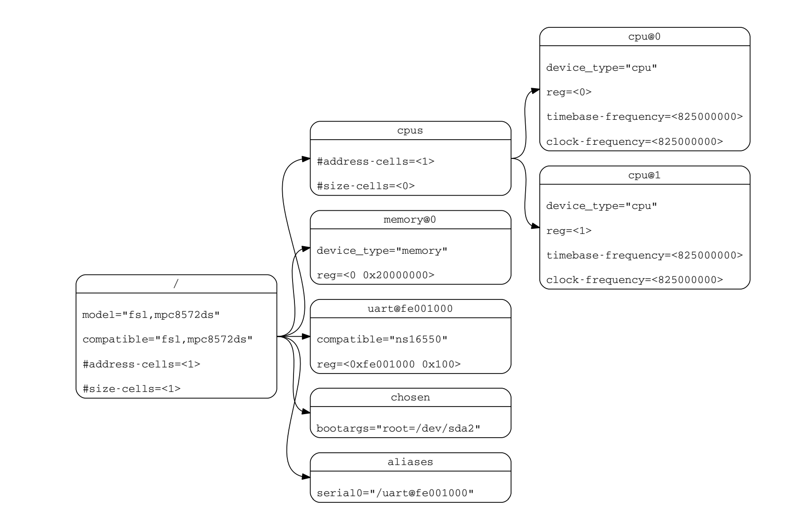

外設平臺
=========================================

本節導讀
-----------------------------------------

現在我們有了對設備的基本瞭解，接下來就要考慮如何編寫驅動程序來控制各種外設了。本節首先講述了驅動程序要完成的主要功能，包括初始化設備，接收用戶進程的I/O請求並給設備發出I
/O命令，響應設備發出的通知，完成用戶進程的I/O請求。然後介紹了計算機硬件系統中除了CPU/內存之外的其他重要的外設和相關I/O控制器，以及如何通過編程來獲取外設相關信息。

驅動程序概述
----------------------------------------

很難為驅動程序提供一個精確的定義。基本而言，驅動程序是一種軟件組件，是操作系統與機外設之間的接口，可讓操作系統和設備彼此通信。從操作系統架構上看，驅動程序與I/O設備靠的更近，離應用程序更遠，這使得驅動程序需要站在協助所有進程的全局角度來處理各種I/O操作。這也就意味著在驅動程序的設計實現中，儘量不要與單個進程建立直接的聯繫，而是在全局角度對I/O設備進行統一處理。

上面只是介紹了CPU和I/O設備之間的交互手段。如果從操作系統角度來看，我們還需要對特定設備編寫驅動程序。它一般需包括如下一些操作：

1. 定義設備相關的數據結構，包括設備信息、設備狀態、設備操作標識等
2. 設備初始化，即完成對設備的初始配置，分配I/O操作所需的內存，設置好中斷處理例程
3. 如果設備會產生中斷，需要有處理這個設備中斷的中斷處理例程（Interrupt Handler）
4. 根據操作系統上層模塊（如文件系統）的要求（如讀磁盤數據），給I/O設備發出命令，檢測和處理設備出現的錯誤
5. 與操作系統上層模塊或應用進行交互，完成上層模塊或應用的要求（如上傳讀出的磁盤數據）

從驅動程序I/O操作的執行模式上看，主要有兩種模式的I/O操作：異步和同步。同步模式下的處理邏輯類似函數調用，從應用程序發出I/O請求，通過同步的系統調用傳遞到操作系統內核中，操作系統內核的各個層級進行相應處理，並最終把相關的I/O操作命令轉給了驅動程序。一般情況下，驅動程序完成相應的I/O操作會比較慢（相對於CPU而言），所以操作系統會讓代表應用程序的進程進入等待狀態，進行進程切換。但相應的I/O操作執行完畢後（操作系統通過輪詢或中斷方式感知），操作系統會在合適的時機喚醒等待的進程，從而進程能夠繼續執行。

異步I/O操作是一個效率更高的執行模式，即應用程序發出I/O請求後，並不會等待此I/O操作完成，而是繼續處理應用程序的其它任務（這個任務切換會通過運行時庫或操作系統來完成）。調用異步I/O操作的應用程序需要通過某種方式（比如某種異步通知機制）來確定I/O操作何時完成。注：這部分可以通過協程技術來實現，但目前我們不會就此展開討論。

編寫驅動程序代碼其實需要的知識儲備還是比較多的，需要注意如下的一些內容：

1. 瞭解硬件規範：從而能夠正確地與硬件交互，並能處理訪問硬件出錯的情況；
2. 瞭解操作系統，由於驅動程序與它所管理的設備會同時執行，也可能與操作系統其他模塊並行/併發訪問相關共享資源，所以需要考慮同步互斥的問題（後續會深入講解操作系統同步互斥機制），並考慮到申請資源失敗後的處理；
3. 理解驅動程序執行中所在的可能的上下文環境：如果是在進行中斷處理（如在執行 ``trap_handler`` 函數），那是在中斷上下文中執行；如果是在代表進程的內核線程中執行後續的I/O操作（如收發TCP包），那是在內核線程上下文執行。這樣才能寫出正確的驅動程序。

硬件系統架構
-----------------------------------------

設備樹
~~~~~~~~~~~~~~~~~~~~~~~

首先，我們需要了解OS管理的計算機硬件系統-- ``QEMU riscv-64 virt machine`` ，特別是其中的各種外部設備。 `virt` 表示了一臺虛擬的RISC-V 64計算機，CPU的個數是可以通過參數 ``-cpu num`` 配置的，內存也是可通過參數 ``-m numM/G`` 來配置。這臺虛擬計算機還有很多外設信息，每個設備在物理上連接到了父設備上最後再通過總線等連接起來構成一整個設備樹。QEMU 可以把它模擬的機器細節信息全都導出到dtb格式的二進制文件中，並可通過 ``dtc`` （Device Tree Compiler）工具轉成可理解的文本文件。如想詳細瞭解這個文件的格式說明可以參考  `Devicetree Specification <https://www.devicetree.org/specifications/>`_ 。

.. code-block:: console

   $ qemu-system-riscv64 -machine virt -machine dumpdtb=riscv64-virt.dtb -bios default
      qemu-system-riscv64: info: dtb dumped to riscv64-virt.dtb. Exiting.
   $ dtc -I dtb -O dts -o riscv64-virt.dts riscv64-virt.dtb
   $ less riscv64-virt.dts
   #就可以看到QEMU RV64 virt計算機的詳細硬件（包括各種外設）細節，包括CPU，內存，串口，時鐘和各種virtio設備的信息。
   

一個典型的設備樹如下圖所示：

.. note::

   **設備樹與設備節點屬性**

   設備樹（Device Tree）是一種數據結構，用於表示硬件系統的結構和功能。 它是一個文本文件，描述了硬件系統的結構和功能，並將這些信息提供給操作系統。設備樹包含了關於硬件系統的信息，如：

   - 處理器的類型和數量
   - 板載設備（如存儲器、網卡、顯卡等）的類型和數量
   - 硬件接口（如 I2C、SPI、UART 等）的類型和地址信息

   設備樹中的節點是用來描述硬件設備的信息的。 一個設備樹節點包含了一個或多個屬性，每個屬性都是一個鍵-值對，用來描述設備的某一特定信息。而操作系統就是通過這些節點上的信息來實現對設備的識別和初始化。具體而言，一個設備節點上會有一些常見的屬性：

   - compatible：表示設備的類型，可以是設備的廠商名、產品名等，如 "virtio,mmio" 指的是這個設備通過 virtio 協議、MMIO（內存映射 I/O）方式來驅動
   - reg：表示設備在系統中的地址空間位置
   - interrupts：表示設備支持的中斷信號

   設備樹在很多嵌入式系統中都得到了廣泛應用，它是一種常用的方法，用於將硬件（特別是外設）信息傳遞給操作系統。在桌面和服務器系統中，PCI總線可以起到設備樹的作用，通過訪問PCI總線上特定地址空間，也可以遍歷出具有掛在PCI總線上的各種PCI設備。

我們可以運行 ``virtio_drivers`` crate中的一個在裸機環境下的測試用例，來動態查看 `qemu-system-riscv64` 模擬的 `virt` 計算機的設備樹信息：

.. code-block:: console

   # 獲取virto_driver git倉庫源碼
   $ git clone https://github.com/rcore-os/virtio-drivers.git
   # 在 qemu 模擬器上運行測試用例：
   $ cd virtio-drivers/examples/riscv
   $ make qemu
   # qemu命令行參數
      qemu-system-riscv64 \
        -machine virt \
        -serial mon:stdio \
        -bios default \
        -kernel target/riscv64imac-unknown-none-elf/release/riscv \
        -global virtio-mmio.force-legacy=false \
        -drive file=target/riscv64imac-unknown-none-elf/release/img,if=none,format=raw,id=x0 \
        -device virtio-blk-device,drive=x0 \
        -device virtio-gpu-device \
        -device virtio-mouse-device \
        -device virtio-net-device
   ...

在上面的 `qemu` 命令行參數中，可以看到 `virt` 計算機中配置了基於virtio協議的存儲塊設備 `virtio-blk-device` 、圖形顯示設備 `virtio-gpu-device` 、 鼠標設備 `virtio-mouse-device` 和 網卡設備 `virtio-net-device` 。 通過看到測試用例掃描出的設備樹信息，且可以看到通過 `virtio_gpu` 顯示的漂亮的圖形：

.. code-block:: console

   [ INFO] device tree @ 0x87000000
   [ INFO] walk dt addr=0x10008000, size=0x1000
   [ INFO] Device tree node virtio_mmio@10008000: Some("virtio,mmio")
   [ INFO] Detected virtio MMIO device with vendor id 0x554D4551, device type Block, version Modern
   [ INFO] device features: SEG_MAX | GEOMETRY | BLK_SIZE | FLUSH | TOPOLOGY | CONFIG_WCE | DISCARD | WRITE_ZEROES | RING_INDIRECT_DESC | RING_EVENT_IDX | VERSION_1
   [ INFO] config: 0x10008100
   [ INFO] found a block device of size 16KB
   [ INFO] virtio-blk test finished
   [ INFO] walk dt addr=0x10007000, size=0x1000
   [ INFO] Device tree node virtio_mmio@10007000: Some("virtio,mmio")
   [ INFO] Detected virtio MMIO device with vendor id 0x554D4551, device type GPU, version Modern
   [ INFO] Device features EDID | RING_INDIRECT_DESC | RING_EVENT_IDX | VERSION_1
   [ INFO] events_read: 0x0, num_scanouts: 0x1
   [ INFO] GPU resolution is 1280x800
   [ INFO] => RespDisplayInfo { header: CtrlHeader { hdr_type: OkDisplayInfo, flags: 0, fence_id: 0, ctx_id: 0, _padding: 0 }, rect: Rect { x: 0, y: 0, width: 1280, height: 800 }, enabled: 1, flags: 0 }
   [ INFO] virtio-gpu test finished
   [ INFO] walk dt addr=0x10006000, size=0x1000
   [ INFO] Device tree node virtio_mmio@10006000: Some("virtio,mmio")
   [ INFO] Detected virtio MMIO device with vendor id 0x554D4551, device type Input, version Modern
   [ INFO] Device features: RING_INDIRECT_DESC | RING_EVENT_IDX | VERSION_1
   [ INFO] walk dt addr=0x10005000, size=0x1000
   [ INFO] Device tree node virtio_mmio@10005000: Some("virtio,mmio")
   [ INFO] Detected virtio MMIO device with vendor id 0x554D4551, device type Network, version Modern
   [ INFO] Device features CTRL_GUEST_OFFLOADS | MAC | MRG_RXBUF | STATUS | CTRL_VQ | CTRL_RX | CTRL_VLAN | CTRL_RX_EXTRA | GUEST_ANNOUNCE | CTL_MAC_ADDR | RING_INDIRECT_DESC | RING_EVENT_IDX | VERSION_1

.. image:: virtio-test-example2.png
   :align: center
   :scale: 30 %
   :name: virtio-test-example2

在上述輸出中，我們看到了 `type` 為 `Block` 、 `GPU` 、`Input` 和 `Network` 的設備，所以我們的測例確實通過發現了這些設備，還通過 `GPU` 設備進行操作，讓我們終於可以看到圖形了。

傳遞設備樹信息
~~~~~~~~~~~~~~~~~~~~~~~~~~~~~~~~

操作系統在啟動後需要了解計算機系統中所有接入的設備，這就要有一個讀取全部已接入設備信息的能力，而設備信息放在哪裡，又是誰幫我們來做的呢？在 RISC-V 中，這個一般是由 bootloader，即 OpenSBI or RustSBI 固件完成的。它來完成對於包括物理內存在內的各外設的探測，將探測結果以 **設備樹二進制對象（DTB，Device Tree Blob）** 的格式保存在物理內存中的某個地方。然後bootloader會啟動操作系統，即把放置DTB的物理地址將放在 ``a1`` 寄存器中，而將會把 HART ID （**HART，Hardware Thread，硬件線程，可以理解為執行的 CPU 核**）放在 ``a0`` 寄存器上，然後跳轉到操作系統的入口地址處繼續執行。

在 ``virtio_drivers/examples/riscv`` 目錄下，我們可以看到 ``main.rs`` 文件，它是一個裸機環境下的測試用例，它會在啟動後打印出設備樹信息：

.. code-block:: Rust
   :linenos:

   //virtio_drivers/examples/riscv/src/main.rs
   #[no_mangle]
   extern "C" fn main(_hartid: usize, device_tree_paddr: usize) {
      ...
      init_dt(device_tree_paddr);
      ...
   }

   fn init_dt(dtb: usize) {
      info!("device tree @ {:#x}", dtb);
      // Safe because the pointer is a valid pointer to unaliased memory.
      let fdt = unsafe { Fdt::from_ptr(dtb as *const u8).unwrap() };
      walk_dt(fdt);
   }

   fn walk_dt(fdt: Fdt) {
      for node in fdt.all_nodes() {
         if let Some(compatible) = node.compatible() {
               if compatible.all().any(|s| s == "virtio,mmio") {
                  virtio_probe(node);
               }
         }
      }
   }

我們只需要給 `main` 函數增加兩個參數（即 ``a0`` 和 ``a1`` 寄存器中的值 ）即可，這樣測試用例就獲得了bootloader傳來的放置DTB的物理地址。然後 ``init_dt`` 函數會將這個地址轉換為 ``Fdt`` 類型，然後遍歷整個設備樹，找到所有的 ``virtio,mmio`` 設備（其實就是 QEMU 模擬的各種virtio設備），然後調用 ``virtio_probe`` 函數來顯示設備信息並初始化這些設備。

解析設備樹信息
~~~~~~~~~~~~~~~~~~~~~~~~~~~~~~~~

`virtio_probe` 函數會進一步查找virtio設備節點中的`reg` 屬性，從而可以找到virtio設備的具體類型（如 `DeviceType::Block` 塊設備類型）等參數。這樣我們就可以對具體的virtio設備進行初始化和進行具體I/O操作了。``virtio_probe`` 函數的主體部分如下所示：

.. code-block:: Rust
   :linenos:

   fn virtio_probe(node: FdtNode) {
      //分析 reg 信息
      if let Some(reg) = node.reg().and_then(|mut reg| reg.next()) {
         let paddr = reg.starting_address as usize;
         let size = reg.size.unwrap();
         let vaddr = paddr;
         info!("walk dt addr={:#x}, size={:#x}", paddr, size);
         info!(
               "Device tree node {}: {:?}",
               node.name,
               node.compatible().map(Compatible::first),
         );
         let header = NonNull::new(vaddr as *mut VirtIOHeader).unwrap();
         //判斷virtio設備類型
         match unsafe { MmioTransport::new(header) } {
               Err(e) => warn!("Error creating VirtIO MMIO transport: {}", e),
               Ok(transport) => {
                  info!(
                     "Detected virtio MMIO device with vendor id {:#X}, device type {:?}, version {:?}",
                     transport.vendor_id(),
                     transport.device_type(),
                     transport.version(),
                  );
                  virtio_device(transport);
               }
         }
      }
   }
   // 對不同的virtio設備進行進一步的初始化工作
   fn virtio_device(transport: impl Transport) {
      match transport.device_type() {
         DeviceType::Block => virtio_blk(transport),
         DeviceType::GPU => virtio_gpu(transport),
         DeviceType::Input => virtio_input(transport),
         DeviceType::Network => virtio_net(transport),
         t => warn!("Unrecognized virtio device: {:?}", t),
      }
   }

顯示圖形的操作其實很簡單，都在 ``virtio_gpu`` 函數中：

.. code-block:: Rust
   :linenos:

   fn virtio_gpu<T: Transport>(transport: T) {
      let mut gpu = VirtIOGpu::<HalImpl, T>::new(transport).expect("failed to create gpu driver");
      // 獲得顯示設備的長寬信息
      let (width, height) = gpu.resolution().expect("failed to get resolution");
      let width = width as usize;
      let height = height as usize;
      info!("GPU resolution is {}x{}", width, height);
      // 設置顯示緩衝區
      let fb = gpu.setup_framebuffer().expect("failed to get fb");
      // 設置顯示設備中的每個顯示點的紅、綠、藍分量值，形成豐富色彩的圖形
      for y in 0..height {
         for x in 0..width {
               let idx = (y * width + x) * 4;
               fb[idx] = x as u8;
               fb[idx + 1] = y as u8;
               fb[idx + 2] = (x + y) as u8;
         }
      }
      gpu.flush().expect("failed to flush");
      info!("virtio-gpu test finished");
   }

可以發現，對各種設備的控制，大部分都是基於對特定內存地址的讀寫來完成的，這就是MMIO的I/O訪問方式。看到這，也許你會覺得查找、初始化和控制計算機中的設備其實沒有特別複雜，前提是你對外設的硬件規範有比較深入的瞭解。不過當與操作系統結合在一起後，還需要和操作系統內部的其他內核模塊（如文件系統等）進行交互，複雜性就會增加。我們會逐步展開這方面的講解。

平臺級中斷控制器
~~~~~~~~~~~~~~~~~~~~~~~~~~~~~~~~~~~~~~~~~

在之前的操作系統中，已經涉及到中斷處理，但還沒有處理外設（時鐘中斷時RISC-V 處理器產生的）產生的中斷。如果要讓操作系統處理外設中斷，就需要對中斷控制器進行初始化設置。在RISC-V中，與外設連接的I/O控制器的一個重要組成是平臺級中斷控制器（Platform-Level Interrupt Controller，PLIC），它的一端匯聚了各種外設的中斷信號，另一端連接到CPU的外部中斷引腳上。當一個外部設備發出中斷請求時，PLIC 會將其轉發給 RISC-V CPU, CPU 會執行對應的中斷處理程序來響應中斷。通過RISC-V的 ``mie`` 寄存器中的 ``meie`` 位，可以控制這個引腳是否接收外部中斷信號。當然，通過RISC-V中M Mode的中斷委託機制，也可以在RISC-V的S Mode下，通過 ``sie`` 寄存器中的 ``seie`` 位，對中斷信號是否接收進行控制。

.. note::

   **中斷控制器（Interrupt Controller）**

   計算機中的中斷控制器是一種硬件，可幫助處理器處理來自多個不同I/O設備的中斷請求（Interrupt Request，簡稱IRQ）。這些中斷請求可能同時發生，並首先經過中斷控制器的處理，即中斷控制器根據 IRQ 的優先級對同時發生的中斷進行排序，然後把優先級最高的IRQ傳給處理器，讓操作系統執行相應的中斷處理例程 （Interrupt Service Routine，簡稱ISR）。

CPU可以通過MMIO方式來對PLIC進行管理，下面是一些與PLIC相關的寄存器：

.. code-block:: console

    寄存器	        地址    	功能描述
    Priority      0x0c00_0000	 設置特定中斷源的優先級
    Pending	  0x0c00_1000    包含已觸發（正在處理）的中斷列表
    Enable	  0x0c00_2000	 啟用/禁用某些中斷源
    Threshold     0x0c20_0000	 設置中斷能夠觸發的閾值
    Claim         0x0c20_0004	 按優先級順序返回下一個中斷
    Complete      0x0c20_0004	 寫操作表示完成對特定中斷的處理

在QEMU ``qemu/include/hw/riscv/virt.h`` 的源碼中，可以看到

.. code-block:: C
   :linenos:

   enum {
        UART0_IRQ = 10,
        RTC_IRQ = 11,
        VIRTIO_IRQ = 1, /* 1 to 8 */
        VIRTIO_COUNT = 8,
        PCIE_IRQ = 0x20, /* 32 to 35 */
        VIRTIO_NDEV = 0x35 /* Arbitrary maximum number of interrupts */
   };

可以看到串口UART0的中斷號是10，virtio設備的中斷號是1~8。通過 ``dtc`` （Device Tree Compiler）工具生成的文本文件，我們也可以發現上述中斷信號信息，以及基於MMIO的外設寄存器信息。在後續的驅動程序中，這些信息我們可以用到。

操作系統如要響應外設的中斷，需要做兩方面的初始化工作。首先是完成第三章講解的中斷初始化過程，並需要把 ``sie`` 寄存器中的 ``seie`` 位設置為1，讓CPU能夠接收通過PLIC傳來的外部設備中斷信號。然後還需要通過MMIO方式對PLIC的寄存器進行初始設置，才能讓外設產生的中斷傳到CPU處。其主要操作包括：

- 設置外設中斷的優先級
- 設置外設中斷的閾值，優先級小於等於閾值的中斷會被屏蔽
- 激活外設中斷，即把 ``Enable`` 寄存器的外設中斷編號為索引的位設置為1

上述操作的具體實現，可以參考 `ch9` 分支中的內核開發板初始化代碼 ``qemu.rs`` 中的 ``device_init()`` 函數：

.. code-block:: Rust
   :linenos:

   // os/src/boards/qemu.rs
   pub fn device_init() {
      use riscv::register::sie;
      let mut plic = unsafe { PLIC::new(VIRT_PLIC) };
      let hart_id: usize = 0;
      let supervisor = IntrTargetPriority::Supervisor;
      let machine = IntrTargetPriority::Machine;
      // 設置PLIC中外設中斷的閾值
      plic.set_threshold(hart_id, supervisor, 0);
      plic.set_threshold(hart_id, machine, 1);
      // 使能PLIC在CPU處於S-Mode下傳遞鍵盤/鼠標/塊設備/串口外設中斷
      // irq nums: 5 keyboard, 6 mouse, 8 block, 10 uart
      for intr_src_id in [5usize, 6, 8, 10] {
         plic.enable(hart_id, supervisor, intr_src_id);
         plic.set_priority(intr_src_id, 1);
      }
      // 設置S-Mode CPU使能中斷
      unsafe {
         sie::set_sext();
      }
   }

但外設產生中斷後，CPU並不知道具體是哪個設備傳來的中斷，這可以通過讀PLIC的 ``Claim`` 寄存器來了解。 ``Claim`` 寄存器會返回PLIC接收到的優先級最高的中斷；如果沒有外設中斷產生，讀 ``Claim`` 寄存器會返回 0。

操作系統在收到中斷並完成中斷處理後，還需通知PLIC中斷處理完畢。CPU需要在PLIC的 ``Complete`` 寄存器中寫入對應中斷號為索引的位，來通知PLIC中斷已處理完畢。

上述操作的具體實現，可以參考 `ch9` 分支的開發板初始化代碼 ``qemu.rs`` 中的 ``irq_handler()`` 函數：

.. code-block:: Rust
   :linenos:

   // os/src/boards/qemu.rs
   pub fn irq_handler() {
      let mut plic = unsafe { PLIC::new(VIRT_PLIC) };
      // 讀PLIC的 ``Claim`` 寄存器獲得外設中斷號
      let intr_src_id = plic.claim(0, IntrTargetPriority::Supervisor);
      match intr_src_id {
         5 => KEYBOARD_DEVICE.handle_irq(),
         6 => MOUSE_DEVICE.handle_irq(),
         8 => BLOCK_DEVICE.handle_irq(),
         10 => UART.handle_irq(),
         _ => panic!("unsupported IRQ {}", intr_src_id),
      }
      // 通知PLIC中斷已處理完畢
      plic.complete(0, IntrTargetPriority::Supervisor, intr_src_id);
   }

這樣同學們就大致瞭解了計算機中外設的發現、初始化、I/O處理和中斷響應的基本過程。不過大家還沒有在操作系統中實現面向具體外設的設備驅動程序。接下來，我們就會分析串口設備驅動、塊設備設備驅動和顯示設備驅動的設計與實現。

