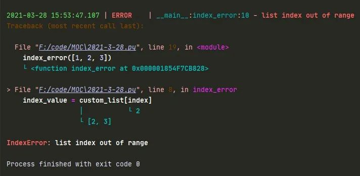
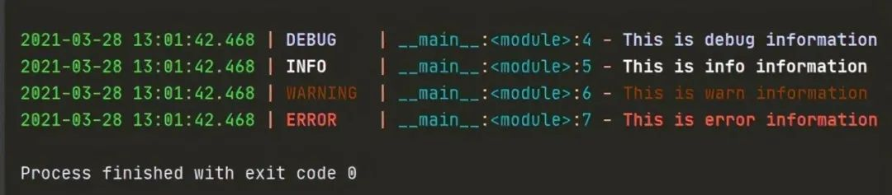
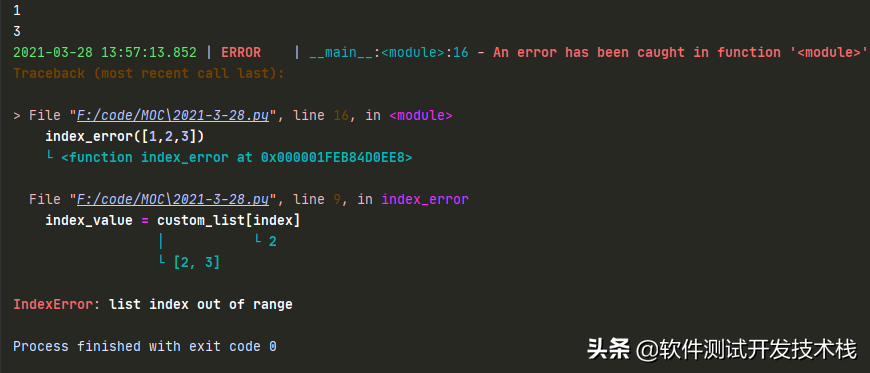

## Loguru：更為優雅、簡潔的 Python 日誌管理模塊




在 Python 開發中涉及到日誌記錄，我們或許通常會想到內置標準庫 —— logging 。雖然 logging 庫採用的是模塊化設計，可以設置不同的 handler 來進行組合，但是在配置上較為繁瑣。同時在多線程或多進程的場景下，若不進行特殊處理還會導致日誌記錄會出現異常。

本文將介紹一個十分優雅、簡潔的日誌記錄第三方庫—— loguru ，我們可以通過導入其封裝的 logger 類的實例，即可直接進行調用。

# 安裝

使用 pip 安裝即可，Python 3 版本的安裝如下：

```
pip3 install loguru
```

# 基本使用

我們直接通過導入 loguru 封裝好的 logger 類的實例化對象，不需要手動創建 logger，直接進行調用不同級別的日誌輸出方法。我們先用一個示例感受下：

```python
from loguru import logger

logger.debug('This is debug information')
logger.info('This is info information')
logger.warning('This is warn information')
logger.error('This is error information')
```

在 IDE 或終端運行時會發現，loguru 在輸出的不同級別信息時，帶上了不同的顏色，使得結果更加直觀，其中也包含了時間、級別、模塊名、行號以及日誌信息。



loguru 中不同日誌級別與日誌記錄方法對應關係 如下：

eIMZOj

# loguru 配置日誌文件

logger 默認採用 sys.stderr 標準錯誤輸出將日誌輸出到控制檯中，假如想要將日誌同時輸出到其他的位置，比如日誌文件，此時我們只需要使用一行代碼即可實現。

例如，將日誌信息輸出到 2021-3-28.log 文件中，可以這麼寫：

```python
from loguru import logger

logger.add("E:/PythonCode/MOC/log_2021-3-28.log",rotation="500MB", encoding="utf-8", enqueue=True, retention="10 days")

logger.info('This is info information')
```

如上，loguru 直接通過 add() 方法，完成了日誌文件的配置。

# 日誌內容的字符串格式化

loguru 在輸出 日誌的時候，還提供了非常靈活的字符串格式化輸出日誌的功能，如下：

```python
import platform
from loguru import logger

rounded_value = round(0.345, 2)

trace= logger.add('2021-3-28.log')

logger.info('If you are using Python {version}, prefer {feature} of course!', version=platform.python_version(), feature='f-strings')

# 執行上述代碼，輸出結果為
2021-03-28 13:43:26.232 | INFO     | __main__:<module>:9 - If you are using Python 3.7.6, prefer f-strings of course!
```

------

# loguru 日誌常用參數配置解析

- sink：可以傳入一個 file 對象（file-like object），或一個 str 字符串或者 pathlib.Path 對象，或一個方法（coroutine function），或 logging 模塊的 Handler（logging.Handler）。
- level (int or str, optional) ：應將已記錄消息發送到接收器的最低嚴重級別。
- format (str or callable, optional) ：格式化模塊，在發送到接收器之前，使用模板對記錄的消息進行格式化。
- filter (callable, str or dict, optional) ：用於決定每個記錄的消息是否應該發送到接收器。
- colorize (bool, optional) – 是否應將格式化消息中包含的顏色標記轉換為用於終端著色的 Ansi 代碼，或以其他方式剝離。如果 None，根據水槽是否為 TTY 自動作出選擇。
- serialize (bool, optional) ：在發送到接收器之前，記錄的消息及其記錄是否應該首先轉換為 JSON 字符串。
- backtrace (bool, optional) ：格式化的異常跟蹤是否應該向上擴展，超出捕獲點，以顯示生成錯誤的完整堆棧跟蹤。
- diagnose (bool, optional) ：異常跟蹤是否應該顯示變量值以簡化調試。在生產中，這應該設置為 “False”，以避免洩漏敏感數據。
- enqueue (bool, optional) ：要記錄的消息在到達接收器之前是否應該首先通過多進程安全隊列。當通過多個進程將日誌記錄到文件中時，這是非常有用的。這還具有使日誌調用非阻塞的優點。
- catch (bool, optional) ：是否應該自動捕獲接收器處理日誌消息時發生的錯誤。如果 True 上顯示異常消息 sys.stderr。但是，異常不會傳播到調用者，從而防止應用程序崩潰。

如果當接收器（sink）是文件路徑（ pathlib.Path ）時，可以應用下列參數，同時 add() 會返回與所添加的接收器相關聯的標識符：

- rotation：分隔日誌文件，何時關閉當前日誌文件並啟動一個新文件的條件，; 例如，"500 MB"、"0.5 GB"、"1 month 2 weeks"、"10h"、"monthly"、"18:00"、"sunday"、"monday at 18:00"、"06:15"
- retention (str, int, datetime.timedelta or callable, optional) ，可配置舊日誌的最長保留時間，例如，"1 week, 3 days"、"2 months"
- compression (str or callable, optional) ：日誌文件在關閉時應轉換為的壓縮或歸檔格式，例如，"gz"、"bz2"、"xz"、"lzma"、"tar"、"tar.gz"、"tar.bz2"、"tar.xz"、"zip"
- delay (bool, optional)：是否應該在配置了接收器之後立即創建文件，或者延遲到第一個記錄的消息。默認為'False'。
- mode (str, optional) ：與內置 open() 函數一樣的打開模式。默認為'"a"(以附加模式打開文件)。
- buffering (int, optional) ：內置 open() 函數的緩衝策略，它默認為 1(行緩衝文件)。
- encoding (str, optional) ：文件編碼與內置的'open()'函數相同。如果'None'，它默認為'locale.getpreferredencoding() 。

# loguru 日誌常用方式

停止日誌記錄到文件中

add 方法 添加 sink 之後我們也可以對其進行刪除， 刪除的時候根據剛剛 add 方法返回的 id 進行刪除即可，還原到標準輸出。如下：

```python
from loguru import logger

trace= logger.add('2021-3-28.log')
logger.error('This is error information')

logger.remove(trace)
logger.warning('This is warn information')
```

控制檯輸出如下：

```
2021-03-28 13:38:22.995 | ERROR    | __main__:<module>:7 - This is error information

2021-03-28 13:38:22.996 | WARNING  | __main__:<module>:11 - This is warn information
```

日誌文件 2021-3-28.log 內容如下：

```
2021-03-28 13:38:22.995 | ERROR    | __main__:<module>:7 - This is error information
```

將 sink 對象移除之後，在這之後的內容不會再輸出到日誌文件中。

只輸出到文本，不在 console 輸出

通過 logger.remove(handler_id=None) 刪除以前添加的處理程序，並停止向其接收器發送日誌。然後通過 add 添加輸出日誌文件，即可 實現 只輸出到文本，不在 console 輸出，如下：

```python
from loguru import logger
# 清除之前的設置
logger.remove(handler_id=None) 

trace= logger.add('2021-3-28.log')

logger.error('This is error information')
logger.warning('This is warn information')
```

filter 配置日誌過濾規則

如下，我們通過實現自定義方法 error_only，判斷日誌級別，當日誌級別為 ERROR，返回 TRUE，我們在 add 方法設置 filter 參數時，設置為 error_only，即可過濾掉 ERROR 以外的所有日誌 。

```python
from loguru import logger

def error_only(record):
    """
    error 日誌 判斷 
    Args:
        record: 

    Returns: 若日誌級別為ERROR, 輸出TRUE

    """
    return record["level"].name == "ERROR"

# ERROR以外級別日誌被過濾掉
logger.add("2021-3-28.log", filter=error_only)

logger.error('This is error information')
logger.warning('This is warn information')
```

在 2021-3-28.log 日誌中，我們可以看到僅記錄了 ERROR 級別日誌。

```
2021-03-28 17:01:33.267 | ERROR    | __main__:<module>:11 - This is error information
```

format 配置日誌記錄格式化模板

```python
from loguru import logger

def format_log():
    """

    Returns:

    """
    trace = logger.add('2021-3-28.log', format="{time:YYYY-MM-DD HH:mm:ss} {level} From {module}.{function} : {message}")

    logger.warning('This is warn information')

if __name__ == '__main__':
    format_log()
```

如下，我們可以看到在 2021-3-28.log 日誌文件中，如 "{time:YYYY-MM-DD HH:mm:ss} {level} From {module}.{function} : {message}" 格式模板進行記錄：

```
# 2021-3-28.log
2021-03-28 14:46:25 WARNING From 2021-3-28.format_log : This is warn information
```

其它的格式化模板屬性 如下：

6fMec9

通過 extra bind() 添加額外屬性來為結構化日誌提供更多屬性信息，如下：

```python
from loguru import logger

def format_log():
    """

    Returns:

    """
    trace = logger.add('2021-3-28.log', format="{time:YYYY-MM-DD HH:mm:ss} {extra[ip]}  {extra[username]} {level} From {module}.{function} : {message}")
    
    extra_logger = logger.bind(ip="192.168.0.1", user)
    extra_logger.info('This is info information')
    extra_logger.bind(user)

    extra_logger.warning('This is warn information')

if __name__ == '__main__':
    format_log()
```

如下，我們可以看到在 2021-3-28.log 日誌文件中，看到日誌按上述模板記錄，如下：

```
2021-03-28 16:27:11 192.168.0.1  張三 INFO From 2021-3-28.format_log : This is info information
2021-03-28 16:27:11 192.168.0.1  李四 ERROR From 2021-3-28.format_log : This is error information
2021-03-28 16:27:11 192.168.0.1  張三 WARNING From 2021-3-28.format_log : This is warn information
```

level 配置日誌最低日誌級別

```python
from loguru import logger

trace = logger.add('2021-3-29.log', level='ERROR')
```

rotation 配置日誌滾動記錄的機制

我們想週期性的創建日誌文件，或者按照文件大小自動分隔日誌文件，我們可以直接使用 add 方法的 rotation 參數進行配置。

例如，每 200MB 創建一個日誌文件，避免每個 log 文件過大，如下：

```python
from loguru import logger

trace = logger.add('2021-3-28.log', rotation="200 MB")
```

例如，每天 6 點 創建一個日誌文件，如下：

```python
from loguru import logger

trace = logger.add('2021-3-28.log', rotation='06:00')
```

例如，每隔 2 周創建一個 日誌文件，如下：

```python
from loguru import logger

trace = logger.add('2021-3-28.log', rotation='2 week')
```

retention 配置日誌保留機制

通常，一些久遠的日誌文件，需要週期性的去清除，避免日誌堆積，浪費存儲空間。我們可以通過 add 方法的 retention 參數可以配置日誌的最長保留時間。

例如，設置日誌文件最長保留 7 天，如下：

```python
from loguru import logger

trace = logger.add('2021-3-28.log', retention='7 days')
```

compression 配置日誌壓縮格式

loguru 還可以配置文件的壓縮格式，比如使用 zip 文件格式保存，示例如下：

```python
from loguru import logger

trace = logger.add('2021-3-28.log', compression='zip')
```

serialize 日誌序列化

如果我們希望輸出類似於 Json-line 格式的結構化日誌，我們可以通過 serialize 參數，將日誌信息序列化的 json 格式寫入 log 文件，最後可以將日誌文件導入類似於 MongoDB、ElasticSearch 中用作後續的日誌分析，代碼示例如下：

```python
from loguru import logger
import platform

rounded_value = round(0.345, 2)

trace= logger.add('2021-3-28.log', serialize=True)

logger.info('If you are using Python {version}, prefer {feature} of course!', version=platform.python_version(), feature='f-strings')
```

在 2021-3-28.log 日誌文件，我們可以看到每條日誌信息都被序列化後存在日誌文件中，如下：

```python
{
    "text": "2021-03-28 13:44:17.104 | INFO     | __main__:<module>:9 - If you are using Python 3.7.6, prefer f-strings of course!\n",
    "record": {
        "elapsed": {
            "repr": "0:00:00.010911",
            "seconds": 0.010911
        },
        "exception": null,
        "extra": {
            "version": "3.7.6",
            "feature": "f-strings"
        },
        "file": {
            "name": "2021-3-28.py",
            "path": "F:/code/MOC/2021-3-28.py"
        },
        "function": "<module>",
        "level": {
            "icon": "\u2139\ufe0f",
            "name": "INFO",
            "no": 20
        },
        "line": 9,
        "message": "If you are using Python 3.7.6, prefer f-strings of course!",
        "module": "2021-3-28",
        "name": "__main__",
        "process": {
            "id": 22604,
            "name": "MainProcess"
        },
        "thread": {
            "id": 25696,
            "name": "MainThread"
        },
        "time": {
            "repr": "2021-03-28 13:44:17.104522+08:00",
            "timestamp": 1616910257.104522
        }
    }
}
```

Traceback 記錄（異常追溯）

loguru 集成了一個名為 better_exceptions 的庫，不僅能夠將異常和錯誤記錄，並且還能對異常進行追溯，如下，我們通過在遍歷列表的過程中刪除列表元素，以觸發 IndexError 異常，

通過 catch 裝飾器的方式實現異常捕獲，代碼示例如下：

```python
from loguru import logger

trace= logger.add('2021-3-28.log')

@logger.catch
def index_error(custom_list: list):

    for index in range(len(custom_list)):
        index_value = custom_list[index]
        if custom_list[index] < 2 :
            custom_list.remove(index_value)

        print(index_value)

if __name__ == '__main__':
    index_error([1,2,3])
```

運行上述代碼，我們可以發現 loguru 輸出的 Traceback 日誌信息， Traceback 日誌信息中同時輸出了當時的變量值，如下：



在 2021-3-28.log 日誌文件中也同樣輸出了上述格式的異常追溯信息，如下。

```
2021-03-28 13:57:13.852 | ERROR    | __main__:<module>:16 - An error has been caught in function '<module>', process 'MainProcess' (7080), thread 'MainThread' (32280):
Traceback (most recent call last):

> File "F:/code/MOC/2021-3-28.py", line 16, in <module>
    index_error([1,2,3])
    └ <function index_error at 0x000001FEB84D0EE8>

  File "F:/code/MOC/2021-3-28.py", line 9, in index_error
    index_value = custom_list[index]
                  │           └ 2
                  └ [2, 3]

IndexError: list index out of range
```

------

同時，附上對類中的類方法和靜態方法的代碼實例，以供參考

```python
from loguru import logger

trace = logger.add('2021-3-28.log')

class Demo:
    @logger.catch
    def index_error(self, custom_list: list):
        for index in range(len(custom_list)):
            index_value = custom_list[index]
            if custom_list[index] < 2:
                custom_list.remove(index_value)

    @staticmethod
    @logger.catch
    def index_error_static(custom_list: list):
        for index in range(len(custom_list)):
            index_value = custom_list[index]
            if custom_list[index] < 2:
                custom_list.remove(index_value)


if __name__ == '__main__':
    # Demo().index_error([1, 2, 3])
    Demo.index_error_static([1, 2, 3])
```

通過 logger.exception 方法也可以實現異常的捕獲與記錄：

```python
from loguru import logger

trace = logger.add('2021-3-28.log')

def index_error(custom_list: list):
    for index in range(len(custom_list)):
        try:
            index_value = custom_list[index]
        except IndexError as  err:
            logger.exception(err)
            break

        if custom_list[index] < 2:
            custom_list.remove(index_value)


if __name__ == '__main__':
    index_error([1, 2, 3])
```

運行上述代碼，我們可以發現 loguru 輸出的 Traceback 日誌信息， Traceback 日誌信息中同時輸出了當時的變量值，如下：

