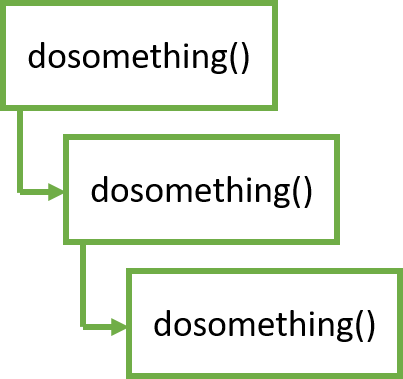

## async def & await 重點整理

## `sync def` & `await` 使用情境

我直接利用下面這個例子來展示什麼情況下可以使用 `async` 和 `await`。

```python
import time

def dosomething(i):
    print(f"第 {i} 次開始")
    time.sleep(2)
    print(f"第 {i} 次結束")

if __name__ == "__main__":
    start = time.time()
    for i in range(5):
        dosomething(i+1)
    print(f"time: {time.time() - start} (s)")
```

執行後應該會像這樣。

```
第 1 次開始
第 1 次結束
第 2 次開始
第 2 次結束
第 3 次開始
第 3 次結束
第 4 次開始
第 4 次結束
第 5 次開始
第 5 次結束
time: 10.048049688339233 (s)
```

這非常直覺，因為每次呼叫 `dosomething()` 時都會等待2秒，等完才會執行下一輪，所以最後執行總時間是10秒相當合理。


但仔細想想，如果那2秒是做網路請求或檔案讀寫(IO)，這2秒是不需要CPU的，但CPU就只能發呆2秒，痴痴地等待回傳結果，其他什麼事都不能做，豈不是太浪費了嗎!? (學過作業系統的人就知道，絕對不能讓CPU發呆XD)

因此 Python 就有了 `asyncio` 這個工具，來徹底的利用(X) 榨乾(O) CPU的效能。

我把剛才的例子改成 `asyncio` 的版本。

我把剛才的例子改成 `asyncio` 的版本。

```python
import time
import asyncio

async def dosomething(i):
    print(f"第 {i} 次開始")
    await asyncio.sleep(2)
    print(f"第 {i} 次結束")

if __name__ == "__main__":
    start = time.time()
    tasks = [dosomething(i+1) for i in range(5)]
    asyncio.run(asyncio.wait(tasks))
    print(f"time: {time.time() - start} (s)")
```

執行結果會變成這樣，只需要2秒就結束了!

```
第 2 次開始
第 1 次開始
第 3 次開始
第 4 次開始
第 5 次開始
第 2 次結束
第 3 次結束
第 5 次結束
第 1 次結束
第 4 次結束
time: 2.011152982711792 (s)
```

為什麼會這樣呢? 其實 `await` 就是告訴 CPU 說後面這個函數很慢，不需要等它執行完畢。因此此時 CPU 就可以先跳去執行其他的事情，只需要在這個函數結束時再回來處理就好。這就是為什麼速度會快很多。



瞭解 `async def` & `await` 使用情境之後，就來說明一些細節吧!

## coroutine

首先，`async def` & `await` 是 Python 3.5+ 之後才出現的 [語法糖](https://zh.wikipedia.org/zh-tw/語法糖)，目的是讓 coroutine 之間的調度更加清楚。

那就要先了解什麼是 **coroutine**。

根據 Python 官方對 coroutine 定義：

> Coroutines are a more generalized form of subroutines. Subroutines are entered at one point and exited at another point. Coroutines can be entered, exited, and resumed at many different points. They can be implemented with the async def statement.

簡單講 coroutine 可以在任意的時間點開始、暫停和離開，並且透過 `async def` 宣告此函數為一個 coroutine。

所以 `await` 的作用就是告訴 CPU 說可以暫停後面的工作，先去執行其他程式。另外 `await` 只能在 coroutine 中宣告，這就是為什麼 `await` 必須寫在 `async def` 裡面。

另一個要注意的點，`await` 後只能接 `awaitables` 物件，`awaitables` 物件就包括 coroutine, Task, Future 和有實作 `__await__()` 的物件。所以並不是所有函數都可以使用 `await` 加速。

## coroutine 使用範例

最後來講 coroutine 的使用範例吧!

```python
import asyncio

async def main():
    await asyncio.sleep(1)
    print('hello')

main()
```

執行後應該會出錯：

```
RuntimeWarning: coroutine 'main' was never awaited
  main()
RuntimeWarning: Enable tracemalloc to get the object allocation traceback
```

這是因為現在 `main()` 已經宣告成一個 coroutine 了，所以不能夠直接呼叫，而是要改成用 `asyncio.run()` 呼叫，所以將程式碼改成下面這樣就可以成功印出 hello 了。

```python
import asyncio

async def main():
    await asyncio.sleep(1)
    print('hello')

asyncio.run(main())
```

好，`async def` & `await` 就大致介紹到這邊，關於 `asyncio` 有滿多東西可以玩的，有需要歡迎看這篇 [Python asyncio 從不會到上路](https://myapollo.com.tw/zh-tw/begin-to-asyncio/)。

## FastAPI `async def` & `await`

最後回來看 [FastAPI 文件](https://fastapi.tiangolo.com/async/) 中怎麼說明 `async def` & `await` 的。

他說如果你需要在 path operation function 中呼叫一些很慢的函數 (如: 讀取資料庫、網路請求...) 時，就可以使用 `async def` 和 `await` 來加速，就像下面的例子。

```python=
@app.get('/')
async def read_results():
    results = await do_something()  # do_something() is slow
    return results
```

但如果不需要呼叫這些函數，就直接使用一般 `def` 即可。

現在就能明白為何 FastAPI 要使用 `async def` 和 `await` 了吧!


---

```python
import asyncio
import multiprocessing as mp

async def crawl_data():
    while True:
        print('Crawling data...')
        await asyncio.sleep(1)

def start_crawler():
    asyncio.run(crawl_data())

if __name__ == '__main__':
    p = mp.Process(target=start_crawler)
    p.start()
    p.join()
```

