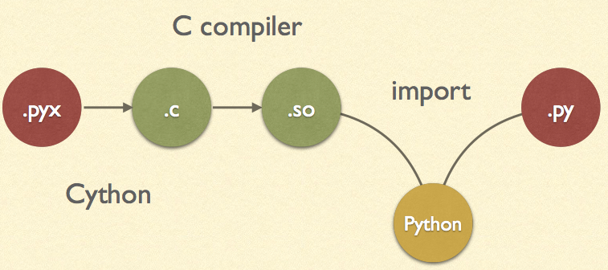
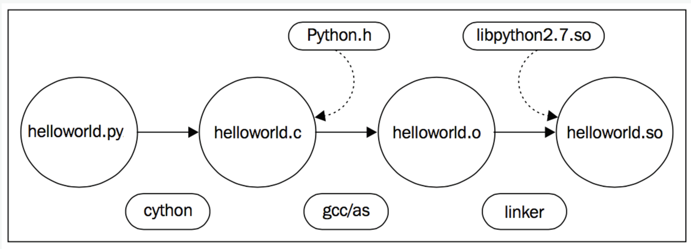
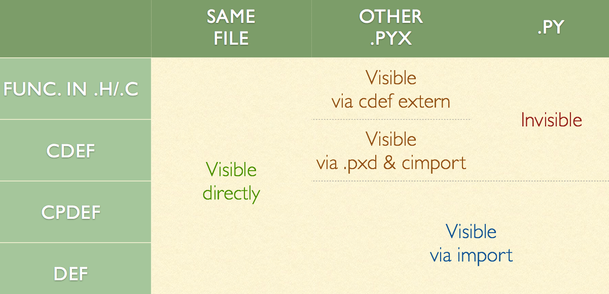
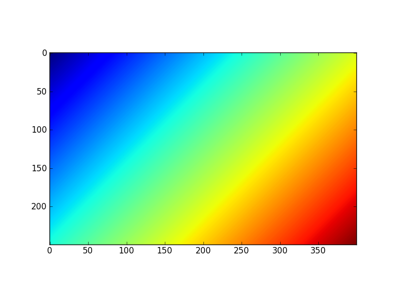

- 雖然cython非平行處理，但其可編譯python與openmp，因此cython是非常重要的套件。
- Cython 是包含 C 資料類型的 Python。
- Cython 是 Python：幾乎所有 Python 代碼都是合法的 Cython 程式碼。 Cython 的編譯器會轉化 Python 程式碼為 C 程式碼，這些 C 程式碼均可以調用 Python/C 的 API。
- 一般來講，在python中使用C/C++模組兩種常見的場景是:
  - 原來的python代碼性能太差
  - 有現成的C/C++可供直接調用 *
- pycharm IDE (professional version) 支援cython語法，建議使用。
- cython簡單的說明，就是替python的變數加上type後再編譯成machine code，因此效能可提高不少。

Cython編譯引用流程。

Cython編譯流程2。

## pyx/pxd檔案命名

- cython的程式之副檔案為pyx(python extension)。

- 而另外還有.pxd的檔案，其功能如C語言的標頭檔(header file)，其包含了cython的宣告。

- pyx可使用cimport引入pxd中的內容。

- pxd的主要功能如下：

  - 共用C的外部宣告，或包裝已編譯的C函式庫。

  - inline C function

    ```python
    cdef inline int int_min(int a, int b):
      return b if b < a else a
    ```

## 函數定義

- cython的函式有三種定義方式：
  - def: 傳入python物件，返回python物件，直接調用
  - cdef: 傳入python物件或C/C++值，返回python物件或C/C++值，不可直接調用
  - cpdef: 以上兩者的混合

Cython function定義可視範圍。

- 然而使用cdef報錯不能很好的捕獲異常。你可以這樣使用:

```python
# 這樣當該函數內部出錯時，將會返回一個0。
# (所以此時應當避免正確的情況中有返回0的可能，以避免歧義。)
cdef int divide(int x, int y) except 0:
    ...
```

## 函數參數傳遞

- python和C/C++之間有一些自動的類型轉換:

| C types                                         | from python types | to python types |
| ----------------------------------------------- | ----------------- | --------------- |
| [unsigned] char [unsigned] short int, long      | int, long         | int             |
| unsigned int unsigned long [unsigned] long long | int, long         | long            |
| float, double, long double                      | int, long, float  | float           |
| char*                                           | str/bytes         | str/bytes       |
| struct                                          |                   | dict            |

- 如果需要檢測傳入的參數不是None的話可以加上not None來檢測

```python
def func(x not None):
    ...
```

## 字串傳遞

- python2.7的字串為ascii或是unicode，而python3.x之後全面使用unicode。
- C的字串(char*)結尾是以\0為結尾。
- C++使用string函式庫處理字串。

### bytes to C string

```python
# python: bytes to unicode
ustring = byte_string.decode('UTF-8')
// 如果C string沒有null bytes，也可用同樣方法轉換成unicode
cdef char* some_c_string = c_call_returning_a_c_string()
ustring = some_c_string.decode('UTF-8')

// 已知字串長度時，轉換會更有效率
cdef char* c_string = NULL
cdef Py_ssize_t length = 0

# get pointer and length from a C function
get_a_c_string(&c_string, &length)
ustring = c_string[:length].decode('UTF-8')
```

### C string to bytes

```python
py_byte_string = py_unicode_string.encode('UTF-8')

#  pointer to the byte buffer of the Python byte string
cdef char* c_string = py_byte_string

# this will not compile !
cdef char* c_string = py_unicode_string.encode('UTF-8')

# Here, the Cython compiler notices that the code takes a pointer 
# to a temporary string result that will be garbage collected after the 
# assignment. Later access to the invalidated pointer will read invalid
# memory and likely result in a segfault. 
# Cython will therefore refuse to compile this code.
```

### for C++ string

- 可直接將std:string的字串給python使用 ```python from libcpp.string cimport string cdef string cpp_string = py_unicode_string.encode('UTF-8')

cdef string s = string(b'abcdefg') ustring1 = s.decode('UTF-8') ustring2 = s[2:-2].decode('UTF-8')

```
### 自動轉換

* cython 0.19提供了兩個命令 <span class='cmd'> c_string_type</span> 與 <span class='cmd'> c_string_encoding </span>處理字串。

```python
# cython: c_string_type=unicode, c_string_encoding=utf8

cdef char* c_string = 'abcdefg'

# implicit decoding:
cdef object py_unicode_object = c_string

# explicit conversion to Python bytes:
py_bytes_object = <bytes>c_string
```

## Hello world程式

- hello.pyx

  ```python
  print ("hello world")
  ```

- setup.py

```python
from distutils.core import setup
from Cython.Build import cythonize

setup(
    ext_modules = cythonize("hello.pyx")
 )
```

- 編譯cython檔案： python setup.py build_ext --inplace
  - 在linux中預設使用gcc編譯，而windows中必須安裝visual c++才可編譯。
  - 因為在編譯時指定--inplace，linux最後會生成同一資料夾中生成hello.so，而windows會生成hello.pyd。
  - 而此時可在python檔案或是shell中，使用 import hello。
- 如果你的模組不需要額外的 C 庫活特殊的構件安裝，可使用pyximport 模組來直接讀取 .pyx 檔，而不需要編寫 setup.py 文件。 它隨同 Cython 一併發佈和安裝，你可以這樣使用它。

```python
import pyximport; pyximport.install()
>>> import helloworld
Hello World
```

## const修飾字

- cython自0.18開始支援const修飾字。
- 許多C函式庫會使用const修飾字指定不可修改的字串或陣列如下。

```c
typedef const char specialChar;
int process_string(const char* s);
const unsigned char* look_up_cached_string(const unsigned char* key);
# cython可使用const修飾字引用C的函式庫
cdef extern from "someheader.h":
    ctypedef const char specialChar
    int process_string(const char* s)
    const unsigned char* look_up_cached_string(const unsigned char* key)

# 即使在pxd中不使用const修飾字時，仍然可引用外部C函式
cdef extern from "someheader.h":
    int process_string(char* s)   # note: looses API information!
```

## 調用C函式庫

- 簡單來說，我們先以一個 C 標準庫中的函數為例。 你不需要向你的代碼中引入 額外的依賴，Cython 都已經幫你定義好了這些函數。所以你可以將這些函數直接 cimport 進來並使用。
  - cimport等同於C中的include
  - 你可以在 Cython 的原始程式碼包[Cython/Includes/](https://github.com/cython/cython/tree/master/Cython/Includes)_. 中找到所有的標準 cimport 檔。這些檔保存在.pxd 檔中，這是一種標準再模組間共用 Cython 函式宣告的方法
- 舉個例子，比如說當你想用最簡單的方法將char*類型的值轉化為一個整型值時， 你可以使用atoi() 函數，這個函數是在stdlib.h 標頭檔中定義的。

```python
from libc.stdlib cimport atoi

# cdef: 為C函式
cdef parse_charptr_to_py_int(char* s):
    assert s is not NULL, "byte string value is NULL"
    # note: atoi() has no error detection!
    return atoi(s)
```

- 使用C的數學庫

```python
from libc.math cimport sin

cdef double f(double x):
    return sin(x*x)
```

## 動態連結（Dynamic linking）

- 在一些類 Unix 系統（例如 linux）中，默認不提供libc math 庫。 所以除了 cimport函式宣告外，你還必須配置你的編譯器以連結共用庫m。 對於 distutils來說，在Extension()安裝變數libraries 中將其添加進來就可以了。

```python
from distutils.core import setup
from distutils.extension import Extension
from Cython.Build import cythonize

ext_modules=[
    Extension("demo",
    sources=["demo.pyx"],
    libraries=["m"] # Unix-like specific
)
]

setup(
    name = "Demos",
    ext_modules = cythonize(ext_modules)
)
```

## 外部聲明（External declarations）

- 如果你想調用一個 Cython 中沒有定義的函式宣告，那麼你必須自己進行聲明。例如，上文中的 sin()函數就是這樣定義的：

```python
 cdef extern from "math.h":
    double sin(double x)
```

- 此處聲明瞭sin()函數，這時我們便可在 Cython 代碼中使用這個函數，並且讓 Cython 生成一份包括math.h 標頭檔的 C 代碼。C 編譯器在編譯時能夠在math.h 中找到原始的函式宣告。但是 Cython 不能解析math.h 並需要一個單獨的定義。
- 正如math 庫中的sin()函數一樣，只要 Cython 生成的模組正確的連結了共用庫或靜態程式庫，我們就可以聲明並調用任意的 C 庫函數。
- 注意，只要簡單地通過cpdef 聲明，你就能從 Cython 模組中匯出一個外部 C 函數。而且生成了一個 Python 擴展，使得我們可以在 Python 代碼中直接訪問到 C 函數sin()。

## 變數的命名（Naming parameters）

- C 和 Cython 都支持沒有參數明的signature declarations如下：

```python
cdef extern from "string.h":
    char* strstr(const char*, const char*)
```

- 然而，這樣的話 Cython 代碼將不能通過關鍵字參數來調用這個函數（由Cython 0.19及以後的版本所支持）。所以，我們最好這樣去聲明一個函數：

```python
cdef extern from "string.h":
      char* strstr(const char *haystack, const char *needle)
```

- 這會讓清楚地知道你所調用了哪兩個參數，從而能夠避免二義性並增強你的代碼的可讀性:

```python
cdef char* data = "hfvcakdfagbcffvschvxcdfgccbcfhvgcsnfxjh"

pos = strstr(needle='akd', haystack=data)
print (pos != NULL)
```

- 注意，正如 Python 代碼一樣，對已有參數名的修改是不向後相容的。那麼， 如果你為外部的 C 或 C++ 函數進行了自己的聲明，通常花一點時間去 將參數名命名的更好是非常值得的。

## Memoryview切片

- Cython 0.16中，增加了記憶體視圖(memoryview)，用它可以很方便地存取NumPy陣列等支援buffer介面的物件中的資料。
- 編寫如下三個檔，並保存到同一個目錄之下：
  - memview_test.py:用來測試編譯之後的擴展庫的測試程式
  - memview.pyx:Cython來源程式
  - setup.py:用於編譯Cython來源程式
- setup.py

```python
import numpy as np
from distutils.core import setup
from distutils.extension import Extension
from Cython.Distutils import build_ext

setup(
    cmdclass = {'build_ext': build_ext},
    ext_modules = [
        Extension("memview", ["memview.pyx"],
    ],

    # 使用numpy套件必須加上此行
    include_dirs=[np.get_include()]
)
```

- Memoryview切片(Memoryview slices)是Cython中的一種特殊類型，通過它可以高效地訪問支援buffer介面的Python物件內部的資料區，例如NumPy中的ndarray物件。下面我們通過一個例子說明它的用法

```python
def memview_sum(int[:] a):
    # 參數a是一個一維整數切片類型，可以將與此切片類型一致的陣列傳遞給它
    cdef int i
    cdef int s = 0
    # 和NumPy陣列一樣，它的shape屬性為其各個軸的長度
    for i in range(a.shape[0]):
        s += a[i]
    return s
```

- 分析編譯後的檔案 cython.py -a memview.pyx ，會生成memview.html與memview.c，可知 s+=a[i] 這一行這段代碼可以處理下標越界以及下標為負數的情況。由於需要在迴圈中對每個元素進行判斷，因此這些代碼會降低運算速度。

```c
    /* "memview.pyx":5   
   *     cdef int s = 0
   *     for i in range(a.shape[0]):   
   *         s += a[i]             # <<<<<<<<<<<<<<
   *     return s   */
      __pyx_t_3 = __pyx_v_i;      
      __pyx_t_4 = -1;
      // 處理下標為負值及越界的狀況，每次迴圈都要處理，相當花時間
      if (__pyx_t_3 < 0) {        
        __pyx_t_3 += __pyx_v_a.shape[0];
        if (unlikely(__pyx_t_3 < 0)) __pyx_t_4 = 0;      
       } else if (unlikely(__pyx_t_3 >= __pyx_v_a.shape[0])) __pyx_t_4 = 0;
      if (unlikely(__pyx_t_4 != -1)) {
        __Pyx_RaiseBufferIndexError(__pyx_t_4);
        __PYX_ERR(0, 5, __pyx_L1_error)
      }
      __pyx_v_s = (__pyx_v_s + (*((int *) ( /* dim=0 */ (__pyx_v_a.data + __pyx_t_3 * __pyx_v_a.strides[0]) ))));
    }
```

- 由於需要在迴圈中對每個元素進行判斷，因此這些代碼會降低運算速度。可以使用Cython提供的wraparound和boundscheck修飾器關閉這兩項功能。

```python
cimport cython
@cython.boundscheck(False)
@cython.wraparound(False)
def memview_sum(int[:] a):
    # ...
```

- 使用修飾器對整個函數體有效，如果只希望對某一段程式有效的話，可以使用with關鍵字：

```python
for i in range(a.shape[0]):
with cython.boundscheck(False):
    with cython.wraparound(False):
            s += a[i]
```

- 關閉這兩個選項之後，輸出的代碼如下，很明顯可看出沒有檢查邊界。

```c
/* "memview.pyx":9
 *     cdef int s = 0
 *     for i in range(a.shape[0]):
 *         s += a[i]             # <<<<<<<<<<<<<<
 *     return s
 */
    __pyx_t_3 = __pyx_v_i;
    __pyx_v_s = (__pyx_v_s + (*((int *) ( /* dim=0 */ (__pyx_v_a.data + __pyx_t_3 * __pyx_v_a.strides[0]) ))));
  }
```

- 在控制檯中輸入

```python
>>> a = np.arange(11)
>>> memview.memview_sum(a)
55
# 由於在C語言代碼中使用data和strides屬性訪問陣列中的資料，因此即使對於元素不是連續存儲的陣列也能正常運算。
>>> memview.memview_sum(a[::2]) ❶
30
```

- 如果希望資料在記憶體中是連續存儲的，那麼可以用int[::1] a定義：

```python
def memview_sum2(int[::1] a):
    cdef int i
    cdef int s = 0
    for i in range(a.shape[0]):
        s += a[i]
    return s

memview.memview_sum2(a)
55
>>> memview.memview_sum2(a[::2])
...
ValueError: ndarray is not C-contiguous
```

- 多維記憶體視圖切片類型可以用如下方式定義：

```python
cdef int[:, :]   # 二維切片
cdef int[:, ::1] # C語言連續(C-contiguous)的二維切片
cdef int[::1, :] # Fortran語言連續(Fortran-contiguous)的二維切片
```

## 記憶體視圖物件

- 當將Cython的記憶體視圖切片類型返回到Python中時，它就變成了一個記憶體視圖物件。

```python
def memview_object(int[:, :] a):
    # 參數a是一個二維切片類型
    # 它除了支援整數下標之外，還可以通過切片下標生成新的切片物件。
    # 我們直接將新生成的切片物件返回.
    return a[::2, ::2]
```

- 在控制檯中執行如下代碼：

  ```python
  b = np.arange(24).reshape(6, 4)
  >>> mv = memview.memview_object(b)
  >>> mv
  # 可得知傳回的是memoryview物件
  <MemoryView of 'ndarray' at 0x32bdb70>
  # 物件的屬性
  >>> dir(mv)
  [..., 'T', 'base', 'copy', 'copy_fortran', 'is_c_contig', 'is_f_contig', 'itemsize',
  'nbytes', 'ndim', 'shape', 'size', 'strides', 'suboffsets']
  >>> mv.shape
  (3, 2)
  ```

- MemoryView物件的這些屬性和NumPy陣列十分類似。我們可以通過numpy.asarray()將MemoryView轉換為NumPy陣列：

  - 新創建的陣列c和原來的陣列b共用記憶體，因此修改c[0,0]會同時修改b[0,0]。

```python
>>> c = np.asanyarray(mv)
>>> c
array([[ 0,  2],
       [ 8, 10],
       [16, 18]])
>>> c[0,0] = 100
>>> b[0,0]
100
```

## Cython陣列

- 當在Cython中調用切片物件的copy()和copy_fortran()時，將創建一個Cython陣列，並在此陣列上創建一個切片物件。在Python中調用MemoryView物件的copy()方法也與此類似。

```python
>>> mv.base
array([[ 0,  1,  2,  3],
       [ 4,  5,  6,  7],
       [ 8,  9, 10, 11],
       [12, 13, 14, 15],
       [16, 17, 18, 19],
       [20, 21, 22, 23]])
>>> mv2 = mv.copy()
>>> mv2
<MemoryView of 'array' at 0x317a210>
# 使用copy()後，得到不同的物件
>>> mv2.base
<memview.array object at 0x0311BA98>
```

- 我們也可以在Cython中直接創建Cython陣列:

```python
cimport cython.view
def cython_array(int w, int h):
    # 創建一個形狀為(h, w)的整型Cython陣列，
    # 並用一個記憶體視圖切片m對它進行存取。
    cdef int [:,:] m = cython.view.array(shape=(h, w), 
                                 itemsize=sizeof(int), format="i")
    cdef int i, j
    for i in range(h):
        for j in range(w):
            m[i, j] = i+j 
    return m

import pylab as pl
m = memview.cython_array(400, 250)
pl.imshow(m)
pl.show()
```

Memoryview繪圖

- 如果要向C傳遞一個陣列來處理，大部分情況下應該是numpy的array，推薦使用Memoryview來接受python傳入的numpy的array。
  - Note: 如果numpy轉成memoryview時，將無法使用numpy的內建函數功能。

```python
cdef int[:,:,:] view = np.arange(27, dtype=np.dtype("i")).reshape((3, 3, 3))
cdef int x[3][3][3]
cdef int[:,:,:] view = x
cdef int[:, :, ::1] c_contiguous = c_contig # store by row
cdef int[::1, :, :] f_contiguous = f_contig # Fortran store by column

cpdef histogram(int[:,:] image):
    import numpy as np
    cdef int[:] hist = np.zeros((256,),dtype=np.intc)
    for x in range(image.shape[0]):
        for y in range(image.shape[1]):
            hist[image[x,y]] += 1
    return np.asarray(hist)
```

- 舊式numpy傳參數做法如下：

```python
def func(np.ndarray[unsigned char, ndim=2, mode="c"] array not None):
    ...
```

## C/C++和物件導向

- 選擇：ctypes/CFFI/boost.python/ SWIG/cython
- cython優點：
  - 易學，Python+C=Cython，重用舊知識 –
  - 好用，pxd，重用聲明檔
  - C++支持全面，可從C++中回檔Python函數，為Python class重載C++ class行為提供可能
- 在Cython中也可以方便的使用物件導向的方式工作，只要使用cdef class就能在Cython中像在pure Python中那樣使用類:
- 注意Cython中的類可以被pure Python中的類繼承，但反過來不行.

```python
cdef class Rect:
    cdef int width, height

    def __init__(self, int w, int h):
        self.width = w
        self.height = h

    def area(self):
        return self.width*self.height

    def test_it(int x, int y):
        cdef Rect R = Rect(x,y)
        return R.area()
class shop:
    cdef object goods

    def __cinit__(self):
        self.goods = []

    property goods:
        def __get__(self):
            return "We have: %s" % self.goods
        def __set__(self, value):
            self.goods.append(value)
        def __del__(self):
            del self.goods[:]
```

- 上面還涉及到**cinit**這個方法和原生python的**init**有些區別，前者可以更快的執行，官方的例子是:
- 所以最求效率的化，儘量使用**cinit**吧。對於經常創建/刪除實例的類，可以在前面加上@cython.freelist(n)的裝飾器。可以獲得更好的性能。

```python
cdef class Penguin:
    cdef object food

    def __cinit__(self, food):
        # 新式建構函式
        self.food = food

    def __init__(self, food):
        # python建構函式
        print("eating!")

normal_penguin = Penguin('fish')
fast_penguin = Penguin.__new__(Penguin, 'wheat')  # note: not calling __init__() !
```

- 使用C++中的STL:

```python
 from libcpp.vector cimport vector

 cdef vector[int] vect
 cdef int i
 for i in range(10):
     vect.push_back(i)
 for i in range(10):
     print vect[i]

 vect = xrange(1,10)
```

- python到C++容器的轉換規則是 | python types | => c++ types | => python types| |---|---|---| | bytes | std:string | types| | iterable | std:vector | list| | iterable | std:list | list | | iterable | std:set | set | | iterable(len 2) | std:pair | tuple(len 2) |

## 直接使用C/C++代碼

- 如果你恰好已經有了C部分的代碼，想直接在python中調用而不是用cython自己重寫的話，你只需要寫一個.pyx進行簡單的封裝，就能達到目的。

### 封裝

- 如果只是一些C的函數需要封裝進來，使用cdef extern可以把C代碼中的函式宣告到cython中，當然你得有一個.c的檔來實現add函數。

```python
cdef extern int add(int x, int y)

def add_py(int x, int y):
    return add(x, y)
```

- 若是有一些C++的類需要封裝進來, 舉個官方的例子，你有一個rectangle.h

```c
//rectangle.h

namespace shapes {
    class Rectangle {
    public:
        int x0, y0, x1, y1;
        Rectangle(int x0, int y0, int x1, int y1);
            int getArea();
        };
}

//rectangle.cpp
#include "Rectangle.h"
namespace shapes {
    Rectangle::Rectangle(int X0, int Y0, int X1, int Y1) {
        x0 = X0;
        y0 = Y0;
        x1 = X1;
        y1 = Y1;
    }

    int Rectangle::getArea() {
        return (x1 - x0) * (y1 - y0);
    }
}
# _rectangle.pyx

cdef extern from "Rectangle.h" namespace "shapes":
    cdef cppclass Rectangle:
        Rectangle(int, int, int, int) except +
            int x0, y0, x1, y1
            int getArea()

        def func():
            cdef Rectangle *rec = new Rectangle(1, 2, 3, 4)
            try:
                area = rec.getArea()
                return area
                ...
            finally:
                del rec     # delete heap allocated object
```
