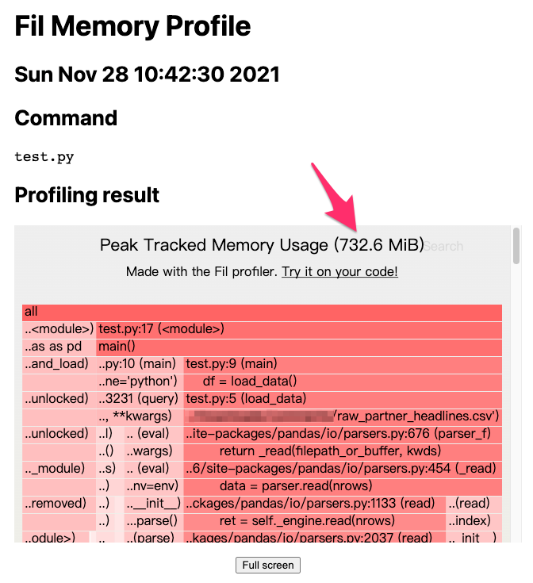
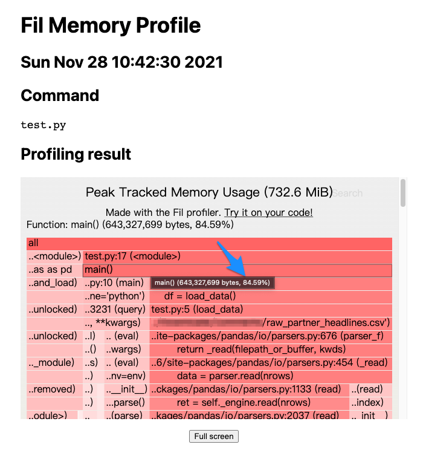

# 實戰 Fil 改善 Python 記憶體用量

https://myapollo.com.tw/blog/fil-memory-usage-profiler/


[用 Python resource 模組找出尖峰記憶體用量](https://myapollo.com.tw/blog/python-resource-module-peak-memory/) 一文介紹如何透過 Python [resource](https://docs.python.org/3/library/resource.html) 模組瞭解尖峰記憶體用量(peak memory usage), 不過該模組並無法提供更詳細的記憶體統計資料，無法得知具體哪部分的 Python 程式消耗大量記憶體，因此我們需要透過工具剖析(profiling)詳細的記憶體用量，以幫助定位問題之所在。

本文將介紹如何使用 [Fil](https://pythonspeed.com/fil/docs/index.html) 剖析 Python 程式的記憶體用量，並透過 1 個簡單的範例，實際定位程式中耗用記憶體的部分，並進行改善優化。

### 本文環境 

- macOS 11.6
- Python 3.7
- pandas 1.0.3
- [Fil](https://pythonspeed.com/fil/docs/index.html)

```undefined
$ pip install pandas==1.0.3 filprofiler
```

### 測試資料 

本文需要使用以下資料集進行測試，該資料集包含至少 200MB 以上的財經新聞 CSV 檔，我們用該資料來模擬實際處理大量資料時，記憶體被耗用的情況：

[Daily Financial News for 6000+ Stocks](https://www.kaggle.com/miguelaenlle/massive-stock-news-analysis-db-for-nlpbacktests)

### Fil (aka Fil profiler) 

[Fil](https://pythonspeed.com/fil/docs/index.html) 是 1 套十分易於使用的 Python 記憶體剖析工具，該工具運作原理為透過作業系統所提供的 `LD_PRELOAD` / `DYLD_INSERT_LIBRARIES` 機制，在程式啟動之前載入開發者指定的共享函式庫(shared library), 該函式庫可以覆寫(override)某些重要的系統 API, 使得開發者可透過該共享函式庫攔截(intercept)某些 API 的呼叫，例如 [Fil 透過覆寫記憶體相關的底層 API](https://pythonspeed.com/fil/docs/fil/what-it-tracks.html), 使得 Fil 得以攔截並統計記憶體分配以及使用情況，達成記憶體剖析的功能。

如果想了解 Fil 會攔截哪些 API, 可以參考 [What Fil tracks](https://pythonspeed.com/fil/docs/fil/what-it-tracks.html) 一文。

### Fil 初體驗 

以下範例載入測試資料集中的 `raw_partner_headlines.csv`, 並查詢多少新聞標題中含有 **J.P. Morgan** 以及該新聞中所提到的股票代號，並且匯總股票代號出現的總次數，最後只顯示超過 5 次的股票代號：

```python
import pandas as pd


def load_data():
    return pd.read_csv('<path to>/raw_partner_headlines.csv')


def main():
    df = load_data()
    df = df.query('headline.str.contains("J.P. Morgan")', engine='python')
    df = df.groupby(by='stock').count()
    for r in df.sort_values(by='headline', ascending=False).itertuples():
        if r.url > 5:
            print(r.Index, r.url)


main()
```

上述範例執行結果如下，可以看到被 J.P. Morgan 提到最多次的股票代號為 JPM, 其次為 ARNA:

```undefined
$ python test.py
JPM 15
ARNA 10
ZIOP 8
BMRN 8
AVEO 8
TEX 6
MDVN 6
NKTR 6
REGN 6
VVUS 6
```

接著我們實際用 Fil 剖析上述範例會用到多少記憶體，以下是呼叫 `fil-profile` 對 `test.py` 進行記憶體用量剖析的指令：

```bash
$ fil-profile run test.py
=fil-profile= Memory usage will be written out at exit, and opened automatically in a browser.
...(略)...
```

一旦 `fil-profile` 指令完成記憶體剖析的工作， Fil 就會打開 1 個瀏覽器視窗，並且將分析報告以網頁方式呈現：



上圖顯示前文的範例用了 **732.6 MiB** 的記憶體，相較於 `raw_partner_headlines.csv` 檔案大小 **400MB** 而言，多耗用將近 1 倍的記憶體，理想情況是載入資料之後只佔用 400MB的記憶體空間，但由於 Python 的物件化設計，記憶體耗用的情況是預料之中的事，可以想見一旦 `raw_partner_headlines.csv` 檔案越大，就需要記憶體越大的機器進行運算，最終勢必對成本（例如機器租用成本）造成影響，所以我們需要優化記憶體的使用。

接著，我們可以循著報告往下找到記憶體耗用的癥結點：



上圖可以發現 `main()` 函式佔了約 **84.59%** 的記憶體用量，但具體在 `main()` 函式的哪部分，可以繼續往下追蹤：


上圖顯示 `main()` 函式中的 `load_data()` 函式佔用約 **66.38%** 的記憶體用量，看來 `load_data()` 的記憶體用量優化，是 1 個可以進行的方向。

### 實戰優化 

[pandas.read_csv()](https://pandas.pydata.org/docs/reference/api/pandas.read_csv.html#pandas.read_csv) 預設會載入整份資料到記憶體之中，如果能夠分批載入計算將可以有效降低記憶體用量，所以我們可以為 `read_csv()` 設定 `chunksize` 參數，讓其分批載入資料，不過分批載入資料的缺點是無法一次計算好最終結果，必須將每批資料的計算結果加總儲存，也就是下列範例中的 `counter[r.Index] += r.url` 部分，最終再將加總後的結果列印：

```python
import pandas as pd

from collections import Counter


def load_data():
    return pd.read_csv(
        '<path to>/raw_partner_headlines.csv',
        chunksize=1000
    )


def main():
    counter = Counter()
    for df in load_data():
        df = df.query('headline.str.contains("J.P. Morgan")', engine='python')
        df = df.groupby(by='stock').count()
        for r in df.itertuples():
            counter[r.Index] += r.url

    for stock, count in counter.items():
        if count > 5:
            print(stock, count)


main()
```

上述範例執行結果如下：

```undefined
$ python test.py
ARNA 10
AVEO 8
BMRN 8
JPM 15
MDVN 6
NKTR 6
REGN 6
TEX 6
VVUS 6
ZIOP 8
```

其記憶體剖析報告如下：


上述報告可以看到，僅僅只是加個參數，就能夠讓記憶體用量從 **732.6 MiB** 下降至 **150.2 MiB**, 下降幅度相當可觀，對於更大的資料也不須擔心記憶體不足的問題，如果是租用雲端機器，也只需要相當低規格的機器即可達成。

以上就是透過 Fil 實際改善記憶體用量的實戰過程。

Happy coding!

### References 

https://pythonspeed.com/fil/docs/index.html