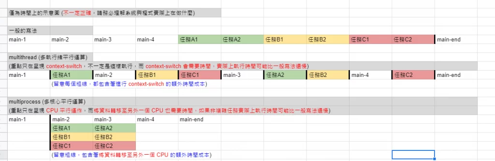
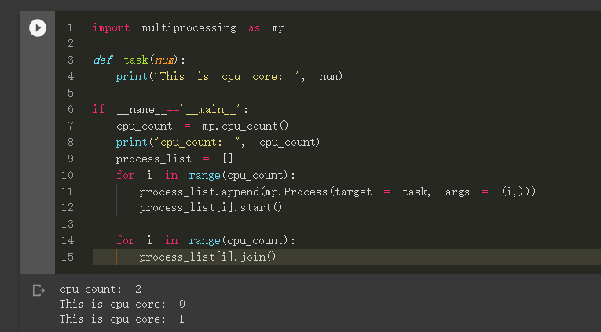

##  Multi-processing 和Multi-threading 的優缺點：

- Multi-processing (多處理程序/多進程)：
  1. 資料在彼此間傳遞變得更加複雜及花時間，因為一個 process 在作業系統的管理下是無法去存取別的 process 的 memory
  2. 適合需要 CPU 密集，像是迴圈計算
- Multi-threading (多執行緒/多線程)：
  1. 資料彼此傳遞簡單，因為多執行緒的 memory 之間是共用的，但也因此要避免會有 Race Condition 問題
  2. 適合需要 I/O 密集，像是爬蟲需要時間等待 request 回覆


```python
import threading, logging, time
import multiprocessing


class Producer(threading.Thread):
    def __init__(self):
        threading.Thread.__init__(self)
        self.stop_event = threading.Event()

    def stop(self):
        self.stop_event.set()

    def run(self):
        while not self.stop_event.is_set():
            print("Producer is working...")
            time.sleep(1)


class Consumer(multiprocessing.Process):
    def __init__(self):
        multiprocessing.Process.__init__(self)
        self.stop_event = multiprocessing.Event()

    def stop(self):
        self.stop_event.set()

    def run(self):
        while not self.stop_event.is_set():
            print("Consumer is working...")
            time.sleep(1)


def main():
    tasks = [Producer(), Consumer()]

    for t in tasks:
        t.start()

    time.sleep(3600)

    for task in tasks:
        task.stop()

    for task in tasks:
        task.join()


if __name__ == "__main__":
    logging.basicConfig(
        format="%(asctime)s.%(msecs)s:%(name)s:%(thread)d:%(levelname)s:%(process)d:%(message)s",
        level=logging.INFO,
    )
    main()

```

---

# 前言

出處: https://www.wongwonggoods.com/python/python-multiprocessing/


在 python 中有 thread 與 multiprocess 兩種平行處理程式的方式，
若只是單純的平行需求，我們可以使用 threading 這個模組來快速完成平行處理的方式。
但是 threading 只是透過頻繁的 CPU context-switch 的方式實現，
要真正實現多核心 CPU 的平行運算，我們需要使用 multiprocessing，
將任務指派給多個核心進行操作。

> multiprocessing 在資料傳遞上，會因為需要將資料轉移至其他 CPU 上進行運算，
> 因此會需要考慮資料搬運的時間，
> 而多核心真正的實現「平行運算的功能」，當任務較為複雜時，效率一定比較好。

# thread 與 multiprocess 比較

## threading 重點摘要

threading 是透過 context-switch 的方式實現
也就是說，我們是透過 CPU 的不斷切換 (context-switch)，實現平行的功能。
當大量使用 threading 執行平行的功能時，反而會因為大量的 context-switch，
「實現了程式平行的功能，但也因為大量的 context-switch ，使得程式執行速度更慢」。

## multiprocessing 重點摘要

multiprocessing 在資料傳遞上，會因為需要將資料轉移至其他 CPU 上進行運算，
因此會需要考慮資料搬運的時間，
而多核心真正的實現「平行運算的功能」，當任務較為複雜時，效率一定比較好。

## thread 與 multiprocess 比較圖

從下圖我們可以看到任務被完成的「概念」時間

- main 1~4, main-end
- 任務 A1, A2
- 任務 B1, B2
- 任務 C1, C2

請留意圖中粗線的部分：
\* 在 multithread 中，
CPU context-switch 會額外消耗我們程式執行的時間，程式實際完成時間可能比一般的還要慢。

- 在 multiprocess 中，
  我們需要將資料轉移至其他 CPU 會額外消耗我們程式執行的時間，如果任務過於簡單，效益可能不大。

> 雖然示意圖中明顯感覺較快，但前提是任務夠複雜
> 也就是說，「任務難度執行的時間 > 資料轉移至其他 CPU 的時間效益」，不然只會更慢。



# multiprocess 基本使用

基本的 multiprocess 使用方式，跟 thread 幾乎一樣，
如果學習過 multithread 的讀者，相信可以上手的很快。

## 範例程式碼 (single-multiprocess)

```python
import multiprocessing as mp

def task(a, b):
  print('Task in the Process.')
  print(a, b)

if __name__=='__main__': # must put thread in the main
  p1 = mp.Process(target=task, args=(1,2))
  p1.start()
  p1.join()
```

## 運行結果


## 說明

- p1 = mp.Process(target=task, args=(1,2))
  - 建立一個名字為 p1 的 Process，執行 task 任務，傳入參數 (1,2)
- p1.start()：啟動 p1 任務
- p1.join()：等待 p1 任務結束 (一定會等到結束才執行下一行)

# 多個 Process 同時平行處理，「保證」任務「結果」的順序性 (multi-process)

> 我們「不保證」任務執行時，「過程中」輸出的順序，但完成「結果」的順序性可用 join() 來「保證」。

## 範例程式碼 (multi-process)

```python
import multiprocessing as mp

def task(num):
  print('This is Process: ', num)

if __name__=='__main__':
  num_process = 5
  process_list = []
  for i in range(num_process):
    process_list.append(mp.Process(target = task, args = (i,)))
    process_list[i].start()

  for i in range(num_process):
    process_list[i].join()
```

## 運行結果 (注意：每次執行不一定相同)


> 注意：該輸入的都有輸出，但有些順序搶先輸出了，這也代表不同核心接到任務的順序。
> 所以「每次執行不一定相同」。

## 說明

- process_list.append(mp.Process(target = task, args = (i,)))
  - 建立 Process，存入，執行 task 任務，傳入參數 (i, )
- process_list[i].start()：啟動 process_list[i] 任務
- process_list[i].join()：等待 process_list[i] 任務結束 (一定會等到結束才執行下一行)

# 多個 Process 同時平行處理，「保證」任務「過程中」的順序性 (multi-process)

答：沒有必要

如果是為了當任務「過程中」順序有高度要求時…你可能要想想

> 如果真要確保「過程中」照順序來，才做下一件事情，那你用 multi-process 到底要幹嘛XDD。
> 直接寫就好了，不用想太多 multi-process 的事情!
> 「又要多核心」、「又要平行任務」、「又要保證過程中的順序」，
> 光是保證「保證過程中的順序」，你的 process 執行過程之間就會互相卡爆了
> 還要效率不如直接不要平行了吧。

所以這邊就不示範了，你可能要先想清楚：為什麼都用到 multi-process ，
還需要保證任務「過程中」的順序性。(如果只是想確保執行「結果」的順序性，請見上面。)

# 利用 multiprocessing 模組 查看自己的CPU「有多少核心」

我們可以利用 multiprocessing 模組內建的功能，
multiprocessing.cpu_count()，得到目前 cpu 的核心數量。

```python
cpu_count = multiprocessing.cpu_count()
```

## 結合上述的程式範例，製作出「依照 CPU 核心數執行任務」的範例程式碼模板

```python
import multiprocessing as mp

def task(num):
  print('This is cpu core: ', num)

if __name__=='__main__':
  cpu_count = mp.cpu_count()
  print("cpu_count: ", cpu_count)
  process_list = []
  for i in range(cpu_count):
    process_list.append(mp.Process(target = task, args = (i,)))
    process_list[i].start()

  for i in range(cpu_count):
    process_list[i].join()
```

執行結果 (依照不同電腦的 CPU 能力而有異)




不過這樣的感覺很不踏實對吧! 感覺都要手動指定核心數量給 Process，
能不能讓系統自動分配呢?

當然是可以的，我們會再另外一篇文章 multiprocessing pool 教學進階的使用，
使用 pool 就可以自動讓系統幫我們分配任務給多個核心，
並且與 Process 最大的不同是「pool 能夠取得結果」。

# Reference

- Python 多執行緒 threading 模組平行化程式設計教學

  

- [【莫煩】Multiprocessing 多程式](https://iter01.com/17324.html)
