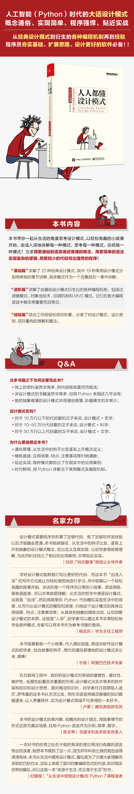

# Description of PyDesignPattern

## English
This is the source ocde of [ *Everybody Know Design Patterns : How to comprehend Design Patterns from daily life* ](https://gitbook.cn/gitchat/column/5b26040ac81ac568fcf64ea3).

## 中文
這是《人人都懂設計模式：從生活中領悟設計模式（Python實現）》一書的源碼。可通過線上課程[如何從生活中領悟設計模式（Python）](https://gitbook.cn/gitchat/column/5b26040ac81ac568fcf64ea3) 進行試讀。

設計模式(Design pattern)是一套被反覆使用、多數人知曉的、無數工程師實踐的代碼設計經驗的總結，它是面向對象思想的高度提煉和模板化。使用設計模式將會使你的代碼具有更高的可重用性，更好的靈活性和可拓展性，更易被人閱讀和理解。

程序不應只是冷冰冰的代碼，更應賦予它生活的樂趣和特殊的意義。本課程將會從生活的角度，在生活的每一個細節和故事中解讀一個個設計模式。 **力求用最通俗的語言闡述最難懂的概念；用最簡單的語法實現最複雜的邏輯；用最短小的代碼寫出最強悍的程序！** 希望能給您帶來一種全新的閱讀體驗和思考方式。

此升級版的系列分三部分內容：(1). 基礎篇，19種常用設計模式單獨章節講解 + 剩餘4種模式合集(會有1到2篇的篇幅)；(2). 進階篇，是基礎設計模式的衍生，也是各大編程語言中非常重要而常見的種編程機制；(3). 經驗篇，將會分享我對設計原則、設計模式、項目重構的經驗和看法。

## 書籍
[京東購買](https://item.jd.com/12580392.html)、[噹噹購買](http://product.dangdang.com/27848931.html)

## 線上課程

### 引導篇
[生活中的設計模式——啟程之前，請不要錯過我【試讀】](http://gitbook.cn/gitchat/column/5a1c24de28554541fbc8f2e8/topic/5a1f8857211fa435d2b9ca6c)

### 基礎篇

[生活中的監聽模式——一坑爹的熱水器](http://gitbook.cn/gitchat/column/5b26040ac81ac568fcf64ea3/topic/5b2604a8c81ac568fcf64ef1)
pattern/Observer.py

[生活中的適配模式——身高不夠鞋來湊](http://gitbook.cn/gitchat/column/5b26040ac81ac568fcf64ea3/topic/5b26052ec81ac568fcf64f20)
pattern/Adapter.py

[生活中的狀態模式——人有少、壯、老， 水之冰、液、汽](http://gitbook.cn/gitchat/column/5b26040ac81ac568fcf64ea3#catalog)
pattern/State.py

[生活中的單例模式——你是我生命的唯一](http://gitbook.cn/gitchat/column/5b26040ac81ac568fcf64ea3#catalog)
pattern/Singleton.py

[生活中的職責模式——我的假條去哪了](http://gitbook.cn/gitchat/column/5b26040ac81ac568fcf64ea3#catalog)
pattern/Responsibility.py

[生活中的中介模式——找房子問中介](http://gitbook.cn/gitchat/column/5b26040ac81ac568fcf64ea3#catalog)
pattern/Mediator.py

[生活中的代理模式——幫我拿一下快遞](http://gitbook.cn/gitchat/column/5b26040ac81ac568fcf64ea3#catalog)
pattern/Proxy.py

[生活中的裝飾模式——你想怎麼穿就怎麼穿](http://gitbook.cn/gitchat/column/5b26040ac81ac568fcf64ea3#catalog)
pattern/Decorator.py

[生活中的工廠模式——你要拿鐵還是摩卡](http://gitbook.cn/gitchat/column/5b26040ac81ac568fcf64ea3#catalog)
pattern/SimpleFactory.py

[生活中的迭代模式——下一個就是你了](http://gitbook.cn/gitchat/column/5b26040ac81ac568fcf64ea3#catalog)
pattern/Iterator.py

[生活中的組合模式——自己電腦組裝，價格再降三折](http://gitbook.cn/gitchat/column/5b26040ac81ac568fcf64ea3#catalog)
pattern/Composite.py

[生活中的構建模式——你想要一輛車還是一座房](http://gitbook.cn/gitchat/column/5b26040ac81ac568fcf64ea3#catalog) 
pattern/Builder.py

[生活中的克隆模式——給你一個分身術](http://gitbook.cn/gitchat/column/5b26040ac81ac568fcf64ea3#catalog)
pattern/Clone.py

[生活中的策略模式——怎麼來不重要，人到就行](http://gitbook.cn/gitchat/column/5b26040ac81ac568fcf64ea3#catalog)
pattern/Strategy.py

[生活中的命令模式——大閘蟹，走起！](http://gitbook.cn/gitchat/column/5b26040ac81ac568fcf64ea3#catalog)
pattern/Command.py

[生活中的備忘模式——好記性不如爛筆頭](http://gitbook.cn/gitchat/column/5b26040ac81ac568fcf64ea3#catalog)
pattern/Memento.py

[生活中的享元模式——顏料很貴必須充分利用](http://gitbook.cn/gitchat/column/5b26040ac81ac568fcf64ea3#catalog)
pattern/Flyweight.py

[生活中的外觀模式——學妹別慌，學長幫你](http://gitbook.cn/gitchat/column/5b26040ac81ac568fcf64ea3#catalog)
pattern/Facade.py

[生活中的訪問模式——一千個讀者一千個哈姆雷特](http://gitbook.cn/gitchat/column/5b26040ac81ac568fcf64ea3#catalog)
pattern/Visitor.py

[生活中的設計模式——與經典23種設計模式的不解淵源](http://gitbook.cn/gitchat/column/5b26040ac81ac568fcf64ea3#catalog)

[生活中的設計模式——那些未完待續的設計模式](http://gitbook.cn/gitchat/column/5b26040ac81ac568fcf64ea3#catalog)
pattern/Template.py

### 進階篇
[深入解讀過濾器模式——製作一杯鮮純細膩的豆漿](http://gitbook.cn/gitchat/column/5b26040ac81ac568fcf64ea3#catalog)
advanced_pattern/Filter.py

[深入解讀對象池技術——共享讓生活更便捷](http://gitbook.cn/gitchat/column/5b26040ac81ac568fcf64ea3#catalog)
advanced_pattern/ObjectPool.py

[深入解讀回調機制——把你技能亮出來](http://gitbook.cn/gitchat/column/5b26040ac81ac568fcf64ea3#catalog)
advanced_pattern/Callback.py

### 經驗篇
[談談我對設計模式的理解](http://gitbook.cn/gitchat/column/5b26040ac81ac568fcf64ea3#catalog)

[談談我對設計原則的思考](http://gitbook.cn/gitchat/column/5b26040ac81ac568fcf64ea3#catalog)

[談談我對項目重構的看法](http://gitbook.cn/gitchat/column/5b26040ac81ac568fcf64ea3#catalog)
