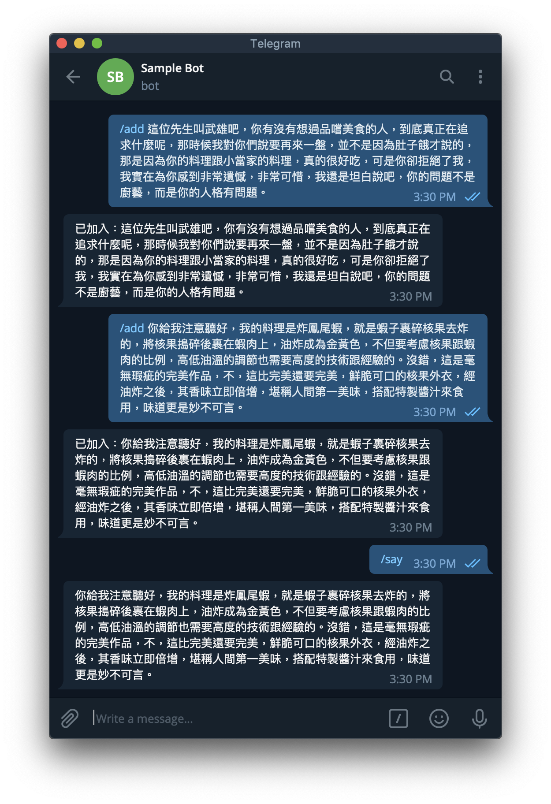
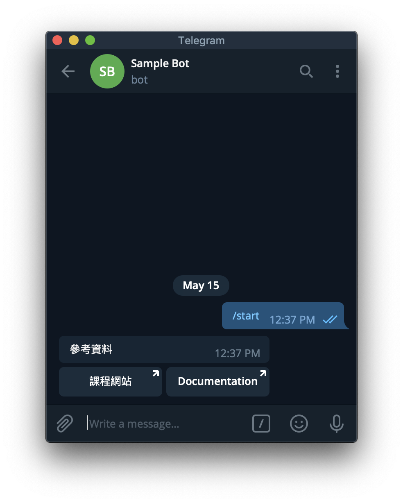
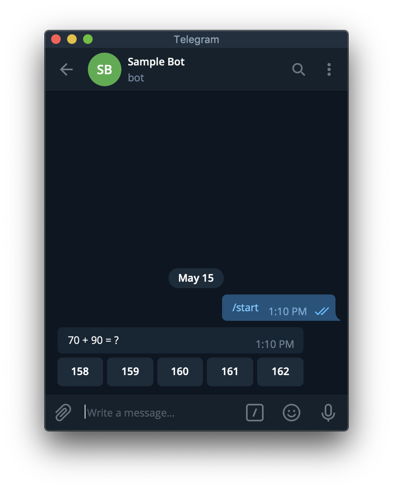
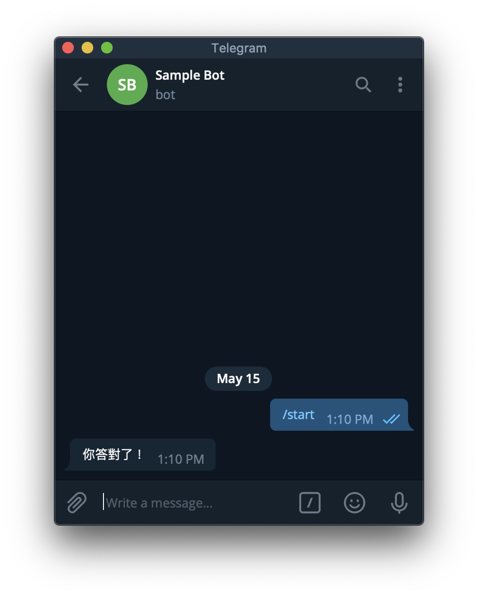
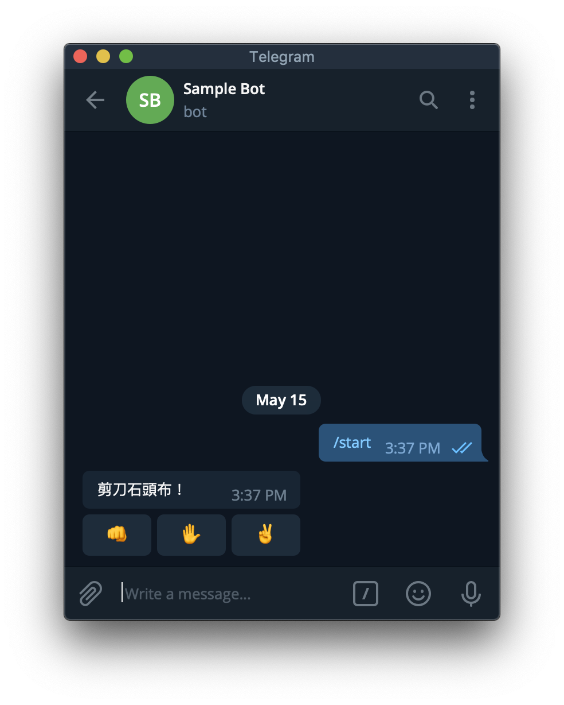
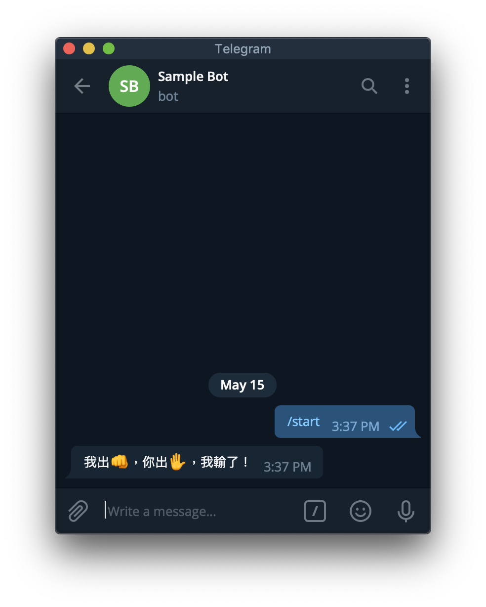
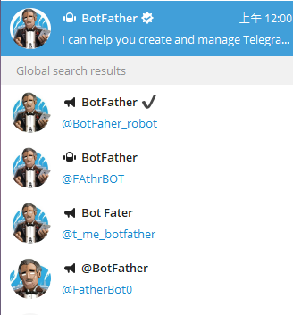
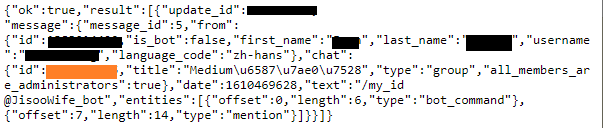

## Python Telegram Bot

https://hackmd.io/@truckski/HkgaMUc24?type=view


找 [@BotFather](https://t.me/BotFather) 申請一個 Bot。

1. /newbot
2. 輸入名稱
3. 輸入 username
4. 記下 token


## hello, world

執行這個程式，注意 `'YOUR TOKEN HERE'` 的地方請填入前面得到的 Token。

```python
from telegram.ext import Updater, CommandHandler

def hello(bot, update):
    update.message.reply_text(
        'hello, {}'.format(update.message.from_user.first_name))


updater = Updater('YOUR TOKEN HERE')

updater.dispatcher.add_handler(CommandHandler('hello', hello))

updater.start_polling()
updater.idle()
```

用 Bot 的 username 或是 BotFather 給的連結可以找到前面建立的 Bot。
對它輸入 `/hello`。


## Command Handler 可從 update 獲得的資訊

- update
  - update_id
  - message
    - message_id
    - from_user：發訊人
      - id
      - first_name
      - last_name
      - full_name
      - username
    - chat：訊息所在的聊天室
      - id
      - type
    - text：訊息內容

[更多資訊](https://python-telegram-bot.readthedocs.io/en/stable/telegram.message.html)

## 傳訊息

- bot.send_message(chat_id, text)
- update.message.reply_text(text)：Shortcut for `bot.send_message(update.message.chat_id, text)`

[更多功能](https://python-telegram-bot.readthedocs.io/en/stable/telegram.bot.html)

## 範例 - 語錄 Bot

```python
import random, os
from telegram.ext import Updater, CommandHandler

# 把語錄檔案載入
if os.path.exists('sentences.txt'):
    with open('sentences.txt') as FILE:
        sentences = [sentence.strip() for sentence in FILE]
else:
    sentences = []

def add(bot, update):
    print('from user:', update.message.from_user.id)
    # 限制只有特定人才能新增語錄
    # if update.message.from_user.id == YOUR_USER_ID_HERE:
    if True:
        sentence = update.message.text[5:].replace('\n', ' ')
        sentences.append(sentence)
        with open('sentences.txt', 'a') as FILE:
            print(sentence, file=FILE)
        update.message.reply_text('已加入：' + sentence)

def say(bot, update):
    if sentences:
        update.message.reply_text(random.choice(sentences))
    else:
        update.message.reply_text('I have no words.')

updater = Updater('YOUR TOKEN HERE')

updater.dispatcher.add_handler(CommandHandler('add', add))
updater.dispatcher.add_handler(CommandHandler('say', say))

updater.start_polling()
updater.idle()
```



## 互動按鈕

`send_message` 加上 `reply_markup = InlineKeyboardMarkup(...)` 就會在該訊息附上按鈕。

```python
from telegram.ext import Updater, CommandHandler
from telegram import InlineKeyboardMarkup, InlineKeyboardButton

def start:
    bot.send_message(chat_id, '參考資料',
        reply_markup = InlineKeyboardMarkup([[
            InlineKeyboardButton('課程網站', url = 'https://github.com/mzshieh/pa19spring'),
            InlineKeyboardButton('Documentation', url = 'https://python-telegram-bot.readthedocs.io/en/stable/index.html')]]))

# ...
```



除了 `url` 以外，也可以用 `callback_data` 來讓 Bot 知道哪個按鈕被按了。

```python
from random import randint
from telegram.ext import Updater, CommandHandler, CallbackQueryHandler
from telegram import InlineKeyboardMarkup, InlineKeyboardButton

def start(bot, update):
    a, b = randint(1, 100), randint(1, 100)
    update.message.reply_text('{} + {} = ?'.format(a, b),
        reply_markup = InlineKeyboardMarkup([[
                InlineKeyboardButton(str(s), callback_data = '{} {} {}'.format(a, b, s)) for s in range(a + b - randint(1, 3), a + b + randint(1, 3))
            ]]))

def answer(bot, update):
    a, b, s = [int(x) for x in update.callback_query.data.split()]
    if a + b == s:
        update.callback_query.edit_message_text('你答對了！')
    else:
        update.callback_query.edit_message_text('你答錯囉！')

updater = Updater('YOUR TOKEN HERE')

updater.dispatcher.add_handler(CommandHandler('start', start))
updater.dispatcher.add_handler(CallbackQueryHandler(answer))

updater.start_polling()
updater.idle()
```





## Callback Query Handler 可從 update 獲得的資訊

- update
  - update_id
  - callback_query
    - from_user
      - 略
    - message：按鈕依附的 message
      - 略
    - data：建立 InlineKeyboardButton 時傳入的 callback_data

[更多資訊](https://python-telegram-bot.readthedocs.io/en/stable/telegram.callbackquery.html)

## 回應 Callback Query

- bot
  - answer_callback_query(callback_query_id, text)：會顯示文字在畫面中間。
  - edit_message_text(chat_id = string, message_id = string, text)：修改文字，會同時清除按鈕。
- update.callback_query
  - answer(text)：Shortcut for `bot.answer_callback_query(update.callback_query.id, text)`
  - edit_message_text(text)：Shortcut for `bot.edit_message_text(chat_id=update.callback_query.message.chat_id, message_id=update.callback_query.message.message_id, text`

[更多功能](https://python-telegram-bot.readthedocs.io/en/stable/telegram.bot.html)

## 範例 - 剪刀石頭布

```python
import random
from telegram.ext import Updater, CommandHandler, CallbackQueryHandler
from telegram import InlineKeyboardMarkup, InlineKeyboardButton

hands = ['rock', 'paper', 'scissors']

emoji = {
    'rock': '👊',
    'paper': '✋',
    'scissors': '✌️'
} 

def start(bot, update):
    update.message.reply_text('剪刀石頭布！',
        reply_markup = InlineKeyboardMarkup([[
                InlineKeyboardButton(emoji, callback_data = hand) for hand, emoji in emoji.items()
            ]]))

def judge(mine, yours):
    if mine == yours:
        return '平手'
    elif (hands.index(mine) - hands.index(yours)) % 3 == 1:
        return '我贏了'
    else:
        return '我輸了'

def play(bot, update):
    try:
        mine = random.choice(hands)
        yours = update.callback_query.data
        update.callback_query.edit_message_text('我出{}，你出{}，{}！'.format(emoji[mine], emoji[yours], judge(mine, yours)))
    except Exception as e:
        print(e)

updater = Updater('YOUR TOKEN HERE')

updater.dispatcher.add_handler(CommandHandler('start', start))
updater.dispatcher.add_handler(CallbackQueryHandler(play))

updater.start_polling()
updater.idle()
```




## Reference

https://python-telegram-bot.readthedocs.io/en/stable/index.html


---

# 使用Python寫一個Telegram Notify


# 第一步: 建立你的Bot名稱與代號



在 Telegram 世界中，管理Bot的叫做 BotFather，請認明第一位有藍勾勾的官方Bot。不要選到下面奇怪的 Bot Fater了XD

跟他對話之後，基本上跟他說聲Hi，他就會吐出

*"I can help you create and manage Telegram bots. If you’re new to the Bot API, please see the manual… "*

接下來，請輸入 ***/newbot\*** 以創建新的Bot。接著幫她建立名稱跟她專屬的ID。


黑色的部分為你這個Bot的Token，類似金鑰

# 第二步: 建立群組，並將你的Bot加入群組

不過Telegram在創建群組上，至少要先加入一個真人，所以你可以加一位好友進去，然後再加入你剛剛創建的Bot，最後再跟你朋友說聲Goodbye把她Remove掉。

# 第三步: 取得你的ChatID

前往網址 [https://api.telegram.org/bot](https://api.telegram.org/bot{){your bot token}/getUpdates

而{your bot token} 就是填入Bot Father賦予你的Bot Token(不用加括號)

如果成功前往，應該會看到像是 ***{“ok”:true,”result”:[]}\*** 的資訊。
這時候，前往你的群組輸入 ***/my_id @你的BotID\***，接著再次重新整理網頁。就會看到以下的資訊。



橘色部分為你的Chat ID

好了，現在有Token，也有ChatID，終於可以開始進入程式部分

# 第四步: 用 Python發送Message

接者使用request.get的方式，去API上通知BOT發送訊息。
而因為可能每次Bot要打出去的訊息不同，所以將這個功能模組化，以下為範例參考。

<iframe src="https://lofinancier.medium.com/media/54e6808ef82757465939590e7cb97ac1" allowfullscreen="" frameborder="0" height="228" width="680" title="tele_bot.py" class="es n gk dh bf" scrolling="auto" style="box-sizing: inherit; top: 0px; width: 680px; height: 228px; position: absolute; left: 0px;"></iframe>


# 結語

以上就是利用簡單的範例來瞭解如何創建一個簡易的Telegram Notify。
應用範圍可以用來推播日常工作排程上的Error Bug或搭配Timer傳送你寫的爬蟲資料，是不是非常好用呢! (而且必要的程式碼也是非常少呢)

如果還有興趣開發功能更強大的Bot，我把連結放在下方，大家就參考看看囉!

---

```python
import os
import telebot
import requests
from loguru import logger


TELEGRAM_BOT_TOKEN = os.environ.get("TELEGRAM_BOT_TOKEN")
bot = telebot.TeleBot(TELEGRAM_BOT_TOKEN)


def get_daily_horoscope(sign: str, day: str) -> dict:
    """通過特定的星座獲取運勢。

    關鍵字解釋:
    sign:str - 星座
    day:str - 格式化的日期 (YYYY-MM-DD) 或 TODAY 或 TOMORROW 或 YESTERDAY
    Return:dict - JSON data
    """
    url = "https://horoscope-app-api.vercel.app/api/v1/get-horoscope/daily"
    params = {"sign": sign, "day": day}
    response = requests.get(url, params)

    return response.json()


@bot.message_handler(commands=["start", "hello"])
def send_welcome(message):
    bot.reply_to(message, "Howdy, how are you doing?")


@bot.message_handler(commands=["horoscope"])
def sign_handler(message):
    text = "What's your zodiac sign?\nChoose one: *Aries*, *Taurus*, *Gemini*, *Cancer,* *Leo*, *Virgo*, *Libra*, *Scorpio*, *Sagittarius*, *Capricorn*, *Aquarius*, and *Pisces*."
    sent_msg = bot.send_message(message.chat.id, text, parse_mode="Markdown")
    bot.register_next_step_handler(sent_msg, day_handler)


def day_handler(message):
    sign = message.text
    text = "What day do you want to know?\nChoose one: *TODAY*, *TOMORROW*, *YESTERDAY*, or a date in format YYYY-MM-DD."
    sent_msg = bot.send_message(message.chat.id, text, parse_mode="Markdown")
    bot.register_next_step_handler(sent_msg, fetch_horoscope, sign.capitalize())


def fetch_horoscope(message, sign):
    day = message.text
    horoscope = get_daily_horoscope(sign, day)
    data = horoscope["data"]
    horoscope_message = (
        f'*Horoscope:* {data["horoscope_data"]}\n*Sign:* {sign}\n*Day:* {data["date"]}'
    )
    bot.send_message(message.chat.id, "Here's your horoscope!")
    bot.send_message(message.chat.id, horoscope_message, parse_mode="Markdown")


@bot.message_handler(func=lambda msg: True)
def echo_all(message):
    print(message, message.text)
    bot.reply_to(message, message.text)


try:
    bot.infinity_polling()
except Exception as e:
    logger.exception(e)

```

