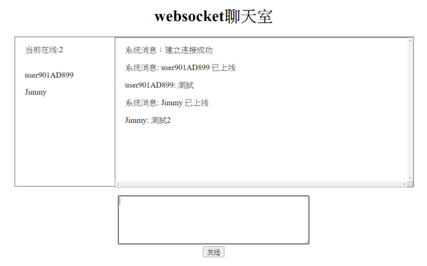

# Python之Websocket介紹與實作

這幾天學了一些Websocket的知識，發現網路上中文文檔非常少，就來分享一下學習心得

- Websocket是應用層協議，服務器可以主動向客戶端推送信息，客戶端也可以主動向服務器發送信息，是真正的雙向平等對話(全雙工)
- http是client去request server，然後server return response，HTTP通信只能由客戶端發起(輪巡) 輪詢的效率低，非常浪費資源（因為必須不停連接，或者HTTP 連接始終打開）


- 是應用層的協議，建立在TCP協議上，握手時採用HTTP，只要握手一次就好
- 和AJAX不同，AJAX是為了達到"推送"技術 而不斷的輪巡，這種傳統的模式帶來很明顯的缺點，即瀏覽器需要不斷的向服務器發出請求，然而HTTP請求可能包含較長的header，其中真正有效的數據可能只是很小的一部分，顯然這樣會浪費很多的帶寬等資源。
- HTML5 定義的WebSocket 協議，數據格式比較輕量，開銷小，能更好的節省服務器資源和帶寬，並且能夠更實時地進行通訊。
- 關於AJAX和Websocket的比較 可以看[這篇](https://claire-chang.com/2020/02/26/html5-websocket與socket-io/)

接下來就是實作了，python要實作websocket的話，可以使用[websockets](https://websockets.readthedocs.io/en/stable/intro.html) 這個函式庫，這個library比較多人用，文檔也很詳細容易上手，不過django和flask應該都有對應的lib，這大家需要再研究吧

備註：接下來會用到異步asyncio的概念，若不熟的可能要去看我寫的[這篇](https://medium.com/@jimmy_huang/python-asyncio-協程-d84b5b945b5b)
或者[real-python](https://realpython.com/async-io-python/)上也寫得很好，主要大概就是async def, await, coroutine這些用法要熟就可以實作websocket了

記得先pip install websockets (然後python版本我用的是3.7，至少需大於3.5，否則不支持asyncio)

client.py

```python
import asyncio
import websockets

async def hello(uri):
    async with websockets.connect(uri) as websocket:
        await websocket.send("Jimmy")
        print(f"(client) send to server: Jimmy")
        name = await websocket.recv()
        print(f"(client) recv from server {name}")

asyncio.get_event_loop().run_until_complete(
    hello('ws://localhost:8765'))
```

server.py (先打開這個，再打開client.py)

```python
import asyncio
import websockets

async def echo(websocket, path):
    print('echo')
    async for message in websocket:
        print(message,'received from client')
        greeting = f"Hello {message}!"
        await websocket.send(greeting)
        print(f"> {greeting}")

asyncio.get_event_loop().run_until_complete(
    websockets.serve(echo, 'localhost', 8765))
asyncio.get_event_loop().run_forever()
```

整個流程大概是一開始server用websockets.serve註冊一個websocket sever，並將handler指定給echo，(echo這個function--> It must be a coroutine accepting two arguments: a `**WebSocketServerProtocol**` and the request URI.)
直接看api文檔可以瞭解參數為何https://websockets.readthedocs.io/en/stable/api.html
client這邊一打開就會連至ws，然後發送字串，server收到後就會echo回去，client收完後，就會關閉client


實作html5(client)與python(server)之多人記數器

實作code就在[這裡](https://websockets.readthedocs.io/en/stable/intro.html) ，裡面的Synchronization example
我稍微解說一下

start_server = websockets.serve(counter, “localhost”, 6789)註冊了counter當作handler，所以每次進來的訊息都會到counter
Global中用了USERS( set 用來計算多少用戶同時在線上) 和STATE(計算計數)
每次進來都會register(websocket)，而try的finally就會unregister(websocket)
(這邊就是用來統計使用者個數，當使用者個數產生變動，就會notify_users，[user.send(message) for user in USERS]的方式廣播變動

而計數也是一樣，操作加減js控件時，會透過ws去send json format
async for message in websocket: data = json.loads(message) 這段就是負責接收加減數字的訊號

簡單來說 counter當作handler，連線進來時增加使用者個數，並監控使用者前端操作js發出來的websocket訊息(json)，而這些異動都存在global的 USERS和STATE，**異動後我就會根據目前使用者數量去notify_state & notify_users 這段就是websocket的重點，Server主動推送訊息**



更進一步：基於websocket的聊天室

接下來有興趣的就可以去實作聊天室了(下面連結提供大陸網友實作的code)
[python websockets 網絡聊天室V0](https://zhuanlan.zhihu.com/p/112813123)

解說一下，其實後端的邏輯十分簡單，會根據chat 這個main function去分不同的訊息處理(switch case 像是有人發訊息，有人login，logout，然後再把msg群發給所有User) 而前端接收到訊息後再呈現

其他像是Flask等等也有內建flask-sockets的函式庫，有興趣的再自己研究吧
https://github.com/heroku-examples/python-websockets-chat


---

## 連續發送  websocket_server.py

```python
import asyncio
import websockets

async def echo(websocket, path):
    print('echo')
    i = 0
    while True:
        i += 1
        greeting = f"Hello {i}!"
        await websocket.send(greeting)
        print(f"> {greeting}")
        await asyncio.sleep(1)

asyncio.get_event_loop().run_until_complete(
    websockets.serve(echo, 'localhost', 8765))
asyncio.get_event_loop().run_forever()
```

## websocket_client.py 使用   websocket.WebSocketApp

```python
import threading
import time
import websocket
import queue
import rel


class ClientSocket:
    def __init__(self):
        websocket.enableTrace(True)
        self.ws = websocket.WebSocketApp(
            "ws://localhost:8765/",
            # "wss://api.gemini.com/v1/marketdata/BTCUSD",
            on_open=self.on_open,
            on_message=self.on_message,
            on_error=self.on_error,
            on_close=self.on_close,
        )
        # ping_interval 表示發送心跳訊息的間隔，預設為 0，表示不發送心跳訊息；
        # 而 ping_timeout 表示伺服器端的回應時間限制，預設為 20 秒。
        # 如果伺服器端在 ping_timeout 時間內沒有回應心跳訊息，則客戶端會認為伺服器端已經斷線，並關閉 WebSocket 連線。
        self.ws.run_forever(
            dispatcher=rel,
            ping_interval=10,  # 發送心跳訊息的間隔為 10 秒
            ping_timeout=5,  # 設定伺服器端的回應時間限制為 5 秒
        )
        rel.signal(2, rel.abort)  # Keyboard Interrupt
        rel.dispatch()

    def on_message(self, ws, message):
        print(message)

    def on_error(self, ws, error):
        print(error)

    def on_close(self, ws, close_status_code, close_msg):
        print("### closed ###")
        rel.abort()
        self.ws.run_forever(dispatcher=rel)
        rel.signal(2, rel.abort)
        rel.dispatch()

    def on_open(self, ws):
        print("Opened connection")


if __name__ == "__main__":
    client_socket = ClientSocket()
```


 