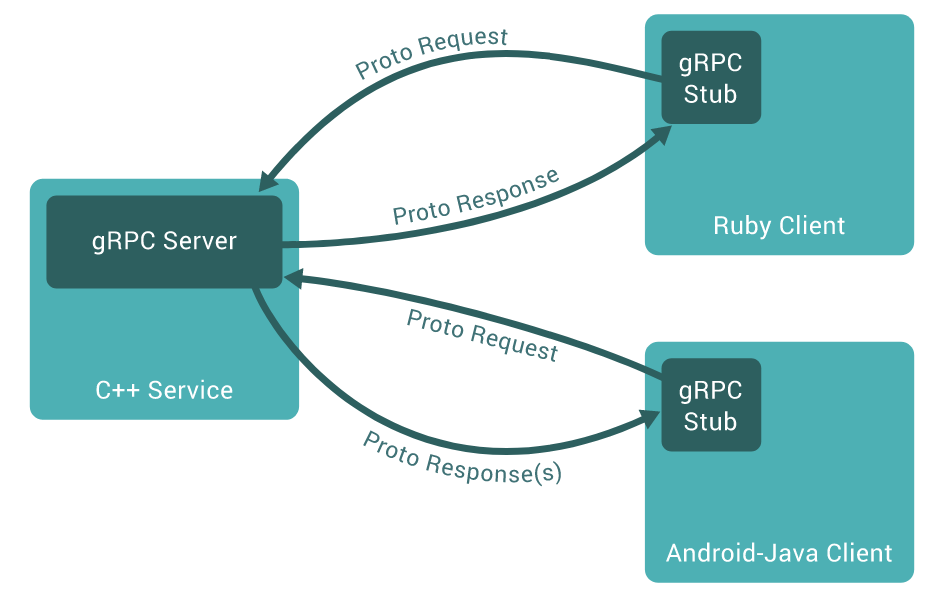

# 教你用Python搭建gRPC服務

## 前言

前陣子剛好有個要使用 gRPC 的機會，同事看了一下官網的 Tutorial 覺得一時之間有點迷路，所以就寫了一份比較簡單的 gRPC Tutorial for Python，應該可以讓需要的人更快入門。

## protocol buffers 簡介

在介紹 gRPC 之前先來講講 [protocol buffers](https://developers.google.com/protocol-buffers/)。我們在不同 service 之間做訊息溝通的時候，最常使用的也許是透過 json 來做傳遞，不過在使用 json 上面可能會遇到以下幾個問題：

1. json 的 serialize/de-serialize 速度太慢
2. 透過 json 傳資料的結構不夠清楚，得靠 API 文件搞定
3. 用 json 傳資料的 size 太大

[protocol buffers](https://developers.google.com/protocol-buffers/) 便是 Google 為瞭解決以上問題而生，它可以透過一個 `.proto` 檔案，在各語言生出相對應的檔案使用。目前[支援的程式語言很多](https://github.com/google/protobuf)，有 Python、golang、js、java 等等。

## grpc 簡介

有了 [protocol buffers](https://developers.google.com/protocol-buffers/) 之後，google 更進一步的推出了 gRPC。透過 gRPC，我們可以在 `.proto` 檔案當中也一併定義好 service，讓遠端使用的 client 可以如同呼叫本地的 library 一樣使用，不用再自己處理 routing 、連線等等的問題。



上圖是從 [gRPC 官網](https://grpc.io/)上面截下來的圖，可以看到 gRPC Server 是由 `C++` 撰寫，client 則分別是 Java 以及 Ruby，Server 跟 Client 端則是透過 [protocol buffers](https://developers.google.com/protocol-buffers/) 來做傳遞。

## 開發 gRPC 流程

接下來讓我們來用 Python 開發一個最簡單的 gRPC service。分別有以下四個部分：

1. 環境安裝 – 最基本的套件安裝
2. `.proto` 檔案 – 定義 [protocol buffers](https://developers.google.com/protocol-buffers/) 還有 service
3. Server – server 的 code
4. Client – client 呼叫 server 的 code

最後完成的程式碼會放在 https://github.com/daikeren/gprc_tutorial

### 環境安裝以及設定

首先我們要安裝相對應的套件，這邊我們用 [pipenv](https://docs.pipenv.org/) 來作為環境管理工具。輸入以下指令安裝 grpcio 以及 grpcio-tools。

```bash
pipenv install grpcio grpcio-tools
```

接著，我們先來定義我們 service 的功能，我們這邊為了 demo，我們這個 service 做的事情很簡單，只是將傳遞進來的 name 前面加上 “Hello” 再回傳回去。這邊當然是可以改成任何我們想要 Python Function。

```python
# hello.py
def hello(name):
    return f"Hello {name}"
```

### `.proto` 檔案

接下來，我們創建一個 `hello.proto` 檔案，裡面描述了我們要使用的 message 以及 service

```python
syntax = "proto3";

message HelloRequest {
    string value = 1;
}

message HelloResponse {
    string value = 1;
}

service Hello {
    rpc Hello(HelloRequest) returns (HelloResponse) {}
}
```

這邊的 message 代表了我們要跟 gRPC 傳遞的參數、型別，service 則是敘述了 service name 以及傳入、傳回的參數。之後我們會透過 `gprc_tools` 來讀取 `.proto` 檔案產生相對應的 Python class。這邊可以看到我們定義的 message 以及 service 如下：

- message: 這邊定義了兩種 message，分別是 `HelloRequest` 以及 `HelloResponse`，裡面都只有一個叫做 `value` 的欄位，形態是 `string`
- service: 這邊定義了一個 service，裡面只有一個叫做 Hello 的 rpc 傳入值是 `HelloRequest`，傳回值則是 `HelloResponse`

接下來，我們輸入以下指令為 Python 產生 gRPC 的 class

```bash
pipenv run python -m grpc_tools.protoc -I. --python_out=. --grpc_python_out=. hello.proto
```

你會看到多出了兩個檔案

- `hello_pb2.py`: 定義了相對應的 message class
- `hello_pb2_grpc.py`: 定義了相對應的 service class

### Server

有了 `hello_pb2.py` 以及 `hello_pb2_grpc.py`，我們就可以開始實作我們的 gRPC server，詳細的程式碼如下：

```python
# server.py
from concurrent import futures
import time

import grpc 
import hello_pb2
import hello_pb2_grpc

import hello

# 創建一個 HelloServicer，要繼承自 hello_pb2_grpc.HelloServicer
class HelloServicer(hello_pb2_grpc.HelloServicer):

# 由於我們 service 定義了 Hello 這個 rpc，所以要實作 Hello 這個 method
    def Hello(self, request, context):

# response 是個 HelloResponse 形態的 message
        response = hello_pb2.HelloResponse()
        response.value = hello.hello(request.value)
        return response


def serve():
# 創建一個 gRPC server
	server = grpc.server(futures.ThreadPoolExecutor(max_workers=10))

# 利用 add_HelloServicer_to_server 這個 method 把上面定義的 HelloServicer 加到 server 當中
	hello_pb2_grpc.add_HelloServicer_to_server(HelloServicer(), server)

# 讓 server 跑在 port 50051 中
	server.add_insecure_port('[::]:50051')
	server.start()
	try:
		while True:
			time.sleep(86400)
	except KeyboardInterrupt:
		server.stop(0)


if __name__ == '__main__':
	serve()
```

接著我們可以輸入以下指令啟動 gRPC server

```bash
pipenv run python server.py
```

### Client

client side 的 code 很單純，就是建立一個 channel 連線到 gRPC server，再用 stub 來呼叫。

```python
# client.py 

import grpc

import hello_pb2
import hello_pb2_grpc

# 連接到 localhost:50051
channel = grpc.insecure_channel('localhost:50051')

# 創建一個 stub (gRPC client)
stub = hello_pb2_grpc.HelloStub(channel)

# 創建一個 HelloRequest 丟到 stub 去
request = hello_pb2.HelloRequest(value="World")

# 呼叫 Hello service，回傳 HelloResponse
response = stub.Hello(request)

print(response.value)
```

因為我們已經在 localhost 跑起來 server 了，執行以下的 client 程式碼：

```bash
pipenv run python client.py
Hello World
```

## 小結

看到這邊應該可以理解一個簡單的 gRPC 該怎麼實作，相信以這為基礎應該可以很容易擴展出未來更多的 gRPC 應用。


## 參考

- https://www.icoding.co/2020/07/grpc-tutorial-for-python