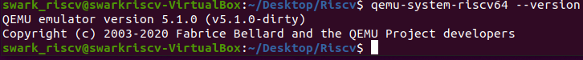

# 在QEMU上執行64 bit RISC-V Linux

出處: https://medium.com/swark/%E5%9C%A8qemu%E4%B8%8A%E5%9F%B7%E8%A1%8C64-bit-risc-v-linux-2a527a078819

本篇文章主要是用來記錄我的學習紀錄，嘗試在Virtual box上以Ubuntu 20.04 (kernel版本:5.4.0–54-generic) 來安裝QEMU並執行RISC-V Linux。

先列出本篇文章的重要參考對象
[1]https://ithelp.ithome.com.tw/articles/10192454
[2]https://risc-v-getting-started-guide.readthedocs.io/en/latest/linux-qemu.html
[3]https://zhuanlan.zhihu.com/p/258394849

那麼就開始吧
首先我從設定路徑開始
一般的教學都會建議安裝設定如下
$ export RISCV=/opt/riscv
但像我自己是全部安裝在桌面上的資料夾之中
$export RISCV=/home/swark_riscv/Desktop/Riscv
*需要注意的是export的路徑，每次重開機後都會消失需要重設，不過也可以修改 "/etc/profile"，在其中加入export的環境變數，如此一來重開機之後都會存在。

# 安裝 riscv-gnu-toolchain

建議先進入github riscv-gnu-toolchain中的README.md上閱讀一下，
可以看到Prerequisites中有提及有些需要先安裝的packages。

像我是使用ubuntu所以必須先用以下指令安裝所需packages

```
sudo apt-get install autoconf automake autotools-dev curl python3 libmpc-dev libmpfr-dev libgmp-dev gawk build-essential bison flex texinfo gperf libtool patchutils bc zlib1g-dev libexpat-dev
```

接著我們開始安裝[riscv-gnu-toolchain](https://github.com/riscv/riscv-gnu-toolchain)

```
git clone https://github.com/riscv/riscv-gnu-toolchain
cd riscv-gnu-toolchain
git submodule update — init — recursive  //update整包code
./configure --prefix=$RISCV
make linux && make install //安裝Linux ABI(Application binary interface) 專用的toolchain
make && make install //安裝 bare metal 專用的toolchain
```

*如果是用實體機器來建置環境的人，可以在make後用-j<核心數>，來決定要用幾核來build，比如make -j 4 (表示使用四核心)

安裝完畢後，導出toolcahin的安裝路徑
export PATH=$PATH:$RISCV/bin
順便測試以"riscv64-unknown-linux-gnu-gcc -v"是否安裝成功


# Busybox的安裝

先退回原工作目錄，比如我是Desktop下的Riscv

```
git clone https://git.busybox.net/busybox
cd busybox
CROSS_COMPILE=riscv64-unknown-linux-gnu- make menuconfig
CROSS_COMPILE=riscv64-unknown-linux-gnu- make -j 4
CROSS_COMPILE=riscv64-unknown-linux-gnu- make install
```

make meunconfig中請做以下設定
選擇 Busybox Settings>>Build BusyBox as Static binary 為y


*如果遇到以下問題

```
make menuconfig HOSTCC scripts/kconfig/lxdialog/checklist.o <command-line>: fatal error: curses.h: No such file or directory compilation terminated. make[2]: *** [scripts/Makefile.host:120: scripts/kconfig/lxdialog/checklist.o] Error 1 make[1]: *** [/home/swark_riscv/Desktop/Riscv/busybox-1.27.2/scripts/kconfig/Makefile:14: menuconfig] Error 2 make: *** [Makefile:444: menuconfig] Error 2
```

我搜尋到的解法是去安裝ncurses，如下，則可解決

```
sudo apt-get install libncurses5-dev
```

# 編譯Linux

退回原工作目錄，
另外目前官方的Linux中已經包含了Risc-V的支援，
因此請直接
git clone https://github.com/torvalds/linux

接著步驟如下

```
git checkout v5.4 make ARCH=riscv CROSS_COMPILE=$RISCV/bin/riscv64-unknown-linux-gnu- defconfig //配置config
make ARCH=riscv CROSS_COMPILE=$RISCV/bin/riscv64-unknown-linux-gnu- -j 4 //編譯
```

# 編譯QEMU

```
git clone https://github.com/qemu/qemu
cd qemu
git checkout v5.1.0
./configure --target-list=riscv64-softmmu --prefix=$RISCV/qemu
make -j $(nproc)
sudo make install
```

*可能遭遇問題

```
ERROR: glib-2.48 gthread-2.0 is required to compile QEMU 
⇒sudo apt-get install libglib2.0-devERROR: pixman >= 0.21.8 not present.
Please install the pixman devel package.
⇒sudo apt-get install libpixman-1-dev
```

導出Qemu的安裝目錄
export PATH=$PATH:$RISCV/qemu/bin
測試Qemu是否安裝成功



# 製作開機用的rootfs

```
qemu-img create rootfs.img 1g
mkfs.ext4 rootfs.img
mkdir rootfs
sudo mount -o loop rootfs.img  rootfs
cd rootfs
sudo cp -r ../busyboxsource/_install/* .
sudo mkdir proc sys dev etc etc/init.dcd etc/init.d/
sudo touch rcS
sudo vi rcS
```

rcS內容如下

```
#!/bin/sh
mount -t proc none /proc
mount -t sysfs none /sys
/sbin/mdev -s
```

並且修改rcS權限
`sudo chmod +x rcS`

最後解除掛載即可
`sudo umount rootfs`

另外如果是透過[1]的文章去製作rootfs的話，我建議在
cp -r $RISCV/sysroot $RISCV/rootfs中改成
cp -r $RISCV/sysroot $RISCV/rootfs_backup，
並且參考上述步驟，掛載rootfs後再將rootfs_backup內容copy進掛載的目錄中，我最後是透過這個方式才成功。

最後我們可以透過Qemu來執行64 bit RISC-V Linux，
請用以下指令

```
qemu-system-riscv64 -M virt -m 256M -nographic -kernel linux/arch/riscv/boot/Image -drive file=rootfs.img,format=raw,id=hd0  -device virtio-blk-device,drive=hd0 -append "root=/dev/vda rw console=ttyS0"
```


---

# qemu搭建riscv的可偵錯環境

- riscv工具鏈

（網上大多數用Github直連的工具鏈，但是因為太大，download的時候老是出問題）

選擇使用[Cross-compilation toolchains for Linux - Home (bootlin.com)](https://toolchains.bootlin.com/)進行下載，之後解壓。


bin目錄下為可執行的工具鏈，將其新增到PATH中。

- qemu

qemu壓縮包下載：[QEMU](https://www.qemu.org/)，之後解壓。

默認的安裝命令：


這樣會生成qemu支援的所有體系架構的可執行檔案。

如果需要只生成一種架構的，需要組態`target-list`選項。


make之後在build目錄下有對應qemu可執行檔案：


將其新增到PATH中。

- opensbi

（opensbi用於系統啟動程式碼跳轉）

項目github地址：https://github.com/riscv-software-src/opensbi

make時指定交叉編譯器CROSS_COMPILE=riscv64-linux。

同時，指定PLATFORM=generic。


```sh
export CROSS_COMPILE=riscv64-linux-
make PLATFORM=generic
```


想要模擬不同類型的裝置，make該項目時的PLATFORM參數可以參考opensbi/docs/platform下的md檔案。

make之後，在opensbi/build/platform/generic/firmware下生成如下檔案：


主要有三種類型的firmware：dynamic、jump、payload。

這裡主要使用jump類型的fw_jump.elf檔案，啟動時直接跳轉到OS入口程式碼。

- linux kernel

直接github上下載linus的分支：[torvalds/linux: Linux kernel source tree (github.com)](https://github.com/torvalds/linux)

然後切換到指定版本的tag。


make ARCH=riscv CROSS_COMPILE=riscv64-linux- defconfig，之後make ARCH=riscv CROSS_COMPILE=riscv64-linux- menuconfig。

要使用GDB+qemu偵錯核心的話，一般得選中kernel debug以及取消地址隨機化KASLR（不過在riscv相關的組態中沒有發現這個組態）。


看riscv社區的新聞：[Linux 核心地址空間佈局隨機化 “KASLR” for RISC-V – RISC-V INTERNATIONAL (riscv.org)](https://riscv.org/news/2023/02/linux-kernel-address-space-layout-randomization-kaslr-for-risc-v/)，riscv至今沒有新增該特性。

make之後，會在arch/riscv/boot下生成對應的Image鏡像。


- rootfs

（建立根檔案系統）地址：[Buildroot - Making Embedded Linux Easy](https://buildroot.org/download.html)

make menuconfig選擇RISCV


之後sudo make，會在output/images下生成對應的檔案：


- 共享檔案

qemu中運行的虛擬機器往往需要和主機間傳輸資料，因此，最常使用的方式就是共享檔案。

```bash
dd if=/dev/zero of=ext4.img bs=512 count=131072
mkfs.ext4 ext4.img
sudo mount -t ext4 -o loop ext4.img ./share
```

在當前目錄下生成share目錄，可用於虛擬機器和主機間共享資料：


- gdb偵錯

```bash
#!/bin/bash

qemu-system-riscv64 -M virt \
	-bios fw_jump.elf \
	-kernel Image \
	-append "rootwait root=/dev/vda ro" \
	-drive file=rootfs.ext2, format=raw,id=hd0 \
	-device virtio-blk-device, device=hd0 \
	-drive file=ext4.img, format=raw,id=hd1 \
	-device virtio-blk-device, driver=hd1 \
	-s -nographic
```

-s參數使主機端使用連接埠1234進行kernel偵錯。

運行命令後：


主機端偵錯，使用riscv64-linux-gdb偵錯編譯kernel後生成的vmlinux。

target remote localhost:1234用於偵錯虛擬機器。


以調度的關鍵函數finish_task_switch為斷點為例：


此時掛載到從init_task切換到下一個處理程序的過程中了。

常規的gdb命令可以用於偵錯kernel，查看kernel執行階段資訊。


